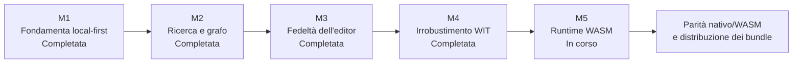

# Piano del progetto

Stato aggiornato al **25 agosto 2026**.

Questo è il documento canonico per la direzione corrente del progetto. La fotografia del codice è in [`STATO.md`](STATO.md), i requisiti di prodotto in [`features/`](features/README.md), il lavoro aperto in [`todo.md`](todo.md) e il ragionamento storico in [`decisions/`](decisions/README.md) e [`roadmap/`](roadmap/README.md).

## Obiettivo

Portare Fub da applicazione locale con funzionalità native a piattaforma estendibile in cui provider nativi e componenti WASM attraversano lo stesso contratto `fub-abi`, senza contaminare il kernel con dettagli di formato, interfaccia o runtime.

## Percorso delle milestone

| Milestone | Stato | Risultato |
|---|---|---|
| M1 — fondamenta local-first | **Completata** | Workspace Rust, shell Tauri, vault locale e primo provider Markdown. |
| [M2 — ricerca e grafo](milestones/M2-search-graph.md) | **Completata** | Ricerca indicizzata, link, backlink, tag, struttura e graph view. |
| [M3 — fedeltà dell'editor](milestones/M3-editor-fidelity.md) | **Completata** | Editor CodeMirror, anteprima e comportamento di modifica; la matematica renderizzata è stata rinviata esplicitamente dalla [decisione 0158](decisions/0158-la-matematica-e-sorgente-a-vista-per-ora.md). |
| [M4 — irrobustimento WIT](milestones/M4-wit-hardening.md) | **Completata** | Contratto `fub:abi@0.1.1`, copie congelate e disciplina di crescita additiva. |
| [M5 — runtime WASM](milestones/M5-wasm-runtime.md) | **In corso** | Runtime Wasmtime, caricamento del componente e primi adattatori verso i trait condivisi. |

## M5: cosa esiste già

- crate `fub-wasm-host`, unico punto che dipende da Wasmtime;
- caricamento e istanziazione di componenti compatibili con il world WIT;
- limiti e traduzione degli errori al confine del runtime;
- attraversamento iniziale delle superfici `Plugin` e `CommandProvider`;
- esempi WASM e strumenti di compilazione fuori dal workspace principale;
- montaggio attraverso il registro dei bundle dell'host.

## M5: cosa manca

1. completare gli adattatori per le altre famiglie di provider previste dal contratto;
2. collegare le capacità dell'host necessarie ai nuovi adattatori senza creare un secondo canale IPC;
3. attraversare la UI dichiarativa da un componente WASM quando una vista reale lo richiederà;
4. consolidare scoperta, installazione, aggiornamento e disattivazione dei bundle di terzi;
5. chiudere le decisioni aperte su temi e provenienza delle superfici elencate in [`todo.md`](todo.md).

## Priorità correnti

| Ordine | Lavoro | Criterio di uscita |
|---|---|---|
| 1 | Chiudere le decisioni P1 ancora aperte | Ogni scelta produce un ADR oppure viene rimossa perché non serve più. |
| 2 | Estendere la parità nativo/WASM | Un provider di terzi attraversa una nuova famiglia senza introdurre un secondo contratto. |
| 3 | Consolidare il caricamento dei bundle | Installazione, inventario, attivazione e arresto seguono lo stesso ciclo di vita. |
| 4 | Validare l'esperienza della shell | Le superfici aggiunte dal contratto hanno stato vuoto, errore e via di uscita comprensibili. |
| 5 | Realizzare le superfici di editing condivise | Celle, formule, rich text e canvas riusano i motori della shell invece di duplicarli nei plugin. |
| 6 | Mantenere separati stato, guida e storia | La documentazione resta aggiornata senza creare fonti parallele. |

Il piano tecnico delle superfici condivise è in [`frontend/05-superfici-di-editing-condivise.md`](frontend/05-superfici-di-editing-condivise.md).

## Cosa non è una roadmap operativa

- [`STATO.md`](STATO.md) descrive il presente, non le priorità future;
- [`features/`](features/README.md) è un capitolato, non una percentuale di completamento;
- [`microfeatures/`](microfeatures/README.md) è un inventario di gesti, non un backlog;
- [`roadmap/`](roadmap/README.md) conserva le sedute che hanno prodotto le decisioni; il nome della cartella è storico;
- [`decisions/`](decisions/README.md) spiega scelte già chiuse e non contiene attività operative.

Quando cambia una priorità si aggiorna questo file. Quando nasce o si chiude un lavoro concreto si aggiorna `todo.md`. Quando si prende una decisione stabile si aggiunge un ADR.