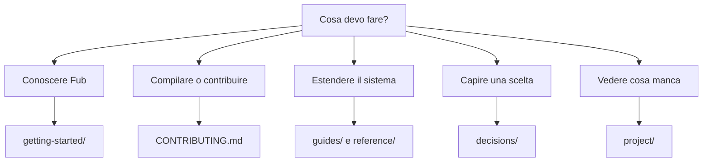

# Documentazione di Fub

Questa è la sola porta d'ingresso alla documentazione corrente. Le pagine canoniche descrivono comportamento implementato; le proposte vivono nelle RFC; il lavoro aperto vive nelle issue; la storia delle scelte vive negli ADR.

## Percorsi di lettura

| Lettore | Inizia da |
|---|---|
| Nuovo utente | [getting-started/overview.md](getting-started/overview.md) |
| Contributore | [CONTRIBUTING.md](../CONTRIBUTING.md) |
| Sviluppatore di provider | [guides/create-native-provider.md](guides/create-native-provider.md) |
| Autore di plugin WASM | [architecture/wasm-runtime.md](architecture/wasm-runtime.md) |
| Revisore architetturale | [architecture/overview.md](architecture/overview.md) |
| Chi cerca lo stato | [project/status.md](project/status.md) |
| Chi cerca il perché | [decisions/README.md](decisions/README.md) |

## Sezioni

- [`getting-started/`](getting-started/overview.md): prodotto, avvio e struttura della repository.
- [`concepts/`](concepts/vault.md): vocabolario stabile.
- [`architecture/`](architecture/overview.md): comportamento implementato e confini.
- [`guides/`](guides/create-native-provider.md): procedure eseguibili.
- [`reference/`](reference/crates.md): contratti, formati e configurazione.
- [`project/`](project/status.md): stato e priorità correnti.
- [`rfcs/`](rfcs/README.md): proposte aperte.
- [`decisions/`](decisions/README.md): decisioni accettate.

## Regole

- una pagina risponde a una domanda principale;
- niente documenti di solo redirect;
- niente seconda roadmap o checklist permanenti;
- una proposta non compare nelle guide come se fosse disponibile;
- i numeri derivabili dal codice devono essere verificati automaticamente;
- ogni Mermaid deve essere semplice, tematico e leggibile senza colori rigidi;
- i limiti noti sono dichiarati nella stessa pagina della funzionalità.

## Stati ammessi

| Stato | Significato |
|---|---|
| `implementato` | Comportamento dimostrato da codice e test |
| `parziale` | Percorso esistente con limiti espliciti |
| `proposto` | Solo nelle RFC |
| `pianificato` | Solo nella roadmap |
