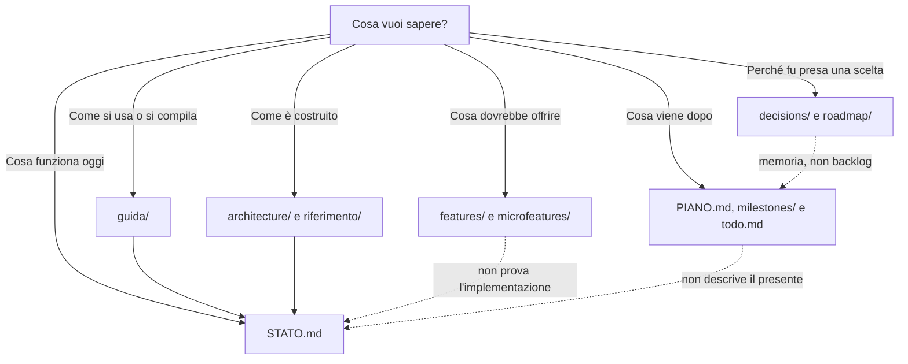

# Documentazione di Fub

Questa cartella ha una sola porta d'ingresso e separa con precisione ciò che **esiste**, ciò che **deve esistere**, ciò che **è pianificato** e ciò che appartiene alla **storia** del progetto.

## Inizia qui

| Esigenza | Documento canonico |
|---|---|
| Capire come leggere la documentazione | [Leggimi prima](leggimi-prima.md) |
| Vedere cosa è verificato nel repository | [Stato del progetto](STATO.md) |
| Installare, avviare e usare Fub | [Guida pratica](guida/README.md) |
| Capire gli strati e i confini del sistema | [Architettura](architecture/README.md) |
| Consultare crate, configurazione e termini | [Riferimento tecnico](riferimento/README.md) |
| Studiare il contratto Rust e WIT | [Contratto](06-contratto/README.md) |
| Capire shell, IPC e superfici di editing | [Frontend](frontend/README.md) |
| Vedere priorità e milestone correnti | [Piano del progetto](PIANO.md) |
| Vedere soltanto il lavoro aperto | [Backlog](todo.md) |

## Documentazione corrente

Descrive la versione presente nel repository:

- [guida/](guida/README.md): installazione, uso, recupero e sviluppo di provider;
- [architecture/](architecture/README.md): confini e comportamento architetturale;
- [riferimento/](riferimento/README.md): struttura, componenti, configurazione e glossario;
- [06-contratto/](06-contratto/README.md): tipi, trait e contratto WIT;
- [frontend/](frontend/README.md): shell, protocollo UI, IPC, temi e piano delle superfici condivise;
- [03-uml/03-componenti-e-dipendenze.md](03-uml/03-componenti-e-dipendenze.md): grafo dei crate verificato automaticamente.

Quando un documento corrente contraddice il codice, i manifest o i test, il documento va corretto.

## Specifiche di prodotto

- [features/](features/README.md): capacità richieste al prodotto;
- [microfeatures/](microfeatures/README.md): gesti piccoli e osservabili dell'utente;
- [personas/](personas/README.md): bisogni e contesti d'uso.

Queste cartelle sono un capitolato. Una checklist non dimostra che una funzione sia già disponibile: per quello esiste [STATO.md](STATO.md).

## Pianificazione viva

- [PIANO.md](PIANO.md): direzione, milestone e priorità correnti;
- [milestones/](milestones/README.md): traguardi e criteri di chiusura;
- [todo.md](todo.md): decisioni aperte, lavoro differito e difetti misurati.

## Memoria storica

- [decisions/](decisions/README.md): decisioni architetturali chiuse;
- [roadmap/](roadmap/README.md): sedute di progettazione conservate per ricostruire il ragionamento;
- [CHANGELOG.md](CHANGELOG.md): cambiamenti per versione.

La cartella `roadmap/` conserva un nome storico: non è il piano operativo corrente.

## Governo del progetto

- [CONTRIBUTING.md](CONTRIBUTING.md): sviluppo, controlli e contributi;
- [SECURITY.md](SECURITY.md): segnalazione privata delle vulnerabilità;
- [CODE_OF_CONDUCT.md](CODE_OF_CONDUCT.md): regole della community;
- [versionamento.md](versionamento.md): versioni del prodotto, del contratto e degli schemi persistenti;
- [appendix/](appendix/README.md): soli rimandi di compatibilità.

## Regole di manutenzione

1. Ogni argomento corrente ha una sola pagina canonica.
2. Gli altri documenti collegano quella pagina invece di riscriverla.
3. Stato, specifiche, piani e storia devono essere riconoscibili già dall'introduzione.
4. Un documento nuovo nasce soltanto quando non può essere una sezione di uno esistente.
5. I verbali storici conservano il contesto del momento in cui furono scritti.
6. Link, conteggi collegati ai sorgenti e tabelle devono restare verificabili dalla CI.

Prima di aggiungere un file, controlla che non basti aggiornare una pagina esistente.