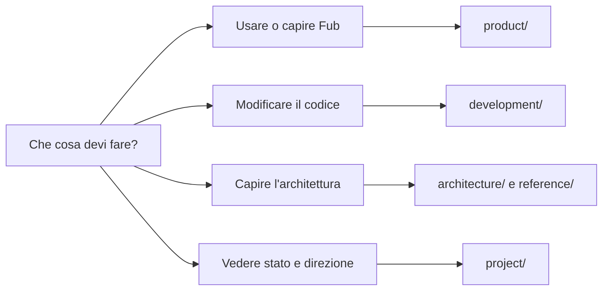

# Documentazione di Fub

Questa è la mappa canonica del progetto.

La documentazione descrive **ciò che esiste**. Le attività eseguibili vivono
nelle GitHub Issues. Le decisioni architetturali spiegano il perché delle scelte
ancora rilevanti. La cronologia completa resta in Git.

## Iniziare

- [Installare, avviare e verificare](getting-started/install-and-run.md)
- [Orientarsi nella repository](getting-started/repository-tour.md)

## Capire il prodotto

- [Panoramica](product/overview.md)
- [Vault e file](product/vault-and-files.md)
- [Editor e anteprima](product/editor-and-preview.md)
- [Ricerca, link e grafo](product/search-links-and-graph.md)
- [Plugin ed estensioni](product/plugins-and-extensions.md)

## Capire l'architettura

- [Vista d'insieme](architecture/overview.md)
- [Componenti e confini](architecture/components-and-boundaries.md)
- [Modello del documento](architecture/document-model.md)
- [Storage e identità](architecture/storage-and-identity.md)
- [Runtime, eventi e job](architecture/runtime-events-and-jobs.md)
- [Frontend e IPC](architecture/frontend-and-ipc.md)
- [Runtime dei plugin](architecture/plugin-runtime.md)

## Sviluppare

- [Workflow](development/workflow.md)
- [Test e qualità](development/testing-and-quality.md)
- [Creare un plugin](development/plugin-authoring.md)
- [Stile della documentazione](development/documentation-style.md)
- [Versionamento e release](development/versioning-and-releases.md)

## Consultare i contratti

- [ABI e WIT](reference/abi-and-wit.md)
- [Layout su disco](reference/on-disk-layout.md)
- [Contratto IPC](reference/ipc-contract.md)
- [Permessi e sicurezza](reference/permissions-and-security.md)

## Vedere stato e direzione

- [Stato corrente](project/status.md)
- [Roadmap](project/roadmap.md)
- [M5: runtime WASM](project/m5-wasm-runtime.md)

## Capire le decisioni

- [Indice ADR](decisions/README.md)
- [Template ADR](decisions/template.md)

## Gerarchia delle fonti

Quando due fonti divergono, usa questo ordine:

1. codice e test;
2. WIT, schemi e formati persistenti;
3. pagine architetturali e riferimenti canonici;
4. ADR, limitatamente alla motivazione;
5. stato e roadmap;
6. cronologia Git.

Una pagina non sostituisce il codice. Deve spiegare i confini, i flussi e le
proprietà che una persona deve conoscere per modificarlo senza romperli.
