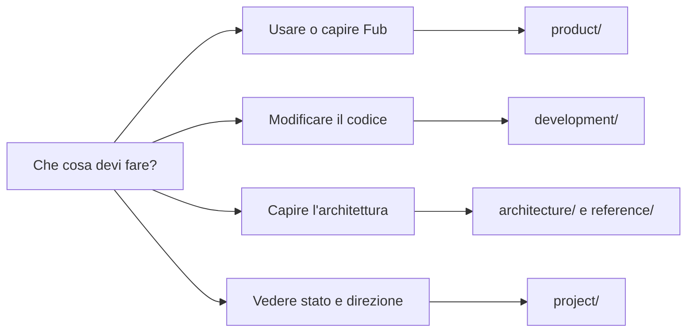

# Documentazione di Fub

Questa è la mappa canonica del progetto.

La documentazione descrive **ciò che esiste**. Le attività eseguibili vivono
nelle GitHub Issues. Un prossimo passo approvato può avere un TODO operativo in
`project/` quando richiede una sequenza tecnica estesa: il TODO deve essere
collegato a un'issue, dichiarare stato e regola di uscita e sparire quando il
lavoro è concluso. Le decisioni architetturali spiegano il perché delle scelte
ancora rilevanti. La cronologia completa resta in Git.

```mermaid
flowchart LR
    START["Che cosa devi fare?"]
    START --> USE["Usare o capire Fub"]
    START --> CODE["Modificare il codice"]
    START --> DESIGN["Capire l'architettura"]
    START --> STATUS["Vedere stato e direzione"]
    USE --> PRODUCT["product/"]
    CODE --> DEV["development/"]
    DESIGN --> ARCH["architecture/ e reference/"]
    STATUS --> PROJECT["project/"]
```

## Iniziare

- [Installare, avviare e verificare](getting-started/install-and-run.md)
- [Orientarsi nella repository](getting-started/repository-tour.md)

## Capire il prodotto

- [Panoramica](product/overview.md)
- [Vault e file](product/vault-and-files.md)
- [Editor e anteprima](product/editor-and-preview.md)
- [Disegni](product/drawing.md)
- [Disegni, modelli e suggerimenti](product/drawing-new.md)
- [Disegni, importare da Excalidraw e draw.io](product/drawing-import.md)
- [Disegni, trasformare](product/drawing-transform.md)
- [Disegni, selezione](product/drawing-selection.md)
- [Disegni, pannello dei livelli](product/drawing-layers.md)
- [Disegni, guide intelligenti](product/drawing-guides.md)
- [Disegni, righelli e guide](product/drawing-rulers.md)
- [Disegni, proprietà](product/drawing-properties.md)
- [Disegni, colori](product/drawing-colors.md)
- [Disegni, stili](product/drawing-styles.md)
- [Disegni, sfumature](product/drawing-gradients.md)
- [Disegni, campiture e motivi](product/drawing-patterns.md)
- [Disegni, punte delle linee](product/drawing-tips.md)
- [Disegni, immagini](product/drawing-images.md)
- [Disegni, ritagli e maschere](product/drawing-masks.md)
- [Disegni, effetti e fusione](product/drawing-effects.md)
- [Disegni, appunti](product/drawing-clipboard.md)
- [Disegni, esportare](product/drawing-export.md)
- [Disegni, poligoni e stelle](product/drawing-shapes.md)
- [Disegni, connettori](product/drawing-connectors.md)
- [Disegni, etichette nelle forme](product/drawing-labels.md)
- [Disegni, forme dal tratto](product/drawing-ink-shapes.md)
- [Disegni, vista ruotata, gesti e menu radiale](product/drawing-view.md)
- [Disegni, cronologia](product/drawing-history.md)
- [Disegni, accessibilità](product/drawing-accessibility.md)
- [Disegni, tavole](product/drawing-boards.md)
- [Disegni, raccolte di forme](product/drawing-library.md)
- [Disegni, livello Esperto](product/drawing-expert.md)
- [Disegni, tracciati](product/drawing-paths.md)
- [Disegni, curve e tagli](product/drawing-curves.md)
- [Disegni, spessore variabile](product/drawing-width.md)
- [Disegni, ricalco delle immagini](product/drawing-trace.md)
- [Disegni, tipografia](product/drawing-typography.md)
- [Disegni, caratteri del vault](product/drawing-fonts.md)
- [Disegni, simboli](product/drawing-symbols.md)
- [Disegni, risorse](product/drawing-resources.md)
- [Disegni, livello Personalizzato](product/drawing-custom.md)
- [Annotazioni dei PDF](product/pdf-annotations.md)
- [Ricerca, link e grafo](product/search-links-and-graph.md)
- [Plugin ed estensioni](product/plugins-and-extensions.md)
- [Budget prestazionale](product/performance-budget.md)
- [Criteri di accettazione](product/acceptance.md)

## Capire l'architettura

- [Vista d'insieme](architecture/overview.md)
- [Componenti e confini](architecture/components-and-boundaries.md)
- [Modello del documento](architecture/document-model.md)
- [Storage e identità](architecture/storage-and-identity.md)
- [Runtime, eventi e job](architecture/runtime-events-and-jobs.md)
- [Frontend e IPC](architecture/frontend-and-ipc.md)
- [Superfici dell'editor](architecture/editor-surfaces.md)
- [Runtime dei plugin](architecture/plugin-runtime.md)

## Sviluppare

- [Workflow](development/workflow.md)
- [Test e qualità](development/testing-and-quality.md)
- [Creare un plugin](development/plugin-authoring.md)
- [Stile della documentazione](development/documentation-style.md)
- [Versionamento e release](development/versioning-and-releases.md)

## Consultare i contratti

- [ABI e WIT](reference/abi-and-wit.md)
- [Layout su disco](reference/on-disk-layout.md)
- [Contratto IPC](reference/ipc-contract.md)
- [Permessi e sicurezza](reference/permissions-and-security.md)
- [Formato della scena](reference/scene-format.md)
- [Formato della scena, unità e guide](reference/scene-format-rulers.md)
- [Formato della scena, poligoni e stelle](reference/scene-format-shapes.md)
- [Formato della scena, spessore variabile](reference/scene-format-width.md)
- [Formato della scena, connettori](reference/scene-format-connectors.md)
- [Formato della scena, etichette](reference/scene-format-labels.md)
- [Formato della scena, testo](reference/scene-format-text.md)
- [Formato della scena, accessibilità](reference/scene-format-accessibility.md)
- [Formato della scena, risorse](reference/scene-format-resources.md)
- [Formato della scena, effetti e fusione](reference/scene-format-effects.md)
- [Formato della scena, stili](reference/scene-format-styles.md)
- [Formato della scena, simboli](reference/scene-format-symbols.md)
- [Formato della scena, tavole](reference/scene-format-boards.md)
- [Formato della scena, export](reference/scene-format-export.md)
- [Operazioni sulla scena](reference/scene-operations.md)
- [Formato delle annotazioni PDF](reference/annotation-format.md)

## Vedere stato e direzione

- [Stato corrente](project/status.md)
- [Roadmap](project/roadmap.md)
- [M5: runtime WASM](project/m5-wasm-runtime.md)

## Capire le decisioni

- [Indice ADR](decisions/README.md)
- [Template ADR](decisions/template.md)

## Gerarchia delle fonti

Quando due fonti divergono, usa questo ordine:

1. codice e test;
2. WIT, schemi e formati persistenti;
3. pagine architetturali e riferimenti canonici;
4. ADR, limitatamente alla motivazione;
5. stato, roadmap e TODO attivi;
6. cronologia Git.

Una pagina non sostituisce il codice. Deve spiegare i confini, i flussi e le
proprietà che una persona deve conoscere per modificarlo senza romperli.
