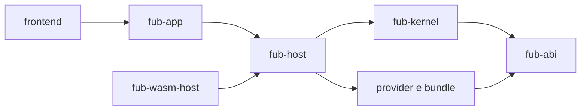

# Architettura

Questa sezione descrive il sistema **come è implementato nel repository**. Le priorità future vivono in [`PIANO.md`](../PIANO.md); le motivazioni storiche in [`decisions/`](../decisions/README.md) e nelle sedute di [`roadmap/`](../roadmap/README.md).

## Ordine di lettura

1. [Mappa visuale](mappa-visuale.md)
2. [Panoramica](panoramica.md)
3. [Componenti e dipendenze verificati](../03-uml/03-componenti-e-dipendenze.md)
4. [Modello dei dati](data-model.md)
5. [Confine dei plugin](plugin-boundary.md)
6. [Shell e frontend](shell.md)
7. [Protocollo UI](ui-protocol.md)
8. [Layout su disco](on-disk-layout.md)
9. [Affidabilità e presidi](affidabilita.md)

## Confini principali

Il contratto Rust/WIT ha una sezione dedicata: [`06-contratto/`](../06-contratto/README.md). Il dettaglio dei crate, della configurazione e del lessico è in [`riferimento/`](../riferimento/README.md).