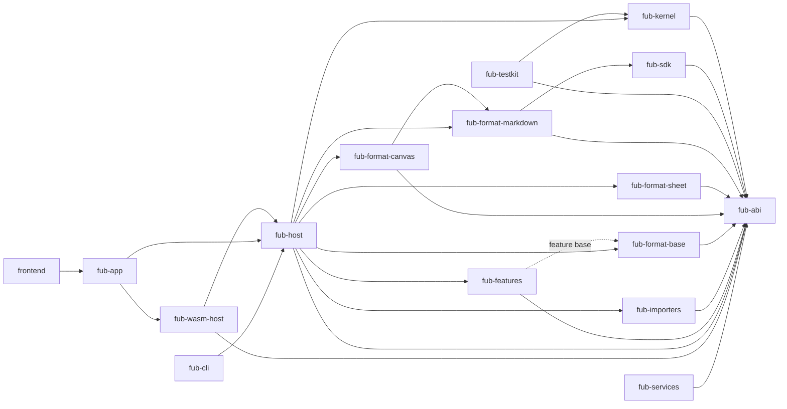

# Componenti e confini

> **Domanda:** quali componenti esistono, da chi possono dipendere e chi
> possiede una modifica?
> **Fonti autorevoli:** manifest Cargo, import TypeScript e guard CI.

## Grafo delle dipendenze

La figura mostra il verso concettuale. I manifest sono la fonte esatta e i guard
del repository verificano le eccezioni.

## Tabella dei componenti

| Componente | Possiede | Non deve possedere |
|---|---|---|
| `fub-abi` | tipi, trait, errori, regole, WIT | storage, runtime, Markdown, UI desktop |
| `fub-kernel` | workspace, path, indici, eventi, policy | Tauri, Wasmtime, parsing Markdown |
| `fub-host` | sessioni, mount, job, watcher, configurazione | comandi Tauri e DOM |
| `fub-app` | stato Tauri, comandi IPC, adattamento eventi | regole di business |
| `fub-sdk` | API comoda per autori e host in memoria | composition root dell'app |
| `fub-testkit` | fixture e integrazione host/kernel | dipendenze di produzione |
| `fub-format-markdown` | parse, render, serialize e transfer Markdown | risoluzione dei path del vault |
| `fub-format-sheet` | workbook persistito, valutatore, sessioni derivate, provider grid e route di valutazione | host, storage, Tauri, Wasmtime |
| `fub-format-canvas` | JSON Canvas: modello con i campi ignoti conservati, `DocumentModel`, HTML statico e riscrittura dei link; il Markdown delle card lo analizza e lo disegna il provider Markdown | host, storage, Tauri, Wasmtime |
| `fub-format-base` | definizioni `.base`: modello YAML persistito, limiti e valutatore di formule | selezione delle righe, che resta del core (`query_index`) |
| `fub-importers` | import ed export ufficiali e comandi di conversione | kernel, Tauri |
| `fub-features` | provider ufficiali indipendenti | conoscenza del desktop |
| `fub-wasm-host` | Wasmtime, binding, traduzione, store e lifecycle dei plugin installati | policy duplicata |
| `fub-cli` | automazione locale sopra `Host`, senza Tauri | un secondo coordinatore di job o di scrittura |
| `fub-services` | servizio self-hostable separato per account, sync e publish | kernel, host, app |
| `frontend` | layout, interazione, resa, editor | accesso diretto al kernel |

## Dipendenze vietate

- `fub-abi` → `fub-kernel`, Tauri, Wasmtime o Markdown;
- `fub-kernel` → `fub-host`, Tauri, Wasmtime o `fub-format-markdown`;
- `fub-host` → Tauri;
- qualunque crate diverso da `fub-wasm-host` → Wasmtime;
- dipendenza normale → `fub-testkit`;
- file frontend arbitrario → `@tauri-apps`;
- feature ufficiale → dettagli privati di un'altra feature per condividere
  logica.

## Ownership pratica

### Contratto e forme condivise

Modifica `fub-abi` quando una regola deve valere per più implementazioni o
attraversare un confine. Non spostare nel contratto un helper usato da un solo
modulo.

### Workspace e persistenza

Modifica `fub-kernel` per identità, accesso al vault, cache, indici, query,
eventi e policy. Una chiamata filesystem dalla shell è quasi sempre il livello
sbagliato.

### Composizione

Modifica `fub-host` per mount, registri, lifecycle, custodia del workspace,
watcher, job, impostazioni macchina e collegamento dei provider. Ciò che tocca
il mondo lo riceve da chi lo compone: il supporto del vault
(`Host::with_storage`, il disco ancorato alla radice di serie), il rilevatore
delle modifiche esterne (`with_watcher`), il client di rete (`with_network`),
l'orologio che registro, cestino, bozze e job leggono (`with_clock`) e il
cestino di sistema (`with_os_trash_backend`). Un banco li sostituisce senza
un secondo canale verso il vault.

### Desktop e serializzazione

Modifica `fub-app` quando il cambiamento è specifico di Tauri o della forma IPC.
Un adattatore deve delegare presto all'host.

### Esperienza utente

Modifica `frontend` per pannelli, layout, editor, disegno e accessibilità.
Comunica con l'host attraverso interfacce TypeScript, non importando il bridge
Tauri ovunque.

## Feature ufficiali

`fub-features` usa feature Cargo indipendenti. Una feature spenta deve rimuovere
il proprio modulo senza lasciare import obbligatori da altri moduli.

L'inventario (`crates/fub-features/src/inventory.rs`) dichiara per ogni feature
id, nome, catalogo, impostazioni, servizi forniti e richiesti, e i provider che
si costruiscono con una chiamata: view, comandi, indice, regole di sintassi e
renderer. `fub-host` monta ogni riga con lo stesso ciclo e non confronta id.
Ciò che soltanto chi monta sa collegare, cioè l'indice di ricerca nella cartella
dati assegnata e lo store delle versioni dietro l'interruttore dell'host, è una
variante di `HostWiring` dichiarata nella riga.

Una feature che non funziona senza un'altra lo dichiara due volte: la sua
feature Cargo accende l'altra (`trash` → `commands`, `template` e `base` →
`properties`) e la sua riga ne richiede il servizio (`requires`), così spegnere
il fornitore a runtime tiene fuori anche chi dipende da lui.
`crates/fub-features/tests/cargo_features.rs` confronta le due dichiarazioni.
Una feature che degrada senza l'altra non la richiede e dice cosa manca: le
menzioni non collegate senza la ricerca full-text ne sono un esempio.

La condizione per dividere il crate in più crate non è il numero di file: è il
primo accoppiamento reale che impedisce build, ownership o dipendenze
indipendenti.

## Percorsi principali

| Area | Percorsi |
|---|---|
| contratto | `crates/fub-abi/src/`, `crates/fub-abi/wit/fub/` |
| workspace | `crates/fub-kernel/src/` |
| composizione | `crates/fub-host/src/mount.rs`, `session.rs`, `registry.rs` |
| desktop | `crates/fub-app/src/lib.rs` |
| Markdown | `crates/fub-format-markdown/src/` |
| foglio | `crates/fub-format-sheet/src/` |
| lavagna e base | `crates/fub-format-canvas/src/`, `crates/fub-format-base/src/` |
| feature | `crates/fub-features/src/` |
| runtime WASM | `crates/fub-wasm-host/src/` |
| seam frontend | `apps/client/src/host/` |
| shell | `apps/client/src/main.ts`, `panels/`, `state/`, `ui/` |
| test | `crates/*/tests/`, `apps/client/src/**/*.test.ts` |
