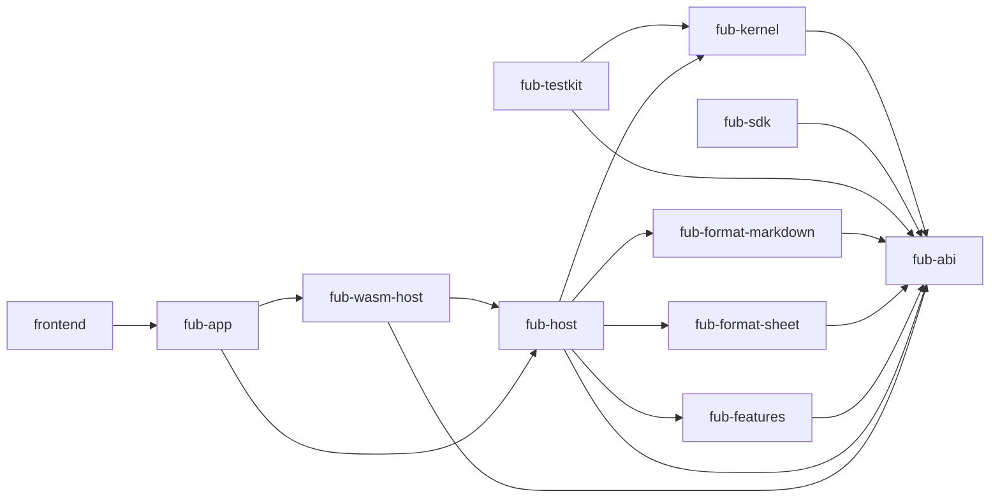

# Componenti e confini

> **Domanda:** quali componenti esistono, da chi possono dipendere e chi
> possiede una modifica?
> **Fonti autorevoli:** manifest Cargo, import TypeScript e guard CI.

## Grafo delle dipendenze

La figura mostra il verso concettuale. I manifest sono la fonte esatta e i guard
del repository verificano le eccezioni.

## Tabella dei componenti

| Componente | Possiede | Non deve possedere |
|---|---|---|
| `fub-abi` | tipi, trait, errori, regole, WIT | storage, runtime, Markdown, UI desktop |
| `fub-kernel` | workspace, path, indici, eventi, policy | Tauri, Wasmtime, parsing Markdown |
| `fub-host` | sessioni, mount, job, watcher, configurazione | comandi Tauri e DOM |
| `fub-app` | stato Tauri, comandi IPC, adattamento eventi | regole di business |
| `fub-sdk` | API comoda per autori e host in memoria | composition root dell'app |
| `fub-testkit` | fixture e integrazione host/kernel | dipendenze di produzione |
| `fub-format-markdown` | parse, render, serialize e transfer Markdown | risoluzione dei path del vault |
| `fub-format-sheet` | schema e workbook autorevole `.fubsheet`, proiezioni comuni | griglia frontend, ABI/WIT per superfici, stato visuale |
| `fub-features` | provider ufficiali indipendenti | conoscenza del desktop |
| `fub-wasm-host` | Wasmtime, binding e traduzione | policy duplicata |
| `frontend` | layout, interazione, resa, editor | accesso diretto al kernel |

## Dipendenze vietate

- `fub-abi` → `fub-kernel`, Tauri, Wasmtime o Markdown;
- `fub-kernel` → `fub-host`, Tauri, Wasmtime o `fub-format-markdown`;
- `fub-host` → Tauri;
- qualunque crate diverso da `fub-wasm-host` → Wasmtime;
- dipendenza normale → `fub-testkit`;
- file frontend arbitrario → `@tauri-apps`;
- feature ufficiale → dettagli privati di un'altra feature per condividere
  logica.

## Ownership pratica

### Contratto e forme condivise

Modifica `fub-abi` quando una regola deve valere per più implementazioni o
attraversare un confine. Non spostare nel contratto un helper usato da un solo
modulo.

### Workspace e persistenza

Modifica `fub-kernel` per identità, accesso al vault, cache, indici, query,
eventi e policy. Una chiamata filesystem dalla shell è quasi sempre il livello
sbagliato.

### Composizione

Modifica `fub-host` per mount, registri, lifecycle, custodia del workspace,
watcher, job, impostazioni macchina e collegamento dei provider.

### Desktop e serializzazione

Modifica `fub-app` quando il cambiamento è specifico di Tauri o della forma IPC.
Un adattatore deve delegare presto all'host.

### Esperienza utente

Modifica `frontend` per pannelli, layout, editor, disegno e accessibilità.
Comunica con l'host attraverso interfacce TypeScript, non importando il bridge
Tauri ovunque.

## Feature ufficiali

`fub-features` usa feature Cargo indipendenti. Una feature spenta deve rimuovere
il proprio modulo senza lasciare import obbligatori da altri moduli.

La condizione per dividere il crate in più crate non è il numero di file: è il
primo accoppiamento reale che impedisce build, ownership o dipendenze
indipendenti.

## Percorsi principali

| Area | Percorsi |
|---|---|
| contratto | `crates/fub-abi/src/`, `crates/fub-abi/wit/fub/` |
| workspace | `crates/fub-kernel/src/` |
| composizione | `crates/fub-host/src/mount.rs`, `session.rs`, `registry.rs` |
| desktop | `crates/fub-app/src/lib.rs` |
| Markdown | `crates/fub-format-markdown/src/` |
| foglio Fub | `crates/fub-format-sheet/src/` |
| feature | `crates/fub-features/src/` |
| runtime WASM | `crates/fub-wasm-host/src/` |
| seam frontend | `apps/client/src/host/` |
| shell | `apps/client/src/main.ts`, `panels/`, `state/`, `ui/` |
| test | `crates/*/tests/`, `apps/client/src/**/*.test.ts` |
