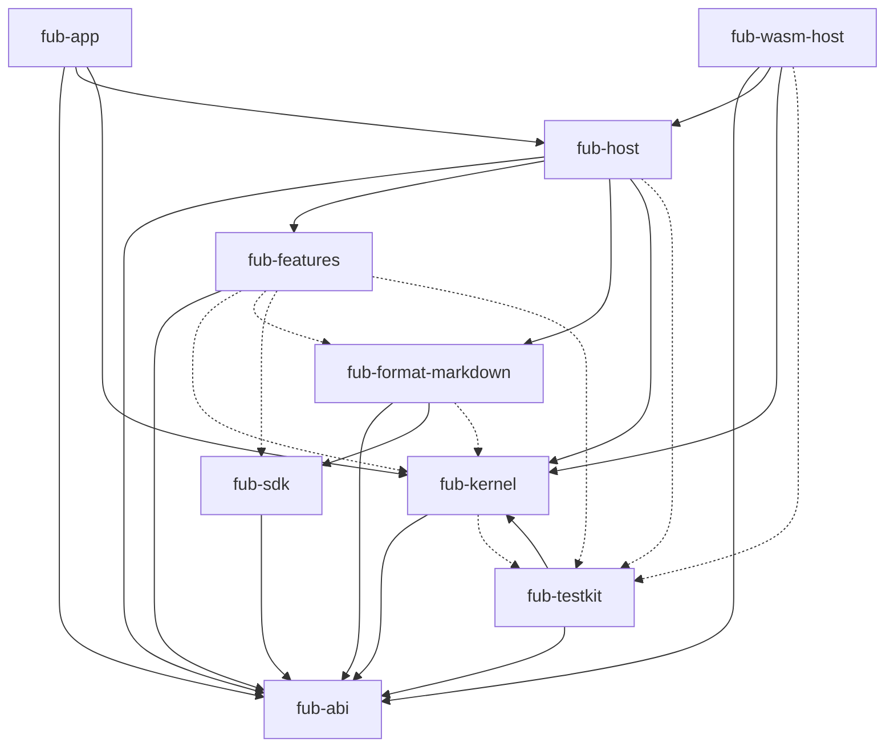

# Componenti e dipendenze

> **Stato:** implementato  
> **Fonte di verità:** `Cargo.toml`, manifest dei crate e `dependency_invariant.rs`

Questa pagina descrive i componenti del workspace e contiene il grafo verificato automaticamente contro `cargo metadata`.

## Componenti

| Componente | Responsabilità | Dipendenze vietate |
|---|---|---|
| `fub-abi` | tipi, trait, WIT, rappresentazioni IPC | Tauri, Wasmtime, Comrak |
| `fub-kernel` | workspace, documenti, indici, policy, eventi | Tauri, Wasmtime, Markdown |
| `fub-sdk` | helper per autori e host in memoria | kernel concreto |
| `fub-testkit` | integrazione reale per test | dipendenza normale dei crate |
| `fub-format-markdown` | parsing e resa Markdown | Tauri |
| `fub-features` | funzionalità ufficiali come provider | accoppiamenti normali con kernel e altri bundle |
| `fub-host` | sessioni, montaggio, watcher e job | Tauri |
| `fub-wasm-host` | linker Wasmtime e proxy | Tauri |
| `fub-app` | binario e adattatori Tauri | logica di dominio |
| `frontend` | shell, editor, pannelli e tema | accesso diretto al disco |

## Grafo verificato del workspace

Le frecce continue rappresentano dipendenze normali. Le frecce tratteggiate rappresentano dipendenze presenti soltanto durante i test.

Il test confronta nodi e archi nei due versi. Un crate o una dipendenza nuovi devono comparire sia nei manifest sia in questo diagramma.

## Composizione

`fub-host` è la composition root riusabile. Una CLI o un test headless devono poter montare il sistema senza inizializzare una webview. `fub-app` aggiunge soltanto ciò che richiede Tauri.
