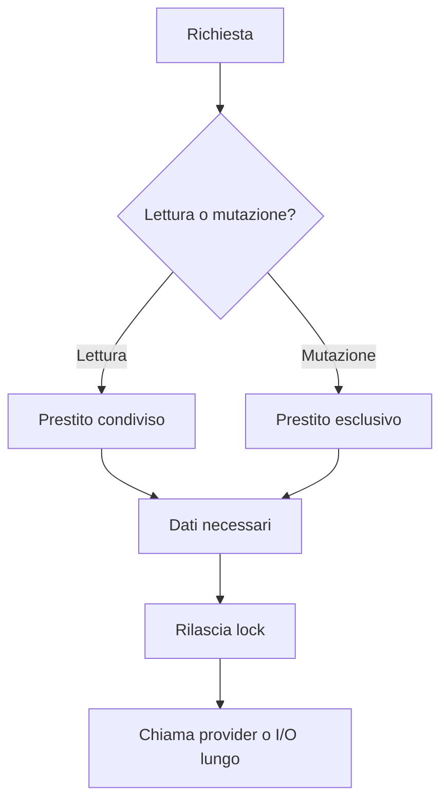
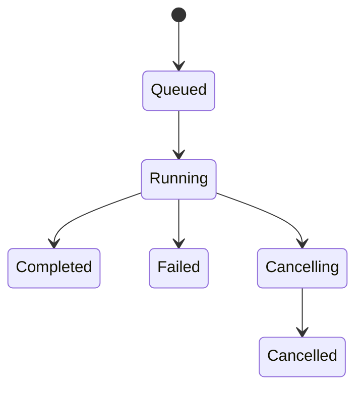

# Concorrenza e lifecycle

> **Stato:** implementato  
> **Fonte di verità:** `Workspace`, custodia host, runner dei job e test di race

Fub combina operazioni sincrone sullo stato condiviso con lavori lunghi cancellabili. La regola centrale è non trattenere lo stato esclusivo mentre viene chiamato codice esterno.

## Modello

## Invarianti

- più letture possono procedere insieme;
- una mutazione non attende indefinitamente;
- nessun lock attraversa una chiamata a provider;
- il dispatch degli eventi non rientra nello stack che lo ha emesso;
- ogni job ha proprietario, progresso e cancellazione;
- la chiusura di un vault ferma prima le sorgenti di nuovo lavoro e poi drena ciò che rimane;
- il teardown di un bundle rimuove registrazioni, sottoscrizioni e risorse.

## Lavori lunghi

Il progresso è un fatto osservabile; la cancellazione è una richiesta cooperativa. Un lavoro deve controllare la bandiera nei punti in cui può fermarsi senza corrompere lo stato.

## Frontend

La shell usa helper di lifetime e race invece di timer speranzosi. Listener globali, observer e `requestAnimationFrame` appartengono a un disposer e devono scomparire con la superficie che li ha creati.
