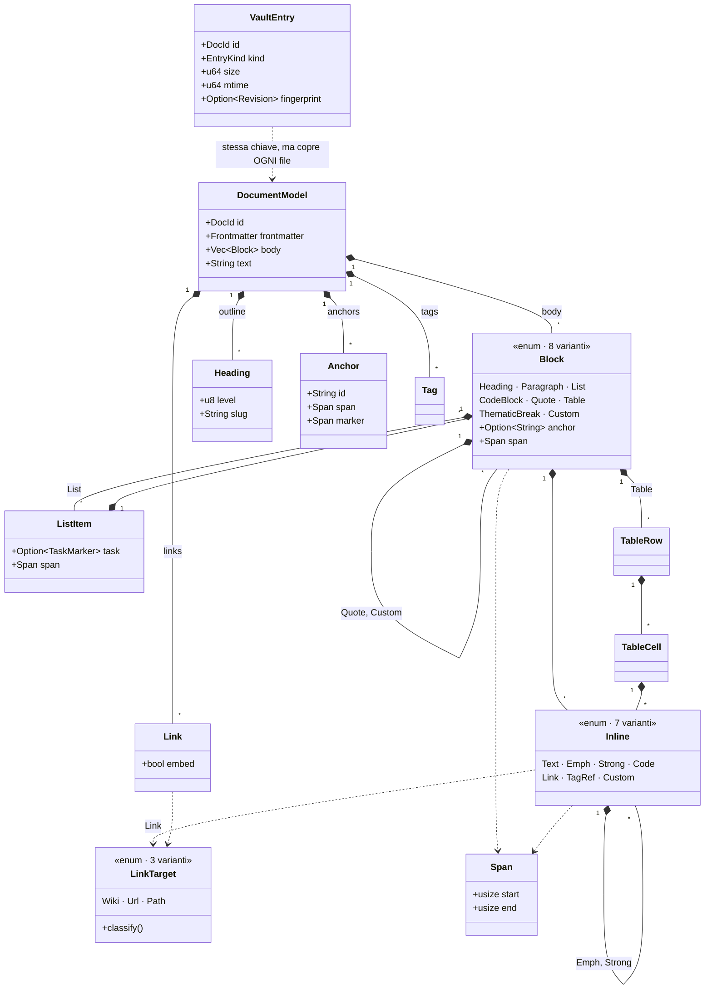
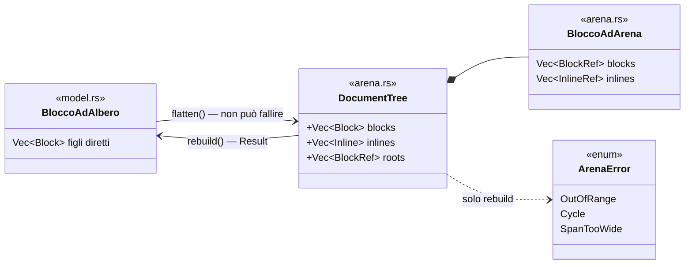

# Modello dati comune (`fub-abi`)

Il modello di documento **comune e agnostico rispetto al formato**, in
`crates/fub-abi/src/model.rs`.

- È abbastanza ricco da rappresentare markdown in modo fedele.
- **Non nomina nulla di specifico del markdown.**
- I concetti trasversali — link, tag, heading, frontmatter — stanno in tabelle
  piatte.
- Ciò che è peculiare di un formato — callout, math, embed, tabelle — finisce
  nell'escape hatch `Custom`.

**Che tipo di agnosticismo è.** Il modello non nomina la *sintassi* di nessun
formato. La *semantica* dei link, invece, ce l'ha il kernel, ed è precisa:
risoluzione wikilink in stile Obsidian, cioè shortest unique path, alias nel
frontmatter con chiavi `aliases`/`alias`, priorità fra omonimi.

Un futuro provider (org-mode, AsciiDoc) non porta la propria semantica di
risoluzione: mappa i propri riferimenti su `LinkTarget::Wiki` e adotta quella del
kernel. Detto in due righe:

- **sintassi**: zero modifiche al kernel;
- **semantica**: una sola, quella del kernel.

Torna a [../PIANO.md](../PIANO.md) · vedi anche [traits.md](traits.md).

## `DocId` — identità del documento

```rust
pub struct DocId(pub String);
```

È il **path relativo al vault**, normalizzato con separatori `/`, estensione
inclusa. `page_name()` restituisce il basename senza estensione (lo usa la
risoluzione wikilink). La risoluzione wikilink → `DocId` è compito del **kernel**,
non dei provider.

**Identità e rename.** L'identità *è* il path, quindi un rename cambia identità.
Il contratto lo tratta come operazione di prima classe, non come remove+add:

- `Event::DocumentRenamed { from, to }` è l'evento dedicato — chi tiene stato
  per-documento migra la chiave;
- `Workspace::rename_document` è l'operazione: sposta il file, migra modello e
  grafo, e riscrive i wikilink entranti.

La riscrittura è **chirurgica**. Tocca solo il testo-pagina dentro lo `Span` del
link, e solo i riferimenti **per nome o per path** che risolvevano davvero al
documento rinominato. Non tocca:

- i riferimenti per **alias** — l'alias vive nel frontmatter del target e
  sopravvive al rename;
- i riferimenti a un **omonimo** vincente, che non vengono dirottati.

Le forme che può scrivere sono **tre**, in quest'ordine:

1. il nome pagina, se nessun altro documento lo contende;
2. il path **senza** estensione, se nessun altro lo contende;
3. altrimenti il path **intero**.

La terza esiste perché la seconda non è «sempre univoca», come questo paragrafo
ha affermato fino alla [0107](../decisions/0107-il-caso-di-una-lettera.md): la
chiave di `path_index` è `resolution_key(strip_ext(…))`, quindi `sub/Nota.md` e
`sub/nota.txt` la condividono, e un path senza estensione si contende esattamente
come si contende un nome. Qui non si sceglie cosa mostrare a schermo — si scrive
su disco **dentro i documenti di terzi** — quindi la condizione si verifica,
invece di affermarla.

**Case dei path.** Due regole, e vanno lette insieme:

- il `DocId` è **byte-exact**: conserva il case del filesystem;
- la **risoluzione** wikilink è **case-insensitive**: le chiavi degli indici del
  grafo sono normalizzate a minuscolo.

Così la semantica osservabile è la stessa su FS case-sensitive (Linux) e
case-insensitive (macOS/Windows). Conseguenze:

- **Il rename case-only** (`nota.md` → `Nota.md`) è supportato. Su FS
  case-insensitive `vault.exists(to)` vedrebbe lo *stesso* file, quindi il kernel
  salta il check sul disco quando i due path coincidono a meno del case. Una vera
  collisione la intercetta la cache dei modelli, perché il vault è l'unica fonte
  dei `DocId`.

- **Due documenti che differiscono solo per il case** possono esistere solo su FS
  case-sensitive, e lì la chiave sola non basta a scegliere. Ci sono perciò due
  funzioni, non una:

  | Funzione | Dove | Cosa fa | A cosa serve |
  |---|---|---|---|
  | `resolution_key` | [`abi/rules/path.rs:49`](../../crates/fub-abi/src/rules/path.rs) | trim, NFC, minuscola | dice chi è **candidato** |
  | `exact_key` | [`abi/rules/path.rs:66`](../../crates/fub-abi/src/rules/path.rs) | trim e NFC **senza** minuscolare | dice chi ha **ragione** fra i candidati |

  Fra gli omonimi di una chiave vince chi combacia esattamente. In sua assenza si
  torna alla priorità di sempre: path più corto, poi lessicografico. Con un
  candidato solo le due si comportano identiche, quindi `[[nOtA]]` continua a
  trovare `sub/Nota.md`. La case-insensitivity non si è ristretta: si è
  **ordinata** ([0107](../decisions/0107-il-caso-di-una-lettera.md)).

- **Dove nemmeno la chiave esatta può decidere** non c'è una regola: c'è un
  avviso. `resolve_key` consulta l'indice dei path solo se la chiave contiene
  `/`, quindi per `Nota.md` e `nota.md` nella **radice** del vault non esiste
  nessun wikilink che disambigui. La collisione la dice
  `HealthCheck::CollidingPaths`, che cammina l'anagrafe sulla chiave del path
  **intero, con estensione** — così `foto.PNG` e `foto.png` collidono come due
  note — ed emette una issue per **ogni** membro del gruppo. Riparare non è
  compito suo: quale dei due file abbia il nome sbagliato lo sa solo chi possiede
  il vault.

## `Span` — ancoraggio alla sorgente

```rust
pub struct Span { pub start: usize, pub end: usize } // [start, end) in byte
```

Ogni nodo del modello porta uno `Span` in **byte** sulla sorgente originale. È il
perno delle decorazioni di live-preview in CodeMirror (M3) e delle modifiche
in-place. Costante `Span::EMPTY` per i test del kernel che non conoscono alcun
formato.

**«La sorgente» sono i byte del file decodificati, integralmente**: il BOM se
c'era, i terminatori di riga come stanno sul disco, nessuna normalizzazione. È la
stessa stringa che:

- `read_document` restituisce;
- `Revision::of` prende per calcolare l'impronta;
- `write_document` scrive.

Quindi uno `Span { start: 0, end: 0 }` su un file col BOM inserisce *prima* del
BOM, e chi vuole la testa del contenuto parte da `text_policy::bom_len`.

Il perché sta nella [decisione 0058](../decisions/0058-un-nome-che-nasce.md).
L'altra lettura possibile — «un testo già normalizzato» — è indistinguibile da
questa fino al momento in cui un provider calcola gli offset su una e l'host li
applica sull'altra: lì gli edit atterrano spostati, e non diventa rosso niente.

Chi parsa un formato che non tollera il BOM lo salta **senza uscire dalle
coordinate**: `text_policy::strip_bom` per il parser, `bom_len` sommato agli
offset che torna. La traslazione è una sola e sta in
[`offsets.rs`](../../crates/fub-format-markdown/src/offsets.rs).

## `DocumentModel` — il documento parsato

```rust
pub struct DocumentModel {
    pub id: DocId,
    pub frontmatter: Frontmatter,        // metadati YAML/TOML proiettati su JSON
    pub body: Vec<Block>,                // albero a blocchi, per il rendering
    pub outline: Vec<Heading>,           // heading piatti, per outline/link a heading
    pub links: Vec<Link>,                // link piatti, risolti poi dal grafo
    pub tags: Vec<Tag>,                  // tag piatti
    pub anchors: Vec<Anchor>,            // ancore di blocco esplicite (`^id`)
    pub text: String,                    // proiezione testo, per l'indice full-text
    pub frontmatter_present: bool,       // il file aveva i delimitatori, anche senza chiavi
}
```

Doppia rappresentazione voluta: **l'albero `body`** serve al rendering, **le
tabelle piatte** fanno sì che il kernel costruisca grafo e indice **senza
camminare alberi format-specific**.

`Frontmatter` è `serde_json::Map<String, Value>` con helper `aliases()` (accetta
stringa singola o lista, chiavi `aliases`/`alias`). Il workspace abilita
`serde_json/preserve_order`: la proiezione mantiene l'**ordine delle chiavi** del
file dell'utente. Restano perdite note della proiezione YAML→JSON (commenti,
anchor): riscrivere il frontmatter va fatto come patch sulla sorgente, non per
riserializzazione.

### La mappa dei tipi

Chi contiene cosa. Le sette tabelle piatte pendono dalla radice accanto
all'albero, ed è la doppia rappresentazione appena descritta vista da fuori.



| Tipo | Dove | Nota che il disegno non può portare |
|---|---|---|
| `DocumentModel` | [model.rs:241](../../crates/fub-abi/src/model.rs) | nove campi, di cui sette sono la stessa cosa vista in due modi; `frontmatter_present` non è uno di quei sette perché una mappa vuota non distingue «assente» da «presente e senza chiavi» |
| `Block` | [model.rs:314](../../crates/fub-abi/src/model.rs) | ogni variante porta `anchor` e `span`, **anche** `ThematicBreak`, perché `Block::anchor` sia totale |
| `Inline` | [model.rs:510](../../crates/fub-abi/src/model.rs) | `Custom` è l'unico varco: senza, un enum chiuso più il freeze WIT obbligherebbe a prevedere ogni sintassi futura |
| `LinkTarget` | [model.rs:548](../../crates/fub-abi/src/model.rs) | è **intento non risolto**: risolverlo è del kernel, via `IndexQuery::Resolve` |
| `Anchor` | [model.rs:774](../../crates/fub-abi/src/model.rs) | due span, per due mestieri: `span` è il blocco che un embed ritaglia, `marker` è il token che un export toglie |
| `Span` | [model.rs:167](../../crates/fub-abi/src/model.rs) | byte UTF-8 nella **sorgente originale**, sempre, `[start, end)` — e la sorgente sono i byte del file, BOM e terminatori compresi ([0058](../decisions/0058-un-nome-che-nasce.md)) |
| `VaultEntry` | [traits.rs:203](../../crates/fub-abi/src/traits.rs) | sta nei trait e non qui, perché è la risposta a `IndexQuery::Entries`; `kind` **non si persiste**, dipende da chi è registrato adesso |

Il disegno mostra la forma **ad albero**. Al confine WIT ce n'è una seconda, e
non è una variante di comodo: WIT non ammette tipi ricorsivi, quindi `Block` e
`Inline` esistono anche in `arena.rs`, appiattiti in due `Vec` con riferimenti
`BlockRef`/`InlineRef` — newtype su `u32`, non alias, così un indice dell'una non
si può passare per l'altra.



I due riquadri dei blocchi si chiamano tutti e due `Block` nel codice: uno sta in
`model.rs` e l'altro in `arena.rs`, e sono omonimi apposta, perché *sono* la
stessa cosa vista dal confine. Qui hanno due nomi diversi solo perché un disegno
non ha i moduli.

L'asimmetria è dichiarata ([arena.rs:76](../../crates/fub-abi/src/arena.rs)):
`flatten` ([arena.rs:489](../../crates/fub-abi/src/arena.rs)) non può fallire,
perché un albero vero si appiattisce sempre; `rebuild`
([arena.rs:498](../../crates/fub-abi/src/arena.rs)) rende un `Result`, perché
un'arena che **arriva** dal confine può non essere un albero — un indice fuori
range, o un ciclo. Lo stesso vale per l'albero della UI, `UiTree`. E cambia anche
lo `Span`: `usize` di qua, `u64` di là, con una conversione controllata che può
fallire solo su wasm32 sopra i quattro gibibyte.

Parecchi tipi **non** hanno un gemello nell'arena — `LinkTarget`, `ColumnAlign`,
`DocId`, `Frontmatter` e tutte le tabelle piatte — e la ragione è la stessa che
ha creato l'arena, al contrario: non sono ricorsivi, quindi WIT li prende così
come sono. L'arena copre il **corpo** di un documento e l'albero della UI, e
nient'altro.

## Proprietà tipizzate

Il JSON del frontmatter è la **verità grezza**, non la risposta che i consumatori
cercano. `Frontmatter::property(key)` restituisce un `PropertyValue` normalizzato
— `Empty`, `Text`, `Number`, `Bool`, `Date`, `Link`, `List(Vec<PropertyScalar>)`,
`Unknown(json)` — e la regola sta nel contratto perché altrimenti ogni
consumatore reinventerebbe il parsing delle date e due plugin darebbero due
risposte diverse sullo stesso file.

Tre scelte, tutte nella direzione del **non indovinare**:

- **Solo l'ISO-8601 è una data** (`2026-07-25`, con orario e fuso opzionali,
  campi a larghezza fissa). `2026-7-5` e `1-2-3` restano testo. La data è
  **scomposta** (`year`/`month`/`day` + `time`) perché il primo cliente (10.4,
  calendario) raggruppa per giorno e per mese, e una stringa lo costringerebbe a
  riparsare. Il fuso è quello **scritto**: senza fuso resta `None`, perché il
  fuso dell'utente è una capacità dell'host, non un fatto del documento.
- **L'unica stringa che cambia specie è il wikilink**: `autore: "[[Mario]]"`
  diventa `PropertyValue::Link`, che è la "proprietà relazione" di 8.2. Un URL
  scritto in una proprietà resta `Text` — 8.2 ha *sia* "proprietà URL" *sia*
  "proprietà testo", e distinguerle è una scelta di prodotto, non un indovinello
  del parser.
- **La lista porta `PropertyScalar`, non `PropertyValue`**: il confine non ammette
  tipi ricorsivi (stessa ragione dell'arena), e per le proprietà l'arena sarebbe
  una macchina sproporzionata. La lista di liste cade in `Unknown`, cioè in JSON,
  e non perde niente.

## Fonte di verità e `serialize`

**La fonte di verità di un documento esistente è la sua sorgente sul disco.** Il
`DocumentModel` è una *proiezione* lossy per costruzione: non conserva lo stile
di enfasi (`*` vs `_`), la spaziatura, l'indentazione delle liste, i commenti
YAML. Ne discendono tre regole:

1. `FormatProvider::serialize` è **generazione, non round-trip**: serve a creare
   documenti nuovi (template, "crea nota") e frammenti. La fedeltà round-trip
   integrale non è un obiettivo che «cresce nel tempo»: con un modello lossy è
   irraggiungibile per costruzione.
2. Il kernel **non riscrive mai un file esistente** passando da `serialize`.
3. Le modifiche programmatiche (rename dei link, inserimenti, refactoring) si
   fanno come **patch chirurgiche sulla sorgente**, guidate dagli `Span`. Dalla
   [decisione 0008](../decisions/0008-modifica-chirurgica.md) la patch è una
   primitiva del contratto: `HostApi::apply_edit(id, EditRequest { base, edits })`,
   con `edits` una lista di `(Span, String)` in coordinate della base. **Guardia
   delle patch:** gli `Span` valgono solo per la sorgente da cui il modello è
   stato parsato, e `base` è la `Revision` di quella sorgente — una patch
   calcolata su un testo cambiato nel frattempo fallisce (`Conflict`) invece di
   applicarsi alla cieca. `Workspace::rename_document` è il primo cliente: il suo
   piano di riscrittura dei link è fatto di `EditRequest`, uno per sorgente.

## Le tre copie: disco, modello, buffer

«La verità è il disco» è completa solo per i documenti **chiusi**. Per il
documento aperto le copie sono tre — sorgente sul disco, `DocumentModel`,
**buffer dell'editor** — e il buffer con modifiche non salvate è **la verità** di
quel documento. La riconciliazione è dell'**app layer** (il kernel resta ignaro
dei buffer, come è ignaro della UI); le regole stanno in
`frontend/src/panels/document.ts`:

- **flush prima di cedere il passo**: ogni operazione che riscrive file salva
  prima il buffer sporco, così le patch chirurgiche non lavorano mai su una
  sorgente superata;
- **cambio esterno, buffer pulito** → il buffer si riallinea dal disco (senza
  reset del cursore se il contenuto è identico: l'eco del proprio salvataggio non
  è un cambio);
- **cambio esterno, buffer sporco** → il buffer **vince** e il suo salvataggio
  riallinea il disco; il conflitto è **detto all'utente** — un avviso nel centro
  notifiche, con due toni: se ha scritto un'altra applicazione è un guasto,
  perché quel lavoro non è nostro e non lo possiamo rifare; se ha riscritto il
  kernel o un plugin informa, perché lo si riottiene rifacendo l'operazione
  ([0080](../decisions/0080-un-guasto-si-dice-a-chi-sta-lavorando.md), §20.4).
  L'eco del **proprio** salvataggio non è un conflitto e non si dice: la
  scrittura della shell torna indietro come `document_changed` di origine
  `user`, e su un buffer che si è risporcato durante il debounce sarebbe
  indistinguibile da una riscrittura altrui se non la si contasse.
  Fino a lì era «segnalato (warn)», che con la console di un'app impacchettata
  voleva dire silenzioso. È un limite accettato a M2: niente merge. Il conflitto esplicito (dialogo/merge,
  span-shift delle patch su buffer sporco) è lavoro di
  [M3](../milestones/M3-editor-fidelity.md).

La cancellazione è l'unica eccezione al flush, e in una sola direzione: il
salvataggio in attesa sul documento cestinato viene **disinnescato** invece che
eseguito, o farebbe risorgere la nota un istante dopo. Non è una perdita
silenziosa: è l'azione che l'utente ha appena confermato.

## Il documento cancellato e il documento di ieri

Due meccanismi allargano il discorso della verità senza contraddirlo, perché
nessuno dei due è una *seconda copia viva* del documento:

- **Il cestino** (`.trash/`, lo stesso di Obsidian). Cancellare dall'app è
  **spostare**: la sorgente resta sul disco, in un posto che il vault non guarda
  — il filtro dei path ignorati è uno solo, condiviso fra la scansione e il
  watcher, ed è ciò che impedisce a una nota cestinata di restare cercabile. Il
  ripristino è un `write_document` normale, quindi passa da grafo, indici ed
  eventi come ogni altra scrittura.
- **Le versioni** (`.fub/data/plugins/fub.versioning/`). Sono *copie morte*: snapshot
  timestampati, mai riletti dal kernel, mai in concorrenza con la sorgente.
  Ripristinarne una è di nuovo una scrittura normale, ed è il motivo per cui
  genera a sua volta una versione — cioè è annullabile.

## `Block` e `Inline` — l'albero

`Block` (tag serde `kind`): `Heading`, `Paragraph`, `List { ordered, start, items }`,
`CodeBlock { lang, code }`, `Quote`, `ThematicBreak`, l'escape hatch
`Custom { custom_kind, attrs, blocks }`, e `Table { head, rows, align }`. **Ogni**
variante porta `anchor: Option<String>` e `span`, e i due accessori totali
`Block::span()` / `Block::anchor()` evitano il `match` esaustivo ripetuto.

`Inline` (tag serde `kind`): `Text`, `Emph`, `Strong`, `Code`,
`Link { target, label, embed, span }`, `TagRef { name, span }`, e
`Custom { custom_kind, attrs, span }`.

**L'escape hatch `Custom`** è la chiave dell'agnosticità: callout Obsidian,
blocchi math, footnote, definition list **non sono hardcoded nell'enum**. Un
provider li emette come `Custom { custom_kind: "callout", attrs: {...}, ... }`; il
core li rende senza conoscerne la semantica.

### Task e liste

`Block::List` non porta `Vec<Vec<Block>>` ma `Vec<ListItem>`, e
`ListItem { blocks, task: Option<TaskMarker>, span }`. Il perché è dimensionale:
finché una task list era una lista di paragrafi, lo stato viveva nel testo, e
**tutto** il capitolo 10 di FEATURES (~90 voci) sarebbe ripartito dal parsing di
quel testo.

`TaskMarker { symbol: Option<char>, span }`, con `checked()` per la lettura
binaria. Due scelte:

- **un carattere, non un booleano**: gli stati personalizzati (`[/]` in corso,
  `[-]` cancellato, `[>]` rimandato) sono una richiesta esplicita di 10.1.
  `checked()` è `true` solo per `x`/`X` — regola di Obsidian; attribuire "fatto"
  a un simbolo che il prodotto non ha ancora definito sarebbe inventare
  semantica.
- **lo span è quello del simbolo**, non della voce né delle parentesi (`[ ]` → lo
  spazio in mezzo). Spuntare una task diventa la sostituzione di **un carattere**
  nella sorgente: la patch più piccola scrivibile, per il gesto più frequente che
  ci sia.

### Ancore stabili

Un blocco è indirizzabile in due sintassi, che sono due spazi di nomi distinti:

- `[[Nota#Titolo]]` → l'ancora di un heading è il suo **slug generato**
  (`heading_slug`, nel contratto: prima era una funzione privata del provider
  markdown, quindi due provider potevano dare due id allo stesso titolo), e
  **disambiguato dentro il documento** (`HeadingSlugs`, decisione 0123): il
  primo di due titoli omonimi tiene la forma pura — così un documento senza
  omonimi ha gli id di sempre e nessun link già scritto cambia destinazione —
  e dal secondo in poi si numera in coda alla prima forma libera (`note`,
  `note-1`, `note-2`), che si raggiunge scrivendola perché `[[Nota#Note 1]]`
  passa dalla stessa regola. Chi cerca usa `heading_matches`, che è la stessa
  cosa nell'altro verso: lo slug, oppure il testo del titolo com'è scritto;
- `[[Nota#^abc]]` → l'**id esplicito** che l'utente scrive in coda al blocco,
  normalizzato da `canonical_anchor` (trim + minuscolo, come `canonical_tag`) e
  validato da `valid_anchor` (lettere, cifre, `-`, `_`). Il `^` deve essere
  preceduto da spazio, altrimenti `2^10` in fondo a un paragrafo diventerebbe
  un'ancora.

La tabella piatta `DocumentModel.anchors` contiene **solo** le ancore esplicite,
con lo span del blocco (è ciò che un embed di blocco ritaglia) e quello del solo
marcatore (è ciò che si toglie esportando). Gli slug degli heading non ci stanno:
sono già in `outline`, e mescolare i due spazi di nomi renderebbe ambigua la
risoluzione.

L'ancora si attacca al blocco **più interno** che la contiene; per indirizzare un
contenitore — una lista, una tabella — si usa la forma su riga propria (`^abc` da
solo, subito dopo il blocco), che il parser non emette come blocco ma assegna a
quello che la precede. Nel rendering l'ancora diventa un `id=`, e non compare né
nel testo indicizzato né a schermo: è indirizzo, non contenuto.

### Tabella: variante, e le altre due no

Il criterio per promuovere qualcosa da `Custom` a variante è duplice: (a) un
consumatore **trasversale al formato** deve interrogarne la struttura, non solo
disegnarla; (b) la forma di `Custom` non regge il contenuto.

- **La tabella** soddisfa entrambi. Chi la consuma non è il renderer markdown ma
  11 (database su file), 11.4 (CSV/JSON), 17 (export Pandoc/Typst), 6.3 (stampa),
  22.1 (chunking), e a tutti serve righe/celle/allineamento *come tipo*. E
  `Custom { blocks }` porta solo blocchi, mentre una cella porta inline: prima di
  questa variante una tabella non era rappresentata alla grossa, era **persa**.
- **Footnote e definition list** non soddisfano né l'uno né l'altro: il loro
  contenuto *sono* blocchi e nessun consumatore trasversale ne interroga la
  struttura. Restano `Custom`, con `custom_kind` registrati. Promuoverle resta
  additivo; per la tabella non lo era, perché il difetto era già un bug.

### Registro dei `custom_kind` noti

`custom_kind` è una stringa: senza un registro condiviso due provider possono
emettere `attrs` diversi per lo stesso kind e l'agnosticità diventa illusoria. Le
costanti stanno in `fub_abi::model::custom_kind`; questa tabella è la loro
forma. Un nuovo kind interpretato dal frontend o da più provider va aggiunto in
tutti e due i posti prima di usarlo:

| `custom_kind` | `attrs` | Note |
|---|---|---|
| `callout` | `{ "type": string, "title": string? }` | callout Obsidian `> [!type] Title`; corpo in `blocks` |
| `footnote-definition` | `{ "label": string }` | corpo in `blocks` |
| `footnote-reference` | `{ "label": string }` | **inline** |
| `definition-list` | — | figli: `definition-term` e `definition-description` alternati |
| `definition-term` / `definition-description` | — | corpo in `blocks` |
| `html` | `{ "html": string }` | HTML grezzo della sorgente: resta **dato**, non torna markup (5.3) |
| `math` | `{ "source": string, "display": bool }` | prodotto dalla regola `fub:math` (recinto `math`/`latex`/`tex`), reso da `MathRenderer` |
| `diagram` | `{ "engine": string, "source": string }` | mermaid, PlantUML, Graphviz, D2. Il motore sta negli `attrs` perché il kind è la **famiglia**: chi li disegna vuole un innesto solo |
| `highlight` | `{ "text": string }` | **inline**, `==…==` |
| `block` | — | ciò che il provider non sa nominare |
| `frontmatter-unparsed` | `{ "text": string, "error": string }` | un frontmatter che non si proietta su JSON (YAML rotto, o un documento che non è una mappa). `text` è il blocco **verbatim**, delimitatori compresi: chi non l'ha capito non lo cancella |

**Chi emette un kind, e chi lo disegna.** Dalla
[decisione 0017](../decisions/0017-chi-disegna-cio-che-il-core-non-conosce.md) i
kind non arrivano più solo dal provider: una `SyntaxRule` innestata può
produrne, e un `CustomRenderer` registrato può disegnarli. Il **namespace** li
divide — i kind del core non hanno prefisso (sono in questa tabella), quelli di
terzi portano `ns:`. `Workspace::undrawn_kinds()` dice quali sono prodotti e mai
disegnati.

I kind **sconosciuti** degradano sempre a resa generica
(`<div class="block-{kind}">` per un blocco, `<span class="inline-{kind}">` per
un inline), mai a errore. I byte che la resa generica mostra stanno negli
`attrs` sotto la chiave che il contratto dichiara: la tabella qui sopra per i
kind del core, la chiave convenzionale **`source`** per quelli di terzi
(§25.7, `fub_abi::rules::carichi`) — un terzo che porta i propri byte sotto
un'altra chiave si rende vuoto, ed è il degrado dichiarato. Il degrado inline
**non esisteva** prima della 0017: un `Inline::Custom` sconosciuto non veniva
reso affatto, quindi il testo spariva in silenzio.

## `LinkTarget` — intento non risolto

```rust
pub enum LinkTarget {
    Wiki { page: String, heading: Option<String>, block: Option<String> },
    Url(String),
    Path(String),
}
```

Il provider dichiara l'**intento** ("questo è un wikilink a `Page#Heading^block`");
la **risoluzione a `DocId` è del kernel** (regola Obsidian dello shortest unique
path, e `fub_abi::rules::path` per i path). Questo confine è ciò che tiene il
provider markdown ignaro della topologia del vault.

**Chi decide la specie è il contratto.** `LinkTarget::classify(raw)` è la regola
per un link scritto alla markdown: schema URI valido (o `//host`) → `Url`, tutto
il resto → `Path`. Prima viveva dentro il provider markdown come
`url.contains("://")`, quindi (a) un secondo provider poteva rispondere un'altra
cosa sulla stessa stringa, e (b) `mailto:` non aveva `//` mentre `C:\foto\a.png`
sembrava avere uno schema.

**L'embed sta sul riferimento, non sul bersaglio.**
`Link { target, embed, span, context }` e `Inline::Link { .., embed, .. }`:
incorporare è un fatto di *chi riferisce* — la stessa nota si può linkare e
incorporare nella stessa pagina — e finché il flag stava dentro
`LinkTarget::Wiki`, `` non aveva modo di dirlo, quindi **le
immagini non entravano affatto in `links`**: nessun riferimento ad allegato
veniva aggiornato al rename né compariva fra gli orfani (13.1). Ora ci entrano, e
in anteprima un embed che non è un wikilink resta un **segnaposto**
(`data-embed-path` / `data-embed-url`): caricare una risorsa è una decisione
della shell (5.3, 23), non del provider che ha letto il file. La resa della
transclusion è in [ui-protocol.md](ui-protocol.md).

## Invarianti del modello

- Nessun tipo del modello nomina il markdown; l'unica dipendenza esterna è `serde`.
- Ogni tipo è `Serialize + Deserialize` (regola d'oro — attraversa IPC e, a M5,
  il confine WASM).
- Gli `Span` sono in byte e riferiti alla sorgente **originale** passata a `parse` — cioè
  ai byte del file, non a un testo normalizzato ([0058](../decisions/0058-un-nome-che-nasce.md)).
- **Uno `Span` affetta la sorgente**: nessun offset esce dai byte del file, e
  nessuno cade in mezzo a un carattere — `&source[span.start..span.end]` non va in
  panico. Vale su **qualunque** ingresso, e su ingresso generato la tiene il fuzzer
  del [§17.1](../roadmap/17-presidi-che-restano.md#171-corpus-fuzzing-prestazioni).
  Non è un invariante cosmetico e ha un cliente in produzione: `MarkdownExport` con
  `{"frontmatter": false}` affetta il sorgente su `first.span().start`
  (`format-markdown/src/transfer.rs`, `strip_frontmatter`), quindi uno span fuori
  range o in mezzo a un carattere non è un modello sbagliato — è un panico dentro
  l'export, cioè un vault che non esce. Ci sono **due** fuzzer, uno per lato: quello
  sul parser è della [0060](../decisions/0060-il-modello-dice-il-vero-sui-byte.md),
  quello su quel taglio della
  [0061](../decisions/0061-un-giro-che-non-passa-dal-modello.md), e seminano lo
  stesso corpus con lo stesso seme.
  Che uno span stia anche **dentro** quello del nodo che lo contiene e non si
  sovrapponga a quello del fratello è preteso sul corpus curato e non su ogni
  ingresso: le divergenze che restano sono dichiarate una per riga in
  `format-markdown/tests/il_corpus.rs`
  ([0060](../decisions/0060-il-modello-dice-il-vero-sui-byte.md)), con le loro
  sorgenti accanto in `format-markdown/tests/corpus/mod.rs` — un modulo condiviso,
  perché le stesse sorgenti le guarda anche il round-trip, e il nome lega le due
  metà ([0061](../decisions/0061-un-giro-che-non-passa-dal-modello.md)).
  L'**ordine** dei fratelli invece non è un invariante: `body` è in ordine di resa,
  non di sorgente, e le note a piè di pagina lo mostrano.
- **`outline`, `links` e `tags` sono una proiezione dell'albero**, non una seconda
  lettura del file: stesso numero, stesso ordine, stessi span di ciò che si trova
  camminando `body`. Se divergessero, il pannello outline e chi rinomina
  leggerebbero due documenti diversi e avrebbero ragione entrambi.
- **`parse` è deterministico**: due chiamate sulla stessa sorgente danno lo stesso
  modello. L'host riparsa quando vuole e non tiene da parte il modello di prima
  per confrontarlo.
- Le tre di qui sopra sono presidiate da `fub_sdk::testing::conformita`, che un
  provider nuovo eredita: `gli_span_affettano_la_sorgente`,
  `le_tabelle_piatte_sono_la_proiezione_dell_albero`, `parse_e_deterministico`.
- I `LinkTarget::Wiki` restano non risolti nel modello; risolverli è del grafo
  (`crates/fub-kernel/src/graph.rs`).
