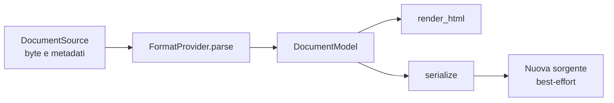

# Modello del documento

> **Stato:** implementato  
> **Fonte di verità:** tipi pubblici di `fub-abi` e provider Markdown

Il `DocumentModel` rappresenta la struttura comune che i formati espongono al resto del sistema. Non è una copia byte-per-byte della sorgente e non appartiene al Markdown.

## Flusso

## Due operazioni diverse

| Operazione | Garanzia |
|---|---|
| Modifica del testo sorgente | Conserva ciò che non viene modificato nel buffer |
| Serializzazione del modello | Produce una rappresentazione valida, non un round-trip identico |

Questa distinzione evita una promessa falsa: un parser può capire la semantica di un documento senza ricordare ogni dettaglio sintattico originale.

## Contenuto del modello

- albero dei nodi;
- intervalli nella sorgente;
- link, tag e proprietà;
- blocchi personalizzati;
- diagnostica;
- riferimenti a dati esterni quando il contratto li consente.

## Posizioni

Le API interne distinguono byte UTF-8 e code unit JavaScript. La conversione avviene nel seam autorizzato; gli identificatori grandi non attraversano JavaScript come `number`.

## Limiti

Un provider deve documentare cosa preserva, cosa normalizza e cosa non può ricostruire. Il provider Markdown non deve dichiarare conservazione assoluta quando usa `serialize` su un modello generato.
