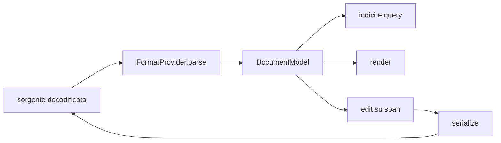
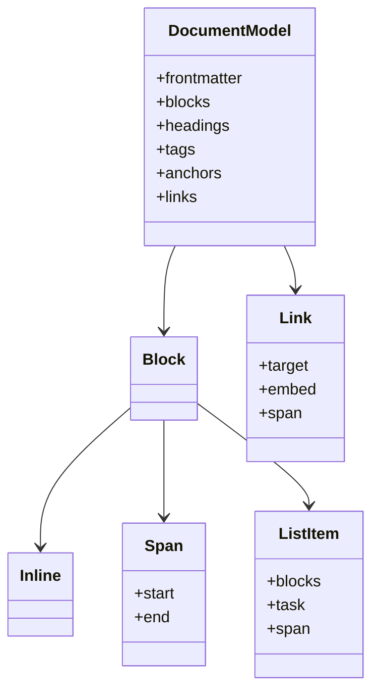
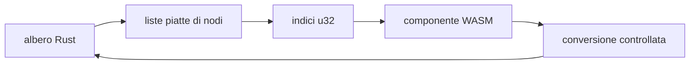

# Modello del documento

> **Domanda:** come rappresenta Fub documenti di formati diversi senza perdere
> la sorgente?
> **Fonti autorevoli:** `crates/fub-abi/src/model.rs`,
> `crates/fub-abi/src/arena.rs`, `crates/fub-abi/src/format.rs`,
> `crates/fub-format-sheet/src/lib.rs`.

## In breve

`DocumentModel` è una lettura strutturata e agnostica del formato. Non sostituisce
la sorgente: span, revisioni e serializzazione continuano a riferirsi ai byte
del file.

Il provider del formato trasforma `DocumentSource` in modello e resa. Il kernel
consuma il contratto comune.

## Flusso

## Tipi principali

Il diagramma mostra le relazioni concettuali, non tutti i campi delle enum Rust.

## Sorgente e span

La sorgente è la stringa decodificata integralmente:

- BOM conservato;
- terminatori di riga conservati;
- nessuna normalizzazione implicita.

`Span` usa intervalli `[start, end)` in byte UTF-8. Nel codice nativo gli offset
sono `usize`; nel WIT sono `u64` per avere larghezza fissa.

Un edit calcolato su un modello vale per la revisione da cui quel modello
proviene. Il kernel non applica la posizione a un testo diverso senza rilevare
il conflitto.

## Blocchi e inline

Il modello distingue blocchi e contenuto inline. Tra le forme comuni esistono:

- paragrafi e heading;
- liste e task;
- quote e codice;
- tabelle;
- link, tag e testo;
- estensioni `Custom` namespaced.

Una forma entra nel modello comune quando più consumatori devono interrogarne la
struttura o quando l'escape hatch perderebbe dati necessari. Un'estensione
specifica del formato può restare `Custom`.

## Identità interne

- gli heading hanno slug e possono avere un'ancora esplicita;
- i blocchi possono avere ancore;
- link e tag conservano lo span nella sorgente;
- `DocId` identifica un documento nel vault, non un nodo del modello;
- l'embed è una proprietà del riferimento, non del bersaglio.

## Proprietà

Il frontmatter grezzo resta JSON e rimane l'autorità del valore.
`PropertyValue` è una proiezione ricostruibile per valori comuni: testo, liste
piatte, numeri, checkbox, date, date-ora, tag e link. Il registro
`PropertyTypes` associa facoltativamente un tipo al nome in tutto il vault; è
metadato di interpretazione, non una copia dei valori.

Senza dichiarazione restano valide le convenzioni `aliases`/`alias`,
`tags` e `cssclasses`/`cssclass`. Una dichiarazione incompatibile, un valore
annidato o uno schema futuro non viene convertito: resta JSON autorevole e si
modifica dalla sorgente. Chi interroga, ordina, conta faccette o mostra colonne
usa la stessa proiezione tipizzata; assente, `null` e lista vuota restano casi
distinti.

## Workbook `.fubsheet`

Una griglia non viene forzata nell'albero di `DocumentModel`.
`fub-format-sheet::Workbook` è un modello autorevole separato: conserva
versione, proprietà, ordine, dimensioni, input e stile. Le celle usano identità
stabili composte da sheet, riga e colonna; A1 dipende dall'ordine corrente.

Formula AST, valori, dipendenze, cache, A1 ed errori sono derivati e non
persistiti. Outline, ricerca e proprietà sono proiezioni comuni del workbook,
non campi aggiunti al modello dei blocchi. Il formato JSON v1 rifiuta campi
sconosciuti, versioni future, coordinate ambigue o mancanti e input oltre i
limiti dichiarati, evitando una riscrittura con perdita silenziosa.

`Workbook::evaluate()` interpreta operatori, stringhe, booleani, riferimenti,
intervalli, riferimenti cross-sheet e le funzioni `SUM`, `AVERAGE`, `MIN`,
`MAX` e `IF`. Gli errori sono valori tipizzati e i cicli vengono rilevati. Il
client non replica questa semantica: chiede il risultato Rust dopo il commit e
usa l'input persistito come fallback.

## Arena al confine WASM

WIT non ammette tipi ricorsivi. Gli alberi `Block`, `Inline` e `UiNode`
attraversano il confine come arena piatta:

La conversione vive in `fub_abi::arena` e viene riusata dal proxy WASM. Limiti
di profondità e indici fuori range producono un errore; non si ricostruisce un
albero malformato.

## Invarianti

- il modello non importa Markdown;
- gli span si riferiscono alla sorgente esatta;
- parse e serializzazione non normalizzano dati senza dichiararlo;
- gli alberi ricorsivi hanno una sola conversione al confine;
- un nuovo campo pubblico rispetta l'additività del WIT;
- una regola comune vive nel contratto, non in due provider;
- un workbook a celle conserva autorità e identità fuori da `DocumentModel`.

## Dove si trova

- `crates/fub-abi/src/model.rs`
- `crates/fub-abi/src/arena.rs`
- `crates/fub-abi/src/format.rs`
- `crates/fub-format-markdown/src/parse.rs`
- `crates/fub-format-markdown/src/render.rs`
- `crates/fub-format-markdown/src/serialize.rs`
- `crates/fub-format-sheet/src/lib.rs`
