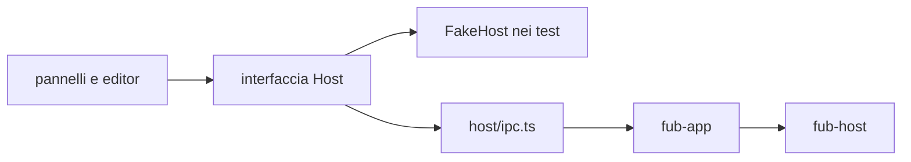
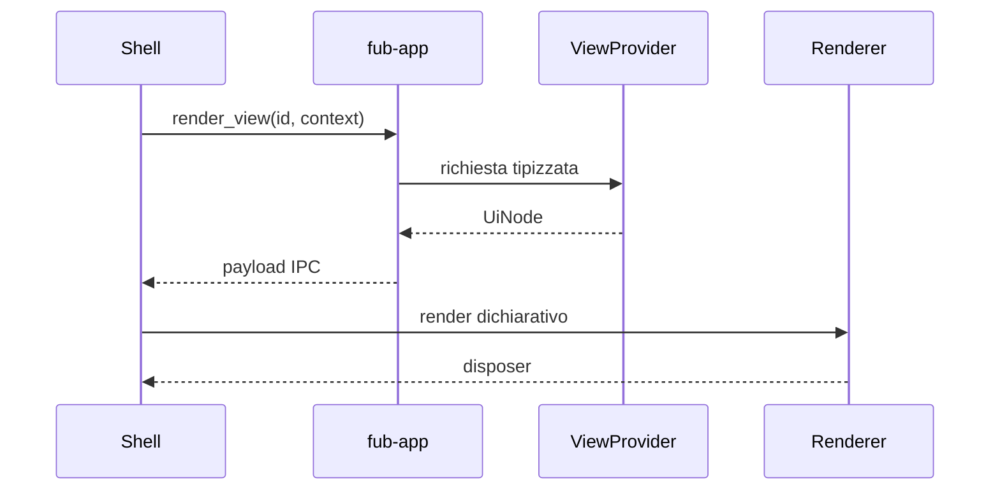

# Frontend e IPC

> **Domanda:** come comunica la shell TypeScript con il core senza diffondere
> Tauri e senza duplicare il contratto?
> **Fonti autorevoli:** `apps/client/src/host/`, `apps/client/src/editors/text/`,
> `apps/client/src/state/document-session.ts`, `apps/client/src/panels/document.ts`,
> `crates/fub-app/src/lib.rs`, `crates/fub-abi/src/ipc.rs`.

## Il seam

`apps/client/src/host/` contiene:

- tipi del confine;
- interfaccia usata dalla shell;
- implementazione IPC reale;
- dialoghi desktop;
- fake host per i test;
- enum generati e fixture di conformità.

Soltanto `host/ipc.ts` e `host/dialog.ts` importano `@tauri-apps`. Un pannello
parla con l'interfaccia host, non con `invoke` direttamente.

## Contratto TypeScript

`contract.ts` rispecchia le forme che attraversano IPC. Gli enum senza payload
sono generati dai tipi Rust; le fixture serializzate verificano le forme più
complesse.

Il mirror non è una seconda implementazione della logica. Contiene soltanto:

- nomi e tipi serializzati;
- commenti sul significato;
- helper di lettura che non cambiano la semantica.

## Interi

JSON non preserva tutti gli interi `u64`. Identità, revisioni e hash che possono
superare `2^53 - 1` attraversano IPC come stringhe.

Un valore temporale in millisecondi può restare `number` quando il proprio
dominio è dimostrabilmente sicuro e viene usato per aritmetica.

## Porte generiche

Preferisci:

| Esigenza | Porta |
|---|---|
| dati indicizzati | `query_index` |
| elenco comandi | `list_commands` |
| esecuzione comando | `invoke_command` |
| elenco view | `list_views` |
| resa view | `render_view` |
| azione su view | `view_action` |

Le porte dedicate restano per operazioni autorevoli che non sono semplici
provider, come apertura del vault, scritture, bozze e lifecycle desktop.

## UI dichiarativa

Una view restituisce `UiNode`, non DOM. Ogni nodo ha una specie, una chiave
stabile e, quando serve, un'azione con payload opaco.

I renderer custom sono namespaced e posseduti da un bundle. Lo smontaggio
rimuove renderer, listener e stato.

## Stato della shell

La shell possiede:

- layout e riquadri;
- tab e focus;
- cursore, scroll e modalità;
- tema visuale;
- animazioni;
- preferenze locali della resa;
- lo stato autorevole in memoria dei documenti aperti, tramite le sessioni
  documento.

Il core possiede:

- documenti persistenti e revisioni;
- policy e permessi;
- indici;
- esito dei comandi;
- eventi;
- dati persistenti dichiarati dal contratto.

La `DocumentSession` è l'autorità della shell per il testo in memoria e per la
scrittura del documento aperto; il core resta l'autorità del file persistente e
della revisione verificata dalla scrittura.

## Superfici di editing

La sessione documento e la superficie non sono la stessa cosa. Il percorso
corrente crea una sola `DocumentSession` per documento tramite
`DocumentSessionCollection`, l'unico owner e percorso di costruzione in
`apps/client/src/state/document-session.ts`.

La sessione possiede il buffer autorevole in memoria: testo, revisione di base,
stato dirty, coda e debounce di salvataggio e bozza, esiti, riconciliazione degli
eventi esterni, conflitti, rinomina, cancellazione e chiusura. Il buffer è lo
stato condiviso del documento, non una copia per riquadro.

La collection mantiene la sessione finché il documento è trattenuto da almeno
un riquadro o da un'apertura in corso. Il rilascio dell'ultima tab esegue il
flush della scrittura e, se il testo resta sporco, della bozza, prima di
chiudere l'owner. Una rinomina mantiene lo stesso owner e il suo buffer; una
cancellazione riuscita o una rimozione esterna lo chiudono. La riapertura crea o
riusa l'owner a partire dalla sorgente.

Durante una cancellazione in attesa di conferma la sessione sospende i timer e
segnala lo stato di cancellazione pendente; il pannello congela con
`setReadOnly` gli editor di ogni riquadro che mostra il documento finché la
conferma non risolve. Il fan-out continua a raggiungere le superfici congelate:
una modifica accettata da un altro riquadro resta visibile ma non modificabile.

Ogni `Pane` possiede invece la superficie restituita dal
`DocumentSurfaceRegistry`. `renderPane()` costruisce soltanto il **chrome** del
riquadro: contenitori, tab, preview e view. Quando il riquadro mostra un
documento, `panels/document.ts` ricava la richiesta da
`surfaceRequestForDocument(id)` e delega a `surfaceRegistry.mount`; non
costruisce factory in loco.

Il registro è posseduto dalla shell (`apps/client/src`), non da `fub-abi`.
`bootstrapSurfaceRegistry()` in `apps/client/src/editors/bootstrap.ts` crea il
registro e registra le factory della shell per Markdown e plain text. In
generale, ogni factory appartiene all'owner della registrazione che la espone.
`desktop-shell.ts` crea il registro prima di `mountDocument()` e lo inietta in
`DocumentDeps`. `createEditor()` in `apps/client/src/editor/editor.ts` resta un
adapter di compatibilità. Il pannello monta sempre la superficie scelta dal
registro.

L'API pubblica del registro espone `register`, che restituisce un disposer,
`resolve`, `select` e `mount`. Non esiste `releaseSurface`. Un `SurfaceOverride`
è soltanto un riferimento a una registrazione posseduta oppure la stringa del
suo id di registrazione. Una `SurfaceFactory` nuda, compreso
`override.factory`, viene rifiutata con una superficie di errore esplicita per
override non registrato; non attiva un fallback silenzioso.

Per la versione, factory e registrazioni espongono soltanto
`supportedVersions?: readonly number[]`; se il campo manca, la versione
supportata è implicitamente `[1]`. La richiesta conserva `version?: number`.
Non esiste un campo `version` sovrapposto su factory o registrazione.

Il lifecycle mantiene l'ownership esplicita. Il `destroy()` pubblico di una
superficie montata è idempotente: prima la rimuove dall'insieme delle istanze
vive della registrazione, poi invoca `inner.destroy()`. Il disposer restituito
da `register()` e `unregister` sono idempotenti. `unregister` fotografa le
istanze vive, svuota il `Set`, distrugge ogni istanza fotografata e continua
anche se una distruzione lancia; rilancia infine il primo errore. Non cerca né
ridistrugge istanze già distrutte.

`DocumentPanel` conserva la chiave opaca restituita da `select`. Riusa una
superficie soltanto quando `r.selectionKey === selected.key`. `family` e
`profile` descrivono capability, non l'identità di riuso: due registrazioni con
la stessa coppia restano distinguibili perché hanno chiavi di selezione diverse.

La risoluzione segue quest'ordine:

1. override esplicito dell'utente;
2. binding esatto `formatKey`;
3. binding per `species`;
4. fallback testuale;
5. viewer in sola lettura per una sorgente a byte;
6. superficie di errore esplicita per famiglia, profilo o versione non
   supportati.

Per una richiesta che dichiara entrambe `family` e `profile`, il registro
considera anche le registrazioni della coppia prima di applicare i fallback.
La coppia `family`-`profile` non è un binding singleton esclusivo. Le collisioni
su `formatKey` o sul nome di `species` coinvolgono entrambi gli owner e
impediscono la registrazione: non vale mai “vince l'ultimo”. Se più
registrazioni corrispondono alla stessa coppia `family`-`profile`, la selezione
mostra un errore visibile che nomina entrambi gli owner.

La superficie scelta dal registro condivide la sessione del documento ma
conserva il proprio stato visuale, come stabilito da
[0190](../decisions/0190-sessioni-documento-e-undo.md).

I fallback incorporati sono superfici DOM, non editor testuali. Il fallback ha
`family: "text"` e `profile: "fallback"` e non implementa
`TextEditorSurface`; il viewer ha `family: "viewer"`; gli errori hanno
`family: "error"`. `DomSurface` crea un elemento con `role="region"`, aggiorna
`aria-readonly` e `dataset.surfaceTheme`, e rende `destroy()` idempotente.

L'identità del formato è un'inferenza temporanea dal path e dall'estensione in
`surfaceRequestForDocument(id)`. La funzione non riceve `handledExtensions`.
Le allowlist sono:

- Markdown: estensioni `md` e `markdown`, oppure id `text/markdown`;
- testo piano: estensioni `plain`, `text` e `txt`, oppure id `text/plain`;
- byte: estensioni `bin`, `blob`, `bytes`, `dat`, `opaque` e `binary` (anche
  gli id `bytes` e `binary`).

Ogni altro id produce `family: "text"` e `profile: "unknown"` e quindi il
fallback testuale. Un'estensione gestita da un provider, come `note` o
`fubsheet`, non viene classificata automaticamente come Markdown. Le
`handledExtensions` e `VaultInfo.extensions` restano esclusivamente dati per
esploratore e note di cartella: non sono l'identità del formato. Nessun
`format_id` attraversa IPC; `FormatDescriptor.id` esiste in Rust ma non fa
parte di `VaultInfo`.

`TextEngine` in `apps/client/src/editors/text/engine.ts` è il motore testuale
corrente. Possiede la `EditorView` e la meccanica condivisa: aggiornamenti e
sincronizzazione del documento, selezioni e offset byte UTF-8, terminatori di
riga, focus, reveal, tema, sola lettura, undo/redo e `destroy()`. Il seam
`extensions` monta la configurazione di un profilo; `reconfigure()` sostituisce
le estensioni senza ricostruire vista, documento, selezione, tema o history
nativa.

Ogni `TextEngine` monta `history({ minDepth: 100, newGroupDelay: 500 })` nel
proprio `historyCompartment`. CodeMirror possiede quindi i due rami per
superficie, l'inversione, il raggruppamento, la composizione, la history delle
selezioni e il mapping attraverso cambi esterni. `historyKeymap` è montata nel
keymap effettivo insieme ai comandi dell'editor: include undo/redo del contenuto
e `undoSelection`/`redoSelection`; l'estensione `history()` registra anche gli
eventi DOM `beforeinput` `historyUndo` e `historyRedo`. `TextEngine.undo()` e
`redo()` sono adapter dei comandi nativi e non leggono campi o strutture private
di CodeMirror.

Una modifica locale diventa un evento della history nativa della superficie.
`TextEngine.syncDoc()` costruisce la transazione dal risultato effettivo di
`EditorState.update()`, dopo i filtri del profilo, con
`Transaction.addToHistory.of(false)` e `Transaction.remote.of(true)`. Il cambio
esterno viene così applicato e mappato sui due rami senza aggiungere un evento
locale.

Prima di inviare un cambio esterno, `HistoryFootprints` conserva al massimo 512
intervalli non vuoti e anchor di cancellazione, soltanto come coordinate UTF-16:
non conserva testo, inversi o frame. `footprintsOverlap()` valuta il
`ChangeDesc` reale. Quando il controllo segnala un overlap o una metadata
sconosciuta, anche per un errore di mapping, fa eseguire a
`resetNativeHistory()` due transazioni pubbliche
successive: prima `historyCompartment.reconfigure([])`, poi il reinserimento
della history nativa. La transazione di sync viene ricostruita dopo il reset e
soltanto allora inviata. Il reset scarta entrambi i rami nativi (anche la
history di selezione) prima di mostrare il cambio esterno; se il reset fallisce,
il sync viene interrotto.

### Confine delle operazioni tra superfici

Il flusso delle modifiche è esplicito e resta interno alla shell:
`TextEngine.handleUpdate()` crea un `EditorChange` con `text`, `operation`
(`TextOperation`) e `origin`; il pannello inoltra questi dati alla sessione,
senza ridurre l'operazione al solo testo.

`TextOperation` vive in `apps/client/src/editor/text-operation.ts` e non conosce
CodeMirror, DOM o history. La `DocumentSession` valida l'operazione tipizzata
contro il testo autorevole, usando la stessa normalizzazione dei terminatori per
preimmagine e testo obiettivo. Un'operazione stantia, malformata o incoerente
lascia invariato il buffer e riallinea la superficie sorgente col testo
autorevole.

Quando la validazione riesce, la sessione aggiorna una volta testo e dirty,
pianifica salvataggio e bozza e diffonde l'operazione alle superfici sottoscritte
tranne la sorgente. Una sostituzione autorevole — ricarica pulita, conflitto
scartato o bozza recuperata — diffonde invece il testo intero a tutte le
superfici. Il pannello possiede il collegamento delle superfici e applica questi
dati all'editor; non possiede la validazione, il buffer o il fan-out delle
modifiche.

La superficie destinataria esegue una seconda guardia:
`TextEngine.syncDoc()` valida l'operazione ricevuta contro il proprio testo
corrente e contro il testo obiettivo normalizzato. Se l'operazione è stantia o
non produce l'obiettivo, usa `operationFromText(current, normalizedText)` come
fallback locale e limitato. Il cambio passa quindi dalla history nativa con
origine `sync`, senza diventare una battuta locale; l'eventuale overlap viene
gestito dalla guardia `HistoryFootprints` descritta sopra.

`EditorChange`, `DocumentUpdate` e `TextOperation` sono tipi interni della
shell TypeScript: non attraversano `host/contract.ts`, IPC, WIT o ABI.
`DocumentSessionCollection` costruisce e conserva gli owner; ogni
`DocumentSession` coordina testo, revisione di base, dirty, coda, salvataggio,
bozza, conflitto, rinomina, cancellazione e chiusura. Le superfici sottoscritte
ricevono soltanto dati e ciascun `TextEngine` conserva i propri rami nativi e la
metadata di sicurezza. `operationFromText()` è soltanto il fallback del
ricevente, non la sostituzione dell'operazione tipizzata emessa dalla sorgente.

La distinzione è motivata da [0190](../decisions/0190-sessioni-documento-e-undo.md)
e il confine di sicurezza della history nativa è precisato in
[0199](../decisions/0199-history-nativa-e-gate-di-overlap.md); 0199 completa
0190 senza sostituirla.

I profili condividono lo stesso motore e aggiungono soltanto semantica di
dominio:

| Profilo | Responsabilità corrente |
|---|---|
| `MarkdownProfile` | `createMarkdownProfile()` monta linguaggio Markdown, comandi, live preview, completamenti e callback per wikilink e tag. |
| `PlainTextProfile` | `createPlainTextProfile()` monta estensioni vuote, senza sintassi o comandi di dominio. |
| `FormulaProfile` | `createFormulaProfile()` monta lessico, completamenti per funzioni/fogli/nomi e commit/cancel espliciti; `singleLine` è configurabile. |

`TextEditorSurface` espone il contratto generico del testo: `setDoc`,
`syncDoc`, `selections` e `revealByteOffset`, oltre alle operazioni comuni
della superficie. Non conosce Markdown. `MarkdownEditorSurface`, con
`profile: "markdown"`, aggiunge `setSyntaxForms` e `setLivePreview`.
`PlainTextSurface`, con `profile: "plain-text"`, non implementa API Markdown
vuote o fittizie.

`bootstrapSurfaceRegistry()` registra le factory possedute dalla shell per
Markdown e plain text. `handledExtensions` non decide il profilo della
superficie: l'inferenza temporanea e le sue allowlist sono descritte sopra.
Il plain text è un client architetturale della shell, non una funzionalità del
vault per gli utenti; nel fake host soltanto `.md` è trattato come documento.

Il catalogo delle modalità vive sulla superficie che lo dichiara, non sul
contratto generico `EditorSurface` o `TextEditorSurface`. `SurfaceModeful`
espone `modes`, `defaultMode`, `mode()` e `setMode()`; le factory modeful
dichiarano lo stesso catalogo tramite `modes` e `defaultMode`, e la superficie
montata lo espone. Markdown dichiara `source`, `live_preview` e `reading`, con
`defaultMode: "live_preview"`; plain text dichiara soltanto `source`, con
`defaultMode: "source"`. Fallback, viewer ed error sono superfici non
modeful. Non esiste un `DocumentModeRegistry` parallelo.

`PaneMode` resta l'ABI `source | live_preview | reading` di
`ViewContext.mode`. Il pannello conserva la modalità persistita del riquadro e
calcola `effectiveMode` confrontandola con il catalogo della superficie:
`live_preview` può quindi restare persistita passando a plain text, mentre
chrome e contesto seguono `effectiveMode` e pubblicano `source`. Il contesto
pubblica `live_preview` soltanto quando la superficie attiva la dichiara.
Il pannello applica `surface.setMode(effectiveMode)` e non invoca
`setLivePreview`; su Markdown `setMode` mappa già `live_preview`, `source` e
`reading` sulla configurazione del profilo.

Il commutatore `#mode-switch` si ricostruisce dal catalogo della superficie
con il focus. Senza documento o con una superficie non modeful non crea
bottoni; Markdown mostra ancora Sorgente, Live e Lettura con le chiavi i18n
esistenti.

L'arbitrato della tastiera segue sette livelli, implementati in
`apps/client/src/ui/arbitration.ts` e consumati da `ui/keyboard.ts`, in questo
ordine: 1) overlay transitorio, 2) editor locale in modifica, 3) comandi della
superficie attiva, 4) profilo attivo, 5) comandi del documento, 6) comandi del
riquadro, 7) comandi globali. I livelli 3 e 4 sono punti di estensione no-op:
Markdown e plain text affidano i comandi locali alla keymap di
CodeMirror.

La tastiera applicativa ha un solo `document` `keydown` di produzione, in
`ui/keyboard.ts` e montato tramite `Lifetime`. In produzione non ci sono
`window` o `document` `keydown` sotto `editors/**` né in `panels/preview.ts`.
L'arbitrato non sottrae undo/redo nativi: i tre accordi dell'insieme
`PASSED_TO_EDITOR` (`shell.doc.search`, `shell.pane.split.down`,
`shell.mode.live`) restano dell'editor quando il focus è dentro `.cm-editor`.

Un riquadro o una finestra vuoti contengono soltanto il chrome, senza una
`EditorView` Markdown fittizia.

`FormulaProfile` resta una superficie usata soltanto dai test e dalle fixture:
non è una superficie esposta all'utente. Sono assenti la griglia (`GridEngine`),
il percorso utente `.fubsheet`, la famiglia `structured` e le superfici WASM.
Il contratto generico non consegna `live_preview` a una griglia né al percorso
`.fubsheet`.

I moduli dei profili sono rispettivamente
`apps/client/src/editors/text/profiles/markdown/profile.ts`,
`apps/client/src/editors/text/profiles/plain-text.ts` e
`apps/client/src/editors/text/profiles/formula.ts`. Le callback
`FormulaProfileCallbacks.commit` e `.cancel` sono punti di integrazione
TypeScript interni e iniettati dal chiamante; non attraversano IPC, WIT o ABI.

## Confine CodeMirror

Gli import `@codemirror/*` della shell sono confinati a
`apps/client/src/editors/text/`. `editors/core` non importa CodeMirror:
`TextEngine`, i tre profili, le loro estensioni e i test del seam vivono sotto
questo percorso. `editor/editor.ts` conserva l'adapter di compatibilità;
`panels/document.ts` usa il registro e i tipi, ma non usa più l'adapter e non
importa CodeMirror.

`node .github/scripts/check-codemirror-boundary.mjs` percorre
`apps/client/src` e segnala ogni import CodeMirror fuori da
`apps/client/src/editors/text/`. Il confine impedisce copie incompatibili e
mantiene CodeMirror un servizio della shell testuale.

Gli altri guard del frontend impediscono:

- nuovi import Tauri fuori dal seam;
- listener globali senza owner;
- attese concorrenti senza il primitivo di cancellazione;
- mirror TypeScript non aggiornati.

## Dove si trova

- `apps/client/src/editors/core/registry.ts`
- `apps/client/src/editors/bootstrap.ts`
- `apps/client/src/editors/text/factories.ts`
- `apps/client/src/editors/text/engine.ts`
- `apps/client/src/editors/text/history-footprints.ts`
- `apps/client/src/editors/text/profiles/markdown/profile.ts`
- `apps/client/src/editors/text/profiles/markdown/commands.ts`
- `apps/client/src/editors/text/profiles/markdown/completions.ts`
- `apps/client/src/editors/text/profiles/markdown/livepreview.ts`
- `apps/client/src/editors/text/profiles/plain-text.ts`
- `apps/client/src/editors/text/profiles/formula.ts`
- `apps/client/src/editor/text-operation.ts`
- `apps/client/src/editor/editor.ts`
- `apps/client/src/panels/document.ts`
- `apps/client/src/host/contract.ts`
- `apps/client/src/host/ipc.ts`
- `apps/client/src/host/dialog.ts`
- `apps/client/src/panels/`
- `apps/client/src/state/`
- `apps/client/src/ui/arbitration.ts`
- `apps/client/src/ui/keyboard.ts`
- `apps/client/src/ui/`
- `crates/fub-app/src/lib.rs`
