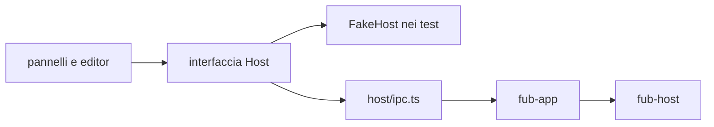
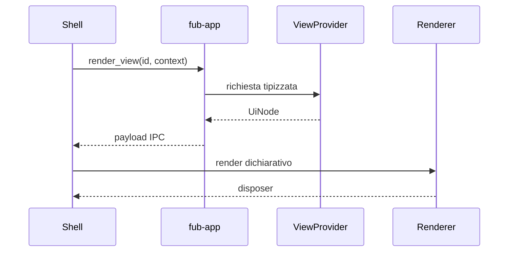

# Frontend e IPC

> **Domanda:** come comunica la shell TypeScript con il core senza diffondere
> Tauri e senza duplicare il contratto?
> **Fonti autorevoli:** `apps/client/src/host/`, `apps/client/src/platform/`,
> `apps/client/src/desktop-shell.ts`, `apps/client/src/state/document-session.ts`,
> `crates/fub-app/src/lib.rs`, `crates/fub-abi/src/ipc.rs`.

## Il seam

`apps/client/src/host/` contiene:

- tipi del confine;
- interfaccia usata dalla shell;
- implementazione IPC reale;
- dialoghi desktop;
- fake host per i test;
- enum generati e fixture di conformità.

Soltanto `host/ipc.ts` e `host/dialog.ts` importano `@tauri-apps`. Un pannello
parla con l'interfaccia host, non con `invoke` direttamente.

Una domanda sì/no all'utente è sempre `confirm` di `host/dialog.ts`, la
superficie che la piattaforma disegna: nessun pannello ne disegna una propria.
I dialoghi della shell in `ui/dialogs.ts` coprono ciò che il sistema non offre,
cioè un nome da scrivere e una scelta in un elenco lungo.

## Contratto TypeScript

`contract.ts` rispecchia le forme che attraversano IPC. Gli enum senza payload
sono generati dai tipi Rust; le fixture serializzate verificano le forme più
complesse.

Il mirror non è una seconda implementazione della logica. Contiene soltanto:

- nomi e tipi serializzati;
- commenti sul significato;
- helper di lettura che non cambiano la semantica.

## Interi

JSON non preserva tutti gli interi `u64`. Identità, revisioni e hash che possono
superare `2^53 - 1` attraversano IPC come stringhe.

Un valore temporale in millisecondi può restare `number` quando il proprio
dominio è dimostrabilmente sicuro e viene usato per aritmetica.

## Porte generiche

Preferisci:

| Esigenza | Porta |
|---|---|
| dati indicizzati | `query_index` |
| elenco comandi | `list_commands` |
| esecuzione comando | `invoke_command` |
| elenco view | `list_views` |
| resa view | `render_view` |
| azione su view | `view_action` |

Le porte dedicate restano per operazioni autorevoli che non sono semplici
provider, come apertura del vault, scritture, bozze e lifecycle desktop.

## UI dichiarativa

Una view restituisce `UiNode`, non DOM. Ogni nodo ha una specie, una chiave
stabile e, quando serve, un'azione con payload opaco.

Una view dell'area principale non si monta all'avvio: la ospita un riquadro,
come una linguetta accanto alle note, e l'istanza è il riquadro. La apre la
palette, con una voce per ogni view che non ha parametri obbligatori, oppure un
comando che restituisce `CommandEffect::OpenView`. Gli argomenti restano sulla
linguetta e il kernel li convalida contro i `ParamSpec` della view a ogni resa.
Una view di barra laterale non si apre così: la monta la shell, e l'effetto
che la nomina viene segnalato come non eseguibile.

Le icone (`spec.icon` di una view, il nodo `icon`) sono nomi del repertorio
della shell in `ui/icons.ts`, lo stesso che disegna rail e ispettore. Il
repertorio è aperto ai moduli della shell: `registerIcon` accetta soltanto
tracciati SVG col costrutto del set, non ridefinisce un nome già disegnato e
restituisce il teardown. Un nome sconosciuto non disegna niente.

I renderer custom sono namespaced e posseduti da un bundle. Lo smontaggio
rimuove renderer, listener e stato. Oltre al payload e alla porta delle azioni,
un renderer riceve il contesto del montaggio (`CustomRenderContext`), cioè il
documento nella cui resa sta il nodo, oppure `null` in una view. Lo passa chi
monta l'albero, e lo riceve allo stesso modo un renderer di qualunque `ns`.
Il renderer del grafo si registra in modo sincrono, ma carica il motore
soltanto quando monta una superficie. Uno smontaggio durante il caricamento
impedisce il mount tardivo; canvas, pannello fisico e sottoscrizioni restano
posseduti dalla stessa superficie.

## Stato della shell

La shell possiede:

- layout e riquadri;
- tab e focus;
- cursore, scroll e modalità;
- tema visuale;
- animazioni;
- preferenze locali della resa;
- lo stato autorevole in memoria dei documenti aperti, tramite le sessioni
  documento.

Il core possiede:

- documenti persistenti e revisioni;
- policy e permessi;
- indici;
- esito dei comandi;
- eventi;
- dati persistenti dichiarati dal contratto.

La `DocumentSession` è l'autorità della shell per il testo in memoria e per la
scrittura del documento aperto; il core resta l'autorità del file persistente e
della revisione verificata dalla scrittura.

Per i temi, la selezione autorevole passa dalla porta settings; la cache browser
è soltanto bootstrap del primo fotogramma. `previewTheme` monta invece una
selezione effimera senza IPC di scrittura: `cancelThemePreview`, la chiusura
delle Impostazioni o un'applicazione esplicita terminano la preview. Solo
`selectTheme` persiste la scelta.

Le linguette sono pulsanti nativi, posseduti dal `tablist` tramite `aria-owns`;
il pulsante di chiusura è un controllo fratello, non un elemento interattivo
annidato. Frecce, Home ed End spostano il focus, Invio e Spazio attivano la
linguetta, Delete la chiude. Gli aggiornamenti di stato preservano il nodo a
fuoco; una chiusura trasferisce il focus a una linguetta vicina o al menu del
riquadro rimasto vuoto.

I divisori espongono ruolo, limiti e dimensione corrente. Tastiera e
trascinamento modificano la stessa misura in pixel CSS; lo zoom della shell
non altera il rapporto fra movimento del puntatore e larghezza risultante.

## Shell e piattaforma

La shell comune (`desktop-shell.ts`) è la stessa su desktop e su mobile. Ogni
shell dichiara all'avvio le proprie capacità di piattaforma (`declareShell` in
`platform/capabilities.ts`), e la shell comune le interroga per capacità con
`platformSupports`, mai confrontando l'id della shell: controlli finestra,
divisori trascinabili, finestre multiple.

La cartella di un vault la sceglie il selettore della shell attiva
(`platform/vault-picker.ts`). Sul desktop è il selettore di cartelle del
sistema. Su mobile è il pannello dello spazio, dove la scelta fra spazio
privato e cartella condivisa è esplicita. Su mobile il backend monta soltanto
il vault privato, di cui risolve da sé il path; una cartella condivisa chiede
una verifica nativa del permesso che non esiste ancora, e resta da concedere.

Gli appunti passano da una porta sola (`platform/clipboard.ts`): di serie sono
quelli della webview, e una shell che ne ha di propri li dichiara con
`declareClipboard`. `writeClipboardText` non lancia mai in modo sincrono, e
l'assenza degli appunti è un errore tipizzato (`ClipboardUnavailable`), non un
controllo ripetuto in ogni pannello.

## Superfici di editing

Sessione documento, superfici, motori e profili, insieme al confine di
CodeMirror e al suo guard, sono in [Superfici dell'editor](editor-surfaces.md).

## Guard del frontend

Oltre al confine di CodeMirror, i guard del frontend impediscono:

- nuovi import Tauri fuori dal seam;
- scritture negli appunti della webview fuori da `platform/clipboard.ts`;
- listener globali senza owner;
- attese concorrenti senza il primitivo di cancellazione;
- mirror TypeScript non aggiornati.

## Dove si trova

- `apps/client/src/host/contract.ts`
- `apps/client/src/host/ipc.ts`
- `apps/client/src/ui/intents.ts`
- `apps/client/src/ui/primary-views.ts`
- `apps/client/src/platform/capabilities.ts`
- `apps/client/src/platform/vault-picker.ts`
- `apps/client/src/platform/clipboard.ts`
- `apps/client/src/desktop-shell.ts`
- `apps/client/src/state/document-session.ts`
