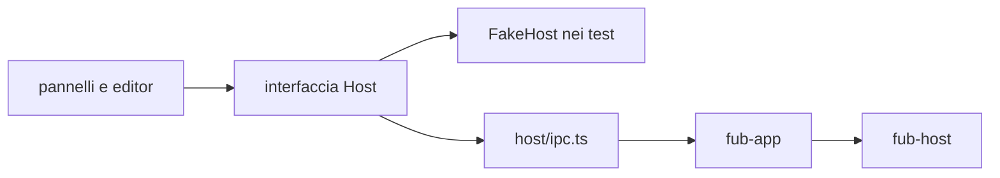
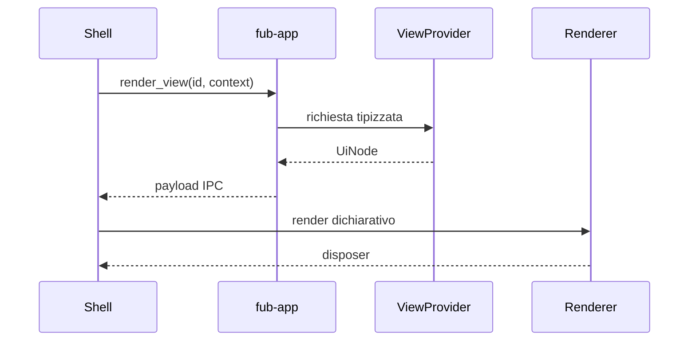

# Frontend e IPC

> **Domanda:** come comunica la shell TypeScript con il core senza diffondere
> Tauri e senza duplicare il contratto?
> **Fonti autorevoli:** `apps/client/src/host/`,
> `crates/fub-app/src/lib.rs`, `crates/fub-abi/src/ipc.rs`.

## Il seam

`apps/client/src/host/` contiene:

- tipi del confine;
- interfaccia usata dalla shell;
- implementazione IPC reale;
- dialoghi desktop;
- fake host per i test;
- enum generati e fixture di conformità.

Soltanto `host/ipc.ts` e `host/dialog.ts` importano `@tauri-apps`. Un pannello
parla con l'interfaccia host, non con `invoke` direttamente.

## Contratto TypeScript

`contract.ts` rispecchia le forme che attraversano IPC. Gli enum senza payload
sono generati dai tipi Rust; le fixture serializzate verificano le forme più
complesse.

Il mirror non è una seconda implementazione della logica. Contiene soltanto:

- nomi e tipi serializzati;
- commenti sul significato;
- helper di lettura che non cambiano la semantica.

## Interi

JSON non preserva tutti gli interi `u64`. Identità, revisioni e hash che possono
superare `2^53 - 1` attraversano IPC come stringhe.

Un valore temporale in millisecondi può restare `number` quando il proprio
dominio è dimostrabilmente sicuro e viene usato per aritmetica.

## Porte generiche

Preferisci:

| Esigenza | Porta |
|---|---|
| dati indicizzati | `query_index` |
| elenco comandi | `list_commands` |
| esecuzione comando | `invoke_command` |
| elenco view | `list_views` |
| resa view | `render_view` |
| azione su view | `view_action` |

Le porte dedicate restano per operazioni autorevoli che non sono semplici
provider, come apertura del vault, scritture, bozze e lifecycle desktop.

## UI dichiarativa

Una view restituisce `UiNode`, non DOM. Ogni nodo ha una specie, una chiave
stabile e, quando serve, un'azione con payload opaco.

I renderer custom sono namespaced e posseduti da un bundle. Lo smontaggio
rimuove renderer, listener e stato.

## Stato della shell

La shell possiede:

- layout e riquadri;
- tab e focus;
- cursore, scroll e modalità;
- tema visuale;
- animazioni;
- preferenze locali della resa.

Il core possiede:

- documenti e revisioni;
- policy e permessi;
- indici;
- esito dei comandi;
- eventi;
- dati persistenti dichiarati dal contratto.

## Superfici di editing

La sessione documento e la superficie non sono la stessa cosa. La prima
coordina il buffer e le scritture; la seconda possiede lo stato visuale locale.

L'estrazione di un registro generico di superfici non è ancora architettura
corrente. È tracciata in
[#11](https://github.com/Fubeo/Fub/issues/11) e richiede un secondo cliente
reale.

## Import consentiti

Un guard CI deve impedire:

- nuovi import Tauri fuori dal seam;
- listener globali senza owner;
- attese concorrenti senza il primitivo di cancellazione;
- copie multiple dei pacchetti CodeMirror;
- mirror TypeScript non aggiornati.

## Dove si trova

- `apps/client/src/host/contract.ts`
- `apps/client/src/host/ipc.ts`
- `apps/client/src/host/dialog.ts`
- `apps/client/src/panels/`
- `apps/client/src/state/`
- `apps/client/src/ui/`
- `crates/fub-app/src/lib.rs`
