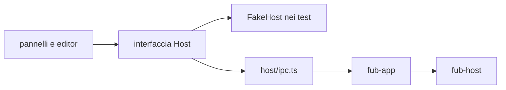
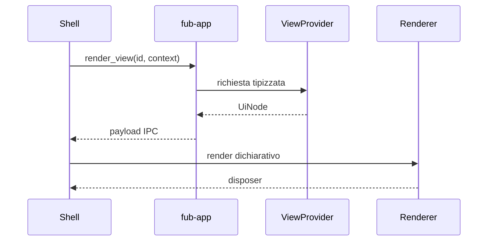

# Frontend e IPC

> **Domanda:** come comunica la shell TypeScript con il core senza diffondere
> Tauri e senza duplicare il contratto?
> **Fonti autorevoli:** `apps/client/src/host/`, `apps/client/src/editors/text/`,
> `apps/client/src/panels/document.ts`, `crates/fub-app/src/lib.rs`,
> `crates/fub-abi/src/ipc.rs`.

## Il seam

`apps/client/src/host/` contiene:

- tipi del confine;
- interfaccia usata dalla shell;
- implementazione IPC reale;
- dialoghi desktop;
- fake host per i test;
- enum generati e fixture di conformità.

Soltanto `host/ipc.ts` e `host/dialog.ts` importano `@tauri-apps`. Un pannello
parla con l'interfaccia host, non con `invoke` direttamente.

## Contratto TypeScript

`contract.ts` rispecchia le forme che attraversano IPC. Gli enum senza payload
sono generati dai tipi Rust; le fixture serializzate verificano le forme più
complesse.

Il mirror non è una seconda implementazione della logica. Contiene soltanto:

- nomi e tipi serializzati;
- commenti sul significato;
- helper di lettura che non cambiano la semantica.

## Interi

JSON non preserva tutti gli interi `u64`. Identità, revisioni e hash che possono
superare `2^53 - 1` attraversano IPC come stringhe.

Un valore temporale in millisecondi può restare `number` quando il proprio
dominio è dimostrabilmente sicuro e viene usato per aritmetica.

## Porte generiche

Preferisci:

| Esigenza | Porta |
|---|---|
| dati indicizzati | `query_index` |
| elenco comandi | `list_commands` |
| esecuzione comando | `invoke_command` |
| elenco view | `list_views` |
| resa view | `render_view` |
| azione su view | `view_action` |

Le porte dedicate restano per operazioni autorevoli che non sono semplici
provider, come apertura del vault, scritture, bozze e lifecycle desktop.

## UI dichiarativa

Una view restituisce `UiNode`, non DOM. Ogni nodo ha una specie, una chiave
stabile e, quando serve, un'azione con payload opaco.

I renderer custom sono namespaced e posseduti da un bundle. Lo smontaggio
rimuove renderer, listener e stato.

## Stato della shell

La shell possiede:

- layout e riquadri;
- tab e focus;
- cursore, scroll e modalità;
- tema visuale;
- animazioni;
- preferenze locali della resa.

Il core possiede:

- documenti e revisioni;
- policy e permessi;
- indici;
- esito dei comandi;
- eventi;
- dati persistenti dichiarati dal contratto.

## Superfici di editing

La sessione documento e la superficie non sono la stessa cosa. Nel codice
corrente non esiste però un `DocumentSession` estratto: `buffers` è una mappa
privata di `apps/client/src/panels/document.ts` con un `Buffer` per documento.
Il `Buffer` possiede testo, revisione di base, stato dirty, coda di salvataggio,
bozza, esito e timer; `Queue`, `scheduleSave()` e `saveDoc()` restano in quel
pannello.

Ogni `Pane` possiede invece un `Editor`. `renderPane()` crea l'editor chiamando
`createEditor()` da `apps/client/src/editor/editor.ts`, che costruisce un
`TextEngine` per quel riquadro e inoltra l'API del profilo Markdown. Questo
`createEditor()` è un adapter temporaneo di compatibilità, non un secondo
motore.

`TextEngine` in `apps/client/src/editors/text/engine.ts` è il motore testuale
corrente. Possiede la `EditorView` e la meccanica condivisa: aggiornamenti e
sincronizzazione del documento, selezioni e offset byte UTF-8, terminatori di
riga, focus, reveal, tema, sola lettura, undo/redo e `destroy()`. Il seam
`extensions` monta la configurazione di un profilo; `reconfigure()` sostituisce
le estensioni senza ricostruire vista, documento, selezione, tema o cronologia.

Ogni istanza di `TextEngine` crea una `LocalHistory` distinta, implementata in
`apps/client/src/editor/local-history.ts`. Una modifica locale aggiorna il
`Buffer` e viene inoltrata alle altre superfici con `syncDoc()`; la ricezione
usa il percorso esterno della cronologia e non aggiunge l'operazione all'undo
locale. Il buffer e la coda di scrittura sono quindi condivisi per documento,
mentre cursore, scroll, focus e history sono locali alla superficie.

I profili condividono lo stesso motore e aggiungono soltanto semantica di
dominio:

| Profilo | Responsabilità corrente |
|---|---|
| `MarkdownProfile` | `createMarkdownProfile()` monta linguaggio Markdown, comandi, live preview, completamenti e callback per wikilink e tag. |
| `PlainTextProfile` | `createPlainTextProfile()` monta estensioni vuote, senza sintassi o comandi di dominio. |
| `FormulaProfile` | `createFormulaProfile()` monta lessico, completamenti per funzioni/fogli/nomi e commit/cancel espliciti; `singleLine` è configurabile. |

I moduli sono rispettivamente
`apps/client/src/editors/text/profiles/markdown/profile.ts`,
`apps/client/src/editors/text/profiles/plain-text.ts` e
`apps/client/src/editors/text/profiles/formula.ts`. Le callback
`FormulaProfileCallbacks.commit` e `.cancel` sono punti di integrazione
TypeScript interni e iniettati dal chiamante; non attraversano IPC, WIT o ABI.

Non fa parte dell'architettura corrente un `DocumentSurfaceRegistry`: il
pannello crea direttamente i propri `Editor` e non risolve le superfici tramite
un registro.

## Confine CodeMirror

Gli import `@codemirror/*` della shell sono confinati a
`apps/client/src/editors/text/`. `TextEngine`, i tre profili, le loro estensioni
e i test del seam vivono sotto questo percorso; `editor/editor.ts` e
`panels/document.ts` usano l'adapter e i tipi senza importare CodeMirror.

`node .github/scripts/check-codemirror-boundary.mjs` percorre
`apps/client/src` e segnala ogni import CodeMirror fuori da
`apps/client/src/editors/text/`. Il confine impedisce copie incompatibili e
mantiene CodeMirror un servizio della shell testuale.

Gli altri guard del frontend impediscono:

- nuovi import Tauri fuori dal seam;
- listener globali senza owner;
- attese concorrenti senza il primitivo di cancellazione;
- mirror TypeScript non aggiornati.

## Dove si trova

- `apps/client/src/editors/text/engine.ts`
- `apps/client/src/editors/text/profiles/markdown/profile.ts`
- `apps/client/src/editors/text/profiles/markdown/commands.ts`
- `apps/client/src/editors/text/profiles/markdown/completions.ts`
- `apps/client/src/editors/text/profiles/markdown/livepreview.ts`
- `apps/client/src/editors/text/profiles/plain-text.ts`
- `apps/client/src/editors/text/profiles/formula.ts`
- `apps/client/src/editor/editor.ts`
- `apps/client/src/editor/local-history.ts`
- `apps/client/src/panels/document.ts`
- `apps/client/src/host/contract.ts`
- `apps/client/src/host/ipc.ts`
- `apps/client/src/host/dialog.ts`
- `apps/client/src/panels/`
- `apps/client/src/state/`
- `apps/client/src/ui/`
- `crates/fub-app/src/lib.rs`
