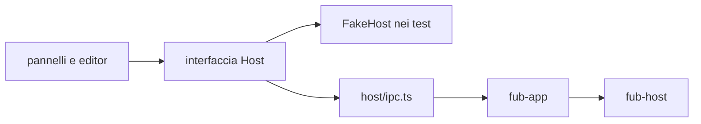
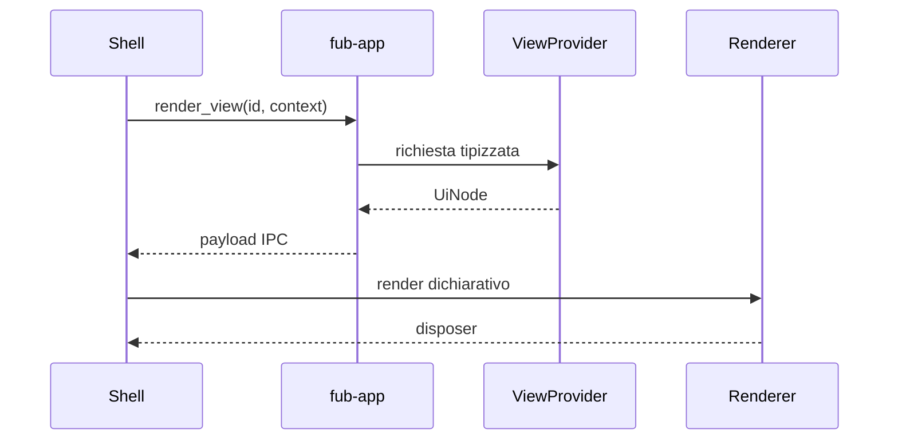

# Frontend e IPC

> **Domanda:** come comunica la shell TypeScript con il core senza diffondere
> Tauri e senza duplicare il contratto?
> **Fonti autorevoli:** `apps/client/src/host/`, `apps/client/src/editors/text/`,
> `apps/client/src/state/document-session.ts`, `apps/client/src/panels/document.ts`,
> `crates/fub-app/src/lib.rs`, `crates/fub-abi/src/ipc.rs`.

## Il seam

`apps/client/src/host/` contiene:

- tipi del confine;
- interfaccia usata dalla shell;
- implementazione IPC reale;
- dialoghi desktop;
- fake host per i test;
- enum generati e fixture di conformità.

Soltanto `host/ipc.ts` e `host/dialog.ts` importano `@tauri-apps`. Un pannello
parla con l'interfaccia host, non con `invoke` direttamente.

## Contratto TypeScript

`contract.ts` rispecchia le forme che attraversano IPC. Gli enum senza payload
sono generati dai tipi Rust; le fixture serializzate verificano le forme più
complesse.

Il mirror non è una seconda implementazione della logica. Contiene soltanto:

- nomi e tipi serializzati;
- commenti sul significato;
- helper di lettura che non cambiano la semantica.

## Interi

JSON non preserva tutti gli interi `u64`. Identità, revisioni e hash che possono
superare `2^53 - 1` attraversano IPC come stringhe.

Un valore temporale in millisecondi può restare `number` quando il proprio
dominio è dimostrabilmente sicuro e viene usato per aritmetica.

## Porte generiche

Preferisci:

| Esigenza | Porta |
|---|---|
| dati indicizzati | `query_index` |
| elenco comandi | `list_commands` |
| esecuzione comando | `invoke_command` |
| elenco view | `list_views` |
| resa view | `render_view` |
| azione su view | `view_action` |

Le porte dedicate restano per operazioni autorevoli che non sono semplici
provider, come apertura del vault, scritture, bozze e lifecycle desktop.

## UI dichiarativa

Una view restituisce `UiNode`, non DOM. Ogni nodo ha una specie, una chiave
stabile e, quando serve, un'azione con payload opaco.

I renderer custom sono namespaced e posseduti da un bundle. Lo smontaggio
rimuove renderer, listener e stato.

## Stato della shell

La shell possiede:

- layout e riquadri;
- tab e focus;
- cursore, scroll e modalità;
- tema visuale;
- animazioni;
- preferenze locali della resa;
- lo stato autorevole in memoria dei documenti aperti, tramite le sessioni
  documento.

Il core possiede:

- documenti persistenti e revisioni;
- policy e permessi;
- indici;
- esito dei comandi;
- eventi;
- dati persistenti dichiarati dal contratto.

La `DocumentSession` è l'autorità della shell per il testo in memoria e per la
scrittura del documento aperto; il core resta l'autorità del file persistente e
della revisione verificata dalla scrittura.

## Superfici di editing

La sessione documento e la superficie non sono la stessa cosa. Il percorso
corrente crea una sola `DocumentSession` per documento tramite
`DocumentSessionCollection`, l'unico owner e percorso di costruzione in
`apps/client/src/state/document-session.ts`.

La sessione possiede il buffer autorevole in memoria: testo, revisione di base,
stato dirty, coda e debounce di salvataggio e bozza, esiti, riconciliazione degli
eventi esterni, conflitti, rinomina, cancellazione e chiusura. Il buffer è lo
stato condiviso del documento, non una copia per riquadro.

La collection mantiene la sessione finché il documento è trattenuto da almeno
un riquadro o da un'apertura in corso. Il rilascio dell'ultima tab esegue il
flush della scrittura e, se il testo resta sporco, della bozza, prima di
chiudere l'owner. Una rinomina mantiene lo stesso owner e il suo buffer; una
cancellazione riuscita o una rimozione esterna lo chiudono. La riapertura crea o
riusa l'owner a partire dalla sorgente.

Durante una cancellazione in attesa di conferma la sessione sospende i timer e
segnala lo stato di cancellazione pendente; il pannello congela con
`setReadOnly` gli editor di ogni riquadro che mostra il documento finché la
conferma non risolve. Il fan-out continua a raggiungere le superfici congelate:
una modifica accettata da un altro riquadro resta visibile ma non modificabile.

Ogni `Pane` possiede invece una `EditorSurface`.
`DocumentSurfaceRegistry` risolve la factory da metadati `format_id` e
`source_kind`, applicando override, formato, specie, fallback testuale, viewer
per byte ed errore. Il registro possiede le istanze e le distrugge quando il
riquadro o l'owner vengono smontati.

`TextEngine` in `apps/client/src/editors/text/engine.ts` è il motore testuale
corrente. Possiede la `EditorView` e la meccanica condivisa: aggiornamenti e
sincronizzazione del documento, selezioni e offset byte UTF-8, terminatori di
riga, focus, reveal, tema, sola lettura, undo/redo e `destroy()`. Il seam
`extensions` monta la configurazione di un profilo; `reconfigure()` sostituisce
le estensioni senza ricostruire vista, documento, selezione, tema o history
nativa.

Ogni `TextEngine` monta `history({ minDepth: 100, newGroupDelay: 500 })` nel
proprio `historyCompartment`. CodeMirror possiede quindi i due rami per
superficie, l'inversione, il raggruppamento, la composizione, la history delle
selezioni e il mapping attraverso cambi esterni. `historyKeymap` è montata nel
keymap effettivo insieme ai comandi dell'editor: include undo/redo del contenuto
e `undoSelection`/`redoSelection`; l'estensione `history()` registra anche gli
eventi DOM `beforeinput` `historyUndo` e `historyRedo`. `TextEngine.undo()` e
`redo()` sono adapter dei comandi nativi e non leggono campi o strutture private
di CodeMirror.

Una modifica locale diventa un evento della history nativa della superficie.
`TextEngine.syncDoc()` costruisce la transazione dal risultato effettivo di
`EditorState.update()`, dopo i filtri del profilo, con
`Transaction.addToHistory.of(false)` e `Transaction.remote.of(true)`. Il cambio
esterno viene così applicato e mappato sui due rami senza aggiungere un evento
locale.

Prima di inviare un cambio esterno, `HistoryFootprints` conserva al massimo 512
intervalli non vuoti e anchor di cancellazione, soltanto come coordinate UTF-16:
non conserva testo, inversi o frame. `footprintsOverlap()` valuta il
`ChangeDesc` reale. Quando il controllo segnala un overlap o una metadata
sconosciuta, anche per un errore di mapping, fa eseguire a
`resetNativeHistory()` due transazioni pubbliche
successive: prima `historyCompartment.reconfigure([])`, poi il reinserimento
della history nativa. La transazione di sync viene ricostruita dopo il reset e
soltanto allora inviata. Il reset scarta entrambi i rami nativi (anche la
history di selezione) prima di mostrare il cambio esterno; se il reset fallisce,
il sync viene interrotto.

### Confine delle operazioni tra superfici

Il flusso delle modifiche è esplicito e resta interno alla shell:
`TextEngine.handleUpdate()` crea un `EditorChange` con `text`, `operation`
(`TextOperation`) e `origin`; il pannello inoltra questi dati alla sessione,
senza ridurre l'operazione al solo testo.

`TextOperation` vive in `apps/client/src/editor/text-operation.ts` e non conosce
CodeMirror, DOM o history. La `DocumentSession` valida l'operazione tipizzata
contro il testo autorevole, usando la stessa normalizzazione dei terminatori per
preimmagine e testo obiettivo. Un'operazione stantia, malformata o incoerente
lascia invariato il buffer e riallinea la superficie sorgente col testo
autorevole.

Quando la validazione riesce, la sessione aggiorna una volta testo e dirty,
pianifica salvataggio e bozza e diffonde l'operazione alle superfici sottoscritte
tranne la sorgente. Una sostituzione autorevole — ricarica pulita, conflitto
scartato o bozza recuperata — diffonde invece il testo intero a tutte le
superfici. Il pannello possiede il collegamento delle superfici e applica questi
dati all'editor; non possiede la validazione, il buffer o il fan-out delle
modifiche.

La superficie destinataria esegue una seconda guardia:
`TextEngine.syncDoc()` valida l'operazione ricevuta contro il proprio testo
corrente e contro il testo obiettivo normalizzato. Se l'operazione è stantia o
non produce l'obiettivo, usa `operationFromText(current, normalizedText)` come
fallback locale e limitato. Il cambio passa quindi dalla history nativa con
origine `sync`, senza diventare una battuta locale; l'eventuale overlap viene
gestito dalla guardia `HistoryFootprints` descritta sopra.

`EditorChange`, `DocumentUpdate` e `TextOperation` sono tipi interni della
shell TypeScript: non attraversano `host/contract.ts`, IPC, WIT o ABI.
`DocumentSessionCollection` costruisce e conserva gli owner; ogni
`DocumentSession` coordina testo, revisione di base, dirty, coda, salvataggio,
bozza, conflitto, rinomina, cancellazione e chiusura. Le superfici sottoscritte
ricevono soltanto dati e ciascun `TextEngine` conserva i propri rami nativi e la
metadata di sicurezza. `operationFromText()` è soltanto il fallback del
ricevente, non la sostituzione dell'operazione tipizzata emessa dalla sorgente.

La distinzione è motivata da [0190](../decisions/0190-sessioni-documento-e-undo.md)
e il confine di sicurezza della history nativa è precisato in
[0199](../decisions/0199-history-nativa-e-gate-di-overlap.md); 0199 completa
0190 senza sostituirla.

I profili condividono lo stesso motore e aggiungono soltanto semantica di
dominio:

| Profilo | Responsabilità corrente |
|---|---|
| `MarkdownProfile` | `createMarkdownProfile()` monta linguaggio Markdown, comandi, live preview, completamenti e callback per wikilink e tag. |
| `PlainTextProfile` | `createPlainTextProfile()` monta estensioni vuote, senza sintassi o comandi di dominio. |
| `FormulaProfile` | `createFormulaProfile()` monta lessico, completamenti per funzioni/fogli/nomi e commit/cancel espliciti; `singleLine` è configurabile. |

Markdown e plain text sono superfici utente distinte montate dal registro sullo
stesso `TextEngine`; `FormulaProfile` è incorporato dalla formula bar e
dall'editor in-cell di `GridEngine`. I moduli dei profili vivono rispettivamente
in `apps/client/src/editors/text/profiles/markdown/profile.ts`,
`apps/client/src/editors/text/profiles/plain-text.ts` e
`apps/client/src/editors/text/profiles/formula.ts`. Le callback
`FormulaProfileCallbacks.commit` e `.cancel` sono punti di integrazione
TypeScript interni e iniettati dal chiamante; non attraversano IPC, WIT o ABI.

Ogni superficie dichiara almeno una `SurfaceMode`: id estensibile, etichetta,
presentazione editabile o resa e proiezione sul `PaneMode` ABI già congelato.
Il layout conserva qualunque id non vuoto; se la superficie attuale non lo
supporta, il pannello usa il primo modo dichiarato senza sovrascrivere la
preferenza persistita. Il toggle `Mod-E` sceglie soltanto fra le modalità che la
superficie dichiara; quando manca una coppia edit/render non mostra un controllo
falso. La command palette usa la stessa proiezione e non conosce nomi di profilo.

La tastiera è ordinata per contesto: il popup di completamento e le keymap
CodeMirror precedono il layer della superficie; poi vengono profilo, documento,
riquadro e globale. La shell monta un solo listener globale e lo rimuove al
rimontaggio. Le callback di superficie diventano comandi nella stessa pipeline,
non un secondo sistema di tasti.

### Workbook e vertical slice della griglia

`crates/fub-format-sheet` possiede il formato testuale `.fubsheet` v1 e il
valutatore autorevole. `Workbook` conserva soltanto dati persistenti: versione,
proprietà, ordine, dimensioni, input e stile. `SheetId + RowId + ColumnId`
identifica una cella; A1, AST, valori, dipendenze, cache, errori, outline,
ricerca e proprietà comuni sono proiezioni calcolate.

Il formato è registrato nel kernel come sorgente conosciuta senza adattarlo a
`DocumentModel`: discovery, sincronizzazione e indicizzazione conservano
l'entry, mentre nessun parser di blocchi viene inventato. `GridEngine` analizza
lo stesso JSON strict nel client, virtualizza righe e colonne e produce
`GridOperation` con coordinate stabili, preimmagini e patch inverse.
`DocumentSession` valida e diffonde l'operazione tipizzata prima della scrittura
guardata; i reload full-text restano il fallback autorevole.

Editor in-cell e formula bar usano due istanze di `TextEngine` con
`FormulaProfile`, ma nessuna battuta attraversa IPC. Dopo un commit,
`host/sheet.ts` invia la sorgente completa con `query_index`, nel namespace
`fub.sheet`. Il provider nativo usa `Workbook::parse()` e
`Workbook::evaluate()`. La richiesta privata ha specie `evaluate`, versione
intera e campi chiusi; il risultato conserva valori ed errori formula tipizzati.
La sorgente è limitata a 16 MiB e la risposta JSON, envelope compreso, a 8 MiB.

Il bundle `fub.sheet` possiede la route nel registro. Disabilitarlo ritira la
valutazione senza rimuovere il formato sorgente; riabilitarlo registra di nuovo
il provider. Le generazioni asincrone scartano risposte stantie. Se la query
non è servita, la superficie dichiara `data-evaluation="unavailable"` e mostra
gli input grezzi senza duplicare il linguaggio formule in TypeScript.

`crates/fub-format-sheet/src/session.rs` possiede il motore derivato. Apertura e
reload costruiscono una sola valutazione e gli indici delle coordinate; le
letture successive restituiscono soltanto la finestra richiesta. Il commit
interno riceve fino a 16.384 patch e 4 MiB complessivi di preimmagini e nuovi
input. Valida revisione, coordinate, duplicati e tutte le preimmagini prima di
mutare; un errore lascia sorgente, revisione, valori e indici precedenti.

Un commit riuscito serializza il workbook autorevole una volta, rivalida la
sessione e restituisce un diff testuale con offset in byte UTF-8 e preimmagine.
Il diff non spezza caratteri multibyte né la coppia `\r\n`. La risposta viene
misurata, escaping JSON compreso, entro 8 MiB usando fette prese in prestito:
`deleted` e `inserted` vengono allocati soltanto dopo il controllo. La prima
canonicalizzazione di una sorgente non canonica può quindi fallire in modo
esplicito senza sostituire la sessione.

L'invalidazione include le coordinate modificate e le dipendenti transitive del
nuovo workbook, comprese formule che puntavano a celle prima assenti. Fino a
32.768 coordinate restituisce l'elenco ordinato; oltre la soglia restituisce
`all`. L'adapter `fub-host::sheet` conserva la derivazione comune
`Revision::of` ed espone la stessa semantica nativa. Il crate formato non
dipende dall'host ed è compilabile per WASM.

Questi tipi attraversano ora il contratto Rust↔WIT↔TypeScript e le porte IPC
tipizzate della famiglia Grid. La shell non riceve DOM, callback JavaScript o
oggetti CodeMirror: possiede rendering, input, clipboard, selezione e stato
visuale, mentre il provider possiede parsing, formule e dipendenze.
`query_index` resta read-only; per `.fubsheet` serve soltanto la valutazione
privata completa e non è il percorso delle finestre, patch, invalidazioni o
lifecycle Grid. Limiti, coordinate, fallback, diff UTF-8 e parità nativo/WASM
sono normati in [ABI e WIT](../reference/abi-and-wit.md) e nel [contratto
IPC](../reference/ipc-contract.md). Nessuna battuta genera IPC o WASM.

## Confine CodeMirror

Gli import `@codemirror/*` della shell sono confinati a
`apps/client/src/editors/text/`. `TextEngine`, i tre profili, le loro estensioni
e i test del seam vivono sotto questo percorso; `editor/editor.ts` e
`panels/document.ts` usano l'adapter e i tipi senza importare CodeMirror.

`node .github/scripts/check-codemirror-boundary.mjs` percorre
`apps/client/src` e segnala ogni import CodeMirror fuori da
`apps/client/src/editors/text/`. Il confine impedisce copie incompatibili e
mantiene CodeMirror un servizio della shell testuale.

Gli altri guard del frontend impediscono:

- nuovi import Tauri fuori dal seam;
- listener globali senza owner;
- attese concorrenti senza il primitivo di cancellazione;
- mirror TypeScript non aggiornati.

## Dove si trova

- `apps/client/src/editors/text/engine.ts`
- `apps/client/src/editors/text/history-footprints.ts`
- `apps/client/src/editors/text/profiles/markdown/profile.ts`
- `apps/client/src/editors/text/profiles/markdown/commands.ts`
- `apps/client/src/editors/text/profiles/markdown/completions.ts`
- `apps/client/src/editors/text/profiles/markdown/livepreview.ts`
- `apps/client/src/editors/text/profiles/plain-text.ts`
- `apps/client/src/editors/text/profiles/formula.ts`
- `apps/client/src/editors/text/surface.ts`
- `apps/client/src/editors/grid/engine.ts`
- `apps/client/src/editors/grid/surface.ts`
- `apps/client/src/editor/text-operation.ts`
- `apps/client/src/state/document-session.ts`
- `apps/client/src/host/contract.ts`
- `apps/client/src/host/ipc.ts`
