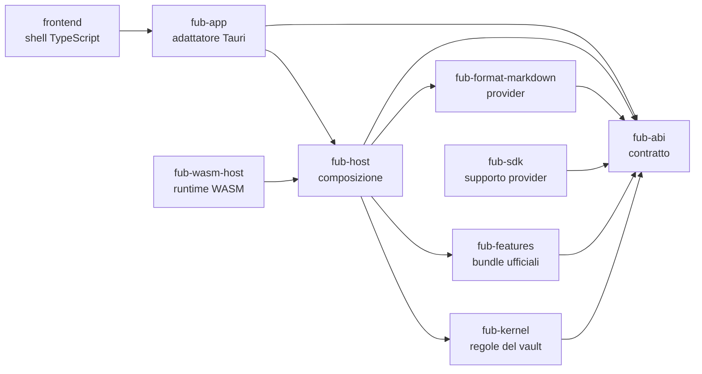

# Mappa visuale

Questa è la vista concettuale, pensata per orientarsi. Il grafo completo delle dipendenze Rust è separato e viene verificato automaticamente in [`03-uml/03-componenti-e-dipendenze.md`](../03-uml/03-componenti-e-dipendenze.md).

## Lettura della mappa

- le frecce indicano chi usa il livello successivo;
- `fub-abi` definisce il vocabolario comune;
- `fub-kernel` applica le regole, ma non decide il formato o la UI;
- `fub-host` è il punto in cui i pezzi vengono assemblati;
- la shell non accede direttamente a file o indici.

Per il dettaglio di ogni crate consulta [`riferimento/componenti.md`](../riferimento/componenti.md).