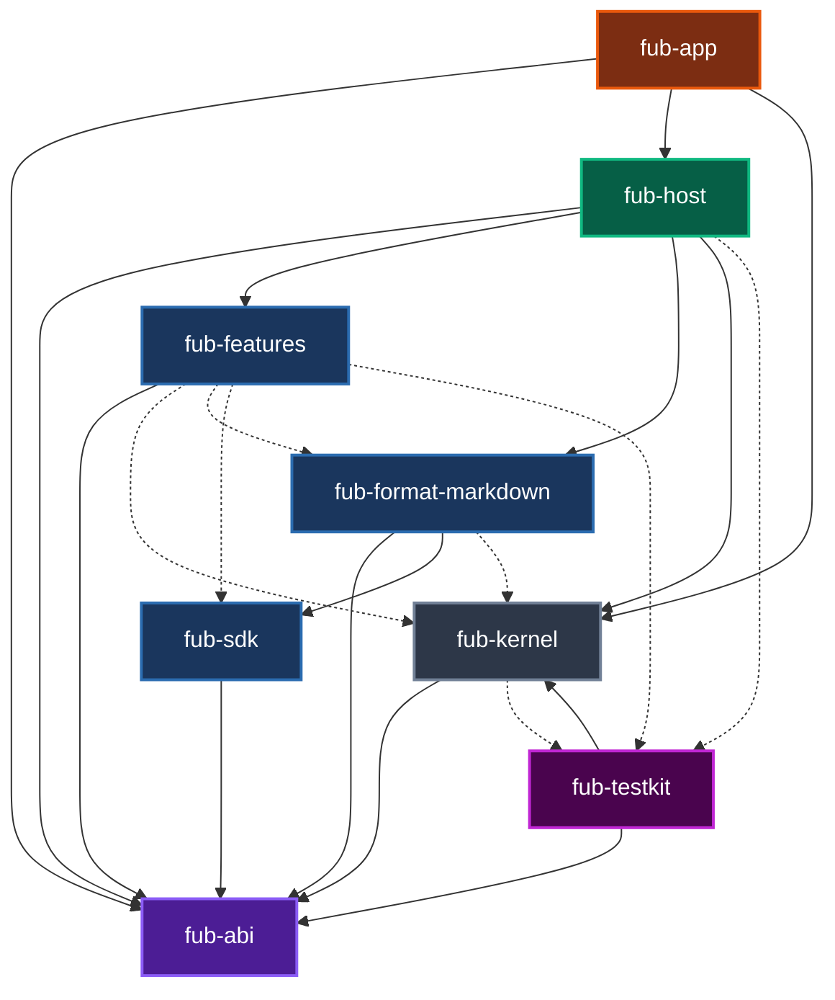
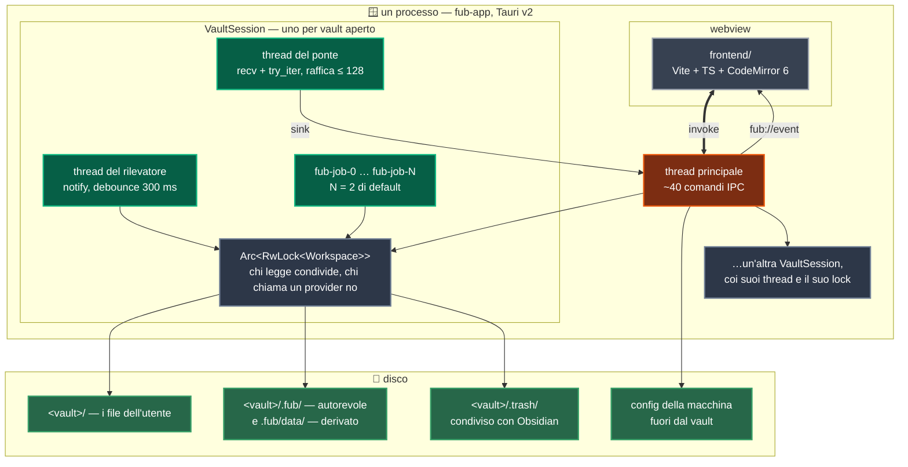

# Fub — mappa visuale

Questa è l'architettura **com'è oggi**, non come sarà in futuro. Ogni riquadro pieno rappresenta codice esistente nel repository. Ogni riquadro tratteggiato è ancora soltanto un documento teorico. Questa differenza è voluta. Un diagramma con FubAI accanto al kernel descrive un'app inesistente.

```mermaid
flowchart TB
    %% ============================== STILI ==============================
    classDef contract fill:#4c1d95,stroke:#8b5cf6,stroke-width:2px,color:#fff
    classDef core     fill:#2d3748,stroke:#718096,stroke-width:2px,color:#fff
    classDef provider fill:#1a365d,stroke:#2b6cb0,stroke-width:2px,color:#fff
    classDef mount    fill:#065f46,stroke:#10b981,stroke-width:2px,color:#fff
    classDef glue     fill:#7c2d12,stroke:#ea580c,stroke-width:2px,color:#fff
    classDef banco    fill:#4a044e,stroke:#c026d3,stroke-width:2px,color:#fff
    classDef ui       fill:#374151,stroke:#9ca3af,stroke-width:2px,color:#fff
    classDef storage  fill:#276749,stroke:#38a169,stroke-width:2px,color:#fff
    classDef future   fill:#3f3f46,stroke:#a1a1aa,stroke-width:2px,color:#d4d4d8,stroke-dasharray: 6 4

    %% ============================== SHELL ==============================
    subgraph SHELL ["🖥️ frontend/ — Vite + TypeScript + CodeMirror 6"]
        Seam["host/<br>tipi rispecchiati, IPC, canale dati"]:::ui
        StateL["state/<br>store, router eventi, comandi"]:::ui
        UiPrim["ui/<br>renderer UiNode, panel-host, palette"]:::ui
        Panels["panels/<br>explorer, ricerca, graph, cestino, impostazioni, attività"]:::ui
        EditorL["editor/<br>live preview, completamenti, tema"]:::ui
    end

    %% =============================== APP ===============================
    subgraph APP ["🪟 fub-app — colla Tauri v2, e nient'altro"]
        Cmd["~40 comandi IPC<br>errori tipizzati, non frasi"]:::glue
        Bridge["ponte eventi<br>freno e raggruppamento"]:::glue
    end

    %% ============================ CONTRATTO ============================
    subgraph CONTRATTO ["📜 fub-abi — il contratto, definito una volta sola"]
        Traits["i trait di estensione<br>Format · View · Index · Command · EventHandler · Plugin"]:::contract
        HostApiN["HostApi<br>quattordici trait: l'unico varco"]:::contract
        QueryN["IndexQuery<br>un albero di predicati, non una stringa"]:::contract
        Model["modello comune<br>+ arena al confine"]:::contract
        UiN["UI dichiarativa<br>UiNode, Intent, eventi"]:::contract
        RulesN["rules/<br>path, id, tag, proprietà, salute"]:::contract
        Wit["fub-abi/wit/<br>lo stesso contratto in WIT<br>+ linea di base congelata"]:::contract
    end

    %% =============================== HOST ==============================
    subgraph HOSTC ["🔧 fub-host — chi monta. Non dipende da Tauri"]
        Mount["tabella di montaggio<br>un bundle per feature"]:::mount
        SessH["sessione del vault aperto<br>registro dei vault"]:::mount
        Runner["runner dei job<br>N thread, cancellazione a bandiera"]:::mount
        Doors["le tre porte verso l'host concreto<br>watcher · event sink · chi apre"]:::mount
    end

    %% ============================== KERNEL =============================
    subgraph KERNEL ["🚀 fub-kernel — il core, agnostico rispetto al formato"]
        WS["Workspace: i cinque proprietari<br>DocumentStore · Indexes · ProviderRegistry<br>Dispatcher · Session"]:::core
        Canale["canale dati<br>CoreIndex, RouteTable, pianificatore"]:::core
        Bus["EventBus<br>maschera col dove, lotti, origine"]:::core
        Regs["Format · Syntax · Renderer registry"]:::core
        Graph["LinkGraph<br>nome, alias, path, backlink"]:::core
        SettStore["SettingsStore<br>vault, poi macchina, poi default"]:::core
        Perms["registro plugin + guardia<br>dove i permessi si applicano"]:::core
        Altro["undo a due pile · stato di vista<br>stato per-documento · anagrafe · locale"]:::core
    end

    %% ============================ PROVIDER =============================
    subgraph PROVIDER ["🧩 I provider nativi — gli stessi trait dei plugin di domani"]
        Markdown["fub-format-markdown<br>comrak: il PRIMO FormatProvider"]:::provider
        Search["Ricerca<br>IndexProvider su tantivy"]:::provider
        Views["Backlink · Struttura · Tag · Statistiche<br>quattro ViewProvider"]:::provider
        Version["Versioning<br>EventHandler + snapshot per file"]:::provider
        Cmds["Comandi<br>ricerca, wikilink, sostituzione in blocco"]:::provider
        Blocks["Blocchi<br>diagrammi, formule, evidenziato"]:::provider
        Sdk["fub-sdk<br>scansione, id"]:::provider
    end

    %% ============================== DISCO ==============================
    subgraph DISCO ["💾 Disco — local-first, e nessun database"]
        Notes["file dell'utente<br>.md, frontmatter, wikilink, tag, allegati"]:::storage
        Conf[".fub/ — autorevole<br>settings.json, workspace.json"]:::storage
        Derived[".fub/data/ — derivato e buttabile<br>anagrafe, doc/, plugins/id/"]:::storage
        Trash[".trash/ + sidecar<br>da dove veniva ogni file"]:::storage
        MConf["config della macchina<br>settings.json, vaults.json, view-state.json"]:::storage
    end

    %% ============================= FUTURO ==============================
    subgraph FUTURO ["🕳️ Ancora da scrivere — nel repo non c'è una riga"]
        WasmHost["fub-wasm-host (M5)<br>plugin di terzi via wasmtime<br>stessi trait, per proxy"]:::future
        Suite["FubSuite<br>FubTasks · FubDB · FubCanvas · FubJournal<br>FubAI · FubPublish · FubSync"]:::future
        Est["servizi esterni opt-in<br>LLM, sync, pubblicazione"]:::future
    end

    %% ============================ CONNESSIONI ==========================
    Seam <==>|"invoke"| Cmd
    StateL <==>|"fub://event"| Bridge

    Cmd ==> SessH
    Bridge <==>|"event sink"| Doors

    SessH ==> WS
    Mount ==>|"registra i bundle"| WS
    Runner <==> WS
    Doors ==>|"scritture altrui"| Bus

    Regs <==>|"dyn FormatProvider"| Markdown
    Canale <==> Search
    WS <==> Views
    Bus <==> Version
    WS <==> Cmds
    Regs <==> Blocks

    Traits -.->|"una firma sola per il nativo e per il WASM"| Markdown
    HostApiN -.-> Perms
    QueryN -.-> Canale
    UiN -.-> UiPrim
    RulesN -.-> Canale

    WS ==>|"path in DocId"| Notes
    WS ==> Trash
    SettStore ==> Conf
    Search ==> Derived
    Version ==> Derived
    Altro ==> Derived
    SessH ==> MConf

    Traits -.-> WasmHost
    WasmHost -.->|"ospiterà"| Suite
    Suite -.-> Est
```

## Cosa dice questo disegno, in cinque righe

1. **L'asse portante è il contratto, non il markdown.** `fub-abi` definisce l'architettura. Non dipende da comrak, tauri, wasmtime o tokio. Un test verifica questa invariante. Il markdown è il *primo* provider, non il formato dell'app.
2. **Chi monta e chi disegna sono separati.** `fub-host` non dipende da `tauri`. Questo montaggio ha cinque clienti previsti: CLI, API locale, e2e headless, mobile, PWA. Nessuno di loro poteva riusarlo finché stava dentro un `#[tauri::command]`.
3. **L'architettura usa solo file.** Non c'è un database. L'indice di ricerca è tantivy dentro `.fub/data/plugins/`. Tutto ciò che sta in quella cartella è derivato. La sua cancellazione richiede solo una ricostruzione. I dati dell'utente sono sempre salvi. La verità è nei file.
4. **Le feature ufficiali sono già plugin.** Backlink, struttura, tag, statistiche, ricerca, comandi, versioning e blocchi implementano gli stessi trait dei futuri plugin di terzi. Non usano sandbox o serializzazione. Il dogfooding (usare il proprio prodotto in fase di sviluppo) fa scoprire gli errori del contratto prima di M5.
   **Fin dove arriva, però, adesso è contato** ([0104](../decisions/0104-la-superficie-di-scrittura-si-presta.md)): le feature ufficiali stanno su **quattro** delle **dieci** [conta: superfici-di-vista] superfici che `ViewSurface` nomina. Dove nessuna feature passa, il contratto non rivela i propri difetti. Il conto sta in `fub-features/tests/conformita.rs`. Questo test pretende una feature o una ragione scritta per ogni superficie.
5. **Il tratteggio è onesto; la freccia «ospiterà» no.** Il runtime WASM e l'intera FubSuite sono documenti, non codice. La cartella `plugins/` nascerà con il runtime che dovrà caricarli. Quella freccia indica **tutta** la Suite. Almeno un riquadro non ci sta. Un sync deve decidere il merge *prima* che il file atterri. Il contratto permette di osservare solo dopo tramite `EventHandler`. Non permette di interporsi. Il metro di valutazione per gli altri plugin si trova in [plugin-boundary.md](plugin-boundary.md#cosa-non-può-essere-solo-un-guest-e-il-metro-per-deciderlo). Questo metro valuta posizione rispetto al prestito, frequenza × payload, e azione prima o dopo la scrittura.

## Il grafo delle dipendenze, e il test che lo legge

Il disegno precedente è disposto a mano. Raggruppa i moduli per ruolo. Le frecce dicono *chi parla con chi*. Nessuno può verificare queste due proprietà. Un riquadro spostato non rompe niente. Questo secondo diagramma mostra una sola proprietà verificabile a macchina: **chi dichiara chi nel proprio `Cargo.toml`**. Una freccia piena indica una dipendenza normale. Una freccia tratteggiata indica una dipendenza di solo `[dev-dependencies]`.

| Riquadro | Manifest | Cosa dichiara |
|---|---|---|
| `fub-abi` | [Cargo.toml](../../crates/fub-abi/Cargo.toml) | Il contratto. Ha quattro dipendenze esterne. Non ha nessun crate del workspace. |
| `fub-kernel` | [Cargo.toml](../../crates/fub-kernel/Cargo.toml) | Il core. Include il contratto, serde, serde_json, camino e thiserror. |
| `fub-sdk` | [Cargo.toml](../../crates/fub-sdk/Cargo.toml) | Il contratto, serde e regex. Chi scrive un provider non usa il kernel. |
| `fub-format-markdown` | [Cargo.toml](../../crates/fub-format-markdown/Cargo.toml) | Il contratto e SDK. comrak si trova solo qui. |
| `fub-features` | [Cargo.toml](../../crates/fub-features/Cargo.toml) | Solo il contratto. Il kernel è dev-only. Questa è l'invariante del dogfooding. |
| `fub-host` | [Cargo.toml](../../crates/fub-host/Cargo.toml) | I quattro crate precedenti. È il composition root. Monta le risorse degli altri moduli. |
| `fub-app` | [Cargo.toml](../../crates/fub-app/Cargo.toml) | abi, kernel, host e features. `tauri` si trova solo qui. |
| `fub-testkit` | [Cargo.toml](../../crates/fub-testkit/Cargo.toml) | Il contratto e il **kernel**. È il banco (l'ambiente di test) del lato host. Per questo motivo non è mai una dipendenza normale di nessuno. |

Le frecce tratteggiate indicano un confine architetturale. Non sono una comodità. `fub-features` e `fub-format-markdown` usano `fub-kernel` **solo nei test**. Le loro librerie usano solo il contratto. Questo simula l'ambiente di un plugin di terzi. Il test `official_features_do_not_depend_on_the_kernel` ([dependency_invariant.rs:375](../../crates/fub-abi/tests/dependency_invariant.rs)) verifica questa assenza di dipendenze. Se una feature usasse il kernel, il test fallirebbe prima di rendere falso il diagramma.

L'assenza di dipendenze extra non garantisce piene capacità. Un plugin di terzi non può fare tutto ciò che fa una feature ufficiale. Il verbale [0104](../decisions/0104-la-superficie-di-scrittura-si-presta.md) spiega i limiti:
- Un guest non ha `UiNode::Html`/`WebView`. Questi sono riservati a `Trust::Core`.
- Un guest non riceve eventi di tastiera. Il contratto non li trasporta.
- La **superficie di scrittura** non vieta queste azioni, ma manca degli strumenti per eseguirle.

Questi limiti rappresentano la quarta voce del metro di giudizio in [plugin-boundary.md](plugin-boundary.md#cosa-non-può-essere-solo-un-guest-e-il-metro-per-deciderlo).

Il diagramma si auto-verifica. Il test `il_diagramma_dice_le_dipendenze_vere` legge questo file e lo confronta con `cargo metadata` **nei due versi**.
- Un arco disegnato che non esiste fa fallire il test.
- Una dipendenza reale omessa fa fallire il test. Un diagramma incompleto mente più di uno sbagliato, perché ha l'aria di essere completo.
- Un nuovo crate creato senza aggiornare il diagramma fa fallire il test.

`fub-app` è una foglia. Nessun altro crate lo usa come dipendenza. Questa è una scelta architetturale.
`fub-testkit` è la foglia opposta. **Nessuna** freccia piena esce verso di lui. Un banco (ambiente di test) non deve entrare in una libreria. Altrimenti si porterebbe dietro il kernel. Il test `il_banco_di_prova_non_entra_in_nessuna_libreria` impedisce questo errore esaminando *tutti* i membri.

`fub-sdk` ha un solo cliente fra le dipendenze piene: `fub-format-markdown`. Questa freccia guida un intero ragionamento: rende impossibile inserire il kernel nell'SDK ([0054](../decisions/0054-il-banco-del-lato-provider.md)). Fra le dipendenze tratteggiate ha anche `fub-features`. Da lì prende `MemoryHost`.

L'elenco a indentazione in [PIANO.md](../PIANO.md#struttura-dei-crate) non è un grafo. Indica la destinazione finale. Nomina anche il crate futuro `fub-wasm-host`. Questo diagramma fotografa invece lo stato attuale.

## Dove gira cosa

I due diagrammi precedenti mostrano la struttura del codice. Questo diagramma mostra la disposizione a runtime. L'app usa **un processo**, un webview e vari gruppi di thread. Un gruppo di thread nasce per ogni vault aperto. Muore quando quel vault si chiude.

| Cosa | Quantità e dettagli | Dove |
|---|---|---|
| Processi | **Uno**. Il sistema non usa demoni o servizi. | [fub-app/src/lib.rs](../../crates/fub-app/src/lib.rs) |
| Webview | Uno. Il core lo considera **privilegiato**. Per questo motivo, `UiNode::Html` è negato al codice non fidato. | [ui-protocol.md](ui-protocol.md) |
| `VaultSession` | Una per vault aperto. Si conservano in una mappa. | [session.rs:106](../../crates/fub-host/src/session.rs) |
| Thread del ponte | Uno per vault. Dorme su `recv()`. Non consuma risorse a vault fermo. | [bridge.rs:7](../../crates/fub-host/src/bridge.rs) |
| Thread del rilevatore | Uno per vault. È **facoltativo**. Si attiva solo dietro una cargo feature. | [watcher.rs:74](../../crates/fub-host/src/watcher.rs) |
| Thread dei job | **Due** di default per vault. Non sono globali. | [runner.rs:67](../../crates/fub-host/src/runner.rs) |
| Database | **Nessuno**. | — |

Il lock agisce per vault, non per applicazione. Due vault aperti non si aspettano a vicenda. Il pool dei job usa la stessa logica. Un'indicizzazione lunga su un archivio non deve rallentare le note di lavoro.

La tabella completa dei riquadri del disco si trova in [on-disk-layout.md](on-disk-layout.md). Specifica contenuto, classe e regole di scrittura.

## Il dettaglio, per riquadro

**📜 `fub-abi`** — Contiene i seguenti elementi:
- Il modello di documento comune e la sua forma al confine. Usa alberi appiattiti e span a larghezza fissa. Il proxy WASM erediterà questa conversione.
- I trait di estensione.
- `HostApi`. È la somma di quattordici trait. Una politica lo nega tramite sedici nomi ([0095](../decisions/0095-cosa-guardo-e-cosa-sto-scrivendo.md)).
- Il linguaggio delle interrogazioni.
- I comandi. Hanno argomenti e raggio dichiarati. La simulazione è il modo per invocarli.
- Le funzioni di import ed export. Lavorano a byte e non a path.
- L'edit. È una coppia span-testo sopra una revisione.
- Il protocollo di UI dichiarativa. Gli eventi specificano chi ha chiesto l'operazione e il lotto (gruppo di modifiche coerenti) di appartenenza.
- Il locale e le impostazioni.
- `rules/`. È la parte di risposta indipendente da chi la formula. Si trova nell'ABI perché chi serve una query potrebbe non avere il kernel.
- `crates/fub-abi/wit/`. Contiene lo stesso contratto definito una seconda volta in WIT. Un test di conformità presidia (protegge) una linea di base congelata.

**🚀 `fub-kernel`**
- `Workspace` non è uno struct con ventiquattro campi piatti. Ne ha cinque. La divisione separa chi *decide* da chi *chiama*.
- `RwLock` segue la stessa divisione. Chi legge prende il prestito condiviso. Chi chiama un provider usa il prestito esclusivo.
- Il canale dati gestisce le risposte del kernel come **un provider registrato per primo**. Non usa un ramo prima del ciclo. I gestori delle richieste si dichiarano al montaggio. Questo rivela subito un conflitto. Il sistema distingue il caso «nessuno la serve» dal caso «chi la serve ha fallito».

**🧩 I provider**
- Nove bundle di feature montati da `fub-host`. Includono: ricerca, versioning, cinque view, comandi e blocchi. Il versioning porta la sua view e il suo comando, in base al verbale [0075](../decisions/0075-una-view-non-chiede-con-una-finestra.md).
- Un decimo provider è intestato al core stesso. Non registra nulla. Serve solo a fornirgli un'identità nel registro.
- Il provider markdown è il primo cliente del `FormatRegistry`. Non è un caso speciale.

**🔧 `fub-host`**
- È il composition root.
- Le tre porte gestiscono funzionalità non incluse nel core dell'app. Gestiscono chi vede le scritture altrui (`notify` debounced attivato da una cargo feature, oppure nessuno). Gestiscono la destinazione degli eventi in uscita (la webview, stdout o niente). Decidono *quando* l'app si apre, poiché l'host non si apre da sé.
- Il runner dei job possiede i thread. Costruisce un `HostApi` **per chiamata**. Il kernel non conosce l'esistenza del lock.

**🪟 `fub-app`**
- Ogni riga di questo crate serve a interagire con Tauri. Altrimenti si trova nel posto sbagliato.

**🖥️ `frontend/`**
- `main.ts` si limita a comporre l'interfaccia.
- Ogni pannello dichiara la propria identità, posizione e condizione di invecchiamento (quando i dati scadono).
- `panel-host` decide quando chiamare il pannello.
- Da questo livello in poi, una view dichiarata dal backend e un pannello nativo non si distinguono.

**💾 Il disco**
- Il vault contiene i file dell'utente e **una** sola radice nostra: `.fub/` ([0048](../decisions/0048-una-radice-sola.md)).
- La cima della cartella contiene i dati da sincronizzare. Includono le impostazioni del vault e l'organizzazione.
- La cartella `data/` contiene dati eliminabili. Includono l'anagrafe (il registro) delle entry, lo stato per-documento sotto `doc/` e lo spazio dei plugin (con l'indice tantivy e gli snapshot del versioning).
- Fuori dal vault si trova `.trash/`. È il cestino condiviso con Obsidian. Usa un file sidecar (file di supporto) per ricordare la provenienza dei file eliminati.
- La mappa completa del disco si trova in [on-disk-layout.md](on-disk-layout.md).
- Fuori dal vault si trova la configurazione della macchina. L'app si avvia tramite un solo bootstrap via `FUB_CONFIG_DIR`, oppure usa la modalità portable dalla cartella dell'eseguibile.

## Legenda dei colori

| Colore | Cosa |
|---|---|
| 🟣 viola | Il contratto. Comprende `fub-abi` e il suo gemello WIT. |
| ⚫ grigio scuro | Il core agnostico. Comprende `fub-kernel`. |
| 🔵 blu | I provider nativi. Includono markdown, le otto feature e l'SDK. |
| 🟢 verde scuro | Chi monta. Comprende `fub-host`. |
| 🟠 arancio | L'integrazione di Tauri. Comprende `fub-app`. |
| ⚪ grigio | La shell. Comprende `frontend/`. |
| 🟩 verde | Il disco. |
| ⬜ tratteggiato | Componenti non ancora scritti. |
