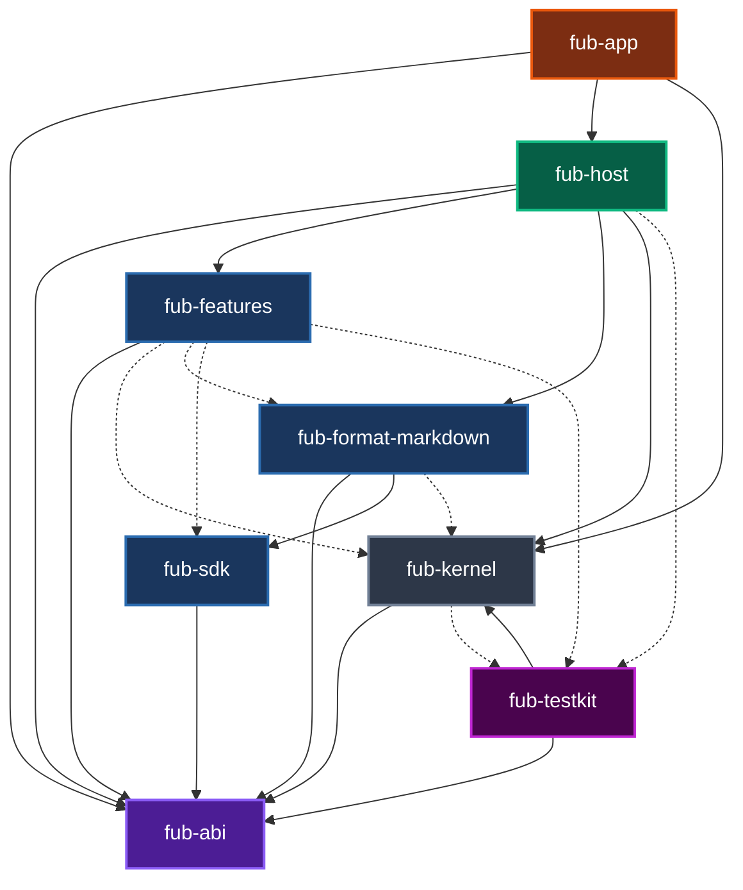
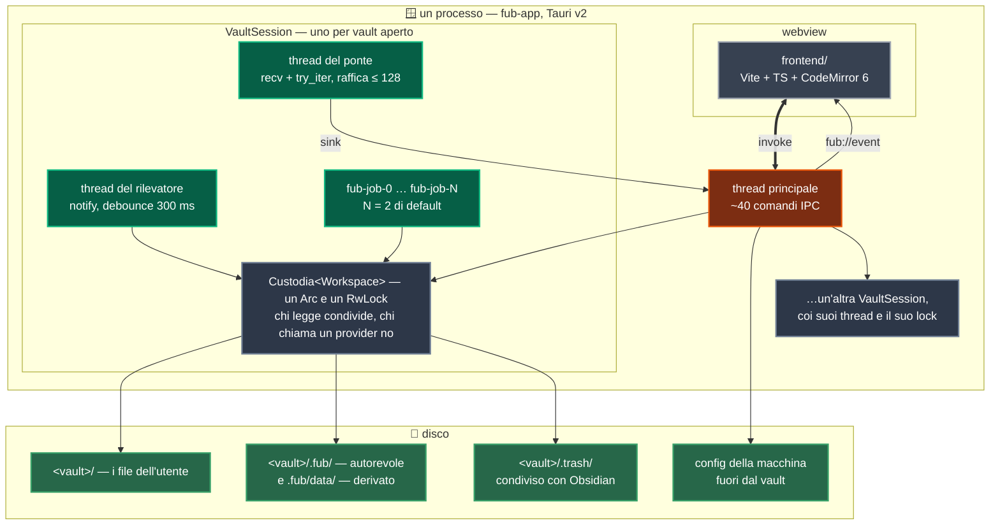

# Fub — mappa visuale

Questa è l'architettura **com'è oggi**, non come sarà.

- Riquadro pieno: codice che nel repo c'è.
- Riquadro tratteggiato: per ora solo un documento.

La differenza è voluta: un diagramma con FubAI accanto al kernel disegnerebbe
un'app che non esiste.

```mermaid
flowchart TB
    %% ============================== STILI ==============================
    classDef contract fill:#4c1d95,stroke:#8b5cf6,stroke-width:2px,color:#fff
    classDef core     fill:#2d3748,stroke:#718096,stroke-width:2px,color:#fff
    classDef provider fill:#1a365d,stroke:#2b6cb0,stroke-width:2px,color:#fff
    classDef mount    fill:#065f46,stroke:#10b981,stroke-width:2px,color:#fff
    classDef glue     fill:#7c2d12,stroke:#ea580c,stroke-width:2px,color:#fff
    classDef banco    fill:#4a044e,stroke:#c026d3,stroke-width:2px,color:#fff
    classDef ui       fill:#374151,stroke:#9ca3af,stroke-width:2px,color:#fff
    classDef storage  fill:#276749,stroke:#38a169,stroke-width:2px,color:#fff
    classDef future   fill:#3f3f46,stroke:#a1a1aa,stroke-width:2px,color:#d4d4d8,stroke-dasharray: 6 4

    %% ============================== SHELL ==============================
    subgraph SHELL ["🖥️ frontend/ — Vite + TypeScript + CodeMirror 6"]
        Seam["host/<br>tipi rispecchiati, IPC, canale dati"]:::ui
        StateL["state/<br>store, router eventi, comandi"]:::ui
        UiPrim["ui/<br>renderer UiNode, panel-host, palette"]:::ui
        Panels["panels/<br>explorer, ricerca, graph, cestino, impostazioni, attività"]:::ui
        EditorL["editor/<br>live preview, completamenti, tema"]:::ui
    end

    %% =============================== APP ===============================
    subgraph APP ["🪟 fub-app — colla Tauri v2, e nient'altro"]
        Cmd["~40 comandi IPC<br>errori tipizzati, non frasi"]:::glue
        Bridge["ponte eventi<br>freno e raggruppamento"]:::glue
    end

    %% ============================ CONTRATTO ============================
    subgraph CONTRATTO ["📜 fub-abi — il contratto, definito una volta sola"]
        Traits["i trait di estensione<br>Format · View · Index · Command · EventHandler · Plugin"]:::contract
        HostApiN["HostApi<br>sedici trait: l'unico varco"]:::contract
        QueryN["IndexQuery<br>un albero di predicati, non una stringa"]:::contract
        Model["modello comune<br>+ arena al confine"]:::contract
        UiN["UI dichiarativa<br>UiNode, Intent, eventi"]:::contract
        RulesN["rules/<br>path, id, tag, proprietà, salute"]:::contract
        Wit["fub-abi/wit/<br>lo stesso contratto in WIT<br>+ linea di base congelata"]:::contract
    end

    %% =============================== HOST ==============================
    subgraph HOSTC ["🔧 fub-host — chi monta. Non dipende da Tauri"]
        Mount["tabella di montaggio<br>un bundle per feature"]:::mount
        SessH["sessione del vault aperto<br>registro dei vault"]:::mount
        Runner["runner dei job<br>N thread, cancellazione a bandiera"]:::mount
        Doors["le tre porte verso l'host concreto<br>watcher · event sink · chi apre"]:::mount
    end

    %% ============================== KERNEL =============================
    subgraph KERNEL ["🚀 fub-kernel — il core, agnostico rispetto al formato"]
        WS["Workspace: i cinque proprietari<br>DocumentStore · Indexes · ProviderRegistry<br>Dispatcher · Session"]:::core
        Canale["canale dati<br>CoreIndex, RouteTable, pianificatore"]:::core
        Bus["EventBus<br>maschera col dove, lotti, origine"]:::core
        Regs["Format · Syntax · Renderer registry"]:::core
        Graph["LinkGraph<br>nome, alias, path, backlink"]:::core
        SettStore["SettingsStore<br>vault, poi macchina, poi default"]:::core
        Perms["registro plugin + guardia<br>dove i permessi si applicano"]:::core
        Altro["undo a due pile · stato di vista<br>stato per-documento · anagrafe · locale"]:::core
    end

    %% ============================ PROVIDER =============================
    subgraph PROVIDER ["🧩 I provider nativi — gli stessi trait dei plugin di domani"]
        Markdown["fub-format-markdown<br>comrak: il PRIMO FormatProvider"]:::provider
        Search["Ricerca<br>IndexProvider su tantivy"]:::provider
        Views["Backlink · Struttura · Tag · Cestino · Grafo · Statistiche<br>sei ViewProvider"]:::provider
        Version["Versioning<br>EventHandler + snapshot per file"]:::provider
        Cmds["Comandi<br>ricerca, wikilink, sostituzione in blocco"]:::provider
        Blocks["Blocchi<br>diagrammi, formule, evidenziato"]:::provider
        Sdk["fub-sdk<br>scansione, id"]:::provider
    end

    %% ============================== DISCO ==============================
    subgraph DISCO ["💾 Disco — local-first, e nessun database"]
        Notes["file dell'utente<br>.md, frontmatter, wikilink, tag, allegati"]:::storage
        Conf[".fub/ — autorevole<br>settings.json, workspace.json"]:::storage
        Derived[".fub/data/ — derivato e buttabile<br>anagrafe, doc/, plugins/id/"]:::storage
        Trash[".trash/ + sidecar<br>da dove veniva ogni file"]:::storage
        MConf["config della macchina<br>settings.json, vaults.json, view-state.json"]:::storage
    end

    %% ============================= FUTURO ==============================
    subgraph FUTURO ["🕳️ Ancora da scrivere — nel repo non c'è una riga"]
        WasmHost["fub-wasm-host (M5)<br>plugin di terzi via wasmtime<br>stessi trait, per proxy"]:::future
        Suite["FubSuite<br>FubTasks · FubDB · FubCanvas · FubJournal<br>FubAI · FubPublish · FubSync"]:::future
        Est["servizi esterni opt-in<br>LLM, sync, pubblicazione"]:::future
    end

    %% ============================ CONNESSIONI ==========================
    Seam <==>|"invoke"| Cmd
    StateL <==>|"fub://event"| Bridge

    Cmd ==> SessH
    Bridge <==>|"event sink"| Doors

    SessH ==> WS
    Mount ==>|"registra i bundle"| WS
    Runner <==> WS
    Doors ==>|"scritture altrui"| Bus

    Regs <==>|"dyn FormatProvider"| Markdown
    Canale <==> Search
    WS <==> Views
    Bus <==> Version
    WS <==> Cmds
    Regs <==> Blocks

    Traits -.->|"una firma sola per il nativo e per il WASM"| Markdown
    HostApiN -.-> Perms
    QueryN -.-> Canale
    UiN -.-> UiPrim
    RulesN -.-> Canale

    WS ==>|"path in DocId"| Notes
    WS ==> Trash
    SettStore ==> Conf
    Search ==> Derived
    Version ==> Derived
    Altro ==> Derived
    SessH ==> MConf

    Traits -.-> WasmHost
    WasmHost -.->|"ospiterà"| Suite
    Suite -.-> Est
```

## Cosa dice questo disegno, in cinque righe

1. **L'asse portante è il contratto, non il markdown.** `fub-abi` non dipende da
   comrak, tauri, wasmtime o tokio, e un test lo verifica. Il markdown è il
   *primo* provider, non il formato dell'app.
2. **Chi monta e chi disegna sono separati.** `fub-host` non dipende da `tauri`,
   perché il montaggio ha cinque clienti previsti: CLI, API locale, e2e
   headless, mobile, PWA. Finché stava dentro un `#[tauri::command]`, nessuno di
   loro poteva riusarlo.
3. **Non c'è un database: ci sono file.** L'indice di ricerca è tantivy dentro
   `.fub/data/plugins/`, e tutto ciò che sta lì è derivato. Cancellarlo costa
   una ricostruzione, mai un dato dell'utente. La verità è nei file.
4. **Le feature ufficiali sono già plugin.** Backlink, struttura, tag, cestino,
   grafo, statistiche, ricerca, comandi, versioning e blocchi implementano gli
   stessi trait che useranno i plugin di terzi, senza sandbox e senza
   serializzazione. Il dogfooding — usare il proprio prodotto mentre lo si
   scrive — è il modo in cui il contratto si scopre sbagliato prima di M5. **Fin
   dove arriva, però, adesso è contato**
   ([0104](../decisions/0104-la-superficie-di-scrittura-si-presta.md)): le
   feature ufficiali stanno su **quattro** delle
   **dieci** [conta: superfici-di-vista] superfici che `ViewSurface` nomina.
   Dove nessuna passa,
   il contratto non si scopre sbagliato: lo si scopre quando qualcuno ci prova.
   Il conto lo tiene `fub-features/tests/conformita.rs`, che per ogni superficie
   pretende una feature o una ragione scritta.
5. **Il tratteggio è onesto; la freccia «ospiterà» no.** Il runtime WASM e
   l'intera FubSuite sono documenti, non codice: la cartella `plugins/` nascerà
   con il runtime che dovrà caricarli. Quella freccia però dice **tutta** la
   Suite, e almeno un riquadro non ci sta. Un sync deve decidere il merge
   *prima* che il file atterri; il contratto permette di osservare dopo
   (`EventHandler`), non di interporsi. Per gli altri plugin la domanda si
   decide con tre misure — dove sta il codice rispetto al prestito del
   workspace, frequenza × payload delle chiamate, e se agisce prima o dopo la
   scrittura — ed è il metro di
   [plugin-boundary.md](plugin-boundary.md#cosa-non-può-essere-solo-un-guest-e-il-metro-per-deciderlo).

## Il grafo delle dipendenze, e il test che lo legge

Il disegno qui sopra è disposto a mano: raggruppa per ruolo, e le frecce dicono
*chi parla con chi*. Sono due cose che nessuno può verificare — un riquadro
spostato non rompe niente. Questo secondo diagramma dice invece una sola cosa,
controllabile a macchina: **chi dichiara chi nel proprio `Cargo.toml`**.

- Freccia piena: dipendenza normale.
- Freccia tratteggiata: dipendenza di solo `[dev-dependencies]`.

| Riquadro | Manifest | Cosa dichiara |
|---|---|---|
| `fub-abi` | [Cargo.toml](../../crates/fub-abi/Cargo.toml) | Il contratto. Ha quattro dipendenze esterne. Non ha nessun crate del workspace. |
| `fub-kernel` | [Cargo.toml](../../crates/fub-kernel/Cargo.toml) | Il core. Il contratto, serde, serde_json, camino, thiserror e la facciata `tracing`. |
| `fub-sdk` | [Cargo.toml](../../crates/fub-sdk/Cargo.toml) | Il contratto, serde e regex. Chi scrive un provider non usa il kernel. |
| `fub-format-markdown` | [Cargo.toml](../../crates/fub-format-markdown/Cargo.toml) | Il contratto e SDK. comrak si trova solo qui. |
| `fub-features` | [Cargo.toml](../../crates/fub-features/Cargo.toml) | Solo il contratto. Il kernel è dev-only. Questa è l'invariante del dogfooding. |
| `fub-host` | [Cargo.toml](../../crates/fub-host/Cargo.toml) | I quattro crate precedenti. È il composition root: monta i pezzi degli altri. |
| `fub-app` | [Cargo.toml](../../crates/fub-app/Cargo.toml) | abi, kernel, host e features. `tauri` si trova solo qui. |
| `fub-testkit` | [Cargo.toml](../../crates/fub-testkit/Cargo.toml) | Il contratto e il **kernel**. È il banco (l'ambiente di test) del lato host. Per questo motivo non è mai una dipendenza normale di nessuno. |

Le frecce tratteggiate non sono una comodità: sono un confine. `fub-features` e
`fub-format-markdown` usano `fub-kernel` **solo nei test**; le loro librerie
vedono solo il contratto, cioè l'ambiente di un plugin di terzi. Il test
`official_features_do_not_depend_on_the_kernel`
([dependency_invariant.rs:375](../../crates/fub-abi/tests/dependency_invariant.rs))
lo verifica: se una feature prendesse il kernel, diventerebbe rosso prima che il
diagramma diventi falso.

Dipendere solo dal contratto non vuol dire però poter fare tutto. Un plugin di
terzi non arriva dove arriva una feature ufficiale, e il verbale
[0104](../decisions/0104-la-superficie-di-scrittura-si-presta.md) dice dove si
ferma:

- Un guest non ha `UiNode::Html`/`WebView`: sono riservati a `Trust::Core`.
- Un guest non riceve eventi di tastiera: il contratto non li trasporta.
- La **superficie di scrittura** non vieta queste azioni. Semplicemente non dà
  gli strumenti per farle.

È la quarta voce del metro in
[plugin-boundary.md](plugin-boundary.md#cosa-non-può-essere-solo-un-guest-e-il-metro-per-deciderlo).

Il diagramma si auto-verifica. Il test `il_diagramma_dice_le_dipendenze_vere`
legge questo file e lo confronta con `cargo metadata` **nei due versi**.
- Un arco disegnato che non esiste fa fallire il test.
- Una dipendenza reale omessa fa fallire il test. Un diagramma incompleto mente
  più di uno sbagliato, perché ha l'aria di essere completo.
- Un nuovo crate creato senza aggiornare il diagramma fa fallire il test.

Due foglie, per ragioni opposte.

- `fub-app` non lo usa nessuno, ed è voluto: la colla di Tauri sta in fondo.
- Verso `fub-testkit` non esce **nessuna** freccia piena. Un banco (l'ambiente
  di test) dentro una libreria si porterebbe dietro il kernel. Il test
  `il_banco_di_prova_non_entra_in_nessuna_libreria` guarda *tutti* i membri.

`fub-sdk` ha un solo cliente fra le dipendenze piene, `fub-format-markdown`, e
quella freccia sola tiene in piedi un ragionamento intero: mettere il kernel
nell'SDK diventerebbe impossibile
([0054](../decisions/0054-il-banco-del-lato-provider.md)). Fra le tratteggiate
ha in più `fub-features`, che dall'SDK prende `MemoryHost`.

L'elenco a indentazione in [PIANO.md](../PIANO.md#struttura-dei-crate) non è un
grafo: dice la destinazione, e nomina anche il crate futuro `fub-wasm-host`.
Questo diagramma fotografa l'oggi.

## Dove gira cosa

I due diagrammi precedenti mostrano la struttura del codice. Questo mostra la
disposizione a runtime: **un processo**, un webview, e un gruppo di thread per
ogni vault aperto. Il gruppo nasce quando il vault si apre e muore quando si
chiude.

| Cosa | Quantità e dettagli | Dove |
|---|---|---|
| Processi | **Uno**. Il sistema non usa demoni o servizi. | [fub-app/src/lib.rs](../../crates/fub-app/src/lib.rs) |
| Webview | Uno. Il core lo considera **privilegiato**: per questo `UiNode::Html` è negato al codice non fidato. | [ui-protocol.md](ui-protocol.md) |
| `VaultSession` | Una per vault aperto, tenute in una mappa. | [session.rs:106](../../crates/fub-host/src/session.rs) |
| Thread del ponte | Uno per vault. Dorme su `recv()`: a vault fermo non costa niente. | [bridge.rs:82](../../crates/fub-host/src/bridge.rs) |
| Thread del rilevatore | Uno per vault, **facoltativo**: esiste solo dietro la cargo feature `notify-watcher`. | [watcher.rs:298](../../crates/fub-host/src/watcher.rs) |
| Thread dei job | **Due** di default per vault (`DEFAULT_JOB_THREADS`), non globali. | [runner.rs:73](../../crates/fub-host/src/runner.rs) |
| Database | **Nessuno**. | — |

Il lock è per vault, non per applicazione: due vault aperti non si aspettano a
vicenda. Il pool dei job segue la stessa regola, e per la stessa ragione — una
indicizzazione lunga su un archivio non deve rallentare le note di lavoro.

I riquadri del disco, con contenuto, classe e regole di scrittura, stanno in
[on-disk-layout.md](on-disk-layout.md).

## Il dettaglio, per riquadro

**📜 `fub-abi`** — dentro ci sta:
- Il modello di documento comune, e la sua forma al confine: alberi appiattiti e
  span a larghezza fissa. Il proxy WASM erediterà questa conversione.
- I trait di estensione.
- `HostApi`, somma di sedici trait. Una politica lo nega per nome, e i nomi sono
  diciannove [conta: guard-famiglie]
  ([0095](../decisions/0095-cosa-guardo-e-cosa-sto-scrivendo.md)).
- Il linguaggio delle interrogazioni.
- I comandi, con argomenti e raggio dichiarati. Si invocano simulandoli.
- Import ed export, che lavorano a byte e non a path.
- L'edit: una coppia span-testo sopra una revisione.
- Il protocollo di UI dichiarativa. Ogni evento dice chi l'ha chiesto e in quale
  lotto (il gruppo di modifiche che vanno insieme) sta.
- Il locale e le impostazioni.
- `rules/`: la parte di una risposta che non dipende da chi la formula. Sta
  nell'ABI perché chi serve una query può non avere il kernel.
- `crates/fub-abi/wit/`: lo stesso contratto scritto una seconda volta in WIT,
  con un test di conformità e una linea di base congelata.

**🚀 `fub-kernel`**
- `Workspace` non ha ventiquattro campi piatti: ne ha cinque, e la divisione
  separa chi *decide* da chi *chiama*.
- Il `RwLock` segue quella stessa divisione. Chi legge prende il prestito
  condiviso; chi chiama un provider prende quello esclusivo.
- Le risposte del kernel escono da **un provider registrato per primo**, non da
  un ramo `if` prima del ciclo. Chi serve una richiesta si dichiara al
  montaggio, così un conflitto si vede subito, e «nessuno la serve» resta un
  caso diverso da «chi la serve ha fallito».

**🧩 I provider**
- Dieci bundle di feature montati da `fub-host`: ricerca, versioning, sei view,
  comandi e blocchi. Il versioning porta anche la sua view e il suo comando
  ([0075](../decisions/0075-una-view-non-chiede-con-una-finestra.md)).
- Un undicesimo bundle è intestato al core. Non registra niente: serve a dargli
  un'identità nel registro.
- Il markdown è il primo cliente del `FormatRegistry`, non un caso speciale.

**🔧 `fub-host`**
- È il composition root.
- Le tre porte tengono fuori dal core ciò che il core non deve sapere: chi vede
  le scritture altrui (`notify` con debounce dietro cargo feature, oppure
  nessuno), dove vanno gli eventi in uscita (la webview, stdout o niente), e
  *quando* l'app si apre — perché l'host da sé non si apre.
- Il runner dei job possiede i thread e costruisce un `HostApi` **per
  chiamata**. Il kernel non sa che esiste un lock.

**🪟 `fub-app`**
- Ogni riga di questo crate parla con Tauri. Se non lo fa, è nel posto
  sbagliato.

**🖥️ `frontend/`**
- `main.ts` compone l'interfaccia, e basta.
- Ogni pannello dichiara identità, posizione e quando i suoi dati scadono.
- `panel-host` decide quando chiamarlo.
- Da lì in su, una view dichiarata dal backend e un pannello nativo non si
  distinguono.

**💾 Il disco**
- Nel vault ci sono i file dell'utente e **una** sola radice nostra: `.fub/`
  ([0048](../decisions/0048-una-radice-sola.md)).
- In cima a `.fub/` sta ciò che si sincronizza: impostazioni del vault e
  organizzazione.
- In `data/` sta ciò che si può buttare: l'anagrafe delle entry, lo stato
  per-documento sotto `doc/`, e lo spazio dei plugin con l'indice tantivy e gli
  snapshot del versioning.
- `.trash/` sta fuori da `.fub/`: è il cestino condiviso con Obsidian, e un file
  sidecar ricorda da dove veniva ogni file cestinato.
- La configurazione della macchina sta fuori dal vault. L'app la trova con
  `FUB_CONFIG_DIR` o in modalità portable, accanto all'eseguibile.
- La mappa completa è in [on-disk-layout.md](on-disk-layout.md).

## Legenda dei colori

| Colore | Cosa |
|---|---|
| 🟣 viola | Il contratto. Comprende `fub-abi` e il suo gemello WIT. |
| ⚫ grigio scuro | Il core agnostico. Comprende `fub-kernel`. |
| 🔵 blu | I provider nativi: markdown, le dieci feature ufficiali e l'SDK. |
| 🟢 verde scuro | Chi monta. Comprende `fub-host`. |
| 🟠 arancio | L'integrazione di Tauri. Comprende `fub-app`. |
| ⚪ grigio | La shell. Comprende `frontend/`. |
| 🟩 verde | Il disco. |
| ⬜ tratteggiato | Componenti non ancora scritti. |
