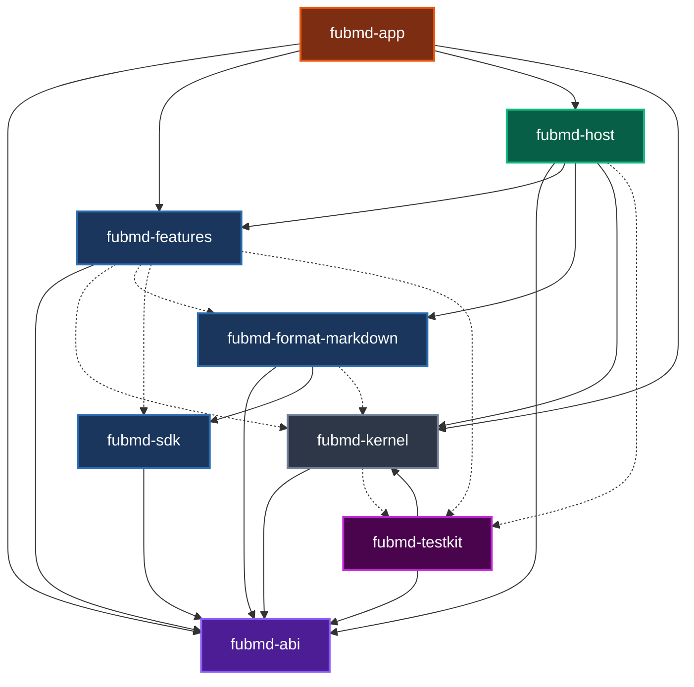
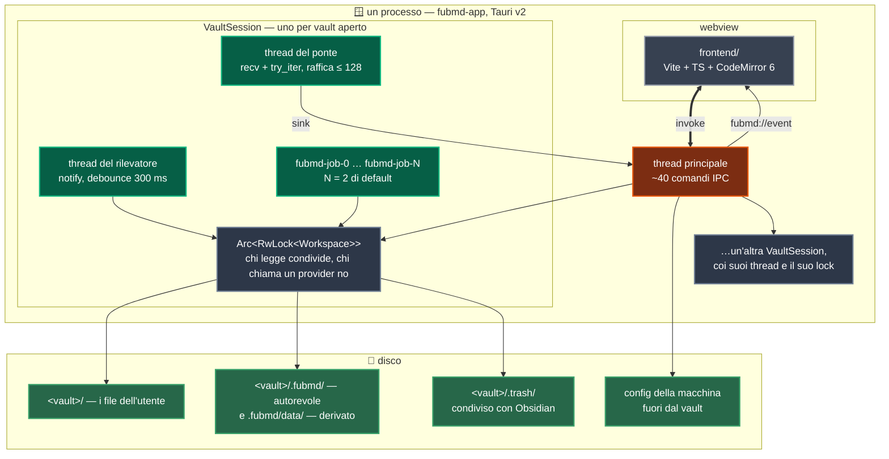

# FubMD — mappa visuale

L'architettura **com'è oggi**, non come sarà: ogni riquadro pieno corrisponde a
codice che esiste nel repo, ogni riquadro tratteggiato è ancora soltanto un
documento. La differenza è segnata apposta — un diagramma che mette FubAI
accanto al kernel racconta un'app che non c'è.

## Cosa dice questo disegno, in cinque righe

1. **L'asse portante è il contratto, non il markdown.** `fubmd-abi` non dipende
   da comrak, tauri, wasmtime o tokio, e l'invariante è verificata da un test.
   Il markdown è il *primo* provider, non il formato dell'app.
2. **Chi monta e chi disegna sono separati.** `fubmd-host` non dipende da
   `tauri` perché quel montaggio ha cinque clienti previsti — CLI, API locale,
   e2e headless, mobile, PWA — e finché stava dentro un `#[tauri::command]`
   nessuno di loro poteva riusarlo.
3. **Non c'è un database.** L'indice di ricerca è tantivy dentro
   `.fubmd/data/plugins/`, e tutto ciò che sta lì è derivato: cancellarlo costa
   una ricostruzione, mai un dato dell'utente. La verità è nei file.
4. **Le feature ufficiali sono già plugin.** Backlink, struttura, tag,
   statistiche, ricerca, comandi, versioning e blocchi implementano gli stessi
   trait che useranno i plugin di terzi, senza sandbox e senza serializzazione:
   il dogfooding è il modo in cui il contratto si scopre sbagliato prima di M5.
5. **Il tratteggio è onesto; la freccia «ospiterà» no.** Il runtime WASM e
   l'intera FubSuite sono documenti, non codice: la cartella `plugins/` non
   esiste ancora, e nascerà con il runtime che dovrà caricarli. Ma quella freccia
   dice **tutta** la Suite, e almeno un riquadro non ci sta: un sync deve
   decidere il merge *prima* che il file atterri, e il contratto permette di
   osservare dopo (`EventHandler`), non di interporsi. Il metro per gli altri —
   posizione rispetto al prestito, frequenza × payload, prima o dopo la
   scrittura — sta in
   [plugin-boundary.md](plugin-boundary.md#cosa-non-può-essere-solo-un-guest-e-il-metro-per-deciderlo).

## Il grafo delle dipendenze, e il test che lo legge

Il disegno qui sopra è disposto a mano: raggruppa per ruolo, e le frecce dicono
*chi parla con chi*. Sono due cose che nessuno può verificare — un riquadro
spostato non rompe niente. Questo secondo diagramma dice una cosa sola, e la
dice in un modo che si può controllare a macchina: **chi dichiara chi nel
proprio `Cargo.toml`**. Freccia piena = dipendenza normale, tratteggiata =
dipendenza di solo `[dev-dependencies]`.

| Riquadro | Manifest | Cosa dichiara |
|---|---|---|
| `fubmd-abi` | [Cargo.toml](../../crates/fubmd-abi/Cargo.toml) | il contratto: quattro dipendenze esterne e nessun crate del workspace |
| `fubmd-kernel` | [Cargo.toml](../../crates/fubmd-kernel/Cargo.toml) | il core: il contratto, più serde, serde_json, camino, thiserror |
| `fubmd-sdk` | [Cargo.toml](../../crates/fubmd-sdk/Cargo.toml) | il contratto, serde e regex: chi scrive un provider non prende il kernel |
| `fubmd-format-markdown` | [Cargo.toml](../../crates/fubmd-format-markdown/Cargo.toml) | contratto e SDK; comrak sta qui e da nessun'altra parte |
| `fubmd-features` | [Cargo.toml](../../crates/fubmd-features/Cargo.toml) | solo il contratto — il kernel è dev-only, ed è l'invariante del dogfooding |
| `fubmd-host` | [Cargo.toml](../../crates/fubmd-host/Cargo.toml) | i quattro a monte: è il composition root, e monta ciò che gli altri offrono |
| `fubmd-app` | [Cargo.toml](../../crates/fubmd-app/Cargo.toml) | abi, kernel, host, features; `tauri` entra solo qui |
| `fubmd-testkit` | [Cargo.toml](../../crates/fubmd-testkit/Cargo.toml) | contratto e **kernel**: è il banco di prova del lato host, e per questo non è mai dipendenza normale di nessuno |

Le frecce tratteggiate sono la parte che vale la pena guardare, perché sono un
confine e non una comodità: `fubmd-features` e `fubmd-format-markdown` usano
`fubmd-kernel` **solo nei test**. Le loro librerie girano con ciò che avrà un
plugin di terzi — il contratto e nient'altro — e quel «nient'altro» è verificato
da `official_features_do_not_depend_on_the_kernel`
([dependency_invariant.rs:317](../../crates/fubmd-abi/tests/dependency_invariant.rs)).
Se una feature prendesse la scorciatoia, il test diventerebbe rosso prima che
il diagramma diventasse falso.

E il diagramma stesso non può invecchiare in silenzio: `il_diagramma_dice_le_dipendenze_vere`
lo rilegge da questo file e lo confronta con `cargo metadata` **nei due versi**.
Un arco disegnato che non esiste è rosso; una dipendenza reale che il disegno
non mostra è rossa anche lei, ed è quella che conta — un diagramma incompleto
mente più di uno sbagliato, perché ha l'aria di essere completo. Vale anche per
un crate nuovo: nasce, e il diagramma che non lo nomina fallisce.

`fubmd-app` non compare in nessun altro riquadro come dipendenza: è una foglia,
e ci sta apposta. `fubmd-testkit` è la foglia opposta — **nessuna** freccia piena
esce verso di lui, e ci sta apposta anche quello: un banco di prova che entrasse
in una libreria si porterebbe dietro il kernel, ed è ciò che
`il_banco_di_prova_non_entra_in_nessuna_libreria` impedisce guardando *tutti* i
membri invece di un elenco.

`fubmd-sdk` ha un cliente solo fra le dipendenze piene, `fubmd-format-markdown`,
ed è il fatto da cui dipende un intero ragionamento: è quella freccia — non il
guest WASM di M5 — a rendere impossibile mettere il kernel nell'SDK
([0054](../decisions/0054-il-banco-del-lato-provider.md)). Fra le tratteggiate ha
anche `fubmd-features`, che da lì prende `MemoryHost`.

L'elenco a indentazione in [PIANO.md](../PIANO.md#struttura-dei-crate) sembra un
grafo ma non lo è: nomina anche `fubmd-wasm-host`, che non esiste. Quello è
l'elenco di destinazione; questo è la fotografia.

## Dove gira cosa

I due disegni sopra dicono com'è fatto il codice. Questo dice come si dispone
mentre l'app è accesa: **un processo**, un webview, e un gruppo di thread che
nasce a ogni vault aperto e muore quando quel vault si chiude.

| Cosa | Quante ce ne sono | Dove |
|---|---|---|
| processi | **uno**: non c'è né un demone né un servizio | [fubmd-app/src/lib.rs](../../crates/fubmd-app/src/lib.rs) |
| webview | uno, e il core lo considera **privilegiato** — è la ragione per cui `UiNode::Html` è negato a chi non è fidato | [ui-protocol.md](ui-protocol.md) |
| `VaultSession` | una per vault aperto, in una mappa | [session.rs:184](../../crates/fubmd-host/src/session.rs) |
| thread del ponte | uno per vault; dorme su `recv()` e non consuma niente a vault fermo | [bridge.rs:69](../../crates/fubmd-host/src/bridge.rs) |
| thread del rilevatore | uno per vault, ed è **facoltativo**: dietro una cargo feature, altrimenti nessuno | [watcher.rs:74](../../crates/fubmd-host/src/watcher.rs) |
| thread dei job | **due** di default, per vault e non globali | [runner.rs:67](../../crates/fubmd-host/src/runner.rs) |
| database | **nessuno** | — |

Il lock è per vault, non per app: due vault aperti non si aspettano a vicenda. E
il pool dei job è per vault per la stessa ragione — un'indicizzazione lunga su un
archivio non deve rallentare le note di lavoro.

Cosa ciascuno di quei riquadri del disco contiene, con quale classe e quale
disciplina di scrittura, non si ridisegna qui: è una tabella, ed è in
[on-disk-layout.md](on-disk-layout.md).

## Il dettaglio, per riquadro

**📜 `fubmd-abi`** — modello di documento comune e la sua forma al confine
(alberi appiattiti, span a larghezza fissa: la conversione che il proxy WASM
erediterà); i trait di estensione; `HostApi` come somma di quattordici famiglie;
il linguaggio delle interrogazioni; i comandi con argomenti e raggio dichiarati,
e la simulazione come modo di invocarli; import ed export a byte e non a path;
l'edit come coppia span-testo sopra una revisione; il protocollo di UI
dichiarativa e gli eventi con chi ha chiesto e di che lotto fanno parte; il
locale; le impostazioni; e `rules/`, la parte di risposta che non dipende da chi
la dà — sta lì e non nel kernel perché chi serve una query può non avere il
kernel fra le mani. In `crates/fubmd-abi/wit/` lo stesso contratto una seconda volta, con una
linea di base congelata presidiata da un test di conformità.

**🚀 `fubmd-kernel`** — `Workspace` non è uno struct con ventiquattro campi
piatti: ne ha cinque, e il taglio passa fra *decidere* e *chiamare*. È anche la
linea lungo cui sta il `RwLock`: chi legge prende il prestito condiviso, chi
chiama un provider quello esclusivo. Il canale dati è la parte più recente: le
risposte del kernel sono **un provider registrato per primo**, non un ramo prima
del ciclo, e chi serve cosa è dichiarato al montaggio — un conflitto si vede
subito, e «nessuno la serve» è distinguibile da «chi la serve ha fallito».

**🧩 I provider** — otto bundle di feature montati da `fubmd-host` (ricerca,
versioning, quattro view, comandi, blocchi), più un nono intestato al core
stesso, che non registra nulla e serve solo a dargli un'identità nel registro.
E il provider markdown, che è il primo cliente del `FormatRegistry` e non un
caso speciale.

**🔧 `fubmd-host`** — il composition root. Le tre porte sono ciò che di un'app
vera *non* può stare lì dentro: chi vede le scritture altrui (`notify` debounced
dietro una cargo feature, oppure nessuno), dove finiscono gli eventi una volta
usciti (il webview, stdout, niente), e chi decide *quando* si apre — l'host non
apre da sé. Il runner dei job possiede i thread e costruisce un `HostApi` **per
chiamata**, perché il kernel non sa che esiste un lock.

**🪟 `fubmd-app`** — se una riga di questo crate si può spiegare senza nominare
Tauri, sta nel posto sbagliato.

**🖥️ `frontend/`** — `main.ts` compone e nient'altro. Un pannello dichiara chi
è, dove sta e cosa lo fa invecchiare; `panel-host` decide quando chiamarlo — una
view dichiarata dal backend e un pannello nativo, da lì in giù, non si
distinguono.

**💾 Il disco** — dentro il vault: i file dell'utente e **una** radice nostra,
`.fubmd/` ([0048](../decisions/0048-una-radice-sola.md)): in cima ciò che si
sincronizza (impostazioni del vault, organizzazione), sotto `data/` ciò che si
può buttare (anagrafe delle entry, stato per-documento sotto `doc/`, spazio dei
plugin con l'indice tantivy e gli snapshot del versioning). Fuori resta
`.trash/`, che è il cestino condiviso con Obsidian, col sidecar che ricorda la
provenienza. La mappa per esteso è
[on-disk-layout.md](on-disk-layout.md). Fuori dal vault, la config della macchina:
un solo bootstrap via `FUBMD_CONFIG_DIR`, o il modo portable accanto
all'eseguibile.

## Legenda dei colori

| Colore | Cosa |
|---|---|
| 🟣 viola | il contratto — `fubmd-abi` e il suo gemello WIT |
| ⚫ grigio scuro | il core agnostico — `fubmd-kernel` |
| 🔵 blu | i provider nativi — markdown, le otto feature, l'SDK |
| 🟢 verde scuro | chi monta — `fubmd-host` |
| 🟠 arancio | la colla Tauri — `fubmd-app` |
| ⚪ grigio | la shell — `frontend/` |
| 🟩 verde | il disco |
| ⬜ tratteggiato | non esiste ancora |
