# FubMD — mappa visuale

L'architettura **com'è oggi**, non come sarà: ogni riquadro pieno corrisponde a
codice che esiste nel repo, ogni riquadro tratteggiato è ancora soltanto un
documento. La differenza è segnata apposta — un diagramma che mette FubAI
accanto al kernel racconta un'app che non c'è.

```mermaid
flowchart TB
    %% ============================== STILI ==============================
    classDef contract fill:#4c1d95,stroke:#8b5cf6,stroke-width:2px,color:#fff
    classDef core     fill:#2d3748,stroke:#718096,stroke-width:2px,color:#fff
    classDef provider fill:#1a365d,stroke:#2b6cb0,stroke-width:2px,color:#fff
    classDef mount    fill:#065f46,stroke:#10b981,stroke-width:2px,color:#fff
    classDef glue     fill:#7c2d12,stroke:#ea580c,stroke-width:2px,color:#fff
    classDef ui       fill:#374151,stroke:#9ca3af,stroke-width:2px,color:#fff
    classDef storage  fill:#276749,stroke:#38a169,stroke-width:2px,color:#fff
    classDef future   fill:#3f3f46,stroke:#a1a1aa,stroke-width:2px,color:#d4d4d8,stroke-dasharray: 6 4

    %% ============================== SHELL ==============================
    subgraph SHELL ["🖥️ frontend/ — Vite + TypeScript + CodeMirror 6"]
        Seam["host/<br>tipi rispecchiati, IPC, canale dati"]:::ui
        StateL["state/<br>store, router eventi, comandi"]:::ui
        UiPrim["ui/<br>renderer UiNode, panel-host, palette"]:::ui
        Panels["panels/<br>explorer, ricerca, graph, cestino, impostazioni, attività"]:::ui
        EditorL["editor/<br>live preview, completamenti, tema"]:::ui
    end

    %% =============================== APP ===============================
    subgraph APP ["🪟 fubmd-app — colla Tauri v2, e nient'altro"]
        Cmd["~40 comandi IPC<br>errori tipizzati, non frasi"]:::glue
        Bridge["ponte eventi<br>freno e raggruppamento"]:::glue
    end

    %% ============================ CONTRATTO ============================
    subgraph CONTRATTO ["📜 fubmd-abi — il contratto, definito una volta sola"]
        Traits["i trait di estensione<br>Format · View · Index · Command · EventHandler · Plugin"]:::contract
        HostApiN["HostApi<br>quattordici famiglie: l'unico varco"]:::contract
        QueryN["IndexQuery<br>un albero di predicati, non una stringa"]:::contract
        Model["modello comune<br>+ arena al confine"]:::contract
        UiN["UI dichiarativa<br>UiNode, Intent, eventi"]:::contract
        RulesN["rules/<br>path, id, tag, proprietà, salute"]:::contract
        Wit["fubmd-abi/wit/<br>lo stesso contratto in WIT<br>+ linea di base congelata"]:::contract
    end

    %% =============================== HOST ==============================
    subgraph HOSTC ["🔧 fubmd-host — chi monta. Non dipende da Tauri"]
        Mount["tabella di montaggio<br>un bundle per feature"]:::mount
        SessH["sessione del vault aperto<br>registro dei vault"]:::mount
        Runner["runner dei job<br>N thread, cancellazione a bandiera"]:::mount
        Doors["le tre porte verso l'host concreto<br>watcher · event sink · chi apre"]:::mount
    end

    %% ============================== KERNEL =============================
    subgraph KERNEL ["🚀 fubmd-kernel — il core, agnostico rispetto al formato"]
        WS["Workspace: i cinque proprietari<br>DocumentStore · Indexes · ProviderRegistry<br>Dispatcher · Session"]:::core
        Canale["canale dati<br>CoreIndex, RouteTable, pianificatore"]:::core
        Bus["EventBus<br>maschera col dove, lotti, origine"]:::core
        Regs["Format · Syntax · Renderer registry"]:::core
        Graph["LinkGraph<br>nome, alias, path, backlink"]:::core
        SettStore["SettingsStore<br>vault, poi macchina, poi default"]:::core
        Perms["registro plugin + guardia<br>dove i permessi si applicano"]:::core
        Altro["undo a due pile · stato di vista<br>stato per-documento · anagrafe · locale"]:::core
    end

    %% ============================ PROVIDER =============================
    subgraph PROVIDER ["🧩 I provider nativi — gli stessi trait dei plugin di domani"]
        Markdown["fubmd-format-markdown<br>comrak: il PRIMO FormatProvider"]:::provider
        Search["Ricerca<br>IndexProvider su tantivy"]:::provider
        Views["Backlink · Struttura · Tag · Statistiche<br>quattro ViewProvider"]:::provider
        Version["Versioning<br>EventHandler + snapshot per file"]:::provider
        Cmds["Comandi<br>ricerca, wikilink, sostituzione in blocco"]:::provider
        Blocks["Blocchi<br>diagrammi, formule, evidenziato"]:::provider
        Sdk["fubmd-sdk<br>scansione, id"]:::provider
    end

    %% ============================== DISCO ==============================
    subgraph DISCO ["💾 Disco — local-first, e nessun database"]
        Notes["file dell'utente<br>.md, frontmatter, wikilink, tag, allegati"]:::storage
        Conf[".fubmd/<br>settings.json, workspace.json"]:::storage
        Derived[".fubmd-data/ — derivato e buttabile<br>anagrafe, doc/, plugins/id/"]:::storage
        Trash[".trash/ + sidecar<br>da dove veniva ogni file"]:::storage
        MConf["config della macchina<br>settings.json, vaults.json, view-state.json"]:::storage
    end

    %% ============================= FUTURO ==============================
    subgraph FUTURO ["🕳️ Ancora da scrivere — nel repo non c'è una riga"]
        WasmHost["fubmd-wasm-host (M5)<br>plugin di terzi via wasmtime<br>stessi trait, per proxy"]:::future
        Suite["FubSuite<br>FubTasks · FubDB · FubCanvas · FubJournal<br>FubAI · FubPublish · FubSync"]:::future
        Est["servizi esterni opt-in<br>LLM, sync, pubblicazione"]:::future
    end

    %% ============================ CONNESSIONI ==========================
    Seam <==>|"invoke"| Cmd
    StateL <==>|"fubmd://event"| Bridge

    Cmd ==> SessH
    Bridge <==>|"event sink"| Doors

    SessH ==> WS
    Mount ==>|"registra i bundle"| WS
    Runner <==> WS
    Doors ==>|"scritture altrui"| Bus

    Regs <==>|"dyn FormatProvider"| Markdown
    Canale <==> Search
    WS <==> Views
    Bus <==> Version
    WS <==> Cmds
    Regs <==> Blocks

    Traits -.->|"una firma sola per il nativo e per il WASM"| Markdown
    HostApiN -.-> Perms
    QueryN -.-> Canale
    UiN -.-> UiPrim
    RulesN -.-> Canale

    WS ==>|"path in DocId"| Notes
    WS ==> Trash
    SettStore ==> Conf
    Search ==> Derived
    Version ==> Derived
    Altro ==> Derived
    SessH ==> MConf

    Traits -.-> WasmHost
    WasmHost -.->|"ospiterà"| Suite
    Suite -.-> Est
```

## Cosa dice questo disegno, in cinque righe

1. **L'asse portante è il contratto, non il markdown.** `fubmd-abi` non dipende
   da comrak, tauri, wasmtime o tokio, e l'invariante è verificata da un test.
   Il markdown è il *primo* provider, non il formato dell'app.
2. **Chi monta e chi disegna sono separati.** `fubmd-host` non dipende da
   `tauri` perché quel montaggio ha cinque clienti previsti — CLI, API locale,
   e2e headless, mobile, PWA — e finché stava dentro un `#[tauri::command]`
   nessuno di loro poteva riusarlo.
3. **Non c'è un database.** L'indice di ricerca è tantivy dentro
   `.fubmd-data/plugins/`, e tutto ciò che sta lì è derivato: cancellarlo costa
   una ricostruzione, mai un dato dell'utente. La verità è nei file.
4. **Le feature ufficiali sono già plugin.** Backlink, struttura, tag,
   statistiche, ricerca, comandi, versioning e blocchi implementano gli stessi
   trait che useranno i plugin di terzi, senza sandbox e senza serializzazione:
   il dogfooding è il modo in cui il contratto si scopre sbagliato prima di M5.
5. **Il tratteggio è onesto.** Il runtime WASM e l'intera FubSuite sono
   documenti, non codice: la cartella `plugins/` non esiste ancora, e nascerà con il
   runtime che dovrà caricarli.

## Il dettaglio, per riquadro

**📜 `fubmd-abi`** — modello di documento comune e la sua forma al confine
(alberi appiattiti, span a larghezza fissa: la conversione che il proxy WASM
erediterà); i trait di estensione; `HostApi` come somma di quattordici famiglie;
il linguaggio delle interrogazioni; i comandi con argomenti e raggio dichiarati,
e la simulazione come modo di invocarli; import ed export a byte e non a path;
l'edit come coppia span-testo sopra una revisione; il protocollo di UI
dichiarativa e gli eventi con chi ha chiesto e di che lotto fanno parte; il
locale; le impostazioni; e `rules/`, la parte di risposta che non dipende da chi
la dà — sta lì e non nel kernel perché chi serve una query può non avere il
kernel fra le mani. In `crates/fubmd-abi/wit/` lo stesso contratto una seconda volta, con una
linea di base congelata presidiata da un test di conformità.

**🚀 `fubmd-kernel`** — `Workspace` non è uno struct con ventiquattro campi
piatti: ne ha cinque, e il taglio passa fra *decidere* e *chiamare*. È anche la
linea lungo cui sta il `RwLock`: chi legge prende il prestito condiviso, chi
chiama un provider quello esclusivo. Il canale dati è la parte più recente: le
risposte del kernel sono **un provider registrato per primo**, non un ramo prima
del ciclo, e chi serve cosa è dichiarato al montaggio — un conflitto si vede
subito, e «nessuno la serve» è distinguibile da «chi la serve ha fallito».

**🧩 I provider** — otto bundle di feature montati da `fubmd-host` (ricerca,
versioning, quattro view, comandi, blocchi), più un nono intestato al core
stesso, che non registra nulla e serve solo a dargli un'identità nel registro.
E il provider markdown, che è il primo cliente del `FormatRegistry` e non un
caso speciale.

**🔧 `fubmd-host`** — il composition root. Le tre porte sono ciò che di un'app
vera *non* può stare lì dentro: chi vede le scritture altrui (`notify` debounced
dietro una cargo feature, oppure nessuno), dove finiscono gli eventi una volta
usciti (il webview, stdout, niente), e chi decide *quando* si apre — l'host non
apre da sé. Il runner dei job possiede i thread e costruisce un `HostApi` **per
chiamata**, perché il kernel non sa che esiste un lock.

**🪟 `fubmd-app`** — se una riga di questo crate si può spiegare senza nominare
Tauri, sta nel posto sbagliato.

**🖥️ `frontend/`** — `main.ts` compone e nient'altro. Un pannello dichiara chi
è, dove sta e cosa lo fa invecchiare; `panel-host` decide quando chiamarlo — una
view dichiarata dal backend e un pannello nativo, da lì in giù, non si
distinguono.

**💾 Il disco** — dentro il vault: i file dell'utente, `.fubmd/` per ciò che si
sincronizza (impostazioni del vault, organizzazione), `.fubmd-data/` per ciò che
si può buttare (anagrafe delle entry, stato per-documento sotto `doc/`, spazio
dei plugin con l'indice tantivy e gli snapshot del versioning), `.trash/` col
sidecar che ricorda la provenienza. Fuori dal vault, la config della macchina:
un solo bootstrap via `FUBMD_CONFIG_DIR`, o il modo portable accanto
all'eseguibile.

## Legenda dei colori

| Colore | Cosa |
|---|---|
| 🟣 viola | il contratto — `fubmd-abi` e il suo gemello WIT |
| ⚫ grigio scuro | il core agnostico — `fubmd-kernel` |
| 🔵 blu | i provider nativi — markdown, le otto feature, l'SDK |
| 🟢 verde scuro | chi monta — `fubmd-host` |
| 🟠 arancio | la colla Tauri — `fubmd-app` |
| ⚪ grigio | la shell — `frontend/` |
| 🟩 verde | il disco |
| ⬜ tratteggiato | non esiste ancora |
