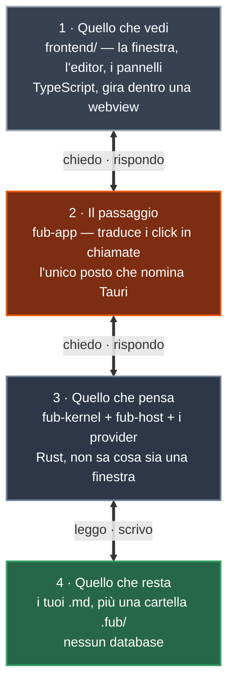
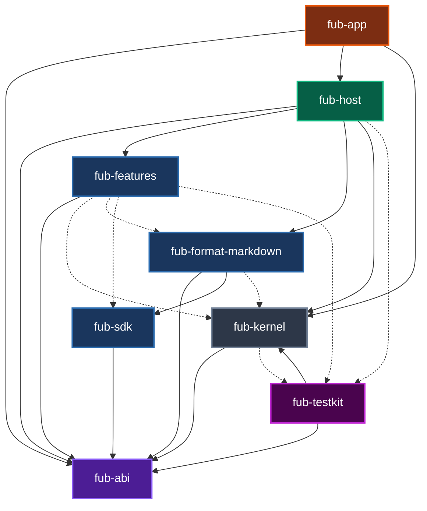
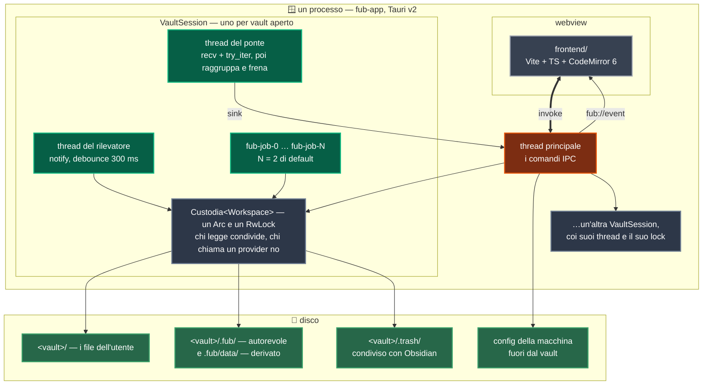

# Fub — mappa visuale

Questa è l'architettura **com'è oggi**, non come sarà.

## Come si legge questa pagina

La pagina è a livelli. Il primo si guarda in un minuto, l'ultimo si legge in
mezz'ora. **Non serve leggerli in fila**: ogni livello si regge da solo, e ogni
sezione dice in testa a chi serve.

| Livello | Sezione | Risponde a | Tempo |
|---|---|---|---|
| 0 | [Fub in quattro riquadri](#fub-in-quattro-riquadri) | Cos'è questo programma, grosso modo | 1 min |
| 1 | [La mappa intera](#la-mappa-intera) | Quali pezzi ci sono e chi parla con chi | 5 min |
| 2 | [Il grafo delle dipendenze](#il-grafo-delle-dipendenze-e-il-test-che-lo-legge) | Chi dichiara chi nel proprio manifest | 5 min |
| 3 | [Dove gira cosa](#dove-gira-cosa-processi-thread-lucchetti) | Processi, thread, lucchetti | 5 min |
| 4 | [Il dettaglio, riquadro per riquadro](#il-dettaglio-riquadro-per-riquadro) | Cosa c'è davvero dentro ogni scatola | 20 min |
| 5 | [Due giri completi](#due-giri-completi) | Cosa succede quando premo un tasto | 10 min |
| — | [Le otto scelte che hanno formato tutto](#le-otto-scelte-che-hanno-formato-tutto) | Perché è fatto così, e cosa costa | 10 min |
| — | [Cosa non c'è ancora](#cosa-non-cè-ancora) | I buchi, dichiarati | 3 min |
| — | [Legenda e glossario](#legenda-e-glossario) | Cosa vuol dire quella parola | — |

Tre convenzioni valgono per tutti i disegni:

- **Riquadro pieno**: codice che nel repo c'è.
- **Riquadro tratteggiato**: per ora solo un documento.
- Un numero scritto in questa pagina o è **contato da una macchina** — porta
  accanto un'annotazione che uno script rifà a ogni corsa — o **è un link a una
  riga di sorgente**. Un numero senza né l'uno né l'altro invecchia in silenzio,
  ed è già successo qui dentro.

La differenza fra pieno e tratteggiato è voluta: un diagramma con FubAI accanto
al kernel disegnerebbe un'app che non esiste.

---

## Fub in quattro riquadri

**A chi serve:** a chi apre questo file per la prima volta.

Fub è un editor di note che tiene i dati in **file normali dentro una cartella**
— un *vault*. Non c'è un database, non c'è un server, non c'è un account.

Le quattro cose da portarsi via, e nient'altro:

1. **La verità sono i tuoi file.** Se Fub sparisse domani, le note restano:
   sono `.md` che `grep`, `git`, Obsidian e qualunque editor sanno leggere.
2. **Il markdown è un pezzo staccabile, non il cuore.** Il cuore non sa cosa sia
   il markdown; glielo racconta un componente che si può sostituire.
3. **Le funzioni di Fub sono già scritte come plugin.** Ricerca, backlink, tag,
   cestino, grafo, cronologia: passano tutte dalla stessa porta che useranno i
   plugin di terzi.
4. **Ogni pezzo ha un confine, e i confini sono provati da test.** Non sono
   promesse scritte in un commento: se qualcuno li supera, la build diventa
   rossa.

---

## La mappa intera

**A chi serve:** a chi deve capire dove mettere le mani.

Questo disegno è **disposto a mano**. Raggruppa per ruolo, e le frecce dicono
*chi parla con chi*. Nessuna macchina lo verifica: un riquadro spostato non
rompe niente. Il diagramma verificato è il [prossimo](#il-grafo-delle-dipendenze-e-il-test-che-lo-legge).

```mermaid
flowchart TB
    %% ============================== STILI ==============================
    classDef contract fill:#4c1d95,stroke:#8b5cf6,stroke-width:2px,color:#fff
    classDef core     fill:#2d3748,stroke:#718096,stroke-width:2px,color:#fff
    classDef provider fill:#1a365d,stroke:#2b6cb0,stroke-width:2px,color:#fff
    classDef mount    fill:#065f46,stroke:#10b981,stroke-width:2px,color:#fff
    classDef glue     fill:#7c2d12,stroke:#ea580c,stroke-width:2px,color:#fff
    classDef ui       fill:#374151,stroke:#9ca3af,stroke-width:2px,color:#fff
    classDef storage  fill:#276749,stroke:#38a169,stroke-width:2px,color:#fff
    classDef future   fill:#3f3f46,stroke:#a1a1aa,stroke-width:2px,color:#d4d4d8,stroke-dasharray: 6 4

    %% ============================== SHELL ==============================
    subgraph SHELL ["🖥️ frontend/ — Vite + TypeScript + CodeMirror 6, nove cartelle"]
        Seam["host/<br>tipi rispecchiati, IPC, dialoghi, canale dati"]:::ui
        StateL["state/<br>store, router eventi, layout, coda di salvataggio"]:::ui
        UiPrim["ui/<br>renderer UiNode, panel-host, palette, notifiche"]:::ui
        Panels["panels/<br>undici pannelli: documento, explorer, ricerca,<br>grafo, cestino, impostazioni, attività, …"]:::ui
        EditorL["editor/<br>live preview, completamenti, comandi, tema"]:::ui
        RulesTs["rules/ · i18n/ · theme/<br>regole gemelle del Rust, stringhe, token"]:::ui
    end

    %% =============================== APP ===============================
    subgraph APP ["🪟 fub-app — colla Tauri v2, e nient'altro"]
        Cmd["i comandi IPC in un file solo<br>errori tipizzati, non frasi"]:::glue
        Bridge["WebviewEvents<br>l'unico EventSink che ha bisogno di Tauri"]:::glue
    end

    %% ============================ CONTRATTO ============================
    subgraph CONTRATTO ["📜 fub-abi — il contratto, definito una volta sola"]
        Traits["i trait di estensione<br>Format · View · Index · Command · Event<br>Service · Plugin · Import · Export · Syntax · Renderer"]:::contract
        HostApiN["HostApi<br>somma di sedici famiglie: l'unico varco<br>vault, dati, query, eventi, servizi, rete"]:::contract
        QueryN["IndexQuery<br>un albero di predicati, non una stringa"]:::contract
        Model["modello comune<br>un albero, cinque tabelle piatte<br>+ arena al confine"]:::contract
        UiN["UI dichiarativa<br>UiNode, Intent, dieci superfici"]:::contract
        RulesN["rules/<br>path, id, tag, proprietà, eventi, salute, …"]:::contract
        Wit["fub-abi/wit/<br>lo stesso contratto in WIT<br>+ linea di base congelata"]:::contract
    end

    %% =============================== HOST ==============================
    subgraph HOSTC ["🔧 fub-host — chi monta. Non dipende da Tauri"]
        Mount["tabella di montaggio<br>un bundle per feature"]:::mount
        SessH["sessione del vault aperto<br>registro dei vault, impostazioni di macchina"]:::mount
        Runner["runner dei job<br>due thread, cancellazione a bandiera"]:::mount
        Doors["le tre porte verso l'host concreto<br>watcher · event sink · chi apre"]:::mount
        Cust["Custodia<br>il lucchetto, e cosa fare se si avvelena"]:::mount
        NetH["rete e orologio di parete<br>UreqNetwork · jiff, dietro cargo feature"]:::mount
        ShellC["shell.rs<br>i comandi che esegue la webview"]:::mount
    end

    %% ============================== KERNEL =============================
    subgraph KERNEL ["🚀 fub-kernel — il core, agnostico rispetto al formato"]
        WS["Workspace: cinque proprietari<br>DocumentStore · Indexes · ProviderRegistry<br>Dispatcher · Session"]:::core
        Canale["canale dati<br>CoreIndex, RouteTable, pianificatore"]:::core
        Bus["EventBus<br>maschera a quattro assi, lotti, origine, freni"]:::core
        Regs["Format · Syntax · Renderer registry"]:::core
        Graph["LinkGraph<br>nome, alias, path, backlink, incrementale"]:::core
        SettStore["SettingsStore<br>vault, poi macchina, poi default"]:::core
        Perms["registro plugin + guardia<br>dove i permessi si applicano"]:::core
        Durata["ciò che dura<br>journal · bozze · undo · anagrafe<br>stato di vista · stato per-documento"]:::core
    end

    %% ============================ PROVIDER =============================
    subgraph PROVIDER ["🧩 I provider nativi — gli stessi trait dei plugin di domani"]
        Markdown["fub-format-markdown<br>comrak: il PRIMO FormatProvider"]:::provider
        Search["Ricerca<br>IndexProvider su tantivy"]:::provider
        Views["sette ViewProvider<br>backlink · struttura · tag · cestino<br>grafo · statistiche · cronologia"]:::provider
        Version["Versioning<br>EventHandler + snapshot per file"]:::provider
        Cmds["Comandi<br>note, ricerca, wikilink, sostituzione in blocco"]:::provider
        Blocks["Blocchi<br>tre SyntaxRule + due CustomRenderer"]:::provider
        Sdk["fub-sdk<br>scansione, id, costruttori di UI, MemoryHost"]:::provider
    end

    %% ============================== DISCO ==============================
    subgraph DISCO ["💾 Disco — local-first, e nessun database"]
        Notes["file dell'utente<br>.md, frontmatter, wikilink, tag, allegati"]:::storage
        Conf[".fub/ — autorevole<br>settings · workspace · journal · drafts"]:::storage
        Derived[".fub/data/ — derivato e buttabile<br>anagrafe, diagnostica, plugins/id/"]:::storage
        Trash[".trash/ + sidecar<br>da dove veniva ogni file"]:::storage
        MConf["config della macchina<br>settings, vaults, view-state, logs"]:::storage
    end

    %% ============================= FUTURO ==============================
    subgraph FUTURO ["🕳️ Ancora da scrivere — nel repo non c'è una riga"]
        WasmHost["fub-wasm-host (M5)<br>plugin di terzi via wasmtime<br>stessi trait, per proxy"]:::future
        Suite["FubSuite<br>FubTasks · FubDB · FubCanvas · FubJournal<br>FubAI · FubPublish · FubSync"]:::future
        Est["servizi esterni opt-in<br>LLM, sync, pubblicazione"]:::future
    end

    %% ============================ CONNESSIONI ==========================
    Seam <==>|"invoke"| Cmd
    StateL <==>|"fub://event"| Bridge
    UiPrim <==> ShellC

    Cmd ==> SessH
    Bridge <==>|"event sink"| Doors

    SessH ==> Cust
    Cust ==> WS
    Mount ==>|"registra i bundle"| WS
    Runner <==> WS
    Doors ==>|"scritture altrui"| Bus
    NetH ==>|"HostNetwork · Clock"| WS

    Regs <==>|"dyn FormatProvider"| Markdown
    Canale <==> Search
    WS <==> Views
    Bus <==> Version
    WS <==> Cmds
    Regs <==> Blocks

    Traits -.->|"una firma sola per il nativo e per il WASM"| Markdown
    HostApiN -.-> Perms
    QueryN -.-> Canale
    UiN -.-> UiPrim
    RulesN -.-> Canale
    RulesN -.->|"metà gemella in TypeScript"| RulesTs
    Model -.-> Seam

    WS ==>|"path in DocId"| Notes
    WS ==> Trash
    SettStore ==> Conf
    Durata ==> Conf
    Search ==> Derived
    Version ==> Derived
    Durata ==> Derived
    SessH ==> MConf

    Traits -.-> WasmHost
    WasmHost -.->|"ospiterà"| Suite
    Suite -.-> Est
```

### Cosa dice questo disegno, in sei righe

1. **L'asse portante è il contratto, non il markdown.** `fub-abi` non dipende da
   comrak, tauri, wasmtime o tokio, e un test lo verifica. Il markdown è il
   *primo* provider, non il formato dell'app.
2. **Chi monta e chi disegna sono separati.** `fub-host` non dipende da `tauri`,
   perché il montaggio ha cinque clienti previsti: CLI, API locale, e2e
   headless, mobile, PWA. Finché stava dentro un `#[tauri::command]`, nessuno di
   loro poteva riusarlo
   ([0023](../decisions/0023-chi-monta-il-kernel.md)).
3. **Non c'è un database: ci sono file.** L'indice di ricerca è tantivy dentro
   `.fub/data/plugins/`, e tutto ciò che sta lì è derivato. Cancellarlo costa
   una ricostruzione, mai un dato dell'utente. La verità è nei file.
4. **Le feature ufficiali sono già plugin.** Sono
   **dieci** [conta: moduli-di-feature] e implementano gli stessi trait che
   useranno i plugin di terzi, senza sandbox e senza serializzazione. Il
   dogfooding — usare il proprio prodotto mentre lo si scrive — è il modo in cui
   il contratto si scopre sbagliato prima di M5. **Fin dove arriva, però, adesso
   è contato** ([0104](../decisions/0104-la-superficie-di-scrittura-si-presta.md)):
   le feature ufficiali stanno su **quattro** delle
   **dieci** [conta: superfici-di-vista] superfici che `ViewSurface` nomina.
   Dove nessuna passa, il contratto non si scopre sbagliato: lo si scopre quando
   qualcuno ci prova. Il conto lo tiene `fub-features/tests/conformita.rs`, che
   per ogni superficie pretende una feature o una ragione scritta.
5. **Il lucchetto non è del kernel.** Il `Workspace` è un oggetto normale, che
   non sa di essere condiviso; a metterlo dietro un `RwLock` è chi monta, dentro
   una `Custodia`. È la ragione per cui il core si può usare anche da un
   processo che non ha thread da sincronizzare.
6. **Il tratteggio è onesto; la freccia «ospiterà» no.** Il runtime WASM e
   l'intera FubSuite sono documenti, non codice: la cartella `plugins/` nascerà
   con il runtime che dovrà caricarli. Quella freccia però dice **tutta** la
   Suite, e almeno un riquadro non ci sta. Un sync deve decidere il merge
   *prima* che il file atterri; il contratto permette di osservare dopo
   (`EventHandler`), non di interporsi. Per gli altri plugin la domanda si
   decide con tre misure — dove sta il codice rispetto al prestito del
   workspace, frequenza × payload delle chiamate, e se agisce prima o dopo la
   scrittura — ed è il metro di
   [plugin-boundary.md](plugin-boundary.md#cosa-non-può-essere-solo-un-guest-e-il-metro-per-deciderlo).

---

## Il grafo delle dipendenze, e il test che lo legge

**A chi serve:** a chi aggiunge un crate, o si chiede se può importare una cosa
da un'altra.

Il disegno precedente è disposto a mano. Questo dice invece una sola cosa,
controllabile a macchina: **chi dichiara chi nel proprio `Cargo.toml`**.

- Freccia piena: dipendenza normale.
- Freccia tratteggiata: dipendenza di solo `[dev-dependencies]`.

I crate del workspace sono **otto** [conta: crate-del-workspace]. La tabella
sotto legge il blocco qui sopra: nella colonna «dipende da» ci sono **gli stessi
archi**, scritti a parole. Se una riga dicesse una cosa diversa dal blocco, il
test si accorgerebbe del blocco e non della riga — quindi la riga si scrive
**guardando il blocco**, mai a memoria.

| Riquadro | Manifest | Dipende da (workspace) | Dipendenze esterne dirette | A cosa serve |
|---|---|---|---|---|
| `fub-abi` | [Cargo.toml](../../crates/fub-abi/Cargo.toml) | nessuno | `serde`, `serde_json`, `thiserror`, `unicode-normalization` | Il contratto. Solo tipi e trait, zero I/O. |
| `fub-kernel` | [Cargo.toml](../../crates/fub-kernel/Cargo.toml) | `fub-abi` | `serde`, `serde_json`, `camino`, `thiserror`, `tracing`; su Windows anche `windows-sys` | Il core: orchestra un vault senza sapere cosa c'è scritto nei file. |
| `fub-sdk` | [Cargo.toml](../../crates/fub-sdk/Cargo.toml) | `fub-abi` | `serde`, `serde_json`, `regex` | Comodità per chi **implementa** i trait. Niente kernel, mai. |
| `fub-format-markdown` | [Cargo.toml](../../crates/fub-format-markdown/Cargo.toml) | `fub-abi`, `fub-sdk` (+ `fub-kernel` solo nei test) | `comrak`, `serde`, `serde_json`, `serde_yaml_ng` | Il primo `FormatProvider`. comrak si trova solo qui. |
| `fub-features` | [Cargo.toml](../../crates/fub-features/Cargo.toml) | `fub-abi` (+ `fub-kernel`, `fub-sdk`, `fub-format-markdown`, `fub-testkit` solo nei test) | `camino`, `serde`, `serde_json`, `tracing`, `tantivy` (opzionale) | Le feature ufficiali. **Il kernel è dev-only: è l'invariante del dogfooding.** |
| `fub-host` | [Cargo.toml](../../crates/fub-host/Cargo.toml) | `fub-abi`, `fub-kernel`, `fub-features`, `fub-format-markdown` (+ `fub-testkit` solo nei test) | `camino`, `serde`, `serde_json`, `tracing`, `jiff`; opzionali `notify`, `notify-debouncer-full`, `ureq` | Il composition root: monta i pezzi degli altri. **Niente Tauri.** |
| `fub-app` | [Cargo.toml](../../crates/fub-app/Cargo.toml) | `fub-abi`, `fub-kernel`, `fub-host` | `tauri`, `tauri-plugin-dialog`, `serde`, `serde_json`, `camino`, `tracing` | La colla. `tauri` si trova solo qui. |
| `fub-testkit` | [Cargo.toml](../../crates/fub-testkit/Cargo.toml) | `fub-abi`, `fub-kernel` | `camino`, `serde_json`, `tempfile` | Il banco del lato host. Per questo non è mai una dipendenza normale di nessuno. |

Due cose in questa tabella meritano di essere lette due volte.

- **`fub-app` non dipende da `fub-features`**, e non è una svista: è una riga
  tolta apposta. Quella riga diceva due cose non vere, e la seconda era sottile
  — chiedere `fub-features/versioning` da lì **non accendeva** ciò che si
  credeva, perché i `#[cfg]` stanno su `fub-host` e le cargo feature non
  risalgono. Una feature si chiede al crate da cui si dipende.
- **`fub-host` dipende da `jiff` e da `ureq`, e sono le due voci più care del
  workspace.** `ureq` costa venti pacchetti nel lockfile benché `reqwest` sia
  già presente via Tauri; `jiff` ne costa dieci. Il manifest lo scrive invece di
  nasconderlo: *«è il conto più caro che questo workspace abbia pagato per una
  dipendenza»*. Il motivo è lo stesso della riga sopra — se stessero in
  `fub-app`, una CLI o un e2e headless non li avrebbero.

Le frecce tratteggiate non sono una comodità: sono un confine. `fub-features` e
`fub-format-markdown` usano `fub-kernel` **solo nei test**; le loro librerie
vedono solo il contratto, cioè l'ambiente di un plugin di terzi. Il test
`official_features_do_not_depend_on_the_kernel`
([dependency_invariant.rs:375](../../crates/fub-abi/tests/dependency_invariant.rs))
lo verifica: se una feature prendesse il kernel, diventerebbe rosso prima che il
diagramma diventi falso.

Dipendere solo dal contratto non vuol dire però poter fare tutto. Un plugin di
terzi non arriva dove arriva una feature ufficiale, e il verbale
[0104](../decisions/0104-la-superficie-di-scrittura-si-presta.md) dice dove si
ferma:

- Un guest non ha `UiNode::Html`/`WebView`: sono riservati a `Trust::Core`.
- Un guest non riceve eventi di tastiera: il contratto non li trasporta.
- La **superficie di scrittura** non vieta queste azioni. Semplicemente non dà
  gli strumenti per farle.

È la quarta voce del metro in
[plugin-boundary.md](plugin-boundary.md#cosa-non-può-essere-solo-un-guest-e-il-metro-per-deciderlo).

### Perché questo diagramma è diverso dagli altri

Il diagramma si auto-verifica. Il test `il_diagramma_dice_le_dipendenze_vere`
legge questo file e lo confronta con `cargo metadata` **nei due versi**.

- Un arco disegnato che non esiste fa fallire il test.
- Una dipendenza reale omessa fa fallire il test. Un diagramma incompleto mente
  più di uno sbagliato, perché ha l'aria di essere completo.
- Un nuovo crate creato senza aggiornare il diagramma fa fallire il test.

Non è teoria: è nato da un errore vero. Questo stesso file diceva «quattordici
famiglie» mentre un commento del contratto ne diceva dieci, **per ottocento
righe**. Il disegno aveva ragione, il codice torto, e nessuno dei due poteva
accorgersene.

Due foglie, per ragioni opposte.

- `fub-app` non lo usa nessuno, ed è voluto: la colla di Tauri sta in fondo.
- Verso `fub-testkit` non esce **nessuna** freccia piena. Un banco (l'ambiente
  di test) dentro una libreria si porterebbe dietro il kernel. Il test
  `il_banco_di_prova_non_entra_in_nessuna_libreria` guarda *tutti* i membri.

`fub-sdk` ha un solo cliente fra le dipendenze piene, `fub-format-markdown`, e
quella freccia sola tiene in piedi un ragionamento intero: mettere il kernel
nell'SDK diventerebbe impossibile
([0054](../decisions/0054-il-banco-del-lato-provider.md)). Fra le tratteggiate
ha in più `fub-features`, che dall'SDK prende `MemoryHost`.

L'elenco a indentazione in [PIANO.md](../PIANO.md#struttura-dei-crate) non è un
grafo: dice la destinazione, e nomina anche il crate futuro `fub-wasm-host`.
Questo diagramma fotografa l'oggi.

---

## Dove gira cosa: processi, thread, lucchetti

**A chi serve:** a chi debugga una cosa che si blocca, o che arriva in ritardo.

I due diagrammi precedenti mostrano la struttura del **codice**. Questo mostra
la disposizione a **runtime**: un processo, un webview, e un gruppo di thread
per ogni vault aperto. Il gruppo nasce quando il vault si apre e muore quando si
chiude.

### Il conto esatto

| Cosa | Quantità e dettagli | Dove |
|---|---|---|
| Processi | **Uno**. Il sistema non usa demoni o servizi. | [fub-app/src/lib.rs](../../crates/fub-app/src/lib.rs) |
| Webview | Uno. Il core lo considera **privilegiato**: per questo `UiNode::Html` è negato al codice non fidato. | [ui-protocol.md](ui-protocol.md) |
| `VaultSession` | Una per vault aperto, tenute in una mappa. Erano una `Option`, e aprire un vault chiudeva quello aperto. | [session.rs:106](../../crates/fub-host/src/session.rs) |
| Thread del ponte | Uno per vault, **e solo se c'è un sink**. Dorme su `recv()`: a vault fermo non costa niente. | [bridge.rs:82](../../crates/fub-host/src/bridge.rs) |
| Thread del rilevatore | Quelli che decide `notify`, dietro la cargo feature `notify-watcher` — che è **accesa di default**. | [watcher.rs:298](../../crates/fub-host/src/watcher.rs) |
| Thread dei job | **Due** di default per vault, non globali: `DEFAULT_JOB_THREADS`. | [runner.rs:73](../../crates/fub-host/src/runner.rs) |
| Database | **Nessuno**. | — |

Il lock è per vault, non per applicazione: due vault aperti non si aspettano a
vicenda. Il pool dei job segue la stessa regola, e per la stessa ragione — una
indicizzazione lunga su un archivio non deve rallentare le note di lavoro.

### Perché **due** thread di job

Nessuna delle due metà del numero è arbitraria:

- **non uno**, perché un job che aspetta la rete non deve tenere fermo un job
  che calcola — è la ragione per cui esiste un pool invece di un worker;
- **non «quanti core»**, perché il parallelismo utile non lo limitano i core: lo
  limita il `RwLock` del workspace, e due job che scrivono si mettono in fila
  comunque. Un pool grande comprerebbe contesa, non velocità.

È un **default**, non una costante del disegno: `Host::with_job_threads` lo
cambia. E il pool non fa polling: aspetta su un campanello che è del kernel,
così non c'è nessun intervallo da indovinare.

### Il lucchetto, e cosa succede se si rompe

Il kernel **non sa che esiste un lock**. `Workspace` è un oggetto normale; a
metterlo dietro un lucchetto è chi monta, dentro `Custodia`
([custodia.rs:86](../../crates/fub-host/src/custodia.rs)). La `Custodia` ha
quattro porte e nient'altro: `read`, `write`, `try_read`, `try_write`.
Chiamarci `.lock()` **non compila**.

| Prestito | Chi lo prende | Perché |
|---|---|---|
| **Condiviso** (`read`) | letture del vault, disegnare una view, interrogare un indice | N view si ridisegnano insieme |
| **Esclusivo** (`write`) | scrivere un documento, invocare un comando, ogni chiamata a provider che muta | il `Workspace` prende `&mut self` per scrivere |

**A classificare è il compilatore**, non una convenzione: da un prestito
condiviso non si può chiamare una funzione che vuole `&mut self`.

Il guadagno è misurato, non stimato. Prima era un `Mutex`: N view che si
ridisegnano insieme sono passate da **7 a 25 volte** più veloci, e chi salva non
viene più affamato — **6,4 secondi** di attesa misurati per un salvataggio sotto
`Mutex`, contro **0,12 ms** adesso.

**Il veleno.** Un `RwLock` di `std` si avvelena solo se pania chi tiene il
prestito **esclusivo**: qui vuol dire *una mutazione si è fermata a metà*. La
politica è scritta e ha tre parti
([0120](../decisions/0120-un-lucchetto-avvelenato-si-dice-una-volta.md)):

1. **irrecuperabile.** Riprendere lo stato darebbe un indice alimentato a metà,
   un documento nella tabella e non nel grafo. Chi cerca troverebbe risposte
   *sbagliate* invece di risposte *mancanti*.
2. **detto una volta.** Un solo errore nel log; ma **tutte** le chiamate,
   compresa la prima, ricevono un errore con la stessa frase — mai un vuoto.
3. **il conto è della custodia, non del processo.** Due vault aperti sono due
   stati indipendenti.

| PRO | CONTRO |
|---|---|
| Le letture concorrenti non si aspettano più | Ogni prestito è una **domanda**: `read()`/`write()` tornano un `Result`, anche dove non fallisce mai |
| Il compilatore separa chi legge da chi muta | `RwLock<T>` vuole `T: Send + Sync` dove `Mutex<T>` bastava `Send`: ha costretto il watcher a essere `Sync` |
| Un panico non lascia il vault in uno stato mezzo scritto | Scrivere `write()` dove bastava `read()` passa **ogni** test funzionale e rimette tutti in fila in silenzio: è il solo motivo per cui esiste `tests/concorrenza.rs` |
| Due vault non si bloccano a vicenda | Un panico costa il vault: per scelta si riavvia |

I riquadri del disco, con contenuto, classe e regole di scrittura, stanno in
[on-disk-layout.md](on-disk-layout.md).

---

## Il dettaglio, riquadro per riquadro

**A chi serve:** a chi deve modificare quel riquadro lì.

Ogni sotto-sezione ha la stessa forma: **cosa c'è dentro**, **perché è così**,
**cosa costa**.

### 📜 `fub-abi` — il contratto

**Cosa c'è dentro.** Ventitré moduli più tredici di regole, circa 23 600 righe
di Rust, e lo stesso contratto una seconda volta in
**4 037** [conta: wit-righe] righe di WIT. Solo tipi e trait: zero
implementazioni vere, zero I/O.

| Modulo | Cosa dichiara |
|---|---|
| `model.rs` | Il documento: un albero (`Block`, `Inline`) più cinque tabelle piatte |
| `traits.rs` | Le famiglie dell'host e la maggior parte dei trait di estensione |
| `query.rs` | Il linguaggio delle interrogazioni |
| `ui.rs` | Il protocollo di UI dichiarativa |
| `event.rs` | Eventi, maschere, lotti, origine |
| `command.rs` | I comandi, con argomenti e raggio dichiarati |
| `format.rs`, `custom.rs` | Come si estende un formato, e come si innesta una sintassi |
| `transfer.rs` | Import ed export, che lavorano a byte e non a path |
| `net.rs` | La richiesta e la risposta di rete, come tipi del contratto |
| `edit.rs` | L'edit: una coppia span-testo sopra una revisione |
| `schema.rs` | `SchemaVersion`, il tipo di una versione su disco |
| `rules/` | Le regole condivise: tredici moduli |
| `arena.rs` | La forma «al confine»: alberi appiattiti, indici `u32` |
| `crates/fub-abi/wit/` | Lo stesso contratto scritto una seconda volta, in WIT |

**I trait che si implementano per estendere Fub sono undici.**

| Trait | Serve a |
|---|---|
| `FormatProvider` | Dire cosa vuol dire un formato: parse, render, serialize |
| `SyntaxRule` | Aggiungere una sintassi che il core non conosce |
| `CustomRenderer` | Disegnare il blocco che quella sintassi produce |
| `CommandProvider` | Offrire azioni al registro dei comandi |
| `ViewProvider` | Disegnare un pannello con la UI dichiarativa |
| `IndexProvider` | Rispondere alle domande del canale dati |
| `EventHandler` | Reagire a ciò che succede nel vault |
| `ServiceProvider` | Offrire una superficie che altri plugin chiamano |
| `Plugin` | Il ciclo di vita: manifest, attiva, disattiva, job |
| `ImportProvider` | Come i dati entrano nel vault |
| `ExportProvider` | Come ne escono |

Tre asimmetrie sono deliberate e valgono da sole la lettura: disegnare una view
prende un prestito **di sola lettura**, cliccarci sopra no; un export gira sotto
prestito condiviso perché **è** una lettura; un import prende il prestito
esclusivo perché scrive.

**`HostApi`: un varco solo.** Tutto ciò che un plugin può fare al mondo passa da
un unico oggetto. Ciò che non è lì, non si può fare. È la somma di sedici
famiglie — sette di sola lettura più nove che mutano — e al confine WIT le
stesse famiglie diventano **diciassette** [conta: wit-interfacce-host]
interfacce con **quaranta** [conta: hostapi-metodi] funzioni in tutto.

La **negazione** non sta qui: sta nel kernel. Il contratto dice cosa si può
fare, il kernel dice a chi. I nomi che una politica sa negare sono
**diciannove** [conta: guard-famiglie]
([0095](../decisions/0095-cosa-guardo-e-cosa-sto-scrivendo.md)), mentre i
permessi che un manifest può **dichiarare** sono
**tredici** [conta: permessi-dichiarabili]. I due numeri divergono apposta:
alcune famiglie non hanno permesso perché il recinto c'è già per costruzione (i
propri blob, l'orologio, lo stato di vista), e alcuni permessi non hanno ancora
una famiglia che li consumi (`camera`, `microphone`, `external-fs`,
`clipboard`). Toglierli perché non fanno niente vorrebbe dire scoprire, il
giorno della prima capacità, che il nome era libero.

**Perché un crate separato.** L'invariante è scritta nel manifest stesso: questo
crate non deve mai dipendere da comrak, tauri, wasmtime, tokio, notify. È il
firewall anti-lock-in. Definendo ogni trait una volta sola, l'implementazione
nativa e quella futura via proxy WASM hanno **la stessa firma**, e il kernel non
distingue le due.

| PRO | CONTRO |
|---|---|
| Parser markdown, motore di ricerca e toolkit UI si sostituiscono senza toccare il contratto | Un tipo nuovo va dichiarato in due posti: Rust **e** WIT |
| Il crate resta compilabile a `wasm32` — condizione per il proxy | Le feature ufficiali passano da API più formali di una chiamata diretta |
| Chi implementa un indice di terzi non ha bisogno del kernel | Ogni scelta qui è quasi irreversibile dopo il freeze M4 |
| L'invariante è un test, non una promessa | I test di conformità sono più righe del crate che presidiano |

**Le regole d'oro delle firme.** Niente `async fn`, niente metodi generici,
niente closure, niente riferimenti alla memoria del kernel, tutto
serializzabile, chiamate brevi, l'I/O nell'`HostApi` e non nei provider,
l'ordine dei casi non si tocca mai. Ognuna ha una ragione sola dietro: **a M5
queste chiamate attraversano un confine WASM**, e ciò che non lo attraversa non
può stare in una firma. Il lavoro lungo passa dai job, non da un `await`.

`rules/` sta nell'ABI e non nel kernel per un motivo che si capisce con una
domanda: chi serve una query di terzi ha il kernel fra le mani? No — quindi le
regole che decidono *come si confrontano due valori*, *quando un path diventa un
`DocId`*, *quale tag sta sotto quale* devono stare dove arriva anche lui. Il
secondo che le rifacesse risponderebbe **diversamente alla stessa query**, e la
differenza non la vedrebbe nessun test, perché i due non si confrontano mai.

**Cosa NON è una regola condivisa:** l'ordine di presentazione. Il kernel ordina
per `DocId` in byte perché serve un ordine totale e calcolabile senza locale;
la sidebar ordina con un collatore italiano. Non sono due copie della stessa
regola: sono due requisiti che devono divergere.

### 🚀 `fub-kernel` — il core

**Cosa c'è dentro.** Trentasette moduli più due cartelle (`host/`, `index/`).
Il kernel fa una cosa: **orchestra un vault** senza sapere cosa ci sia scritto
dentro i file. Chi decide che `.md` è markdown non è lui: è chi lo monta.

**`Workspace` non è uno `struct` piatto: ha diciotto campi, e cinque di quei
campi sono i proprietari.**

| # | Proprietario | Risponde alla domanda |
|---|---|---|
| 1 | `docs: DocumentStore` | Il disco, e come ciò che ci sta sopra diventa un modello |
| 2 | `indexes: Indexes` | Il canale dati: chi risponde a una query |
| 3 | `providers: ProviderRegistry` | Chi è registrato, cosa ha dichiarato, chi possiede quale nome |
| 4 | `dispatch: Dispatcher` | Quando un evento parte, con che nome, per quanto |
| 5 | `session: Session` | Cosa sta guardando l'utente adesso |

Gli altri tredici campi non sono un sesto proprietario, e ognuno ha scritto
accanto perché: `network` (il filo verso fuori, e `None` non è un difetto),
`settings`, `view_states`, `organization`, `system_locale`, `undo`,
`entry_store`, `journal`, `drafts`, `sources`, `closed`, più due residui
dichiarati. Sono stato del *tutto*, che nessuno dei cinque saprebbe da sé.

**Dove passa il taglio, ed è la parte importante.** Non passa fra sottosistemi:
passa fra **decidere** e **chiamare**. Ogni chiamata a un provider vuole un
`HostApi`, che è costruito su **tutto** il workspace — quindi disegnare una
view, invocare un comando, importare, esportare e drenare la coda restano
orchestrazione sul `Workspace`. Nei cinque componenti c'è ciò a cui si risponde
*senza svegliare nessuno*.

Esempio concreto: il dispatcher decide **cosa** consegnare, il workspace lo
**consegna** — perché consegnare vuol dire prestare il workspace intero.

| PRO | CONTRO |
|---|---|
| Ogni componente ha un nome che dice di cosa risponde: si sa dove cercare | `workspace.rs` resta **6685** righe. La divisione ha estratto la proprietà, non la lunghezza |
| È la stessa linea lungo cui passa il lucchetto | I campi sono `pub(crate)`, non dietro accessori: il componente è un raggruppamento, non un muro |
| I componenti si testano senza montare mezzo mondo | Tredici campi su diciotto hanno bisogno di un paragrafo che spieghi perché non sono un sesto proprietario |

**Il registro dei provider: come si risolve «chi serve questa richiesta».** Non
c'è un `if`. C'è un registro, e la rivendicazione è un **dato dichiarato alla
registrazione**.

| Si chiede | Chi risolve | Nessuno la serve | Due la servono |
|---|---|---|---|
| un file `.md` | il registro dei formati, per estensione | errore «non servita» | conflitto, e la registrazione **non avviene affatto** |
| una query dati | la tabella delle rotte, per famiglia | errore «non servita» | conflitto di rotta |
| un comando, una view, un servizio | il proprietario dichiarato | «comando sconosciuto» | rivendicazione già presa, al montaggio |

Prima il dispatch degli indici era **per tentativi**: si provavano in ordine
finché uno non rispondeva «non è roba mia». Con un indice funzionava benissimo;
con quelli che il piano prevede — full-text, semantico, vettoriale, proprietà,
task, database, citazioni — ogni query girava su tutti, e due indici che
rivendicavano la stessa cosa **si oscuravano a vicenda in silenzio**.

Due conseguenze, ed è per queste che il registro esiste:

- «nessuno la serve» è diventato **distinguibile** da «chi la serve ha
  fallito». Chi disegna deve sapere se scrivere «installa un indice» o
  «qualcosa è andato storto».
- il conflitto si vede **al montaggio**, non a runtime a seconda dell'ordine.

E vale la regola del tutto-o-niente: se **una** rivendicazione è contesa,
**niente** viene registrato, nemmeno le parti libere. Un provider registrato a
metà è peggio di uno non registrato, perché funziona per alcuni file e non per
altri.

**Gli eventi.** Ci sono due canali che portano la **stessa cosa** — un evento
più la sua origine: la coda verso gli handler registrati, dentro il giro
sincrono, e il bus verso chi sta fuori (il ponte, il rilevatore). Due canali che
portassero forme diverse dello stesso fatto sarebbero due verità da tenere
allineate a mano.

Un abbonamento si dichiara con una **maschera a quattro assi in AND**: specie,
topic dei custom, dove nel vault, cosa è cambiato. Prima era una lista di specie
e basta, e con quella sola grana ogni handler si svegliava per ogni custom di
ogni plugin e per ogni documento del vault. Due eccezioni rendono la maschera
onesta: un evento che **non nomina nessun documento** passa comunque il filtro
del soggetto (`overflow`, `vault-closed`, `job-done` — la regola opposta avrebbe
fatto perdere in silenzio proprio i tre che non si possono perdere), e un rename
è del soggetto di partenza *e* di quello d'arrivo.

I **freni** sono tre, e nessuno butta in silenzio:

| Freno | Tetto | Dove |
|---|---|---|
| budget del dispatch verso gli handler | 1024 eventi per drenaggio | [dispatcher.rs:65](../../crates/fub-kernel/src/dispatcher.rs) |
| arretrato per abbonato del bus | 1024 notice non ritirati | [bus.rs:70](../../crates/fub-kernel/src/bus.rs) |
| raffica del ponte verso la shell | 128 eventi per raffica | [bridge.rs:65](../../crates/fub-host/src/bridge.rs) |

Tutti e tre degradano allo **stesso** modo: ciò che si riscopre riguardando il
vault diventa un evento di **overflow** col conteggio, cioè «riconcilia da
zero». Ciò che **non** è recuperabile passa comunque — l'esito di un job lo sta
aspettando chi lo ha chiesto, e nessuna riconciliazione lo ritrova. E i posti da
cui un evento può sparire sono **quattro** [conta: code-che-si-svuotano], tutti
in un file solo, ognuno con la sua ragione scritta accanto.

**Il dispatch è a coda, mai ricorsivo.** Durante una chiamata a un provider gli
eventi si rimandano: arrivano *dopo* che la chiamata è tornata, mai dentro di
essa. Non è una comodità — a M5 il component model **vieta la rientranza di
un'istanza**, e un plugin che fosse insieme view e handler trapperebbe a
runtime. La semantica è promossa a contratto già in nativo.

**Gli indici non passano dal bus.** Ricevono ogni documento **dentro la stessa
operazione** che aggiorna il grafo. Il perché è netto: la coda eventi ha un
budget e può troncare, un indice no — un indice che perde un aggiornamento
**mente, e mentirebbe in silenzio**.

**Il grafo dei link.** Risolve i link e calcola i backlink, lavorando **solo su
documenti già parsati**: i suoi test lo costruiscono con modelli fatti a mano,
senza una riga di markdown. Due specie di arco (un nome di pagina, un path
relativo) diventano indistinguibili subito dopo la risoluzione, «perché per
l'utente *è* la stessa promessa». La parte difficile dell'incrementale non è
aggiungere gli archi del documento toccato: è sapere **quali altri documenti
vanno ri-risolti** — creare `Nota.md` **ruba** il nome `nota` a `sub/Nota.md` e
sposta i link di terzi; cancellarlo lo restituisce. Due mappe inverse tengono il
costo proporzionale al vicinato invece che al vault, e c'è una ricostruzione
completa che fa da **oracolo** contro cui misurare l'incrementale.

**Ciò che dura** — cinque depositi diversi, e la differenza fra loro è il punto:

| Deposito | Cos'è | Dove | Tetto |
|---|---|---|---|
| `journal` | ciò che il kernel **ha fatto** al vault, una riga per mutazione | `.fub/journal.jsonl` | 10 000 record |
| `drafts` | ciò che l'utente ha scritto e **non ha salvato** | `.fub/drafts/` | — |
| `undo` | le operazioni **dichiarate** annullabili, a profondità zero | in memoria | 100 voci |
| `entries` | l'anagrafe: per ogni file dimensione, data, impronta, metadati | `.fub/data/entries.json` | — |
| `viewstate` | dove si era fermato ogni esemplare di vista | fuori dal vault | — |

Tre distinzioni che sembrano pedanteria e non lo sono:

- **Il journal non porta il contenuto di prima. Mai.** Un registro dice *cosa è
  successo*, non *cosa c'era scritto*. Per un pezzo di strada l'eccezione
  c'era; la [0103](../decisions/0103-un-registro-dice-cosa-e-successo.md) l'ha
  tolta e ci ha messo l'impronta: dove la modifica ha toccato e **quanti** byte
  c'erano, mai quali. Il costo è dichiarato perché è stato misurato:
  l'annullamento vero non è mai passato di lì.
- **L'undo del testo e l'undo delle operazioni sono due pile diverse.** Quello
  del testo vive nell'editor, è per-documento e per-pannello, e il suo soggetto
  è un buffer che sul disco non è ancora arrivato. Questo ha per soggetto ciò
  che sul disco **c'è già**. La riga che le separa: *un comando entra da qui,
  una battuta di tastiera no* ([0045](../decisions/0045-l-undo-ha-due-pile.md)).
- **L'anagrafe è derivata, e la disciplina segue dal path.** Sta sotto la radice
  dei derivati, quindi illeggibile o di versione sconosciuta → si butta e si
  ricostruisce, senza avvisi. È l'opposto dell'organizzazione, che è autorevole
  e **si rifiuta di sovrascrivere** un file che non ha potuto leggere.

**Le impostazioni hanno tre livelli, e non sono tre posti in cui cercare**: il
vault (`.fub/settings.json`, quasi tutte le chiavi), la macchina (solo le chiavi
che lo dichiarano — oggi la diagnostica), e il **default**, che è parte della
dichiarazione e non un file. È per questo che un valore c'è sempre. Due regole
non le può applicare nessun altro: una chiave di macchina scritta dentro un
vault **si ignora** — un vault non alza il livello di log di chi lo apre — e non
si ignora in silenzio; e un valore può essere **sospeso**, perché le scorciatoie
di un vault arrivato da fuori riprogrammano un gesto, e un gesto riprogrammato
si scopre premendolo ([0100](../decisions/0100-i-tasti-che-arrivano-da-fuori.md)).

### 🔧 `fub-host` — chi monta

**Cosa c'è dentro.** Sedici moduli. È il **composition root**: il posto unico
dove si decide *quali pezzi esistono e in che ordine si accendono*.

Prima il montaggio stava dentro un comando IPC di apertura vault, quindi
**esisteva solo per chi aveva un webview**.

**Le tre porte verso l'host concreto.** Ciò che di un'app vera non può stare qui
non è il montaggio: sono i tre punti in cui il montaggio tocca il mondo.

| # | Porta | Le implementazioni che esistono |
|---|---|---|
| 1 | chi vede le scritture altrui | `NotifyWatcher` (dietro cargo feature, accesa di default) e `NoWatcher` |
| 2 | dove finiscono gli eventi usciti | la webview per l'app; stdout per una CLI; **niente** per gli e2e |
| 3 | chi decide quando si apre | nessuna: l'host da sé non si apre |

Due dettagli dicono il livello di attenzione. Il watcher ha **un metodo solo**,
`is_watching` — senza quello il trait sarebbe un oggetto opaco con un nome
nuovo, che è il punto di partenza. E quella risposta non è più *per
costruzione*: prima un debouncer che moriva rispondeva «sto guardando» per
sempre; adesso è una bandiera condivisa che il debouncer abbassa quando muore.
**Un bit solo**, non due idee.

**La tabella di montaggio.** Un core più **dieci** [conta: moduli-di-feature]
feature ufficiali fa undici bundle. L'elenco delle feature **non sta più in
questo file**: sta in un `static` di `fub-features`, e il montaggio lo *itera*.
La ragione è misurata: finché quelle righe erano qui, l'inventario *era* questo
file, e ogni presidio che volesse iterarle ne teneva una copia che nessuno
confrontava con l'originale — **quattro copie per le view, una per i
cataloghi**.

Cosa il montaggio decide ancora: **cosa** registra ognuna, e resta perché è
davvero irregolare — l'indice può non aprirsi, il versioning ha bisogno di uno
store che vive qui e di un interruttore che è dell'host, i blocchi registrano
cinque cose in due famiglie. Se una feature è nell'inventario e la tabella non
sa cosa registri, il montaggio **restituisce errore** invece di montare in
silenzio.

**L'ordine di accensione, e perché ogni riga sta dove sta:**

1. si monta;
2. si **sospendono** le scorciatoie sconosciute — qui e non più tardi, perché da
   questa riga in poi il vault è utilizzabile e «una scorciatoia attiva anche
   per un solo istante sarebbe un tasto premuto»;
3. si **guarda** cosa c'è nel vault (solo questo: non legge, non parsa, non
   indicizza);
4. si accende il **ponte eventi** — dopo la scansione, perché gli eventi
   dell'indicizzazione sono il vault che si popola, non che cambia, e la shell
   li leggerebbe come un temporale di modifiche;
5. si accoda il lavoro di indicizzazione — **dopo il ponte**, o la shell
   vedrebbe un lavoro progredire e finire senza averlo mai visto cominciare;
6. si accende il rilevatore;
7. si accende il pool, per ultimo: i job che la scansione ha accodato sono già
   in coda, e il primo giro del pool li trova lì.

La chiusura ha l'ordine inverso, e anche lì l'ordine è il punto: **smette di
guardare**, poi **smette di lavorare**, poi **si chiude**. Lasciare il watcher
vivo durante la chiusura vorrebbe dire ricevere una sincronizzazione *dopo* che
gli indici sono stati chiusi.

**Il rilevatore, e il bug che ha dovuto imparare.** Vale la pena per intero,
perché è didattico:

> inotify riporta anche le aperture e gli accessi. Chi apre i documenti di
> questo vault più spesso di chiunque altro è **Fub stesso** — la
> localizzazione delle occorrenze apre il sorgente di ogni riga di risultato.
> Trattare quelle aperture come cambiamenti chiudeva un anello: una ricerca
> leggeva sessanta note → il rilevatore riferiva sessanta «modifiche» → il
> kernel rileggeva quelle note per scoprire che erano identiche → altre sessanta
> aperture. **Il giro si alimentava da solo**, finché il ponte non andava in
> overflow e la shell non rispondeva più.

La regola che ne è uscita: nel dubbio si considera un cambiamento, perché una
rilettura di troppo costa un file aperto e una di meno costa un indice che
drifta in silenzio. E un lotto di sole letture **non è un lotto**: non si prende
il prestito esclusivo per non fare niente.

**Il filo verso fuori.** La rete è una capacità del contratto, non una libreria
che un plugin si porta: l'implementazione concreta sta qui
([net.rs](../../crates/fub-host/src/net.rs)) dietro la cargo feature
`http-client`, accesa di default. Un solo permesso porta un **parametro che
viene letto davvero**, ed è questo: l'elenco degli host che un manifest
dichiara. Accanto c'è la seconda sorgente di tempo — l'orario di **parete**, con
un calendario vero, tenuto separato dal tempo *trascorso* dello scheduler
([0091](../decisions/0091-un-orario-di-parete-non-e-un-intervallo.md)). Le due
non si mescolano: «ogni ora» deve voler dire un'ora anche se qualcuno sposta
l'orologio della macchina, e un `Instant` non sa cosa sia un lunedì.

**I job.** La regola sta in una riga: **un prestito per chiamata, mai per la
durata del job**, e nel verso giusto. La conseguenza è dichiarata nel contratto:
il vault **può cambiare fra due chiamate**. Non è un difetto, è ciò che vuol
dire non fermare il mondo — e la guardia è una revisione di base più un errore
di conflitto. L'annullamento è la stessa idea al contrario: un job annullato non
riceve un segnale da controllare, riceve un errore **alla capacità successiva**.
Non c'è niente da ricordarsi di chiamare, e un job scritto prima che la
cancellazione esistesse si ferma comunque.

**Il limite vero, scritto:** sei capacità non possono rifiutare, perché non
hanno dove metterlo un rifiuto. Quindi **un job puro che non chiama mai l'host
arriva in fondo comunque.**

| PRO | CONTRO |
|---|---|
| Una CLI o un e2e headless ottiene **lo stesso identico vault** dell'app | Alcune cose che Tauri già porta vanno riprese qui: `ureq` costa venti pacchetti, `jiff` dieci |
| Le tre porte rendono esplicito cosa cambia fra un client e l'altro | Un'indirezione in più per l'app |
| Testare l'host non richiede un webview | **Quattro dei cinque clienti previsti oggi non esistono ancora**: il costo è pagato adesso, il ritorno arriva dopo |

### 🧩 I provider nativi

**Le dieci feature ufficiali.** Non è un numero scritto in un documento: è la
lunghezza di un elenco Rust.

| id | nome | cosa registra | dove si vede |
|---|---|---|---|
| `fub.search` | Ricerca | un `IndexProvider` su tantivy più un handler per i pesi | — |
| `fub.versioning` | Versioning | un handler, la view della cronologia, il comando di ripristino | sidebar destra |
| `fub.backlinks` | Backlink | una view | sidebar destra |
| `fub.outline` | Struttura | una view | sidebar destra |
| `fub.tags` | Tag | una view | sidebar destra |
| `fub.trash` | Cestino | una view | sidebar sinistra |
| `fub.graph` | Grafo | una view | area principale |
| `fub.stats` | Statistiche | una view | barra di stato |
| `fub.commands` | Comandi | un provider di comandi | — |
| `fub.blocks` | Blocchi | tre regole di sintassi e due renderer | — |

Fuori da quel crate ce n'è un'undicesima che si comporta uguale, la
manutenzione, che sta nel kernel e viene montata dentro il bundle di core. Le
view sono in tutto **sette**: le sei di questa tabella più la cronologia del
versioning.

**Perché sono scritte come plugin.** Implementano gli **stessi trait** che
useranno i plugin di terzi, senza sandbox e senza serializzazione ma con la
stessa firma. L'invariante che lo rende vero — e non un'intenzione — è che
`fub-features` **non dipende da `fub-kernel`**: il kernel compare solo fra le
dipendenze di test. Un plugin di terzi non ha il kernel fra le mani. Quindi
neanche loro.

| PRO | CONTRO |
|---|---|
| Il contratto si scopre sbagliato **prima** di M5. Se una feature ufficiale ha bisogno di una scorciatoia, quella scorciatoia è un buco del contratto | **Il dogfooding non copre tutto, e adesso è contato**: le feature stanno su quattro superfici su dieci. Dove nessuno passa, il contratto non si scopre sbagliato |
| Il giro è provato da dieci clienti veri, non da un esempio | **Nessuna sandbox oggi.** Il costo vero della sandbox WASM non l'ha ancora pagato nessuno |
| Un plugin di terzi non è cittadino di serie B: passa dalla stessa porta della sidebar di casa | **Le tre feature irregolari sono la misura di quanto il contratto non basti ancora.** Se il dogfooding fosse perfetto, il montaggio sarebbe un ciclo e basta |

**Una feature = una cargo feature**, e il guadagno è misurato: compilare tutte
le feature tira 118 crate, compilare il solo pannello struttura ne tira 26.
Compilare il pannello struttura non compila più un motore di ricerca.

**Il markdown.** Un solo tipo pubblico che implementa `FormatProvider`, e la
registrazione è **una riga**. Il primo registrato dà anche l'estensione alle
note nuove; nella shell non c'è nessun `.md` cablato, perché l'informazione sul
vault porta un campo con le estensioni che i provider registrati gestiscono.

| PRO | CONTRO |
|---|---|
| Un secondo formato è un crate nuovo e una riga di registrazione | **Il modello è lossy per costruzione**: stile di enfasi, spaziature e indentazione si perdono. Il round-trip integrale è irraggiungibile, e non è l'obiettivo |
| Backlink, outline, tag, ricerca e grafo funzionano su qualunque formato | Ne segue che «creo una nota» e «modifico una nota» sono due strade diverse: la seconda è una patch chirurgica guidata dagli span |
| Chi non vuole il markdown non paga i 69 crate transitivi di comrak | Una sintassi innestata **non compare** fra le capacità dichiarate dal provider: sono capacità del vault, non sue |

La distinzione fra *degradare* e *cancellare* è costata sangue: scrivere
`evidenziato` al posto di `==evidenziato==` non è una resa degradata, è il file
dell'utente che torna dal disco senza la sua sintassi. Succedeva in **nove punti
misurati**. La regola adesso è: *ciò che non si sa scrivere risale come errore*.

**L'SDK.** Quattro moduli — scansione di testo, forme di identità, costruttori
dell'albero di UI, e un banco di prova col suo host in memoria — più la
riesportazione del contratto. Esiste separato dall'ABI per tre ragioni: il
contratto **dichiara** e l'SDK **aiuta a implementare**, e sono due mestieri;
l'SDK è ciò che un guest WASM importerà a M5; e non può avere il kernel nemmeno
dietro una cargo feature, perché è dipendenza normale del markdown.

**Perché due banchi di prova e non uno.** L'SDK porta il banco del lato
**provider**: un host in memoria, per provare un provider contro il *contratto*
([0054](../decisions/0054-il-banco-del-lato-provider.md)). `fub-testkit` è il
banco del lato **host**: costruisce un vault vero e ha il kernel fra le mani
([0055](../decisions/0055-il-banco-del-lato-host.md)). Sono due crate perché il
primo può stare in una libreria di provider e il secondo no.

Il pezzo che vale il prezzo del biglietto: **l'orologio si muove a comando**. È
il guadagno di aver messo il tempo nel contratto — invecchiare le fasce di
ritenzione del versioning non richiede di piantare timestamp finti dentro lo
store.

**CONTRO onesto:** un host in memoria è un doppio, e se diverge dal kernel vero
un provider passa i test e fallisce in produzione. La mitigazione sono i test
end-to-end col kernel vero, che ci sono, ma sono un secondo insieme da
mantenere.

### 🪟 `fub-app` — la colla

**Cosa c'è dentro.** Due file: 883 righe di libreria e 6 di eseguibile. La
regola sta scritta in testa:

> Se una riga di questo file può essere spiegata senza nominare Tauri, sta nel
> posto sbagliato.

**La dieta dell'IPC** ([0057](../decisions/0057-la-dieta-dell-ipc.md)). I
comandi IPC sono la sola porta che la shell ha e un plugin no. Ogni volta che ne
nasce uno, il progetto perde un pezzo della proprietà che dichiara di avere —
*«una feature ufficiale è ciò che scriverà un plugin»* — e lo perde **in
silenzio**,
perché aggiungere una riga non rompe niente.

Il presidio è un'allowlist, e quella riga porta **la ragione** per cui non
poteva essere un comando del registro, una view o una query. Le ragioni ammesse
sono sei, e una vale da sola l'esempio: *la porta è una credenziale* — il testo
non salvato è il dato più privato di un vault, e una capacità lo darebbe a ogni
plugin montato ([0096](../decisions/0096-una-bozza-non-e-una-nota.md)).

Il test guarda **in tutte e due le direzioni**: «ne è comparso uno» e «ne è
sparito uno». Un elenco che resta lungo mentre il codice si accorcia smette di
essere una fotografia e diventa un ricordo. E c'è un presidio sopra il presidio:
i file del repo che portano
superficie IPC devono essere **uno** [conta: file-con-superficie-ipc] — la zona
cieca era un plugin
Tauri con un proprio elenco di comandi, raggiungibile dalla webview.

**Gli errori sono tipizzati, non frasi.** Prima ogni firma tornava una stringa,
e al frontend arrivava una frase italiana: l'unico modo di distinguere «esiste
già» da «disco pieno» era cercarci dentro una sottostringa. Adesso ci sono
dodici varianti discriminabili sul filo. Quattro meritano una riga a testa,
perché ognuna esiste per una distinzione che qualcuno stava perdendo:

- **conflitto** — «il documento è cambiato nel frattempo». È l'unico errore del
  confine che **non è una colpa di chi chiama**: gli argomenti erano giusti
  quando li ha calcolati. La risposta è ricalcolare, non correggere.
- **non servita** — «nessun indice risponde a questa domanda», diverso da «chi
  la serve ha fallito».
- **annullato** — «il lavoro non è fallito, è stato fermato». L'unico esito che
  non è un difetto di nessuno.
- **esiste già** — il costo lo pagava un cliente vero: il pannello del cestino
  assumeva che un errore volesse dire «il path è di nuovo occupato», e un disco
  pieno produceva la domanda sbagliata all'utente.

Il testo di un errore è **localizzabile**, non una stringa: un errore è testo
che qualcuno legge ([0041](../decisions/0041-un-errore-e-testo-che-qualcuno-legge.md)).

### 🖥️ `frontend/` — la shell

**Cosa c'è dentro.** 103 file TypeScript, di cui 43 di test; circa 19 200 righe
di sorgente. Nove cartelle.

| Cartella | Sorgenti | Test | Cosa contiene |
|---|---|---|---|
| `host/` | 7 | 3 | la cucitura verso il backend: tipi, IPC, dialoghi, canale dati |
| `state/` | 9 | 5 | stato condiviso, router eventi, layout dei riquadri, coda di salvataggio |
| `ui/` | 19 | 15 | primitive senza dominio: renderer, registro pannelli, palette, notifiche |
| `panels/` | 11 | 5 | un modulo per dominio: documento, explorer, ricerca, grafo, cestino, impostazioni, attività, anteprima, selettore rapido, sidebar, ricerca nel documento |
| `editor/` | 5 | 5 | i moduli CodeMirror più il tema |
| `rules/` | 7 | 6 | le regole gemelle di quelle Rust |
| `i18n/` | 1 | 2 | catalogo delle stringhe della shell |
| `theme/` | 1 | 2 | token e tema chiaro/scuro |
| `__fixtures__/` | — | — | i campioni generati da serde |

**La regola numero uno: una cucitura sola.** Nessun modulo importa Tauri fuori
da **due** file: quello dei comandi e quello dei dialoghi. Non è una regola di
stile — un test legge i sorgenti e diventa rosso il giorno in cui l'import di
troppo viene scritto. Due dettagli lo rendono non aggirabile: **un import di
solo tipo conta come un import** (altrimenti la regola si aggira con una parola,
e un presidio aggirabile con una parola non è un presidio), e il test legge i
file con lo strumento del bundler e non con quello di Node, perché *un presidio
della portabilità non deve essere il primo a rinunciarci*.

**I tipi rispecchiati: tre meccanismi, per tre classi di tipo.** È il pezzo più
interessante della cucitura, e il fatto che siano tre è il costo dichiarato.

| Classe | Meccanismo | Cosa lo tiene onesto |
|---|---|---|
| enum senza payload | **generati** dai tipi Rust | il file dice in prima riga di non toccarlo; casi e ordine vengono dalla dichiarazione ([0053](../decisions/0053-il-contratto-ha-una-sorgente.md)) |
| record e variant con payload | **rispecchiati a mano** | una fixture serializzata con serde: la metà Rust non compila senza un campione, la metà TS scatta su un caso nuovo |
| regole condivise | **riscritte** e confrontate | offsets, organizzazione, sintassi, maschera degli eventi ([0136](../decisions/0136-una-regola-di-identita-di-un-nome-si-dichiara.md)) |

Il ciclo del secondo meccanismo è progettato per **spostare il rosso**:
aggiungi un caso in Rust → la metà Rust diventa rossa (fixture stantia) →
rigeneri → il rosso si sposta di là, dove il mirror TypeScript non lo gestisce
ancora.

**Il modello dei pannelli**, in una riga sola:

> Un pannello dichiara **chi è**, **dove sta** e **cosa lo fa invecchiare**;
> l'host decide **quando** chiamarlo.

Prima c'erano due modi di montare un pannello: una view dichiarata dal backend
si montava **per dato**, un pannello nativo **per conoscenza privata** — si
iscriveva da sé agli eventi che riteneva suoi. Il secondo costa poco a scriverlo
e si paga tre volte: la terna degli eventi da ascoltare era copiata in explorer,
ricerca e cestino, e chi ne dimenticava un pezzo — **è già successo** — si
ritrovava un pannello fermo senza che nulla lo dicesse.

Tre dettagli del modello di oggi valgono da soli:

- **la posizione non è un elenco scritto a mano**: è il tipo delle superfici del
  contratto, più l'overlay. Le superfici nuove sono arrivate qui **da sole**;
- **la scadenza è la maschera del contratto**, non una lista di specie. Se fosse
  rimasta una lista, la shell avrebbe ignorato le restrizioni per topic e
  soggetto, cioè avrebbe ridisegnato più di quanto il provider ha chiesto;
- **l'overflow non si dichiara.** Non è un fatto del dominio, è la coda
  troncata: ci pensa l'host, riconciliando tutti da zero.

Un pannello che lancia non zittisce gli altri: l'esito si nomina, si prosegue, e
si **dice** con una notifica. Il perché è scritto accanto: *un pannello che non
si ridisegna lascia montato l'albero precedente, cioè un pannello stantio
identico a uno vivo — il sintomo peggiore che ci sia, perché somiglia a uno che
funziona.*

**Le superfici sono dieci dichiarate, otto ospitate.** Le due non ospitate — il
menu applicativo e il menu contestuale estendibile — sono dichiarate tali
**invece di essere lasciate cadere in silenzio**: una view che le chiede riceve
un avviso che la nomina, e quell'avviso arriva a chi guarda lo schermo.

Quello che una view **non** può fare è aprire una finestra. Una view dichiara un
albero e la superficie su cui va; **dove** quell'albero atterra lo decide la
shell. Se potesse chiedere una finestra, ogni host che non ne ha una — una CLI,
un e2e headless, un domani mobile — dovrebbe dire di no a una richiesta
legittima ([0075](../decisions/0075-una-view-non-chiede-con-una-finestra.md)).

⚠️ Il documento [ui-protocol.md](ui-protocol.md) conta ancora le superfici
ospitate come prima della [0079](../decisions/0079-il-grafo-esce-dall-overlay.md);
è un difetto registrato. I numeri giusti sono quelli qui sopra, presi dal
sorgente.

**L'area principale è ospitata in modo diverso da tutte le altre.** Le altre
hanno un contenitore fisso: c'è, è uno, e una view che le dichiara ci finisce
dentro da sola all'avvio. Un riquadro dell'area principale no: non è un posto
che si riempie da solo, è un posto in cui **qualcuno mette qualcosa**. Una view
di quella superficie si dichiara e aspetta.

**L'editor.** Quattro moduli CodeMirror più il tema, autonomi e iniettati. Due
cose da sapere:

- **Il difetto delle due copie.** Due copie del pacchetto di stato vorrebbero
  dire due insiemi di identità, cioè estensioni che la configurazione non vede —
  **e la rottura sarebbe muta**: nessun errore di tipo, nessuna eccezione, solo
  una live preview che non fa niente. A tenere la copia una è un presidio, non
  un commento.
- **Due metodi che sembrano uno.** Mettere nell'editor un testo che *l'utente
  non ha scritto* **azzera la cronologia di undo**; finché non lo faceva, un
  annulla dopo un cambio nota **riscriveva nel documento aperto il testo del
  precedente**, e il salvataggio automatico lo persisteva. Portare l'editor su
  un testo scritto *da un altro editor sulla stessa nota* invece applica la
  modifica minima, non muove il cursore e non entra nella pila di undo.

E due decisioni sui tasti con la stessa ragione dietro: l'annulla del testo è
dell'editor, l'annulla delle operazioni prende un altro accordo; la spunta delle
todo nel buffer è dell'editor, quella che tocca il **file** non prende nessuna
scorciatoia. Sono due gesti su due oggetti diversi, e dare a entrambi la stessa
combinazione vorrebbe dire che l'accordo fa due cose a seconda di chi vince la
corsa.

**L'host finto** è un vault in memoria che risponde a **tutta** la porta, e il
suo tipo di ritorno è la porta stessa: se domani la shell si dà un metodo nuovo,
questo file non compila finché non lo sa rispondere. Tre regole lo tengono
onesto: è un modulo intero e non un mock parziale, non conosce nessuna feature,
e **ciò che non sa fare lancia** — un host finto accomodante è il modo più
rapido di scrivere un test che passa mentre la shell chiede la cosa sbagliata.

### 💾 Il disco

**La regola in una riga:**

> Tutto ciò che Fub scrive dentro un vault sta in una radice sola: `.fub/`. **La
> profondità dice la classe.**

| Dove | Classe | Cosa vuol dire quando non si legge |
|---|---|---|
| `<vault>/.fub/` | **autorevole** | **tieni il file che c'è**, dillo, e vai avanti in memoria |
| `<vault>/.fub/data/` | **derivato** | **buttalo e rifallo**, in silenzio |
| `<vault>/.trash/` | dell'utente | sta fuori dalla radice apposta: è **condiviso con Obsidian** |

Prima della [0048](../decisions/0048-una-radice-sola.md) le radici dentro il
vault erano due, e la classe stava in prosa, ripetuta a parole in testa a ogni
modulo.

**Cosa c'è dentro, davvero.**

| Posto | Chi lo scrive | Classe |
|---|---|---|
| `.fub/workspace.json` | l'organizzazione: icone, appuntate, ordinamenti | autorevole |
| `.fub/settings.json` | le impostazioni del vault | autorevole |
| `.fub/journal.jsonl` | il registro di ciò che è successo | autorevole, una versione **su ogni riga** |
| `.fub/drafts/<doc>.json` | ciò che l'utente ha scritto e non ha salvato | autorevole |
| `.fub/data/entries.json` | l'anagrafe | derivato |
| `.fub/data/diagnostics.json` | la diagnostica | derivato |
| `.fub/data/trash/<nome>.json` | il sidecar del cestino | **classe indipendente** |
| `.fub/data/plugins/<id>/…` | chiunque abbia la capacità di scrivere dati | dichiarato derivato |
| `.trash/` | il cestino | contenuto dell'utente |

Fuori dal vault sta la configurazione della **macchina**: `settings.json`,
`vaults.json` (il registro dei vault conosciuti, con i venti più recenti),
`view-state.json`, i log, più un file di lock accanto a ciascuno dei tre. Dove
sta quella cartella lo decidono tre regole in ordine: la variabile d'ambiente
`FUB_CONFIG_DIR`, il modo **portable** (un file accanto all'eseguibile), il
profilo dell'utente. Non trovarla **non è un errore da mostrare**: è un host
senza un posto dove scrivere, e chi la riceve lavora in memoria — perdere il
tema è meglio di un'app che non parte.

**Le eccezioni sono dichiarate, perché una mappa che le nasconde è una mappa
sbagliata:**

1. **Gli snapshot del versioning sembrano derivati e sono autorevoli.** Uno
   stato passato non si ricostruisce da nessuna parte. Stanno lì perché lo
   spazio dati di un plugin è **uno solo**.
2. **Il sidecar del cestino non sta in nessuna delle due classi.** Perderlo
   costa poco: una nota ripristinata torna in radice invece che nella sua
   cartella. Si chiama **degrado garbato**, ed è quello che fa Obsidian coi file
   cestinati senza sidecar.
3. **L'indice tantivy passa di fianco al supporto**: gli si dà una cartella vera
   del filesystem, quindi quelle scritture non sono atomiche e non saranno
   cifrate. Su un dato derivato non fa danno, ma **segna fin dove arriverà il
   supporto cifrato**.

Il sidecar merita una riga in più. Il cestino è **piatto** per interoperare con
Obsidian, quindi `progetti/Nota.md` cestinata diventa `.trash/Nota <timbro>.md`
e il nome da solo non sa dire da quale cartella veniva. Il sidecar porta tre
campi, e il terzo è quello interessante: **di quale file questo sidecar parla**.
Serve perché il cestino è condiviso, e senza quel campo un sidecar rimasto
indietro verrebbe creduto per una nuova voce che si chiama uguale, e la
manderebbe in una cartella che non ha mai visto.

**Le versioni di schema sono indipendenti l'una dall'altra:** sono
**undici** [conta: schemi-su-disco] e ognuna è il **tipo** `SchemaVersion`, non
un intero qualunque ([0128](../decisions/0128-una-versione-di-schema-e-un-tipo.md)).
Non c'è nessuna migrazione globale: ogni file porta il proprio numero.

| PRO | CONTRO |
|---|---|
| **La verità è nei file dell'utente.** Se Fub sparisse domani, le note restano | **L'anagrafe è un file solo, e su questo repo pesa 46 MB.** Si riscrive intera: nessuna scrittura incrementale, nessuna query parziale |
| Cancellare i derivati costa una ricostruzione, mai un dato | **Non c'è transazione fra due file.** La coerenza la tiene la disciplina, non il motore |
| Nessuna migrazione di schema globale | **Nessun indice se non quelli scritti a mano**: ogni domanda nuova è un provider da scrivere, non una clausola di query |
| Interoperabilità reale: il cestino è *lo stesso* di Obsidian | **Il journal è append-only senza sincronizzazione forzata**: un crash può far perdere la coda ([0067](../decisions/0067-il-registro-di-cio-che-e-successo.md)) |
| Nessun motore da linkare, versionare, migrare; nessun file che si corrompe | **La classe di un dato non è ancora dicibile nel contratto**: oggi la si legge solo dal path |

---

## Due giri completi

**A chi serve:** a chi vuole vedere i pezzi muoversi insieme, invece che
elencati.

### A · L'utente digita nell'editor

**Nella shell**

1. CodeMirror emette un cambiamento.
2. La shell aggiorna il buffer — che è **per documento**, non per riquadro —
   sincronizza gli altri riquadri che mostrano la stessa nota, ridisegna le tab
   e la barra di stato, e programma due cose.
3. **Il salvataggio**, con un debounce di 400 ms.
4. **La bozza**, con un debounce più lungo, scritta in `.fub/drafts/`. È il
   buffer di crash: ciò che è nell'editor e non è ancora sul disco.
5. Quando il debounce scade, la shell **non scrive: accoda**. Perché due
   salvataggi dello stesso documento potevano essere in volo insieme e leggere
   entrambi la stessa base; il primo scriveva, il secondo arrivava con la base
   vecchia in mano, e il kernel rispondeva «conflitto» — cioè l'utente vedeva
   *il file è cambiato sotto di te* di un file che aveva toccato solo lui.
6. Prima di chiamare, la shell **conta l'eco**. Il cambiamento che questa
   scrittura produce lo emette il kernel *dentro* la scrittura, cioè prima che
   la chiamata torni: contarlo dopo vorrebbe dire annunciare «il file è
   cambiato sotto di te» di ciò che abbiamo appena scritto noi.

**Attraverso il confine**

7. La chiamata porta id, sorgente e **base**. La base non ha un default: prima
   era facoltativa, cioè la guardia si perdeva non passandola
   ([0092](../decisions/0092-una-base-si-dichiara.md)).

**Nel backend**

8. Il comando IPC è sei righe: prende il workspace, prende il prestito
   esclusivo, chiama, converte l'errore.
9. Il kernel **verifica la base**: rilegge il file dal disco e ne ricalcola la
   revisione. Se non combacia, torna «stantio» e **non scrive niente**.
10. Poi quattro passi, e **l'ordine è la decisione**:
    1. **parse** — è puro e va fatto *prima* di scrivere. Nell'ordine inverso un
       parse fallito lascerebbe il disco avanti rispetto a modelli, grafo e
       indici, e il chiamante riceverebbe un errore *pur avendo scritto*;
    2. **scrittura**, che passa dal supporto ed è **atomica**;
    3. **ingestione**: anagrafe, grafo, indici. È qui che tantivy e il
       versioning vengono chiamati;
    4. **dispatch** degli eventi.
11. Il journal si scrive **dopo** che la mutazione è riuscita. Se non si scrive,
    l'esito **non risale**: una scrittura riuscita non deve fallire perché il
    suo registro non si è scritto. Ma si perde qualcosa che non si ricostruisce,
    quindi non è un avviso e basta — è un guasto che esce anche dal canale
    eventi.

**Il ritorno**

12. L'evento attraversa il ponte, arriva alla shell, e il registro dei pannelli
    decide **per dato** chi ridisegnare: backlink, struttura e grafo si
    aggiornano da soli.
13. Il contatore degli echi riconosce che quel cambiamento **è nostro**, quindi
    nessun avviso.
14. La nuova revisione diventa la base del buffer. È ciò che rende la guardia
    una **catena** invece di un controllo alla prima battuta.

**Se qualcosa va storto**, due rami e non uno:

- **conflitto** → si notifica, la bozza si scrive **adesso** senza aspettare, e
  **non si riprova**: riprovare è la sovrascrittura che la guardia ha appena
  impedito. Ciò che manca non è un tentativo ma una **decisione**, e la
  decisione è dell'utente.
- **tutto il resto** (disco pieno, permesso) → bozza subito, e il buffer resta
  sporco: la battuta dopo ci riprova da sola.

La specie si legge dal **tipo** dell'errore, non da una sottostringa del
messaggio — il messaggio è già tradotto quando arriva, e cercarci dentro
«conflict» smetterebbe di funzionare nella lingua in cui l'app viene usata.

### B · L'utente cerca una parola

1. La ricerca è a debounce **e a corsa**: di N giri in volo conta solo l'ultimo.
2. Ciò che l'utente digita è **testo cercato, non una sintassi**: la stringa è
   il campo di una foglia della query, e non c'è un parser che possa rifiutarla
   a metà parola. Un secondo argomento dice che **l'ultimo termine è
   incompleto**, così `arch` trova *architettura* prima che la parola sia
   finita. Lo dice **la query**, non un asterisco appeso dalla shell — così la
   lingua è una sola per la casella, la CLI, l'API locale e le automazioni.
3. **La finestra è obbligatoria** ([0114](../decisions/0114-una-finestra-non-si-omette.md)).
   Prima era facoltativa, e ometterla voleva dire «tutto il vault» — cioè la
   cosa che si fa senza deciderlo. Il risultato misurato era un pannello che
   chiedeva l'anagrafe intera per riempire un elenco a discesa.
4. Nel backend la domanda passa dal **routing dichiarato**: ogni indice dichiara
   le rotte che serve. Se nessuno la serve, l'errore dice «non servita» e non è
   il rifiuto dell'ultimo interpellato.
5. Dopo la risposta il kernel **localizza le occorrenze**: apre i sorgenti della
   pagina e ci trova dentro i punti, per dare le coordinate a chi deve saltare.
   Costa **una lettura per riga**, e c'è un tetto che impedisce a una domanda
   senza finestra di aprire il vault intero.
6. **Se e solo se non ci sono risultati**, la shell chiede lo stato del vault.
   Se l'indicizzazione sta ancora girando, la risposta non è «nessun risultato» ma
   **«sto ancora indicizzando»** — perché un vault si apre in **due tempi**
   ([0070](../decisions/0070-un-vault-si-apre-in-due-tempi.md)), e nei primi
   secondi di un vault grande la risposta vera è *non lo so ancora*.
   Disegnarla come una risposta negativa manda a cercare altrove chi aveva
   cercato bene. E si chiede solo a mani vuote: su una ricerca che trova, non si
   paga niente.
7. Le righe si montano **fuori dal documento** e si attaccano in una volta sola:
   cinquanta note con le loro occorrenze sono qualche migliaio di elementi, e
   attaccarli uno per uno vuol dire rifare i conti del layout qualche migliaio
   di volte, **a ogni tasto premuto**.
8. A mani vuote, il gesto che chiude il giro: «non l'ho trovata, creala». Solo
   se non si sta indicizzando, solo se non c'è stato un errore, e solo se da
   quel testo esce un nome di nota valido — perché creare una nota prende un
   **path**,
   quindi uno slash cercato creerebbe una cartella che nessuno ha chiesto.
9. Il pannello si ridisegna da solo quando l'indice cambia: è un pannello
   registrato con la sua maschera, non un modulo che si iscrive al bus.

---

## Le otto scelte che hanno formato tutto

**A chi serve:** a chi vuole capire *perché* prima di *come*. Ognuna ha un
prezzo, ed è scritto.

| # | La scelta | Il guadagno | Il prezzo |
|---|---|---|---|
| 1 | **Il contratto è un crate a sé** che non dipende da niente di concreto | Ogni pezzo grosso è sostituibile; l'impl nativa e quella WASM hanno la stessa firma | Un tipo nuovo si scrive due volte, Rust e WIT; dopo il freeze ogni scelta è quasi irreversibile |
| 2 | **Il markdown è il primo provider**, non il formato dell'app | Un secondo formato è un crate e una riga; backlink, tag, ricerca funzionano su tutti | Il modello comune è lossy: creare una nota e modificarla sono due strade diverse |
| 3 | **Un varco solo verso l'host** invece di N porte | Il punto in cui i permessi si applicano è **uno**; a M5 il rifiuto diventa l'assenza della funzione | Quaranta funzioni sono tante da implementare per un host di test; la superficie va chiusa prima del freeze, e chiuderla in anticipo è indovinare |
| 4 | **Le feature ufficiali sono plugin** (dogfooding) | Il contratto si scopre sbagliato *prima* di M5; un plugin di terzi non è di serie B | Copre quattro superfici su dieci; tre feature restano irregolari; la sandbox non l'ha ancora pagata nessuno |
| 5 | **Chi monta non dipende dall'interfaccia grafica** | Cinque clienti previsti ottengono lo stesso identico vault | Quattro dei cinque oggi non esistono; alcune dipendenze si ricomprano (`ureq`, `jiff`) |
| 6 | **File, non un database** | La verità è nei file dell'utente; interoperabilità reale con Obsidian | Un'anagrafe da 46 MB riscritta intera; nessuna transazione fra due file; ogni domanda nuova è un indice da scrivere |
| 7 | **Il lucchetto è di chi monta**, e la lettura è condivisa | Da 7 a 25 volte più veloce sulle letture concorrenti; chi salva non viene affamato | Ogni prestito è un `Result`; un `write` di troppo passa ogni test e rimette tutti in fila in silenzio |
| 8 | **I numeri della prosa li conta una macchina** | Un documento non può più dire un numero che il codice ha cambiato | Un numero senza criterio meccanico — le caselle residue, per esempio — resta a mano, e nessun presidio lo vede |

Un filo le tiene insieme, e vale la pena dirlo esplicitamente: **quasi ogni
scelta qui nasce da un difetto misurato, non da un principio.** Il registro dei
provider nasce da due indici che si oscuravano in silenzio; la maschera a
quattro assi da handler che si svegliavano N×M volte; il conteggio dell'eco da
un avviso «il file è cambiato sotto di te» su un file toccato solo da noi; la
politica del lucchetto avvelenato da tre strati che rispondevano in tre modi
diversi alla stessa domanda.

---

## Cosa non c'è ancora

**A chi serve:** a chi sta per proporre una cosa che sembra mancante.

**Non esiste una riga di codice per:**

- **`fub-wasm-host`** — il runtime che caricherà i plugin di terzi. È commentato
  nel manifest del workspace. La cartella `plugins/` nascerà con lui.
- **La FubSuite** — tasks, database, canvas, journal, AI, pubblicazione, sync.
  Sono documenti.
- **La sandbox.** Le feature ufficiali girano in-process e fidate. Il costo vero
  della serializzazione e della latenza al confine non l'ha ancora pagato
  nessuno.

**Esiste, ma è dichiarato incompleto:**

- **La classe di un dato non è dicibile nel contratto.** Chi scrive dati non
  dichiara se ciò che scrive si può buttare: oggi la classe si legge **solo dal
  path**, e sotto la radice dei derivati c'è anche roba che nessuno saprebbe
  rifare.
- **Due superfici su dieci non sono ospitate**, e sei non hanno nessuna feature
  che le eserciti.
- **Un job puro non si può annullare**: se non chiama mai l'host, arriva in
  fondo.
- **Il contratto è pre-freeze.** Tutto ciò che in queste pagine è scritto come
  «dopo il freeze» è promessa, non stato attuale: il WIT vivo è più grande di
  quello congelato, e il test rende la differenza **visibile** invece che
  opinabile.

I buchi dichiarati sono **otto** [conta: buchi-dichiarati], e stanno in
[docs/todo.md](../todo.md) insieme ai difetti aperti.

---

## Legenda e glossario

### I colori

| Colore | Cosa |
|---|---|
| 🟣 viola | Il contratto: `fub-abi` e il suo gemello WIT. |
| ⚫ grigio scuro | Il core agnostico: `fub-kernel`. |
| 🔵 blu | I provider nativi: markdown, le dieci feature ufficiali, l'SDK. |
| 🟢 verde scuro | Chi monta: `fub-host`. |
| 🟠 arancio | L'integrazione di Tauri: `fub-app`. |
| ⚪ grigio | La shell: `frontend/`. |
| 🟩 verde | Il disco. |
| 🟪 magenta | Il banco di prova: `fub-testkit`. |
| ⬜ tratteggiato | Componenti non ancora scritti. |

### Le parole

| Parola | Vuol dire |
|---|---|
| **vault** | una cartella di note. Fub non ne conosce altre forme |
| **contratto** | i tipi e i trait che tutti i pezzi condividono; il crate `fub-abi` |
| **provider** | chi implementa un trait di estensione: un formato, un indice, una view, un comando |
| **composition root** | il posto unico dove si decide quali pezzi esistono e in che ordine si accendono |
| **capacità** | una cosa che un plugin può chiedere all'host; ciò che non è nel varco non si può fare |
| **lotto** | un gruppo di modifiche che vanno insieme: gli eventi dentro un lotto si coalizzano, e l'annulla lo tratta come una voce sola |
| **maschera** | come un abbonato dichiara *cosa* vuole ricevere, su quattro assi in AND |
| **overflow** | «la coda è stata troncata, riconcilia da zero». Non è un errore: è un modo di dire la verità |
| **autorevole** | se si perde, è perso. Chi non riesce a leggerlo tiene il file che c'è |
| **derivato** | si rifà rileggendo il vault. Chi non riesce a leggerlo lo rifà in silenzio |
| **presidio** | uno script o un test che rende una promessa **meccanica** invece che scritta |
| **verbale** | un documento datato in `docs/decisions/`, che dice cosa si è deciso e perché |
| **M4 / M5** | le tappe del piano: M4 congela il contratto, M5 apre ai plugin di terzi |
| **dogfooding** | usare il proprio prodotto mentre lo si scrive: qui vuol dire scrivere le feature di casa come plugin |

---

## Come questa pagina resta onesta

Quasi tutto quello che c'è scritto qui sopra è verificato da qualcosa che gira.

| Cosa | Chi la verifica |
|---|---|
| Il grafo delle dipendenze | `il_diagramma_dice_le_dipendenze_vere`, nei due versi contro `cargo metadata` |
| Che il banco di prova non entri in nessuna libreria | `il_banco_di_prova_non_entra_in_nessuna_libreria` |
| Che le feature ufficiali non prendano il kernel | `official_features_do_not_depend_on_the_kernel` |
| Che il contratto non prenda comrak, tauri, wasmtime, tokio | tre reti nello stesso file: denylist transitiva, allowlist diretta, allowlist transitiva |
| I numeri scritti in questa pagina | `.github/scripts/check-prosa.mjs`, che rifà ogni conto `[conta: …]` e lo confronta con **ogni** posto che lo cita |
| I link e i numeri di riga | `.github/scripts/check-doc-links.mjs` |

**Ciò che nessuna macchina guarda, e che quindi va riletto a mano:**

- le **etichette del primo diagramma** — un riquadro che elenca sei cose su
  undici è vero e ingannevole insieme, ed è la specie di errore che questa
  pagina ha già avuto;
- la **tabella dei manifest** — si scrive guardando il blocco marcato, mai a
  memoria;
- le **motivazioni**: un «perché» che smette di essere vero non rompe nessun
  test. Per questo ognuno cita il suo verbale.

Tre regole per chi la modifica:

1. **Mai presentare un sottoinsieme come l'insieme.** Se un elenco è parziale,
   finisce con «…e altri N», col numero vero.
2. **Mai un conteggio posizionale.** «I quattro crate precedenti» invecchia il
   giorno che nasce un crate; si scrivono i nomi.
3. **Ogni numero o entra in `conteggi.mjs` con il suo `[conta:]`, o diventa un
   link a una riga di sorgente.** Non c'è una terza strada che non marcisca.
