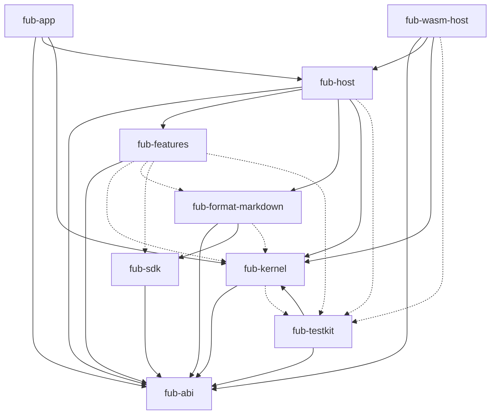
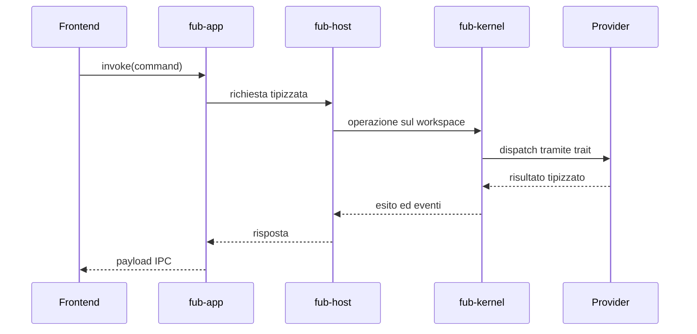

# Architettura di Fub

> **Domanda:** quali confini attraversa una richiesta e dove vive ogni
> responsabilità?
> **Fonti autorevoli:** `Cargo.toml`, `crates/*/Cargo.toml`, `apps/client/src/`.

## In breve

Fub separa:

1. shell e adattamento desktop;
2. composizione e sessioni;
3. kernel indipendente dal trasporto;
4. contratti condivisi;
5. provider di formato e feature;
6. runtime dei componenti di terzi.

Il core non dipende dal formato, dal toolkit desktop o dal motore WASM.

## Dipendenze del workspace Rust

Il diagramma seguente è la fotografia completa delle dipendenze dichiarate fra
i crate del workspace. Le frecce continue indicano dipendenze normali; quelle
tratteggiate esistono soltanto in `[dev-dependencies]`. Un test confronta il
blocco con `cargo metadata`, quindi un crate o un arco non può restare fuori
senza far fallire la CI.

Il frontend TypeScript non è un crate Cargo. Entra nel sistema attraverso
`fub-app`, che adatta Tauri e IPC. `fub-host` compone provider e sessioni;
`fub-wasm-host` dipende dall'host per montare bundle, ma l'host non dipende da
Wasmtime.

## Flusso di un comando

Un comando non dovrebbe generare una porta Tauri dedicata se può attraversare
il registro generico dei comandi.

## Proprietà stabili

### Dipendenze verso il contratto

`fub-abi` non importa Markdown, Tauri, Wasmtime o Tokio. I crate esterni
implementano o consumano i suoi tipi.

### Composition root fuori dal kernel

`fub-host` sceglie quali provider montare, possiede sessioni e collega servizi.
Il kernel non decide quali feature ufficiali esistono.

### Adattatori sottili

`fub-app` traduce Tauri e serializzazione. Non deve duplicare policy, regole di
path o logica di business.

### Shell dietro un seam

Il frontend importa l'host da `apps/client/src/host/`. Soltanto i moduli di IPC e
dialogo conoscono `@tauri-apps`; i test usano un fake host.

### Un trait, più backend

Un provider nativo implementa il trait direttamente. Un componente WASM viene
adattato da un proxy che implementa lo stesso trait. I registri del kernel non
conoscono il backend.

### Dati autorevoli e derivati

Il vault e alcuni sidecar conservano l'autorità. Indici e cache possono essere
rigenerati. La classificazione è esplicita nel riferimento su disco.

## Approfondimenti

- [Componenti e confini](components-and-boundaries.md)
- [Modello del documento](document-model.md)
- [Storage e identità](storage-and-identity.md)
- [Runtime, eventi e job](runtime-events-and-jobs.md)
- [Frontend e IPC](frontend-and-ipc.md)
- [Runtime dei plugin](plugin-runtime.md)
