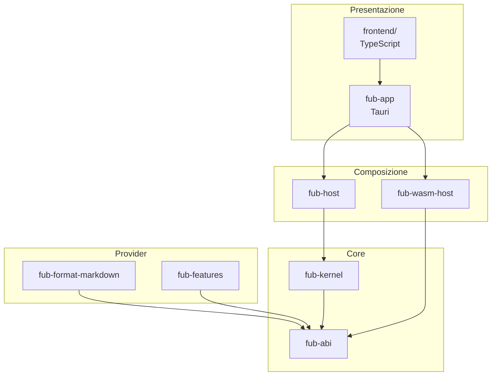

# Architettura

> **Stato:** implementato  
> **Fonte di verità:** workspace Rust, frontend e test di dipendenza

Fub separa contratto, stato, composizione, adattatori e presentazione. La dipendenza procede verso i contratti; i dettagli concreti non risalgono nel kernel.

## Vista d'insieme

## Regole essenziali

1. La shell disegna e gestisce interazioni locali.
2. `fub-app` traduce IPC e eventi Tauri.
3. `fub-host` possiede sessioni, bundle, watcher e job.
4. Il kernel mantiene stato e policy indipendenti dalla UI.
5. `fub-abi` definisce tipi e punti di estensione.
6. I provider contengono semantica di formato o funzionalità.
7. Il runtime WASM adatta componenti agli stessi contratti.

## Percorsi successivi

- [Componenti e dipendenze](components.md)
- [Flusso di una richiesta](request-flow.md)
- [Concorrenza](concurrency.md)
- [Modello del documento](document-model.md)
- [Storage](storage.md)
- [Confine dei plugin](plugin-boundary.md)
- [Runtime WASM](wasm-runtime.md)
- [Shell grafica](ui-shell.md)
