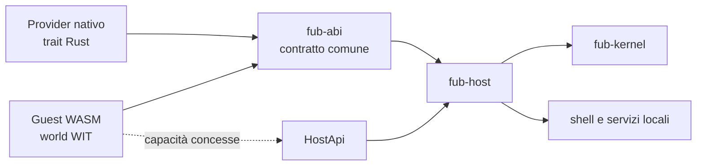
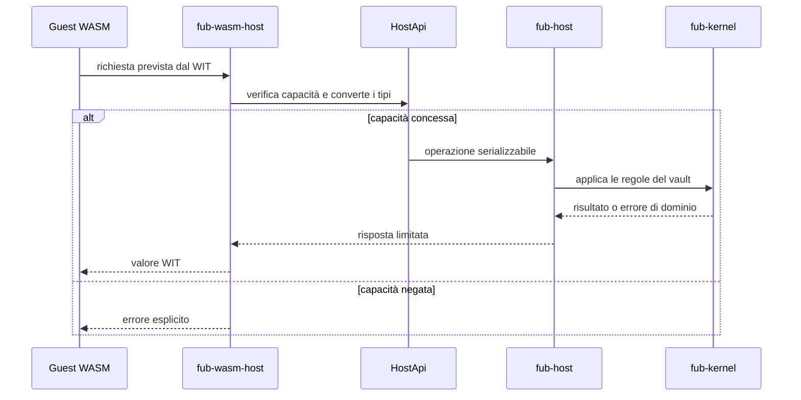

# Confine dei plugin

## Un solo contratto, due esecuzioni

Un provider può essere compilato nativamente con l'applicazione oppure eseguito come componente WASM. In entrambi i casi implementa il vocabolario di `fub-abi`; cambia soltanto il modo in cui il confine viene attraversato.

## Cosa esporta un provider

Secondo il tipo di provider, il contratto può esporre:

- parsing e serializzazione di un formato;
- query di indice;
- comandi;
- viste dichiarative e azioni delle viste;
- impostazioni e metadati di manifest;
- lavori con progresso e cancellazione.

## Cosa importa da Fub

Un guest non riceve accesso generale al processo. L'host importa soltanto le funzioni concesse dalle sue capacità: letture del vault, scritture, query, storage, log o altri servizi espliciti.

Il trait `HostApi` raccoglie **quarantadue** metodi [conta: hostapi-metodi]. Sono organizzati per famiglie di capacità; il numero è verificato sui sorgenti, mentre la responsabilità architetturale resta una sola: ogni accesso al mondo dell'host attraversa questo varco.

Negare una famiglia di capacità significa non esporre le relative funzioni al componente, non affidarsi a un controllo tardivo dentro una funzione già disponibile.

## Regole del confine

- niente accesso diretto al filesystem del vault;
- niente dipendenza da Tauri o dalla shell;
- niente tipi non serializzabili nel contratto;
- errori espliciti invece di panic attraverso il confine;
- limiti e cancellazione per operazioni costose;
- versione ABI dichiarata e verificata prima dell'uso.

## Cosa non deve diventare un guest

Il criterio non è “si può scrivere in un plugin?”, ma “questo confine resta stabile, serializzabile e controllabile?”.

Resta nella shell o nell'host ciò che richiede:

- accesso diretto a DOM, focus, IME, clipboard o ciclo di vita della finestra;
- latenza da interazione continua, come cursore, selezioni e composizione del testo;
- integrazione privilegiata con sistema operativo o filesystem;
- stato condiviso fra più viste che deve avere un solo proprietario;
- oggetti o callback che non possono attraversare IPC e WIT in modo esplicito.

Può stare nel guest ciò che può essere espresso come richiesta e risposta serializzabili, con costo limitabile, cancellazione definita e capacità minime dichiarate.

Per questo i futuri editor di celle, formule o rich text devono riusare motori della shell: il plugin sceglie e configura la superficie, ma non duplica CodeMirror, input Unicode, undo, tema o accessibilità.

## Stato attuale

Il WIT vivo e le baseline congelate sono presenti e sotto test. `fub-wasm-host` contiene il runtime, ma il flusso pubblico completo di installazione e distribuzione dei plugin non è ancora un'API stabile.

Per iniziare consulta [`guida/creare-un-plugin.md`](../guida/creare-un-plugin.md), [`06-contratto/03-il-contratto-wit.md`](../06-contratto/03-il-contratto-wit.md) e la milestone [`M5`](../milestones/M5-wasm-runtime.md).