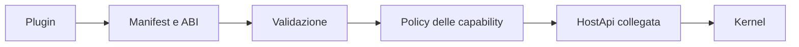

# Confine dei plugin

> **Stato:** implementato per provider nativi; parziale per componenti WASM  
> **Fonte di verità:** `fub-abi`, capability guard e `fub-wasm-host`

Il confine separa il contratto che un'estensione vede dalle implementazioni concrete dell'host.

## Modello di fiducia

## Regole

- il plugin dichiara identità, versione ABI e capacità richieste;
- l'host valida prima del mount;
- il kernel applica una sola policy delle capability;
- una famiglia negata non ottiene accesso indiretto attraverso un altro canale;
- i provider nativi e WASM devono produrre la stessa semantica osservabile;
- errori, limiti e fallback sono rappresentabili in Rust, WIT e TypeScript;
- una risorsa registrata appartiene al plugin e scompare al teardown.

## HostApi

`HostApi` espone famiglie limitate: lettura e scrittura del vault, query, eventi, servizi, rete e altre capacità dichiarate. Il contratto non trasferisce oggetti DOM, closure JavaScript o tipi Wasmtime.

## Dati grandi

Payload estesi devono essere paginati, richiesti per finestra o trasferiti in modo incrementale. Un'intera base dati o un workbook non deve attraversare il confine a ogni ridisegno.

## Sicurezza

Consulta [SECURITY.md](../../SECURITY.md) per il perimetro e [wasm-runtime.md](wasm-runtime.md) per la porzione realmente disponibile.
