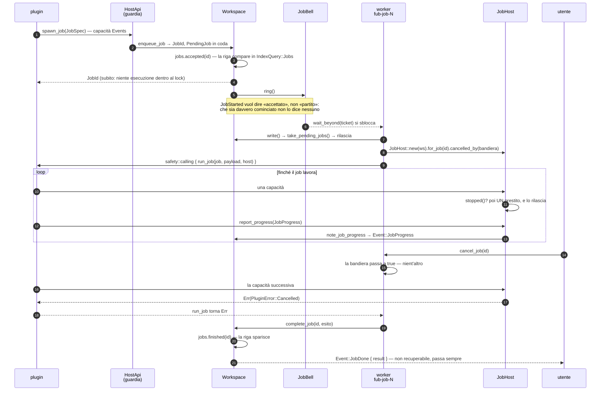
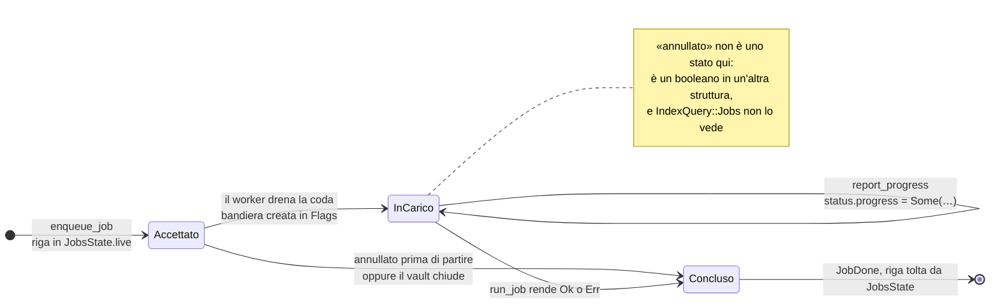
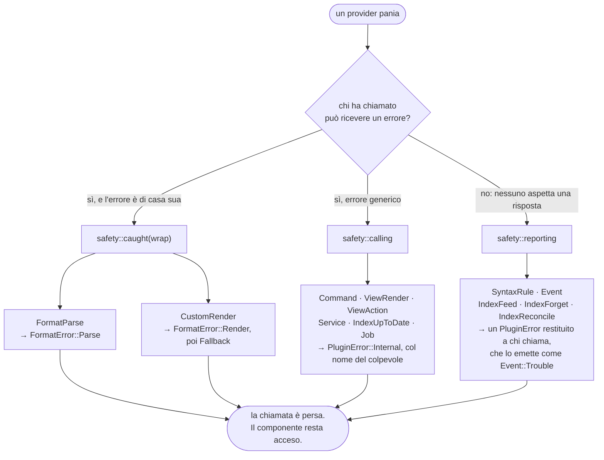
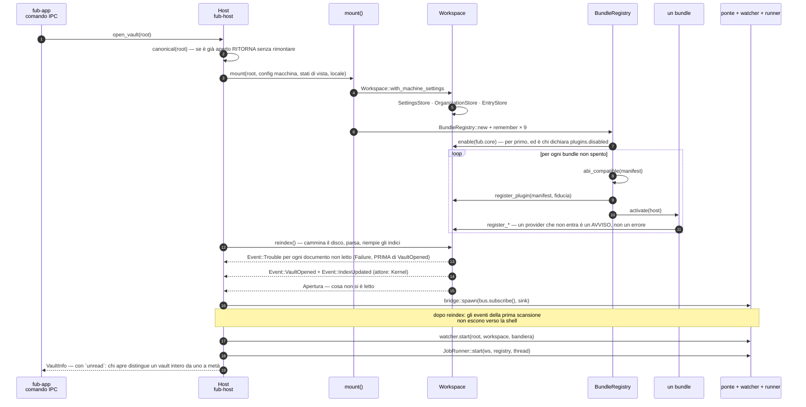
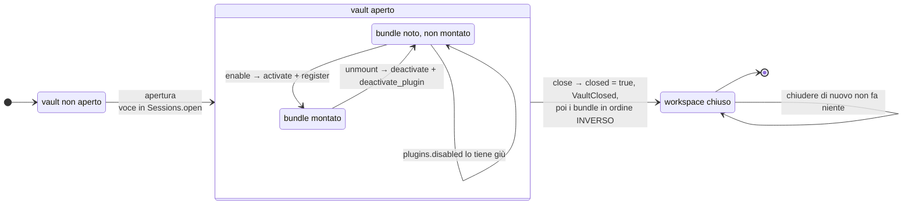

# Confine dei plugin: `Plugin`, `HostApi`, capability

Il **confine di fiducia** fra il core e un plugin — nativo (M4) o WASM (M5). Il
kernel vede `dyn Trait` e non distingue un backend dall'altro. La differenza sta
in due cose sole:

- *come* le chiamate attraversano il confine;
- *quali capacità* il core concede.

Torna a [../PIANO.md](../PIANO.md) · vedi [traits.md](traits.md).

## `HostApi`: l'unico varco

Un plugin non tocca mai il filesystem o il bus direttamente: passa da `HostApi`
(firma in [traits.md](traits.md)). Così c'è **un solo punto** in cui applicare i
permessi.

Dalla [decisione 0021](../decisions/0021-il-confine.md) l'`HostApi` è la **somma
di famiglie**: quattordici dal §11.2, e al confine WIT altrettante `interface`,
importate una per una dal `plugin-world`.

Il punto di applicazione esiste davvero, non è una promessa:

- il kernel tiene un [registro dei
  plugin](../../crates/fub-kernel/src/plugins.rs) con manifest, permessi e grado
  di fiducia;
- ogni host nasce dentro un `Guard<H, P: Policy>` che nega ciò che la politica
  del suo plugin non concede.

Prima `PluginPermissions` esisteva nel contratto e non lo leggeva nessuno.

Ne segue la regola di montaggio: **chi registra qualcosa si dichiara prima**
(`register_plugin`). Un id non dichiarato non è un plugin creato al volo: è un
errore, e un host intestato a un id sconosciuto nega tutto dicendo perché.

- **Nativo (M4):** `HostApi` è un oggetto in-process che chiama direttamente il
  `Workspace` (`KernelHost` in `fub-kernel/src/host/kernel.rs`, usato dal
  dispatch degli eventi). Costo ≈ zero.
- **WASM (M5):** il plugin riceve un *proxy*; ogni metodo è una **host function**
  wasmtime che serializza gli argomenti, attraversa il confine, esegue nel core e
  ritorna. La firma è identica: per questo la regola d'oro impone tipi
  serializzabili.

### Storage

Un plugin ricorda in un modo solo: `data_read/write/remove/list`, path → blob di
byte, persistente.

Lo spazio è `.fub/data/plugins/<id>/`, **dentro al vault**: i dati derivati da
un vault appartengono a quel vault, e copiarlo o metterlo in sync se li porta
dietro. L'identità `<id>` la assegna chi registra il plugin
(`Workspace::register_event_handler(id, handler)`), mai il plugin: uno che si
sceglie il proprio recinto non è dentro a un recinto. Verifica in
`crates/fub-kernel/tests/plugin_data.rs`.

`storage_get/set` — chiave → JSON, volatile — **è stato tolto** dal contratto con
la [decisione 0013](../decisions/0013-elenco-delle-capacita.md), ritagliando la
linea di base (`crates/fub-abi/wit/frozen/0.1.0.wit`). È la sola rottura di quel
giro, e i motivi sono due:

- con `data_*` da una parte e le impostazioni del §11.1 dall'altra, non gli
  restava un caso d'uso;
- «ricordare qualcosa per la durata della sessione» il chiamante lo aveva già
  risolto senza saperlo — un provider è un **oggetto vivo** nel workspace, e a M5
  un componente WASM ha la propria memoria lineare.

**Lo stato per-documento ha un posto dichiarato**
([decisione 0044](../decisions/0044-lo-stato-per-documento.md)):
`doc/<documento codificato>/<nome>`, con la convenzione e il suo inverso in
[`fub_abi::rules::doc_data`](../../crates/fub-abi/src/rules/doc_data.rs).

Non è una capacità in più. È `data_*` con un prefisso che il **kernel
riconosce**, e riconoscendolo fa due cose da sé:

- lo migra quando il documento viene rinominato;
- lo raccoglie quando la nota non è più né nel vault né nel cestino.

Chi ci mette qualcosa smette di doversi migrare la chiave da sé, cioè smette di
avere il buco che tutte le copie di quel rito avevano: chi ascolta
`DocumentRenamed` non sente ciò che è successo mentre non c'era.

Regola: **sotto `doc/` sta ciò che non ha senso senza il documento**. Ciò che
deve sopravvivergli — i tombstone del versioning — sta fuori.

**La configurazione è un'altra cosa** ([decisione 0036](../decisions/0036-le-impostazioni-e-i-tre-stati.md)):
`setting` / `set_setting` / `reset_setting`. Le chiavi le **dichiara un
manifest** (non se le inventa chi scrive), il valore lo decide l'utente (non il
plugin), il file è leggibile a mano, e ciò che il file contiene senza che nessuno
lo dichiari resta lì senza essere letto.

**I due cancelli della scrittura**, ed è la parte che riguarda il confine:

| Cancello | Risponde a | Default |
|---|---|---|
| il permesso `fub:write-settings` | *chi* può scrivere | — |
| `SettingSpec.program_writable` | *cosa* si può scrivere | `false`, per la stessa regola di `Trust::default` |

Il secondo esiste perché il divieto che conta — privacy e AI non si spostano da
sole — non dipende da chi chiede.

La persona davanti allo schermo passa da un'altra porta: la shell scrive sul
workspace. È la distinzione dell'origine
([0012](../decisions/0012-origine-degli-eventi.md)) applicata alla
configurazione.

**Cosa la configurazione NON è**: un posto per i segreti. Il file è JSON in
chiaro; una chiave d'API vuole un portachiavi di sistema, che sarà una capacità
sua.

**Perché blob e non un'API filesystem scoped.** Un filesystem scoped chiede al
plugin di comporre path e all'host di verificarli: il recinto diventa una
convenzione. Con i blob, invece:

- il plugin non ha mai in mano un path del filesystem;
- non sa dove sia la radice del vault;
- non può nominare niente che stia fuori — path assoluti, `..` e separatori di
  sistema sono `PermissionDenied`.

Il recinto è una proprietà della firma.

**L'unica eccezione, e sta fuori dal contratto.** Un provider **nativo** che
avvolge un motore con un proprio formato su disco non può passare da `data_*`:
tantivy mmappa i propri segmenti e li rilegge quando gli pare, anche dai thread
di merge.

Per questi c'è `Workspace::plugin_data_dir(id)`, che restituisce **la stessa
cartella** del recinto, ma come path del filesystem. È un metodo del workspace e
non una capacità dell'`HostApi`, deliberatamente: così un plugin WASM non ce
l'ha. A M5 l'equivalente per un componente è un preopen WASI sulla stessa radice.

**Perché esiste.** Lo ha chiesto il dogfooding del versioning, che è un
`EventHandler` come quelli di terzi e con l'`HostApi` precedente non avrebbe
potuto tenere il proprio store. Il buco è stato chiuso nel contratto prima del
freeze di M4, e `VersionStore` è la prova che la firma regge un caso reale.

### Operazioni strutturali e composizione ([decisione 0013](../decisions/0013-elenco-delle-capacita.md))

Sette capacità aggiunte prima del freeze, e la chiusura dell'elenco: la
superficie dell'`HostApi` è dichiarata **completa**, e ciò che non c'è è fuori per
una ragione scritta a verbale, capacità per capacità.

- **`create_document(id, source)`** — crea, e **rifiuta** un path occupato. È
  l'unica differenza con `write_document`, ed è tutta la ragione per cui sono
  due: un template che sbaglia la data e usa `write_document` cancella una nota
  vera, e nel codice non sembra una cancellazione. Chi vuole comunque un nome
  libero compone con `free_name`.
- **`rename_document(from, to)`** — quella del kernel: identità preservata **e
  wikilink entranti riscritti**. Non ce n'è una versione "nuda": due semantiche
  sotto lo stesso nome sarebbero una trappola. Ne segue che è un lotto
  ([0011](../decisions/0011-il-lotto.md)), e dentro un lotto aperto vi si
  unisce.
- **`trash_document(id) -> DocId`**, **`list_trash()`**,
  **`restore_document(entry, to)`**, **`empty_trash() -> u64`** — il giro del
  cestino. `trash_` e non `delete_` perché non distrugge: restituisce l'id con
  cui si ripristina, e l'unica capacità che distrugge si chiama `empty_trash`.
  `list_trash` sta accanto a `list_documents` e **non** in `IndexQuery`: il
  cestino non è indicizzato — una nota cestinata non ha modello, né tag, né archi.
- **`run_command(command, args) -> CommandOutcome`** — invoca un comando del
  registro ([0009](../decisions/0009-registro-dei-comandi.md)). Non prende un
  `InvokeMode` (il modo è dell'host: chi si sta simulando riceve il *piano*, e il
  piano di una macro è l'unione dei piani dei suoi passi), non prende un `Actor`
  (l'attore è chi è *entrato* nel kernel), non apre un lotto suo. Un comando non
  può invocare sé stesso nemmeno per giro: la catena è nota all'host e il rifiuto
  nomina il ciclo.
- **`undo_last() -> Option<Text>`** — annulla l'ultima operazione annullabile e
  dice quale era ([0045](../decisions/0045-l-undo-ha-due-pile.md)). È una
  capacità e non un comando del registro perché la pila è **privata del kernel**,
  e un `CommandProvider` riceve solo l'`HostApi`. Il comando che la invoca c'è lo
  stesso (`vault.undo`) ed è quello che compare nella palette. Al confine ha
  **due** controlli e non uno: annullare è invocare *ed* è, sempre, scrivere.

`run_command` è anche la ragione per cui i `CommandProvider` sono gli unici
provider **condivisi** (`Arc`) invece che estratti dal workspace per la durata
della chiamata: un comando che invoca deve trovare gli altri comandi, compresi
quelli del proprio provider.

**Dove sta il permesso.** `PluginPermissions` porta `fub:write-vault` e **non lo
legge nessuno**. Non è una dimenticanza:

- questo kernel non ha plugin, ha provider registrati per id;
- `Plugin::manifest()` non viene mai chiamata, perché non c'è niente che
  installi, abiliti o verifichi;
- applicare `write_vault` oggi vorrebbe dire inventare il registro che tiene i
  manifest, cioè il §7.3 e M5.

Il varco però esiste già
([0010](../decisions/0010-comando-descritto-a-una-macchina.md)). Un comando in
**sola lettura** o **simulato** riceve un host che nega, con un errore che dice
perché. E nega più delle strutturali: le famiglie che `ReadOnly` rifiuta sono
**sette** — `VaultWrite`, `VaultStructure`, `DataWrite`, `SettingsWrite`,
`ViewStateWrite`, `Events`, `Services` — cioè anche la configurazione, lo stato
di vista, i propri blob, i job e i servizi di terzi, che strutturali non sono in
nessun senso.

Il presidio è `every_structural_capability_is_refused_by_the_same_gate`, in
`crates/fub-kernel/tests/invoke_command.rs`. Dalla
[0056](../decisions/0056-un-elenco-che-e-la-sorgente.md) l'insieme atteso lo
**calcola** da `Capability::ALL` invece di elencarlo: così una famiglia negata
che nessuno prova diventa rossa.

*(Questa riga diceva «tutte e sei le strutturali». Il numero era sbagliato — i
metodi di `VaultStructure` sono cinque [conta: capacita-strutturali] — e la
portata lo era di più, perché nominava una famiglia sola su sette.)*

Il giorno che `write_vault` diventerà vincolante non dovrà costruire il rifiuto:
dovrà aggiungere una seconda ragione per negare.

### Interrogazione, contesto, struttura

Quattro capacità aggiunte prima del freeze; la semantica di ognuna sta in
[traits.md](traits.md), `HostApi`. Qui conta il lato confine:

- **`query_index`** — la view interroga il vault da sé invece di ricevere dati
  già pronti. Stessa porta e stesso dispatch di `Workspace::query_index`: chi
  serve cosa è **dichiarato alla registrazione**
  ([0019](../decisions/0019-il-canale-dati.md)), e le risposte di cui il kernel è
  l'unica fonte di verità le serve `CoreIndex`, un `IndexProvider` registrato per
  primo e non un ramo privilegiato. È il **canale metadata**: senza, una view non
  potrebbe leggere né la struttura parsata né il frontmatter, perché non ha un
  `FormatProvider`. Ed è il canale di ciò che il kernel tiene **in cache**, quindi
  una view lo usa a ogni ridisegno senza toccare il disco.
- **`active_context`** — la view lo **chiede**; a scriverlo è **solo** la shell,
  con `set_active_context`. Non c'è un gemello che scrive nell'`HostApi`: «quale
  nota guardo e dove ho cliccato» è una decisione dell'utente sull'app, non una
  capacità da concedere a un plugin. Non è un `DocId` nudo perché con schede,
  split e finestre multiple (FEATURES 4.1) «il documento attivo» smette di essere
  una variabile globale: il `PaneId` dentro il contesto distingue due pannelli
  backlink affiancati, che altrimenti farebbero la stessa domanda e riceverebbero
  la stessa risposta, sbagliata per uno dei due.
- **`read_model`** e **`format_of`**
  ([0018](../decisions/0018-chi-vede-il-modello-parsato.md)) stanno accanto a
  `read_document` e non dentro `query_index`, perché sono una **lettura del
  vault** e non qualcosa di derivato. Il recinto: `read_model` lo applica come
  `read_document` (stesso `valid_doc_id`, stesso `PermissionDenied` a una
  risalita); `format_of` no, perché non legge niente.

### La regola dello span

Una selezione porta sempre il **testo**. Porta le **coordinate** solo a buffer
pulito, cioè quando valgono anche per il sorgente che il kernel ha in mano.

Non è prudenza: senza questa regola il contratto inviterebbe a un errore preciso
— leggere il documento con `read_document`, ritagliarlo con offset calcolati su
un altro testo, e tagliare i byte sbagliati **proprio mentre l'utente scrive**.

Quella scelta sta **sopra l'insieme** e non dentro le singole selezioni, e lo
dice la [0093](../decisions/0093-le-selezioni-sono-n-e-il-buffer-e-uno.md):

- `SelectionSet` è `Anchored` o `Floating`, perché a decidere è lo stato del
  **buffer**, che è uno per pannello;
- con più cursori le selezioni sono N, e non possono cadere una alla volta;
- nel caso ancorato lo `span` non è facoltativo. Un insieme metà posizionato e
  metà no non è rappresentabile, ed è il punto: un provider che agisse solo
  sulle posizionate agirebbe su due dei tre punti che l'utente vede.

Dall'altro lato la stessa invariante la tiene il kernel. Quando il sorgente sotto
la selezione cambia, viene rinominato o sparisce, la selezione **cade**
(`Session::invalidate`, in `kernel/src/session.rs`). Uno span stantio è peggio di
uno span assente; la shell ne ripubblica uno vero al salvataggio successivo.

### Chi si ridisegna, e quando

`ViewSpec` dichiara due maschere:

| Maschera | Guarda | Esempi |
|---|---|---|
| `refresh: EventMask` | gli eventi del **vault** | una nota scritta, un indice aggiornato |
| `follows: ContextMask` | il contesto di **sessione** | documento, selezione, modalità |

Il contesto non passa dall'event bus, ed è deliberato: un cursore che si muove
non è un fatto del vault, e passare di là vorrebbe dire consegnare ogni battuta
di tasto a ogni handler registrato.

`Workspace::set_active_context` restituisce **gli id delle view da ridisegnare**,
cioè quelle la cui `follows` interseca ciò che è cambiato. Il conto sta nel
kernel e non nella shell perché la risposta non deve dipendere da chi la calcola:
a M5 un host diverso avrà la stessa regola. La shell decide il *quando* e ignora
il *chi*.

Il giro completo di una view passa tutto dal contratto:

1. la shell pubblica il contesto;
2. chiama `render_view` sulle view che il kernel le indica;
3. il provider chiede contesto e dati all'host;
4. un click torna come `on_action`, il provider risponde con un `ViewUpdate`, e
   la shell lo esegue.

Prove end-to-end: `crates/fub-features/tests/backlinks_view_e2e.rs` (il giro
base), `outline_view_e2e.rs` (il cursore che arriva alla view) e
`stats_view_e2e.rs` (il testo selezionato che vale anche a buffer sporco).

## Il lotto e l'origine

Un `EventHandler` non riceve un `Event` nudo ma un
**`Notice { event, origin }`**. `Origin { actor, batch }` risponde alle due domande che il confine non sapeva
porre: chi ha chiesto, e di quale lotto fa parte.

**Chi ha chiesto** — `Actor { User, Watcher, Kernel, Plugin { id } }`. È *chi ha
chiesto*, non chi ha eseguito: un comando invocato da un'automazione scrive con
l'origine dell'automazione.

Il problema che risolve è concreto. Un'automazione su-modifica **che scrive** si
richiama da sola, e prima di questo campo l'unica difesa era il budget del
dispatch, che tronca — cioè una rete di sicurezza al posto di una semantica. La
difesa vera è una riga:

```rust
fn handle(&mut self, notice: &Notice, host: &mut dyn HostApi) -> Result<(), PluginError> {
    if notice.origin.actor.is_plugin(MIO_ID) {
        return Ok(()); // questa l'ho scritta io
    }
    // …
}
```

Riconoscerle dal **contenuto** non è equivalente. Funziona finché la scrittura
cambia il proprio innesco, e smette di funzionare proprio nel caso normale di
un'automazione che appende — un diario, un log, un sommario — dove ogni scrittura
è diversa dalla precedente.

**Di quale lotto fa parte** — `batch: Option<BatchId>`
([decisione 0011](../decisions/0011-il-lotto.md)). Un lotto è uno scope del
kernel dentro cui N scritture sono *una* cosa; il caso vero è una rinomina con
200 backlink. Cosa succede dentro un lotto — `IndexUpdated` coalizzato in un
`BatchEnded`, dispatch rimandato alla chiusura, e la regola *chi dichiara
`IndexUpdated` dichiara anche `BatchEnded`* — sta in [traits.md](traits.md),
`EventHandler`.

Al **confine** riguardano due proprietà.

**Un plugin non apre un lotto.** Uno scope a chiusura garantita non attraversa il
confine dei componenti, e un lotto lasciato aperto da un'istanza morta terrebbe
sospesi gli eventi del vault per sempre. Il lotto di un plugin è la sua
**invocazione di comando**, che l'host apre e chiude per lui.

**Un lotto non è una transazione.** Se una scrittura fallisce, le altre restano
fatte, e chi lo ha aperto lo scopre dal proprio valore di ritorno. Il
tutto-o-niente vuole il journal del §15.2, e lì la situazione è questa:

- il posto **c'è**, dalla
  [0067](../decisions/0067-il-registro-di-cio-che-e-successo.md): di ogni
  operazione tiene i confini, l'origine e il tempo. A mancare è chi lo
  ripercorre;
- l'informazione non basta per tutto, e lo dichiara. Dalla
  [0103](../decisions/0103-un-registro-dice-cosa-e-successo.md) una modifica
  chirurgica ci lascia l'**impronta** — dove ha toccato e quanti byte — e non il
  testo sostituito;
- quindi un rollback costruito su questo file rimetterà i nomi al loro posto e
  ripescherà dal cestino, e **non** disferà gli edit. Era già così per i
  salvataggi, che un inverso non l'hanno mai avuto: adesso è così in modo
  uniforme, e `JournalOp::is_invertible` lo risponde invece di lasciarlo scoprire
  applicando.

Per questo qui non compaiono i nomi `transaction` e `rollback`: chi legge solo la
firma ci crederebbe.

Prove: `crates/fub-kernel/tests/batch_and_origin.rs` (incluso il confronto fra
un'automazione che si difende con l'origine e la stessa che non lo fa),
`crates/fub-features/tests/{commands_e2e,view_refresh_masks}.rs`.

## Scrivere un pezzo: l'edit porta la revisione

Un plugin ha due modi di cambiare un documento, e la differenza sta nella firma:

| | `write_document(id, source, base)` | `apply_edit(id, request)` |
|---|---|---|
| Cosa manda | il documento **intero** | una lista di `(span, testo)` |
| Su cosa si applica | sul sorgente che `base` nomina, o su qualunque cosa ci sia adesso se `base` è `None` | sul sorgente che `request.base` nomina |
| Chi ha scritto nel frattempo | fa fallire la richiesta (`Conflict`) se `base` c'è; con `base: None` viene sovrascritto **in silenzio**, e apposta | fa fallire la richiesta (`Conflict`), niente scritto |
| La base è obbligatoria? | **no**: un importer, un template, un ripristino non correggono un testo che hanno letto — lo **dettano**, e una base inventata è una guardia che dice sempre di sì ([0089](../decisions/0089-da-cosa-e-partita-una-scrittura.md)) | **sì**: un edit senza la revisione su cui è calcolato non è una modifica, è un'ipotesi |
| Chi lo usa | chi il testo intero ce l'ha in mano: l'editor che salva, un importer che crea | tutti gli altri |

`EditRequest { base: Revision, edits: Vec<TextEdit> }`. La base **non è
opzionale**: un edit è una coppia di offset calcolata su *un* testo, e senza dire
quale, due modifiche concorrenti — un'automazione e l'utente che scrive — si
cancellano a vicenda senza che nessuna delle due lo sappia.

La `Revision` è **opaca**: solo l'uguaglianza è contratto. Non è un numero
d'ordine, e come l'host la derivi — impronta del contenuto, digest, `mtime+size`
— non è promesso a nessuno: la si chiede con `document_revision`. Questo host usa
l'impronta del contenuto, e la scelta si vede in un caso vero. Chi scrive un
carattere e lo cancella riporta il documento al testo di prima, e un edit
calcolato allora è ancora valido; un contatore direbbe di no.

Gli span della richiesta sono in byte del sorgente della base, mai del testo in
corso di produzione: chi calcola gli edit li elenca e basta, l'host li ordina e
li applica in un colpo solo. Ciò che non sta in piedi — fuori dal sorgente, a
metà di un carattere, sovrapposti, due nello stesso punto — è `BadArgs`, e non
lascia mai un documento modificato a metà.

Il rapporto è `EditReport { revision, applied }`. Torna nelle coordinate del
testo **nuovo** e porta ciò che è stato sostituito, e con quei due pezzi si fanno
due cose:

- si mette il cursore dove l'utente se lo aspetta (16.1);
- si costruisce l'edit **inverso** (`EditReport::inverse`).

Di chi sia la proprietà dell'undo l'ha deciso la
[0045](../decisions/0045-l-undo-ha-due-pile.md): le pile sono **due** e non si
fondono — il testo nell'editor, le operazioni nel kernel. Questa è la forma con
cui la seconda esprime i propri passi testuali (`UndoStep::Edit`); l'inverso di
un cambiamento **strutturale** ha avuto bisogno di una forma nuova, un comando e
non un vocabolario.

Il primo cliente è il kernel stesso. La riscrittura dei wikilink su rename
(`Workspace::rename_document`) applica un `EditRequest` per sorgente invece di
riscrivere N file interi, quindi una nota che qualcun altro ha toccato fra il
calcolo del piano e la sua applicazione non viene più sovrascritta.

## Invocare un comando: cosa l'host fa rispettare

Il registro dei comandi ([decisione 0009](../decisions/0009-registro-dei-comandi.md))
è il posto in cui un'azione si dichiara **una volta** e la chiedono tutti: la
palette, la tastiera, una macro (16.2), la CLI (27.1), l'API locale (27.2), il
centro di comando LLM (22.4). Da qui in poi una feature nuova non aggiunge un
comando Tauri: aggiunge una riga a un `CommandProvider`.

Qui interessa cosa il confine **garantisce** a chi invoca senza aver letto il
codice del comando:

| Chi invoca dichiara | Chi implementa dichiara | Cosa gli presta l'host |
|---|---|---|
| `InvokeMode::Apply` | `scope.writes: true` | `KernelHost`: scrive |
| `InvokeMode::Apply` | `scope.writes: false` | host in **sola lettura**: ogni scrittura è `PermissionDenied` |
| `InvokeMode::DryRun` | qualunque cosa | host in **sola lettura** |

La tabella esiste per due conseguenze.

- **La simulazione è un modo di invocare, non una cortesia di chi implementa.**
  Un dry-run che dipendesse dalla buona volontà del comando sarebbe una
  convenzione — cioè qualcosa che un comando di terzi non onora, proprio nel
  momento in cui il chiamante si fida di lui.
- **Dichiararsi innocuo è vincolante.** `writes: false` non è una decorazione da
  mostrare nella palette: chi lo dichiara riceve un host che rifiuta.

Gli **argomenti** sono l'altra metà. L'host li convalida contro la `CommandSpec`
prima di chiamare (`validate_args`), quindi un comando non si difende da solo e
chi sbaglia riceve un `BadArgs` che dice *cosa* manca. Un argomento non
dichiarato è un errore, non un argomento ignorato.

**Chi invoca dice anche chi è**, e l'host apre un lotto:
`invoke_command(command, args, mode, by: Actor)`. `vault.replace` su 40 note
emette un `batch-ended` solo, e ogni evento che ne nasce porta `by` come attore.
Il parametro non ha un default, per la stessa ragione per cui non ce l'ha
`InvokeMode`. Sul confine Tauri l'attore è fissato a `User` invece di essere un
parametro dell'IPC: da lì passa la webview, e un chiamante che potesse firmarsi
come vuole avrebbe aggirato quella difesa dall'altra parte.

`by` **non** arriva fino a `CommandProvider::invoke`: l'origine è ciò che l'host
appone. Un comando che si comportasse diversamente a seconda di chi lo chiama
sarebbe una policy nascosta in un'implementazione, e le policy hanno un posto
(§7.3). Il giorno che servirà **leggerla**, è un metodo additivo sull'`HostApi`.

### Il consenso non è una capacità

Sono due domande diverse:

- `PluginPermissions` (§7.3) risponde a «questo componente *può*, in generale?»;
- 22.4 chiede «l'utente approva **questa** esecuzione, su **queste** 40 note?».

La risposta di Fub alla seconda è il giro **dry-run → piano → approvazione →
apply**, e non una capacità `HostApi::confirm`. Due ragioni:

1. **Un host non può fermarsi a chiedere.** Il kernel è chiamato *dalla* shell e
   ne tiene il lock: una conferma sincrona dovrebbe risalire nella webview che
   sta aspettando la risposta. Una capacità che questo host non può implementare
   sarebbe una firma che ogni host dovrà onorare e nessuno onora.
2. **Il piano si legge, la domanda no.** Una conferma nel mezzo mostra ciò che il
   comando *sceglie* di dire; un `CommandPlan` mostra i documenti impattati e gli
   edit proposti, e li mostra prima. È la differenza fra «sei sicuro?» e il diff.

*Quando* chiedere lo decide chi invoca, a partire dal `CommandScope` dichiarato:
la shell mostra il piano quando un comando scrive su più di una nota o si
dichiara non reversibile (`needsPlan` in `frontend/src/ui/palette.ts`). Una CLI in uno
script può avere un'altra politica sullo stesso dato, ed è per questo che il
raggio sta nella spec e la politica no.

Resta fuori, dichiarato: l'**attribuzione** — chi ha chiesto l'operazione:
utente, comando, modello, prompt — è l'origine degli eventi
([0012](../decisions/0012-origine-degli-eventi.md)) applicata al lotto
([0011](../decisions/0011-il-lotto.md)).

## Import ed export: il confine è di byte, non di path

Il capitolo 17 di FEATURES (~120 voci) è, in ogni altra applicazione, quello che
tocca il filesystem più di tutti. Qui **nessuna delle due firme nomina un
percorso**:

- `ImportProvider::import(source, request, host)` riceve
  `ImportSource { name, media_type, content }`. Il `name` è quello che l'utente
  conosce (`vault.zip`), non un path: viene da fuori, e `ImportSource::stem()`
  lo riduce a un componente solo perché `../../.ssh/config.md` non diventi una
  scrittura fuori dal vault.
- `ExportProvider::export(request, host, out)` versa in un `ArtifactSink` e
  restituisce `ExportArtifact { path, media_type, content }`, dove `path` è il
  posto **dentro l'esito** (un albero relativo), non sul disco.

Il `content` è la sola cosa cambiata dalla
[0102](../decisions/0102-i-byte-non-stanno-nel-record.md). I byte possono stare
in due posti:

- nel record — `SourceContent::Bytes`, il caso comune;
- dall'host, dietro una chiave che solo lui risolve, posizionale perché la
  directory di un archivio sta in fondo:
  `read_source(handle, offset, len)`.

Un handle non si costruisce, si riceve, e nomina la sorgente che l'utente ha
appena scelto. È la stessa forma di questo capitolo — chi apre e chi legge resta
l'host — applicata al *contenuto* invece che al *percorso*.

Chi apre il dialogo di sistema e chi posa i byte è **l'host**, che è già l'unico
a sapere dove sia il vault. Ne seguono due cose: import ed export non chiedono
nessuna capacità nuova oltre a `free_name`, e a M5 la sandbox **non deve
concedere niente** — la riga «Filesystem: nessun accesso diretto» resta vera
senza eccezioni.

La [0006](../decisions/0006-import-export-come-trait.md) dichiarava un prezzo:
*sorgente e artefatti stanno in memoria*. Era scusato da una condizione
**scaduta** — valeva «finché un job non vede il vault», e dalla
[0027](../decisions/0027-il-lavoro-lungo-vede-il-vault.md) il lavoro lungo il
vault lo vede. La 0102 l'ha pagato senza toccare questa pagina nella sostanza:
restare in memoria è ancora il caso comune, ma adesso è una scelta **dichiarata**
invece dell'unica strada. Un `path: string` sarebbe stato invece una porta aperta
da richiudere con una major, e infatti non c'è.

**Il recinto, dove sta.** `KernelHost::read_document`/`write_document` validano
il `DocId` con la stessa regola dei comandi IPC (`valid_doc_id`) e rispondono
`PermissionDenied` a una risalita. Il controllo sta sul confine delle capacità e
non dentro i provider: `ImportSource::stem()` serve a non finirci contro per
distrazione, il recinto serve perché non ci si possa andare apposta
(`fub-kernel/tests/transfer_dispatch.rs`).

## Lavoro lungo: i job

In tre righe: **un plugin chiede, qualcun altro esegue fuori dal lock, l'esito
torna come evento**. Sotto: i tre passi, cosa se ne guadagna, cosa manca, e come
si annulla.

Il motivo: i trait sono sincroni e il `Workspace` vive dietro un lock, quindi
**qualunque cosa lenta dentro una chiamata sincrona blocca l'app**, e a M5 la
deadline la tronca. Il contratto dà allora al lavoro lungo — rete, calcolo
pesante — una strada propria, i **job**:

1. **Richiesta (sincrona, istantanea).** Il plugin chiama
   `HostApi::spawn_job(JobSpec { job, payload })` e riceve subito un `JobId`. Il
   kernel accoda soltanto: niente esecuzione dentro al lock
   (`Workspace::take_pending_jobs`).
2. **Esecuzione (fuori dal kernel).** Chi possiede i thread — il `JobRunner` di
   `fub-host` ([0032](../decisions/0032-il-runner-dei-job.md)), l'host WASM a
   M5 — drena la coda ed esegue `Plugin::run_job(job, payload, host)` **senza
   tenere in mano nessun prestito del workspace**. Il job ha le stesse capacità
   che il plugin ha altrove ([0027](../decisions/0027-il-lavoro-lungo-vede-il-vault.md)),
   con davanti la politica dei suoi permessi, e le usa **una chiamata alla
   volta**. Il `payload` porta gli **argomenti**, non l'input. La coda dice **a
   quale plugin** chiedere il corpo (`PendingJob.plugin`), e a saperglielo dare è
   `BundleRegistry::plugin` ([0031](../decisions/0031-chi-possiede-i-bundle.md)).
3. **Rientro (sincrono).** L'esito torna con `Workspace::complete_job` →
   `Event::JobDone { id, job, result }` sul giro sincrono normale.

E in mezzo il job **si racconta**
([0035](../decisions/0035-il-lavoro-lungo-si-racconta.md)): il ciclo
`JobStarted` → `JobProgress` → `JobDone` e la porta `report_progress`, che non
nomina il job perché `run_job` non riceve la propria identità, sono in
[traits.md](traits.md), `HostApi`.

Cosa se ne guadagna:

- il giro sincrono resta **breve per definizione**, quindi la deadline di M5 può
  essere severa senza uccidere i plugin legittimi;
- un job lento o ostile non congela nulla: al peggio il suo `JobDone` porta un
  errore (timeout dell'host);
- il permesso `network` si applica **al job**;
- **al confine WIT non si vede**: le capacità sono import del world, non un
  parametro di `run-job`, quindi «dentro un job non c'è `host-api`» era una
  regola solo Rust.

Cosa un job **non** dà:

- **niente snapshot.** Fra due chiamate il vault può cambiare, e chi lo cammina
  vedrà qualcosa che non è mai stato vero tutto insieme. La guardia è quella di
  tutti — `apply_edit` con la sua `base` e `Conflict`
  ([0008](../decisions/0008-modifica-chirurgica.md)), `create_document` che
  rifiuta un path occupato — e un job non è né una transazione né un lotto;
- il **progresso** c'è, lo **streaming** no. Un job consegna un esito solo, e chi
  vuole mandare risultati parziali oggi lo fa con un `Event::Custom` suo. Se
  servirà davvero (AI, indicizzazioni lunghe) sarà un canale in più *prima* del
  freeze — vedi [../appendix/ai-autocomplete.md](../appendix/ai-autocomplete.md).

**Si può annullare, e la cancellazione è cooperativa.** `Host::cancel_job` alza
una bandiera; da quel momento l'host del job **rifiuta** ogni capacità fallibile
con `PluginError::Cancelled`. Attorno a questo:

- le sei infallibili non hanno dove metterlo, un rifiuto;
- `emit` e `report_progress` restano aperte di proposito: l'ultima cosa che un
  job che smette può voler dire è che sta smettendo, e a che punto era;
- nel contratto non compare nessuna capacità nuova, quindi un job scritto prima
  che la cancellazione esistesse si ferma comunque, alla prima cosa che prova a
  fare;
- limite dichiarato: **un job che non chiama mai l'host arriva in fondo**, perché
  in Rust un thread non si uccide. La risposta vera è la deadline di M5;
- chiudere il vault annulla tutto, ferma il pool e aspetta chi ha già cominciato:
  nessun job sparisce senza il suo `JobDone`.

### Il giro completo, con un annullamento in mezzo



Il punto che il disegno rende visibile meglio della prosa: **annullare non
interrompe niente**. Alza un booleano, e a fermarsi è il job, alla prima cosa che
prova a fare. Fra la bandiera alzata e l'`Err(Cancelled)` c'è tutto il tempo che
il job impiega ad arrivare alla capacità successiva — e se non ci arriva mai,
arriva in fondo.

| Pezzo | Dove | Cosa tiene |
|---|---|---|
| la coda | [dispatcher.rs:566](../../crates/fub-kernel/src/dispatcher.rs) | `PendingJob`, con l'id assegnato dal kernel |
| il campanello | [dispatcher.rs:589](../../crates/fub-kernel/src/dispatcher.rs) | un conto cumulativo, non un booleano: chi si sveglia sa se ha perso un giro |
| i thread | [runner.rs:72](../../crates/fub-host/src/runner.rs) | **due** di default, un pool **per vault**, non uno globale |
| l'host per chiamata | [jobs.rs:94](../../crates/fub-host/src/jobs.rs) | tiene la `Custodia<Workspace>` e prende un prestito **per capacità** |
| la bandiera | [runner.rs:89](../../crates/fub-host/src/runner.rs) | `HashMap<JobId, Arc<AtomicBool>>`, più `seen`: il confine fra «deve ancora arrivare» e «è già finito» |
| la riga viva | [core.rs:499](../../crates/fub-kernel/src/index/core.rs) | `JobsState`, ciò che `IndexQuery::Jobs` restituisce |

**`JobStatus` è una struct, non un enum**
([traits.rs:114](../../crates/fub-abi/src/traits.rs)): cinque campi — `id`,
`job`, `plugin`, `since`, `progress` — e nessuno è uno stato. Lo stato di un job
è **implicito** e vive in due strutture che non si parlano:

- la riga in `JobsState` (kernel) dice che è vivo;
- la bandiera in `Flags` (host) dice che è stato annullato.

Perciò un job annullato resta indistinguibile da uno che lavora finché non arriva
il suo `JobDone`. È una conseguenza del taglio, non una svista.



Nessuno di questi nomi esiste come variante di un enum: sono i **portatori**
dello stato, e il diagramma li nomina per non far credere che ci sia un `JobState` da
cercare. Quel che manca davvero, ed è dichiarato:

- non c'è transizione osservabile «in coda → in esecuzione»;
- non c'è timeout né deadline (a M5 la porta l'host WASM);
- niente di tutto questo è persistente: un riavvio perde ogni job in volo, e
  nessun evento lo dice.

## Onestà sul modello di minaccia: nativo = fidato

Tre affermazioni, in ordine: **un plugin nativo è codice fidato**, il confine di
fiducia vero arriva **a M5**, e l'unica cosa che si compra oggi è l'isolamento
dagli *incidenti*.

L'enforcement in `HostApi` confina davvero **solo chi non può aggirarlo**, e un
plugin nativo è codice Rust in-process: può fare qualunque cosa, permessi o no.
Quindi, esplicitamente:

- **«plugin nativo» significa codice fidato** — feature ufficiali e plugin
  compilati dentro l'app. Il loro manifest è *descrittivo* (dogfooding del
  percorso di attivazione, UI di consenso), non una barriera di sicurezza;
- il **confine di fiducia reale esiste solo a M5**, con la sandbox WASM;
- lo scopo del primo plugin nativo (M4) è esercitare *il percorso* (manifest →
  consenso → `HostApi` con permessi → attivazione), così M5 cambia il backend,
  non inventa il confine.

**Un panico al confine costa la chiamata, non il vault.** Ogni porta da cui si
entra in codice di un provider gira dentro una rete
(`fub-kernel/src/safety.rs`) che cattura il panico e lo traduce nell'errore di
casa, nominando il colpevole.

La rete sta **attorno alla chiamata del provider e a niente di più**: dentro
quella chiamata il kernel ha invarianti da rimettere a posto, e quel codice gira
già sul ramo dell'errore. Senza la rete, un provider che pania sotto il prestito
esclusivo avvelenava il `RwLock` del workspace e rendeva il vault irraggiungibile
fino al riavvio.

Le porte **sono un dato, non una frase**: le enumera `safety::Gate`, e sono
**tredici** [conta: porte-verso-un-terzo] —

- un comando, una view che disegna, una view che agisce, un servizio;
- la consegna a un `EventHandler`;
- le quattro degli indici: alimentare, dimenticare, `up_to_date`, riconciliare;
- il `parse` di un `FormatProvider`, l'innesto di una `SyntaxRule`, il disegno di
  un `CustomRenderer`;
- un job sul pool.

Erano **otto** finché l'elenco stava in prosa, e il conto era sbagliato: la 0032
lo aveva dichiarato esaustivo a memoria, `up_to_date` è nata dopo
([0046](../decisions/0046-l-anagrafe-del-vault.md)) senza toccarlo, e altre erano
sfuggite al censimento del suo tempo. Adesso i `match` senza `_` sono due
([0105](../decisions/0105-una-porta-si-nomina-e-un-presupposto-si-compila.md)):

- `Gate::what` — chi apre una porta nuova **non compila** finché non le dà una
  frase;
- uno in `il_panico.rs` — non compila finché non si dichiara dove quella porta è
  provata, o perché non lo è.

La frase che l'utente legge è della porta, il soggetto («quale comando», «quale
view») è del sito che chiama, e un presidio verifica che nessuna porta accetti un
dettaglio per poi buttarlo via.

La rete **presuppone che un panico srotoli**, e il presupposto lo verifica il
compilatore: un `#[cfg(panic = "abort")] compile_error!` in `fub-kernel` rifiuta
quel profilo. Perché così e non altrimenti:

- **non è un test**, perché un test non lo vedrebbe. Cargo ignora `panic` per i
  profili `test` e `bench`, quindi un `[profile.release] panic = "abort"` non
  arriva nemmeno a `cargo test --release`, e il banco resterebbe **verde**
  attestando una rete che nel binario spedito non c'è più;
- **non è una lettura del `Cargo.toml`**, che non vedrebbe
  `RUSTFLAGS=-Cpanic=abort`;
- **non è un divieto per sempre**: vale finché la risposta a un componente che
  pania è *catturarlo*. Il giorno che quel profilo lo si vuole davvero, la
  risposta è isolare i componenti fuori dal processo (§24.2, o il guest WASM di
  M5), e sta scritto nel messaggio dell'errore.

La rete ha **tre maglie**, e quale si usa dipende da una domanda sola: chi ha
chiamato ha un modo di ricevere un no?



| Maglia | Dove | Cosa produce |
|---|---|---|
| `calling` | [safety.rs:220](../../crates/fub-kernel/src/safety.rs) | `PluginError::Internal("«X» è andato in panico …")` |
| `caught` | [safety.rs:238](../../crates/fub-kernel/src/safety.rs) | l'errore di casa del chiamante, passato come funzione |
| `reporting` | [safety.rs:273](../../crates/fub-kernel/src/safety.rs) | il `PluginError` **restituito** a chi chiama, perché non c'è nessuno a cui dire di no |

Nessuna delle tre disattiva niente, ed è ciò che dice il riquadro finale del
disegno. Il meccanismo per smontare esiste (`BundleRegistry::unmount`), e dal
§11.1 esiste anche il modo di **riaccendere** (`BundleRegistry::enable`, con lo
stato in `plugins.disabled`) — ma **nulla collega un panico a quel meccanismo**:
non c'è un contatore di panici, non c'è una soglia, non c'è nessun tipo che
rappresenti una quarantena. Il «safe mode» è una voce di roadmap (§20.2), non un
pezzo di codice.

Quindi ciò che manca **non è più il canale**: dirlo si può (`Event::Trouble`,
[0052](../decisions/0052-cio-che-va-storto-e-un-evento.md)) e riaccendere anche
(§11.1). Manca la **politica**, cioè una decisione di prodotto su quanti panici
costino cosa, e nessuna voce la pone. L'isolamento vero resta la sandbox di M5.

Stesso principio per la UI: un provider non fidato non può emettere
`UiNode::Html`/`WebView`, che iniettano contenuto attivo nella webview
privilegiata del core scavalcando la sandbox. L'host lo rifiuta con
`UiNode::validate_untrusted()`, in un punto solo — `Workspace::render_view` /
`view_action`. Vedi [ui-protocol.md](ui-protocol.md).

## Manifest e permessi (stato attuale)

```rust
pub struct PluginManifest { pub id, pub name, pub version, pub abi_version, pub permissions: PluginPermissions }
pub struct PluginPermissions { pub granted: OptionMap }   // `ns:nome` → parametro
```

Erano **tre booleani** fino alla
[decisione 0017](../decisions/0017-chi-disegna-cio-che-il-core-non-conosce.md).
È cambiata la forma, non la larghezza:

- un booleano non ha dove mettere il **parametro** di un permesso;
- «rete» senza allowlist è o tutto o niente, mentre 20.3 chiede proprio
  l'allowlist, di rete e di file.

Le chiavi del core stanno in `options::permission`. Un permesso con un namespace
di terzi attraversa il confine intatto, e un host che non lo conosce può
**rifiutarlo** — che è esattamente ciò che un enum chiuso non gli avrebbe
permesso di fare.

## La chiave del carico di un `custom_kind` di terzi

Quando una `SyntaxRule` produce un `Custom` (blocco o inline), i byte dell'utente
che la resa generica deve mostrare stanno negli `attrs`. La chiave sotto cui
stanno dipende da chi ha dichiarato il kind:

- **kind del core**: la dichiara la tabella `custom_kind::CARICHI`;
- **kind di terzi**: in quella tabella **non può entrare** — l'elenco è del core,
  e il conto a due versi lo presidia — quindi la chiave è la convenzione,
  **`source`** (§25.7, forma (b)).

La regola sta in `fub_abi::rules::carichi`, ed è la stessa che il provider WASM
di M5 erediterà. Chi dichiara i propri byte sotto `source` si vede rendere dalla
resa generica di qualunque provider; chi li porta sotto un'altra chiave si rende
vuoto. Il silenzio è dichiarato, perché la resa generica è il degrado della
[0122](../decisions/0122-una-sorgente-non-degrada-si-rifiuta.md), non un errore.

## Modello capability: **ibrido**

Il modello in tre righe: **un permesso per capacità** (grana grossa), con
l'**allowlist come parametro** del permesso, applicato in **un solo punto**. Poi
l'elenco delle voci, e in fondo l'unico pezzo che ancora non si onora: il filtro
per path.

Le due alternative scartate:

- **grana fine con prompt di consenso runtime** — troppo costo host/UI per il
  valore;
- **permessi nudi** — troppo poco per limitare *dove* un plugin legge, scrive o
  si connette.

L'allowlist è il **valore** della voce, ed è la ragione per cui i tre booleani
sono diventati una mappa.

- **Concessione all'installazione:** le voci di `granted` sono mostrate e
  accettate quando il plugin viene installato/attivato.
- **Scope del vault:** `fub:read-vault` / `fub:write-vault` con un elenco di
  prefissi (es. `["Templates/", "Daily/"]`); `read_document` / `write_document`
  lo applicano e negano (`PermissionDenied`) tutto ciò che sta fuori. Senza
  parametro, la voce vale sull'intero vault. Sotto `read-vault` ci va anche
  `read_model`, che è una lettura come l'altra e dà **di più** di una sorgente;
  `format_of` no, perché non legge niente.
- **La rete, e il filesystem esterno che ancora non c'è:** `fub:network` con
  l'allowlist di host è **vero da adesso**
  ([0097](../decisions/0097-un-recinto-che-vale-anche-quando-nessuno-guarda.md)):
  la capacità è `HostNetwork::fetch`, e l'elenco dichiarato nel manifest si
  **onora** — è il primo parametro di permesso che questo repo legga. Al suo
  fianco `fub:external-fs` con quella dei path (20.3) resta invece una chiave
  senza capacità dietro: metà di questo punto elenco descrive ciò che c'è,
  metà ciò che manca, ed è scritto perché fino alla 0097 le descriveva
  entrambe come esistenti.
- **La sessione, in due:** `fub:read-session` (quale nota è aperta, in che
  modalità) e `fub:read-selection` (il testo selezionato, verbatim) —
  [0095](../decisions/0095-cosa-guardo-e-cosa-sto-scrivendo.md). Sono l'unico
  caso in cui **un metodo solo** (`active_context`) ha due cancelli, e l'unica
  eccezione alla grana «un permesso per capacità»: la scelta che serve
  all'utente — *«sai che nota guardo, non sai cosa ci sto scrivendo»* — cade
  esattamente in mezzo a una famiglia. Nessuno dei due sta sotto `read-vault`,
  che pure governa il contenuto dei documenti: legarceli avrebbe reso
  impossibile concedere il vault e negare la selezione, cioè avrebbe tolto la
  scelta invece di darla.
- **Le bozze, a parte:** `fub:read-drafts` per `IndexQuery::Drafts` —
  [0096](../decisions/0096-una-bozza-non-e-una-nota.md). Prima passava da
  `fub:read-vault` come ogni altra query, quindi chi poteva leggere una nota
  salvata poteva leggere ciò che l'utente stava scrivendo in quel momento. Sta
  **al posto** di `read-vault` su quella variante e non sopra, ed è la sola
  differenza di forma con la coppia della sessione: là i due cancelli si
  sommano, qui si escludono, perché le frasi da rendere dicibili sono **due** —
  *«puoi cercare nelle mie note, non ciò che sto scrivendo adesso»* e *«puoi
  ritrovare ciò che non ho salvato, il resto del vault no»*, che è il pannello
  di recupero dopo un crash. Un documento salvato lo si legge nominandolo; le
  bozze arrivano **tutte insieme col testo dentro**, e sono l'unica copia di
  quel testo. La **scrittura** resta negata per sempre
  ([0088](../decisions/0088-cio-che-non-e-ancora-successo.md)).
- **Enforcement in un solo punto:** i controlli vivono nell'implementazione di
  `HostApi`, così valgono identici per plugin nativi e WASM. **Quel punto adesso
  c'è**: è `Guard<H, P: Policy>` (`kernel/host/guard.rs`), un wrapper generico e
  non una impl gemella, davanti a ogni host — col registro dei plugin in cui chi
  si registra si dichiara con manifest, permessi e fiducia (`kernel/plugins.rs`).
  È il §7.3, chiuso dalla [decisione 0021](../decisions/0021-il-confine.md).

Quello che **non** c'è è il filtro per **path**. Per `read-vault` e
`write-vault` la politica legge la presenza della chiave e non il suo parametro,
quindi un plugin ristretto a `Progetti/` legge tutto. Tre cose da sapere:

- non vale più in generale: dalla
  [0097](../decisions/0097-un-recinto-che-vale-anche-quando-nessuno-guarda.md)
  `fub:network` il suo parametro lo onora, ed è il primo;
- i due filtri non condividono una riga di proposito. Un path si confronta per
  prefisso dentro una radice che è dell'utente; un host per nome dentro uno
  spazio che non è di nessuno. Il filtro dei path resta additivo dentro
  `Granted`;
- il bloccante è **caduto**. La [0021](../decisions/0021-il-confine.md) gli
  aveva dato il §15.5 — *«la politica dei path in un modulo solo»*, perché due
  idee di cosa sia un prefisso sarebbero peggio di nessuna — e la
  [0058](../decisions/0058-un-nome-che-nasce.md) ha fatto di
  `fub_abi::rules::path` quel modulo. Questa riga ha detto «aspetta il §15.5»
  per trentadue verbali dopo che non aspettava più niente. È la casella del
  [§7.1](../roadmap/07-il-confine.md#la-casella-rimasta).

```rust
PluginPermissions::of(&[permission::READ_VAULT])          // tutto il vault, in lettura
    .granted
    .with(permission::NETWORK, json!(["api.esempio.com"])) // rete: l'elenco si ONORA (0097)
```

`PluginError` ha già la variante `PermissionDenied(String)` per veicolare i
rifiuti al frontend/all'IPC.

## Sandbox WASM (M5)

Cosa cambia a M5, in tre righe: il plugin diventa un **componente wasmtime** che
non vede la memoria del core; tutto ciò che tocca il mondo — disco, rete, tempo —
passa da una **host function**; chi è lento o ostile viene **interrotto** a
scadenza. L'elenco dice poi, voce per voce, cosa gli si concede.

- **Runtime:** wasmtime, **component model**; plugin come componenti
  `wasm32-wasip2`, compilati a parte con `cargo component` (vedi
  [M5](../milestones/M5-wasm-runtime.md)).
- **Isolamento di memoria:** dato dal component model; il plugin non vede la
  memoria del core, solo i dati che passano dalle host function.
- **Rete:** negata di default. La riga adesso nomina una cosa sola perché le due
  si sono ricongiunte: `fub:network` è un **permesso** con la sua allowlist di
  host, e dalla
  [0097](../decisions/0097-un-recinto-che-vale-anche-quando-nessuno-guarda.md)
  la **capacità** che lo usa esiste, `HostNetwork::fetch`.

  `http_fetch` non fu rifiutato genericamente, ma con due bloccanti nominati
  ([0013](../decisions/0013-elenco-delle-capacita.md)): *Ǥ9.1 (un lavoro lungo
  che vede il vault) perché sia utile e §7.3 (`network` letto da qualcuno)
  perché sia sicura. Due bloccanti, entrambi nominati; dopo, additiva»*.
  **Entrambi sono caduti** — il §9.1 con la
  [0027](../decisions/0027-il-lavoro-lungo-vede-il-vault.md), il §7.3 con la
  [0021](../decisions/0021-il-confine.md), che ha perfino scritto dove atterra:
  *«il giorno che `http_fetch` entrerà, `Capability::permission()` è la riga che
  le dà un permesso»*.

  La condizione posta dalla 0013 era soddisfatta da settantasei verbali e
  **nessuno lo aveva registrato**. La ragione vale come metodo: la voce era
  **additiva**, quindi non scadeva, ed è per questo che non saliva da sé — il
  criterio della [seduta 20](../roadmap/20-quando-qualcosa-va-storto.md).

  Adesso è entrata, e la riga che resta è quella di M5: un guest deve trovare
  **questa** strada e non un'altra. Una che gli venisse da WASI invece che
  dall'`HostApi` sarebbe una seconda porta con una seconda politica, cioè ciò
  che l'«enforcement in un solo punto» esiste per non far succedere. E a M4 il
  cancello vale come **dichiarazione** e non come imposizione, perché un plugin
  nativo gira in-process e `std::net` non passa dal `Guard`.
- **Filesystem:** nessun accesso diretto; i documenti passano da
  `read_document`/`read_model`/`write_document`/`list_documents`, i dati del
  plugin da `data_*`. **Import ed export non fanno eccezione**, ed è una
  proprietà della firma: una sorgente arriva come `ImportSource.content` — byte,
  o una chiave che **solo l'host** risolve — e un export esce come
  `ExportArtifact.content`, versato in un sink che l'host ha scelto. Il plugin
  non nomina un posto del disco in nessuno dei due versi.
- **Storage per-plugin:** `data_*` a blob dentro `.fub/data/plugins/<id>/`, e
  nient'altro (vedi "Storage").
- **Operazioni strutturali:** `create_document`, `rename_document`,
  `trash_document`, `list_trash`, `restore_document`, `empty_trash` — sono ciò
  che `write_vault` dovrà governare.
- **Tempo:** `now_unix_millis` viene dall'host. WASI può negare l'orologio a un
  componente, e un tempo che passa dal confine è anche un tempo che i test
  possono fermare.
- **Disponibilità, non solo memoria:** i trait sono sincroni, quindi una chiamata
  a un plugin lento o ostile bloccherebbe il kernel. L'host wasmtime usa **epoch
  interruption** (deadline per chiamata) e limiti di risorse: chi sfora viene
  interrotto con `PluginError::Internal`. La deadline può essere severa perché il
  lavoro lento **legittimo** ha la sua strada: i **job**, eseguiti su un'istanza
  separata con una deadline propria, più lasca.
- **UI:** il proxy applica `UiNode::validate_untrusted()` a ogni albero
  restituito da `render_view` (vedi [ui-protocol.md](ui-protocol.md)).

### Cosa non può essere **solo** un guest, e il metro per deciderlo

C'è una contraddizione da sciogliere. I "Rischi" in fondo dicono una riga sola —
*«costo di serializzazione al confine WASM: accettato solo per i plugin di terzi;
le feature ufficiali restano native»* — mentre la [mappa](mappa-visuale.md)
disegna l'**intera** FubSuite sotto `fub-wasm-host`, sync compreso. Le due cose
non possono essere vere insieme.

Qui si dice quale cede, e in base a cosa: il metro ha tre voci, e nessuna è
un'opinione sul valore di una feature.

1. **Posizione rispetto al prestito.** I trait sono sincroni e girano dentro
   `Workspace::lend`: la latenza di un guest non è un costo suo, è **tempo in cui
   tiene in mano il vault**. L'*epoch interruption* qui sopra limita chi è ostile
   o rotto — non chi è lento e legittimo, che è il caso più comune.
2. **Frequenza × payload.** Gli alberi al confine sono un'**arena** — lista
   piatta più indici `u32`, conversione in `fub_abi::arena` — quindi una copia
   per direzione. Ciò che porta *il modello* o *il contenuto* paga in proporzione
   alla nota, ogni volta; ciò che tocca **ogni** documento — indicizzare,
   parsare, digerire — si paga a ogni documento. Su un `reindex` il fattore è il
   vault intero, ed è la ragione per cui la grana della chiamata era una domanda
   della [decisione 0051](../decisions/0051-l-alimentazione-risponde.md) e non un
   dettaglio di implementazione: l'alimentazione di un indice è passata **a
   lotti** proprio con questa aritmetica in mano, e col limite dichiarato, perché
   il lotto riduce il numero di attraversamenti e non il volume, che attraversa
   comunque per intero.
3. **Prima o dopo la scrittura.** Il contratto permette di **osservare** una
   modifica — `EventHandler`, dopo — e non di **interporsi**: non esiste nessun
   punto che preceda `write_document` e possa dire di no. Chi deve decidere
   *prima* che il file atterri non è un plugin stretto, è un plugin
   **impossibile**.

Chi inciampa in **una sola** delle tre non può essere *solo* un guest. Fuori da
qui l'arena è un pedaggio che non si vede, e la regola non deve mangiarsi tutto.

**La quarta voce, e perché è arrivata dopo.** Le tre di sopra misurano un
**costo**: quanto tiene il vault, quanto attraversa, quando arriva. Sono le
domande giuste per chi vuole fare da guest *ciò che il contratto sa già dire*, e
per tre anni di decisioni sono bastate. Ma un metro che pesa solo il costo non sa
nominare chi non passa perché **non c'è una porta**: quel caso non è vietato, non
è caro, non è impossibile — è non previsto, e lo si scopre scrivendolo.

4. **Se la superficie esiste.** Un plugin può occupare una superficie solo se il
   contratto ne nomina una che gli serve, e solo se ciò che ci disegna sa
   ricevere ciò che gli serve. `ViewSurface` ne nomina dieci e sono tutte di
   **ancoraggio**: dicono *dove* una view si attacca, non *cosa* può fare
   dentro. Chi ha bisogno di un gesto che il contratto non trasporta non
   inciampa in nessuna delle tre voci di sopra: le passa tutte, e resta fuori.

**Il caso che la quarta voce trova, ed è un buco dichiarato.** È la **superficie
di scrittura**, cioè l'editor. Non è vietata a un terzo: è **non attrezzata**, il
che è un'altra cosa e va detta con le sue parole.

Ciò che c'è già è più di quanto sembri. Un plugin di terzi ha:

- `VaultWrite::apply_edit`, quindi **può scrivere il testo di una nota**;
- `ViewSurface::Main`, che dalla
  [0079](../decisions/0079-il-grafo-esce-dall-overlay.md) è ospitata davvero — un
  riquadro tiene una tab di *view* e non per forza un documento;
- il `pane` del `ViewContext` dalla
  [0007](../decisions/0007-contesto-di-sessione.md), quindi sa dove sta;
- dalla [0093](../decisions/0093-le-selezioni-sono-n-e-il-buffer-e-uno.md), il
  modo di leggere le selezioni.

La strada per il riquadro esiste, ed è percorribile oggi. Ciò che manca è **due
cose, e nessuna delle due è stata decisa**:

1. nel contratto **non esiste nessun evento di tastiera** — non un `KeyEvent`,
   non una `key`, niente. Un provider riceve `UiAction`, cioè un gesto già
   interpretato da qualcun altro; sotto una superficie di scrittura
   l'interpretazione *è* il lavoro;
2. `UiNode` è dichiarativo per costruzione. I suoi nodi di testo (`TextInput`,
   `TextArea`) non hanno cursore né selezione, e `Html`/`WebView` sono riservati
   a `Trust::Core` — cioè la via d'uscita che un terzo userebbe per disegnarsi la
   propria superficie è chiusa a chiave, e per ottime ragioni che riguardano il
   contenuto attivo e non l'editing.

**La decisione, perché una riga che dice «si vedrà» non serve a nessuno.**
«L'editor è della shell» vuol dire **questo** editor, non *l'editing*. La
superficie si presta: un terzo che porti la propria esperienza di scrittura — una
modalità modale, un editor strutturato, una tela di scrittura — è un cliente
previsto, non un abuso. Il giorno in cui arriva, la strada che percorre è quella
di sopra più le due porte che mancano. Non sono aperte oggi perché nessuno le ha
chieste, e si aprono in modo additivo: un evento di tastiera è un tipo nuovo, non
un tipo cambiato.

**Sta scritto qui perché chi vorrà portare la propria superficie di scrittura
deve trovarlo prima di scoprirlo.** Non è lavoro rimandato e non è un no: è un
fatto sulla forma del contratto di oggi. La differenza fra «non si può» e «non
c'è ancora la porta» un terzo non ha modo di dedurla da solo: chi legge
l'invariante — *una feature ufficiale è ciò che scriverà un plugin di terzi* — ne
dedurrebbe di poter scrivere un editor, e ci arriverebbe lontano prima di
accorgersi che gli manca un tasto.

**E la stessa domanda, posta all'annulla, ha già una risposta che non costa una
porta.** Una view di terzi con stato manipolabile — un canvas, una griglia — non
ha una **terza pila**: le pile sono due per la
[0045](../decisions/0045-l-undo-ha-due-pile.md), quella del testo e quella delle
operazioni, e nessuna delle sette varianti di `ViewUpdate` porta un annulla. La
strada che c'è è comporre **comandi**, che dichiarano il proprio inverso come
tutti gli altri e che a profondità zero il workspace mette in pila da sé
(`workspace.rs`, `command_stack.is_empty()`). Il prezzo è `fub:run-command`, il
permesso che la [0021](../decisions/0021-il-confine.md) chiama *«quello che
moltiplica»* — e quel prezzo è anche il **metro**: il giorno in cui tre view di
terzi l'avranno dovuto chiedere solo per fare `Ctrl+Z`, un campo su `view-spec`
che dichiari una pila propria si sarà pagato da sé. Prima di allora è un campo
aggiunto per un cliente che non c'è, che è ciò che la
[0013](../decisions/0013-elenco-delle-capacita.md) vieta. Resta vero, e vale la
pena saperlo prima: **il tasto, comunque, non arriva** — è la prima delle due
porte di sopra, e senza di lei l'annulla di una view di terzi si invoca dalla
palette e non da `Ctrl+Z` (decisione 0153).

**L'invariante, misurato.** Quella frase resta vera dove è **provata**, e dove
sia provata adesso si legge invece di dedursi. Le feature ufficiali di questo
repo stanno su **quattro** delle **dieci** [conta: superfici-di-vista] superfici;
le altre sei sono dichiarate scoperte una per una in
`fub-features/tests/conformita.rs` (`il_dogfooding_dichiara_fin_dove_arriva`),
con la ragione accanto. Un dogfooding che copre meno di metà di ciò di cui parla
non è un dogfooding sbagliato: è un dogfooding che finora non sapeva dirsi, e un
invariante che non sa dire dove finisce è il modo in cui una garanzia diventa una
scusa.

**Il caso che la mappa sbaglia è il sync**, e non per la rete — quella è una voce
additiva le cui condizioni sono cadute (sopra). È il punto 3, e poi il 2.

- **Punto 3.** Un sync deve decidere il merge **prima** che il file atterri, e da
  `EventHandler` arriva dopo, su una coda che per contratto può troncare. Il
  versioning si compra la perdita riconciliando su `Event::Overflow`
  (`features/src/versioning.rs`) perché perdere un evento gli costa **una
  versione in ritardo**; a un sync costa una **divergenza su un altro device**, e
  non c'è riconciliazione che la renda gratis.
- **Punto 2.** Un ciclo di sync è hashing del vault intero: nativo è leggere e
  digerire in-process, da guest è copiare il vault attraverso l'arena a ogni
  giro.

Il paragone con Obsidian — dove il sync è un plugin — non regge *qui*: là i
plugin sono JS non sandboxato con accesso pieno all'app, cioè il modello che
"Onestà sul modello di minaccia" rifiuta per intero. Il sync è un **servizio del
core**, estendibile semmai nei backend di trasporto.

**Due che restano nativi per costruzione**, e la ragione è già scritta altrove.

- Il **motore di ricerca** predefinito. Tantivy vive di segmenti mmappati e il
  varco esiste apposta (`plugin_data_dir`); la §21.2 vuole un ranking *per
  battuta*; i 6,8× della [0026](../decisions/0026-due-query-insieme.md) vengono
  da thread che un guest non condivide. La **firma** resta da provider — un
  motore alternativo di terzi deve poter esistere, ed è la
  [0025](../decisions/0025-la-ricerca-predefinita.md) — ma quello **acceso di
  default** è nativo.
- Il **`FormatProvider` di casa**, per il punto 2 e **non** per il punto 1. La
  live preview non chiama il provider a ogni battuta, perché la
  [0018](../decisions/0018-chi-vede-il-modello-parsato.md) ha deciso che il
  modello verso il webview non ci va e il buffer lo decora Lezer nella shell — e
  ciò che Lezer non conosce lo decora interpretando la **dichiarazione** del
  contratto, che è la risposta della
  [0115](../decisions/0115-la-verita-e-la-dichiarazione.md) alla §4.4 e vale
  anche per una superficie di scrittura di terzi. Ma ogni salvataggio e ogni
  `reindex` passano di lì, e un vault da 100k note sono 100k parse oltre il
  confine. Un formato di terzi paga quel pedaggio perché lo sceglie; quello che
  apre le note di tutti no.

**Il rovescio, che è la parte che tiene onesta la regola.**

- Il **versioning** è la prova vivente che il modello regge: per-evento,
  throughput e non latenza, perdita riconciliabile.
- I **job** — import, export, OCR, pubblicazione — sono lavoro lungo con una
  deadline propria su un'istanza separata, ed è la strada che questo documento ha
  costruito apposta.
- Ciò che sopra un canale dati sano è una **view sottile più dei comandi** sta di
  là senza asterischi.
- Dove il lavoro vero costa 50–500 ms — un'inferenza, una conversione — il
  pedaggio dell'arena è rumore di fondo: il numeratore conta solo quando il
  denominatore è piccolo.

## Percorso di attivazione

Il percorso in tre righe: **legge il manifest, lo dichiara al kernel, poi accende
il plugin**, e lo spegnimento lo ripercorre al contrario. I quattro passi qui
sotto valgono uguali a M4 e a M5.

A percorrerlo è il **`BundleRegistry`** di `fub-host`
([decisione 0031](../decisions/0031-chi-possiede-i-bundle.md)), mai il plugin.
Sta dalla parte dell'host per una ragione sola: l'`HostApi` non ha capacità di
registrazione
([0013](../decisions/0013-elenco-delle-capacita.md)), quindi **un plugin non può
registrarsi da sé**. A M5 il caricatore WASM percorre gli stessi passi; cambia
come si costruisce il `Plugin`, non chi lo dichiara.

1. Il registry legge il `PluginManifest` (nativo: dal codice; WASM: dai metadati
   del componente) e ne verifica la **versione del contratto**
   (`abi_compatible`): una major diversa, o una minor più nuova di quella
   dell'host, non si monta e non si dichiara.
2. Lo **dichiara** al kernel (`Workspace::register_plugin`), che applica permessi
   e fiducia (§7.3), la regola dei nomi sui servizi offerti (§7.4) e i requisiti
   (§7.5); da lì un `HostApi` intestato a quell'id ha i permessi applicati.
3. Chiama `Plugin::activate(host)`; poi **il bundle** registra i provider
   (`Command`/`View`/`Index`/`EventHandler`/`Import`/`Export`). I primi tre passi
   sono tutto-o-niente — un `activate` fallito ritira la dichiarazione — mentre
   un provider che non entra è un avviso: il bundle è montato, e gli manca quel
   pezzo.
4. Alla disattivazione, `Plugin::deactivate(host)` **prima** che il kernel gli
   tolga provider e dichiarazione (`Workspace::deactivate_plugin`): dopo, l'host
   intestato a quell'id nega tutto, e quel commiato non potrebbe più né scrivere
   né chiamare i propri comandi.

Il **primo plugin nativo** (M4) esercita esattamente questo percorso senza WASM.

### Dove sta questo percorso dentro l'apertura di un vault

I quattro passi qui sopra sono il passo 13 di una catena più lunga, e l'ordine di
ciò che sta intorno non è arbitrario: il ponte si accende **dopo** la prima
scansione e **prima** del rilevatore, e il pool dei job parte per ultimo.



| Passo | Dove | Perché è lì e non altrove |
|---|---|---|
| `Host::open` | [session.rs:537](../../crates/fub-host/src/session.rs) | un vault già aperto non si rimonta: si torna la scheda e basta |
| `mount` | [mount.rs:188](../../crates/fub-host/src/mount.rs) | la tabella di montaggio ha **nove** righe: `fub.core` più le otto feature |
| `BundleRegistry::mount` | [registry.rs:269](../../crates/fub-host/src/registry.rs) | tutto-o-niente sui primi tre passi, avvisi sul quarto |
| `reindex` | [workspace.rs:157](../../crates/fub-kernel/src/workspace.rs) | **dopo** il montaggio: un indice registrato dopo la scansione resterebbe vuoto. Restituisce un'`Apertura` e non un `()`: un documento che non si legge o non si parsa non fa fallire l'apertura ([0068](../decisions/0068-un-vault-si-apre-per-quel-che-si-legge.md)), la **scansione** sì |
| `bridge::spawn` | [bridge.rs:73](../../crates/fub-host/src/bridge.rs) | fra `reindex` e il watcher |
| `JobRunner::start` | [runner.rs:993](../../crates/fub-host/src/runner.rs) | ultimo: prima che ci siano job, ci dev'essere un vault |

La riga che è facile perdere è la prima: **`fub.core` è un bundle come gli
altri** e si monta per primo. Non registra nulla: esiste per avere un'identità
nel registro, e perché è la riga che dichiara la chiave `plugins.disabled`, cioè
quella che decide se le altre otto si montano.

### Come un componente smette, e cosa resta di lui



Anche qui **nessuno di questi stati ha un enum**. Sono l'appartenenza a una mappa
e un booleano:

- un vault è aperto se sta in `Sessions.open`
  ([session.rs:209](../../crates/fub-host/src/session.rs));
- un workspace è chiuso se `Workspace.closed` è vero
  ([workspace.rs:522](../../crates/fub-kernel/src/workspace.rs));
- un bundle è montato se sta in `BundleRegistry.mounted` e non solo in `known`
  ([registry.rs:218](../../crates/fub-host/src/registry.rs)).

Le uniche transizioni che il **contratto** nomina sono eventi, non stati:
`VaultOpened`, `VaultClosed`, `IndexUpdated`.

L'ordine dello spegnimento è l'unica parte rigida, e ha tre regole:

| Regola | Dove | Cosa costerebbe non averla |
|---|---|---|
| il watcher si lascia andare **per primo** | [session.rs:165](../../crates/fub-host/src/session.rs) | eventi dal disco su un workspace che si sta smontando |
| il pool **aspetta** chi ha già cominciato, e rifiuta chi è in coda | [runner.rs:787](../../crates/fub-host/src/runner.rs) | un job senza il suo `JobDone`, che per la shell resta in corso per sempre |
| `deactivate` gira **mentre il bundle è ancora intero** | [registry.rs:405](../../crates/fub-host/src/registry.rs) | un commiato che non può più né scrivere né chiamare i propri comandi |
| i bundle si spengono in ordine **inverso** | [workspace.rs:1201](../../crates/fub-kernel/src/workspace.rs) | chi si è montato appoggiandosi a un altro lo troverebbe già via |

La seconda regola è quella che tiene in piedi la terza. `deactivate` prende
`&mut self`, quindi vuole il plugin di **uno solo**, e l'unico altro che può
tenerne una copia è un job in volo: `body` gli rende un `Arc` clonato apposta,
perché un job dura minuti. Perciò **chi spegne aspetta prima di bussare**, e le
porte da cui si arriva sono due:

- chi chiude il vault ferma il pool intero (`JobRunner::stop`);
- chi spegne un solo componente ferma i job *suoi* (`JobRunner::ferma_bundle`,
  [runner.rs:1000](../../crates/fub-host/src/runner.rs)). Questa alza la bandiera
  dell'annullamento dei job di quel bundle e poi aspetta che escano: un job
  cooperativo se ne accorge alla prima capacità che chiede, e nel frattempo
  nessun job nuovo di quel bundle parte più.

Se malgrado tutto una copia resta in giro, `deactivate` non viene chiamato e al
suo posto si produce un errore che lo **dice**
([registry.rs:398](../../crates/fub-host/src/registry.rs)): è la diagnostica per
una terza porta aperta domani senza l'attesa, non un caso normale. Non ferma la
chiusura — gli errori dello spegnimento si accumulano e tornano come lista,
perché fermarsi al primo lascerebbe metà dei componenti accesi dentro un vault
che l'utente considera chiuso.

## I buchi dichiarati

Un **buco dichiarato** è un fatto sulla forma del contratto che chi legge
dedurrebbe **al contrario**, scritto nel posto in cui ci si inciampa mentre ci si
chiede se una cosa si può fare — non in fondo a un verbale, e non come casella da
spuntare. Non entra in nessun totale e non è lavoro rimandato: è ciò che si
sarebbe scoperto dopo.

Sono **dieci** [conta: buchi-dichiarati]:

| # | Il buco | Verbale |
|---|---|---|
| 1 | `plugin_data_dir`, che consegna a un provider nativo una cartella vera | [0064](../decisions/0064-il-supporto-sta-sotto.md) |
| 2 | «su task completato» non ha un campo nel modello, quindi in `DocChange` non si può nominare | [0069](../decisions/0069-cosa-sa-dire-un-abbonamento.md) |
| 3 | la superficie di scrittura di un terzo: non è vietata, ma non è attrezzata | [0104](../decisions/0104-la-superficie-di-scrittura-si-presta.md) |
| 4 | il formato su disco nasce senza costante nominata e senza riga in tabella | [0106](../decisions/0106-un-formato-si-presenta.md) |
| 5 | ciò che di Windows da qui non si può provare | [0109](../decisions/0109-un-conteggio-che-non-si-sa-non-e-un-nome-solo.md) |
| 6 | che il ponte Tauri serializzi davvero questi record, e che la webview li disegni | [0112](../decisions/0112-un-e2e-contro-un-host-finto-prova-il-cablaggio.md) |
| 7 | il rapporto fra due tempi, che nessun conto di operazioni sa sostituire | [0113](../decisions/0113-il-banco-conta-le-operazioni.md) |
| 8 | `SchemaVersion::new(1)` scritto al volo dentro il record, senza una costante che lo nomini: è del tipo giusto, quindi il compilatore è contento, e non lo conta nessuno | [0128](../decisions/0128-una-versione-di-schema-e-un-tipo.md) |
| 9 | `fub:read-clipboard` e `fub:write-clipboard` non governano niente: chi li nega oggi non nega niente, perché non c'è ancora una famiglia da negare | [0144](../decisions/0144-una-spunta-sola-diceva-due-cose.md) |
| 10 | che il passaggio al confine sia **economico**: il varco prova che il contratto è costruibile e compilabile a `wasm32`, non quanto costi serializzare un `Document` — quella metà vuole il motore, che è di M5 | [0146](../decisions/0146-il-contratto-attraversa-il-confine.md) |

Il numero ha una storia sua, ed è la ragione per cui adesso porta un conto
accanto. Questa riga ha detto «due» mentre erano tre, e poi «quattro» mentre
erano sei: è rimasta indietro **tre volte**.

La serie che i verbali si timbrano a vicenda — *n. 5* nella 0112, *n. 6* nella
0113 — è l'ordinale dei soli buchi **numerati**, non dell'inventario: la 0069 ne
aveva dichiarato uno prima che la numerazione esistesse, e nessun consuntivo
l'aveva raccolto. Il posto dove il conto torna è questo.

## Rischi

- **Superficie `HostApi` troppo stretta o troppo larga** — mitigato dal primo
  plugin nativo di M4, che la mette alla prova prima del freeze.
- **Costo di serializzazione al confine WASM** — accettato solo per i plugin di
  terzi; le feature ufficiali restano native.
- **Glob del `vault_scope`** — semantica (case, symlink, path traversal `..`) da
  fissare con test dedicati a M4.
