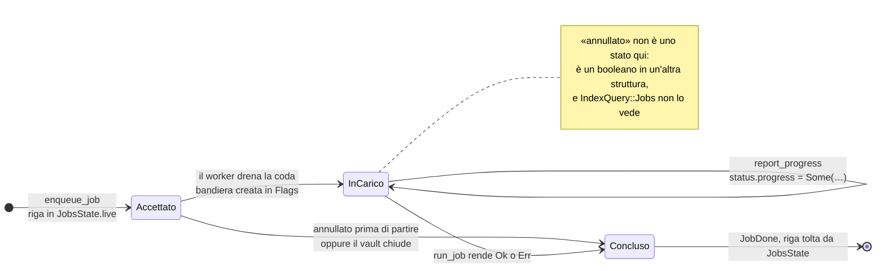
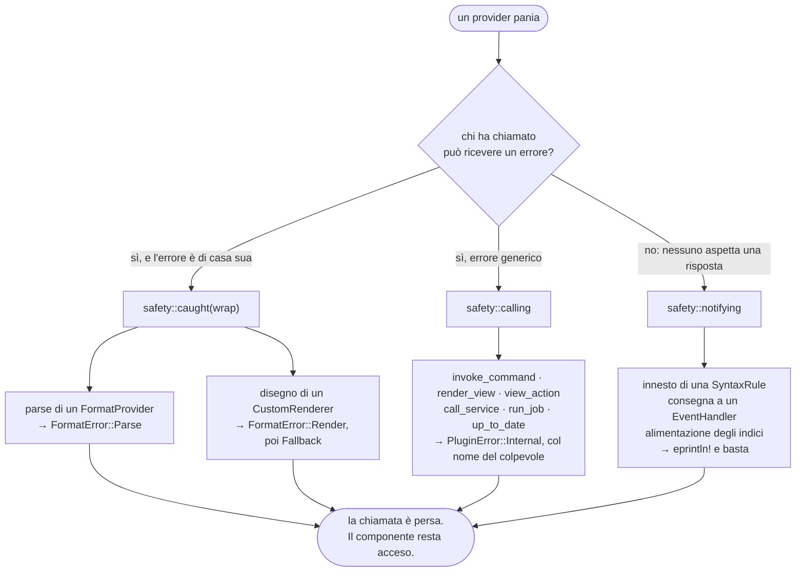
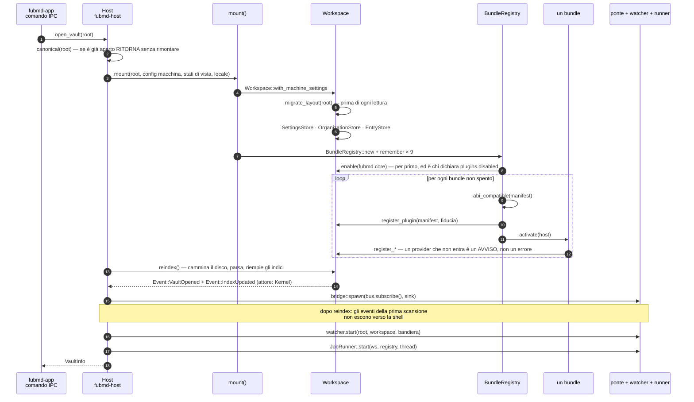
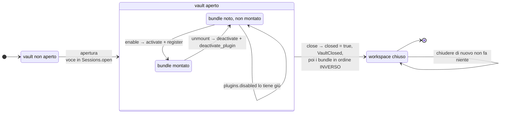

# Confine dei plugin: `Plugin`, `HostApi`, capability

Il **confine di fiducia** fra il core e un plugin — nativo (M4) o WASM (M5). Il
kernel vede `dyn Trait` e non distingue un backend dall'altro; la differenza è
nel *come* le chiamate attraversano il confine e in *quali capacità* il core
concede.

Torna a [../PIANO.md](../PIANO.md) · vedi [traits.md](traits.md).

## `HostApi`: l'unico varco

Un plugin non tocca mai il filesystem o il bus direttamente: passa da `HostApi`
(firma in [traits.md](traits.md)). Questo dà **un solo punto** in cui applicare i
permessi.

Dalla [decisione 0021](../decisions/0021-il-confine.md) l'`HostApi` è la **somma
di famiglie** — quattordici dal §11.2, al confine WIT altrettante `interface`
importate una per una dal `plugin-world` — e il punto di applicazione esiste
davvero: il kernel tiene un
[registro dei plugin](../../crates/fubmd-kernel/src/plugins.rs) con manifest,
permessi e grado di fiducia, e ogni host nasce dentro un `Guard<H, P: Policy>`
che nega ciò che la politica del suo plugin non concede. Prima
`PluginPermissions` esisteva nel contratto e non lo leggeva nessuno.

Ne segue la regola di montaggio: **chi registra qualcosa si dichiara prima**
(`register_plugin`). Un id non dichiarato non è un plugin creato al volo: è un
errore, e un host intestato a un id sconosciuto nega tutto dicendo perché.

- **Nativo (M4):** `HostApi` è un oggetto in-process che chiama direttamente il
  `Workspace` (`KernelHost` in `fubmd-kernel/src/host/kernel.rs`, usato dal
  dispatch degli eventi). Costo ≈ zero.
- **WASM (M5):** il plugin riceve un *proxy*; ogni metodo è una **host function**
  wasmtime che serializza gli argomenti, attraversa il confine, esegue nel core e
  ritorna. La firma è identica: per questo la regola d'oro impone tipi
  serializzabili.

### Storage

Un plugin ricorda in un modo solo: `data_read/write/remove/list`, path → blob di
byte, persistente.

Lo spazio è `.fubmd/data/plugins/<id>/`, **dentro al vault**: i dati derivati da
un vault appartengono a quel vault, e copiarlo o metterlo in sync se li porta
dietro. L'identità `<id>` la assegna chi registra il plugin
(`Workspace::register_event_handler(id, handler)`), mai il plugin: uno che si
sceglie il proprio recinto non è dentro a un recinto. Verifica in
`crates/fubmd-kernel/tests/plugin_data.rs`.

`storage_get/set` — chiave → JSON, volatile — **è stato tolto** dal contratto con
la [decisione 0013](../decisions/0013-elenco-delle-capacita.md), ritagliando la
linea di base (`crates/fubmd-abi/wit/frozen/0.1.0.wit`): è la sola rottura di
quel giro. Con `data_*` da una parte e le impostazioni del §11.1 dall'altra non
gli restava un caso d'uso, e «ricordare qualcosa per la durata della sessione» il
chiamante lo aveva già risolto senza saperlo — un provider è un **oggetto vivo**
nel workspace, e a M5 un componente WASM ha la propria memoria lineare.

**Lo stato per-documento ha un posto dichiarato**
([decisione 0044](../decisions/0044-lo-stato-per-documento.md)):
`doc/<documento codificato>/<nome>`, con la convenzione e il suo inverso in
[`fubmd_abi::rules::doc_data`](../../crates/fubmd-abi/src/rules/doc_data.rs). Non
è una capacità in più: è `data_*` con un prefisso che il **kernel riconosce**, e
riconoscendolo lo migra al rename e lo raccoglie quando la nota non è più né nel
vault né nel cestino. Chi ci mette qualcosa smette di doversi migrare la chiave
da sé — cioè smette di avere il buco che tutte le copie di quel rito avevano: chi
ascolta `DocumentRenamed` non sente ciò che è successo mentre non c'era. Regola:
**sotto `doc/` sta ciò che non ha senso senza il documento**; ciò che deve
sopravvivergli (i tombstone del versioning) sta fuori.

**La configurazione è un'altra cosa** ([decisione 0036](../decisions/0036-le-impostazioni-e-i-tre-stati.md)):
`setting` / `set_setting` / `reset_setting`. Le chiavi le **dichiara un
manifest** (non se le inventa chi scrive), il valore lo decide l'utente (non il
plugin), il file è leggibile a mano, e ciò che il file contiene senza che nessuno
lo dichiari resta lì senza essere letto.

**I due cancelli della scrittura**, ed è la parte che riguarda il confine: il
permesso `fubmd:write-settings` dice *chi* può scrivere,
`SettingSpec.program_writable` dice *cosa* si può scrivere — con `false` come
default, per la stessa regola di `Trust::default`. La seconda esiste perché il
divieto che conta (privacy e AI non si spostano da sole) non dipende da chi
chiede. La persona davanti allo schermo passa da un'altra porta — la shell scrive
sul workspace — ed è la distinzione dell'origine
([0012](../decisions/0012-origine-degli-eventi.md)) applicata alla
configurazione.

**Cosa la configurazione NON è**: un posto per i segreti. Il file è JSON in
chiaro; una chiave d'API vuole un portachiavi di sistema, che sarà una capacità
sua.

**Perché blob e non un'API filesystem scoped.** Un filesystem scoped chiede al
plugin di comporre path e all'host di verificarli: il recinto diventa una
convenzione. Con i blob il plugin non ha mai in mano un path del filesystem, non
sa dove sia la radice del vault e non può nominare niente che stia fuori — path
assoluti, `..` e separatori di sistema sono `PermissionDenied`. Il recinto è una
proprietà della firma.

**L'unica eccezione, e sta fuori dal contratto.** Un provider **nativo** che
avvolge un motore con un proprio formato su disco non può passare da `data_*`:
tantivy mmappa i propri segmenti e li rilegge quando gli pare, anche dai thread
di merge. Per questi c'è `Workspace::plugin_data_dir(id)`, che restituisce **la
stessa cartella** del recinto come path del filesystem. È un metodo del workspace
e non una capacità dell'`HostApi`, deliberatamente: così un plugin WASM non ce
l'ha. A M5 l'equivalente per un componente è un preopen WASI sulla stessa radice.

**Perché esiste.** Lo ha chiesto il dogfooding del versioning, che è un
`EventHandler` come quelli di terzi e con l'`HostApi` precedente non avrebbe
potuto tenere il proprio store. Il buco è stato chiuso nel contratto prima del
freeze di M4, e `VersionStore` è la prova che la firma regge un caso reale.

### Operazioni strutturali e composizione ([decisione 0013](../decisions/0013-elenco-delle-capacita.md))

Sette capacità aggiunte prima del freeze, e la chiusura dell'elenco: la
superficie dell'`HostApi` è dichiarata **completa**, e ciò che non c'è è fuori per
una ragione scritta a verbale, capacità per capacità.

- **`create_document(id, source)`** — crea, e **rifiuta** un path occupato. È
  l'unica differenza con `write_document`, ed è tutta la ragione per cui sono
  due: un template che sbaglia la data e usa `write_document` cancella una nota
  vera, e nel codice non sembra una cancellazione. Chi vuole comunque un nome
  libero compone con `free_name`.
- **`rename_document(from, to)`** — quella del kernel: identità preservata **e
  wikilink entranti riscritti**. Non ce n'è una versione "nuda": due semantiche
  sotto lo stesso nome sarebbero una trappola. Ne segue che è un lotto
  ([0011](../decisions/0011-il-lotto.md)), e dentro un lotto aperto vi si
  unisce.
- **`trash_document(id) -> DocId`**, **`list_trash()`**,
  **`restore_document(entry, to)`**, **`empty_trash() -> u64`** — il giro del
  cestino. `trash_` e non `delete_` perché non distrugge: restituisce l'id con
  cui si ripristina, e l'unica capacità che distrugge si chiama `empty_trash`.
  `list_trash` sta accanto a `list_documents` e **non** in `IndexQuery`: il
  cestino non è indicizzato — una nota cestinata non ha modello, né tag, né archi.
- **`run_command(command, args) -> CommandOutcome`** — invoca un comando del
  registro ([0009](../decisions/0009-registro-dei-comandi.md)). Non prende un
  `InvokeMode` (il modo è dell'host: chi si sta simulando riceve il *piano*, e il
  piano di una macro è l'unione dei piani dei suoi passi), non prende un `Actor`
  (l'attore è chi è *entrato* nel kernel), non apre un lotto suo. Un comando non
  può invocare sé stesso nemmeno per giro: la catena è nota all'host e il rifiuto
  nomina il ciclo.
- **`undo_last() -> Option<Text>`** — annulla l'ultima operazione annullabile e
  dice quale era ([0045](../decisions/0045-l-undo-ha-due-pile.md)). È una
  capacità e non un comando del registro perché la pila è **privata del kernel**,
  e un `CommandProvider` riceve solo l'`HostApi`. Il comando che la invoca c'è lo
  stesso (`vault.undo`) ed è quello che compare nella palette. Al confine ha
  **due** controlli e non uno: annullare è invocare *ed* è, sempre, scrivere.

`run_command` è anche la ragione per cui i `CommandProvider` sono gli unici
provider **condivisi** (`Arc`) invece che estratti dal workspace per la durata
della chiamata: un comando che invoca deve trovare gli altri comandi, compresi
quelli del proprio provider.

**Dove sta il permesso.** `PluginPermissions` porta `fubmd:write-vault` e **non
lo legge nessuno** — non per dimenticanza: questo kernel non ha plugin, ha
provider registrati per id, e `Plugin::manifest()` non viene mai chiamata perché
non c'è niente che installi, abiliti o verifichi. Applicare `write_vault` oggi
vorrebbe dire inventare il registro che tiene i manifest, cioè il §7.3 e M5. Il
varco però esiste già ([0010](../decisions/0010-comando-descritto-a-una-macchina.md)):
un comando in **sola lettura** o **simulato** riceve un host che nega con un
errore che dice perché — e nega più delle strutturali: le famiglie che `ReadOnly`
rifiuta sono **sette** (`VaultWrite`, `VaultStructure`, `DataWrite`,
`SettingsWrite`, `ViewStateWrite`, `Events`, `Services`), cioè anche la
configurazione, lo stato di vista, i propri blob, i job e i servizi di terzi, che
strutturali non sono in nessun senso. Il presidio è
`crates/fubmd-kernel/tests/invoke_command.rs`,
`every_structural_capability_is_refused_by_the_same_gate`, e dalla
[0056](../decisions/0056-un-elenco-che-e-la-sorgente.md) l'insieme atteso lo
**calcola** da `Capability::ALL` invece di elencarlo — quindi una famiglia negata
che nessuno prova è rossa. *(Questa riga diceva «tutte e sei le strutturali»: il
numero era sbagliato — i metodi di `VaultStructure` sono cinque — e la portata lo
era di più, perché nominava una famiglia sola su sette.)* Il giorno che
`write_vault` diventerà vincolante non dovrà costruire il rifiuto: dovrà
aggiungere una seconda ragione per negare.

### Interrogazione, contesto, struttura

Quattro capacità aggiunte prima del freeze; la semantica di ognuna sta in
[traits.md](traits.md), `HostApi`. Qui conta il lato confine:

- **`query_index`** — la view interroga il vault da sé invece di ricevere dati
  già pronti. Stessa porta e stesso dispatch di `Workspace::query_index`: chi
  serve cosa è **dichiarato alla registrazione**
  ([0019](../decisions/0019-il-canale-dati.md)), e le risposte di cui il kernel è
  l'unica fonte di verità le serve `CoreIndex`, un `IndexProvider` registrato per
  primo e non un ramo privilegiato. È il **canale metadata**: senza, una view non
  potrebbe leggere né la struttura parsata né il frontmatter, perché non ha un
  `FormatProvider`. Ed è il canale di ciò che il kernel tiene **in cache**, quindi
  una view lo usa a ogni ridisegno senza toccare il disco.
- **`active_context`** — la view lo **chiede**; a scriverlo è **solo** la shell,
  con `set_active_context`. Non c'è un gemello che scrive nell'`HostApi`: «quale
  nota guardo e dove ho cliccato» è una decisione dell'utente sull'app, non una
  capacità da concedere a un plugin. Non è un `DocId` nudo perché con schede,
  split e finestre multiple (FEATURES 4.1) «il documento attivo» smette di essere
  una variabile globale: il `PaneId` dentro il contesto distingue due pannelli
  backlink affiancati, che altrimenti farebbero la stessa domanda e riceverebbero
  la stessa risposta, sbagliata per uno dei due.
- **`read_model`** e **`format_of`**
  ([0018](../decisions/0018-chi-vede-il-modello-parsato.md)) stanno accanto a
  `read_document` e non dentro `query_index`, perché sono una **lettura del
  vault** e non qualcosa di derivato. Il recinto: `read_model` lo applica come
  `read_document` (stesso `valid_doc_id`, stesso `PermissionDenied` a una
  risalita); `format_of` no, perché non legge niente.

### La regola dello span

`Selection { span: Option<Span>, text: String }` porta il **testo** sempre, lo
**span** solo quando le sue coordinate valgono anche per il sorgente che il
kernel ha in mano — cioè a buffer pulito. Non è prudenza: è l'unico modo di
rendere impossibile l'errore che il contratto altrimenti inviterebbe a fare —
leggere il documento con `read_document` e ritagliarlo con offset calcolati su un
altro testo, cioè tagliare i byte sbagliati **proprio mentre l'utente scrive**.

La stessa invariante è tenuta dal kernel dall'altro lato: quando il sorgente
sotto la selezione cambia, viene rinominato o sparisce, la selezione **cade**
(`Session::invalidate`, in `kernel/src/session.rs`). Uno span stantio è peggio di
uno span assente. La shell ne ripubblica uno vero al salvataggio successivo.

### Chi si ridisegna, e quando

`ViewSpec` dichiara due maschere: `refresh: EventMask` per gli eventi del
**vault**, `follows: ContextMask` per le parti del contesto di **sessione**
(documento, selezione, modalità). Il contesto non passa dall'event bus di
proposito: un cursore che si muove non è un fatto del vault, e farlo passare di
là significherebbe consegnare ogni battuta di tasto a ogni handler registrato.

`Workspace::set_active_context` restituisce **gli id delle view da ridisegnare**
— quelle la cui `follows` interseca ciò che è cambiato. Il conto sta nel kernel e
non nella shell perché la risposta non deve dipendere da chi la calcola: a M5 un
host diverso avrà la stessa regola. La shell resta padrona del *quando* e ignara
del *chi*.

Il giro completo di una view passa tutto dal contratto: la shell pubblica il
contesto → chiama `render_view` sulle view che il kernel le indica → il provider
chiede contesto e dati all'host → un click torna come `on_action` e il provider
risponde con un `ViewUpdate`, che la shell esegue. Prove end-to-end:
`crates/fubmd-features/tests/backlinks_view_e2e.rs` (il giro base),
`outline_view_e2e.rs` (il cursore che arriva alla view) e `stats_view_e2e.rs` (il
testo selezionato che vale anche a buffer sporco).

## Il lotto e l'origine

Un `EventHandler` non riceve un `Event` nudo ma un **`Notice { event, origin }`**,
e `Origin { actor, batch }` risponde alle due domande che il confine non sapeva
porre.

**Chi ha chiesto** — `Actor { User, Watcher, Kernel, Plugin { id } }`. È *chi ha
chiesto*, non chi ha eseguito: un comando invocato da un'automazione scrive con
l'origine dell'automazione. La difficoltà che risolve è concreta: un'automazione
su-modifica **che scrive** si richiama da sola, e prima di questo campo l'unica
difesa era il budget del dispatch, che tronca — cioè una rete di sicurezza al
posto di una semantica. La forma di quella difesa è una riga:

```rust
fn handle(&mut self, notice: &Notice, host: &mut dyn HostApi) -> Result<(), PluginError> {
    if notice.origin.actor.is_plugin(MIO_ID) {
        return Ok(()); // questa l'ho scritta io
    }
    // …
}
```

Riconoscerle dal **contenuto** non è equivalente: funziona finché la scrittura
cambia il proprio innesco, e smette di funzionare proprio nel caso normale di
un'automazione che appende (un diario, un log, un sommario), dove ogni scrittura
è diversa dalla precedente.

**Di quale lotto fa parte** — `batch: Option<BatchId>`
([decisione 0011](../decisions/0011-il-lotto.md)). Un lotto è uno scope del
kernel dentro cui N scritture sono *una* cosa (il caso vero: una rinomina con 200
backlink). Cosa succede dentro un lotto — `IndexUpdated` coalizzato in un
`BatchEnded`, dispatch rimandato alla chiusura, e la regola *chi dichiara
`IndexUpdated` dichiara anche `BatchEnded`* — sta in [traits.md](traits.md),
`EventHandler`. Le due proprietà che riguardano il **confine**:

- **Un plugin non apre un lotto**: uno scope a chiusura garantita non attraversa
  il confine dei componenti, e un lotto lasciato aperto da un'istanza morta
  terrebbe sospesi gli eventi del vault per sempre. Il lotto di un plugin è la
  sua **invocazione di comando**, che l'host apre e chiude per lui.
- **Un lotto non è una transazione.** Se una scrittura fallisce, le altre restano
  fatte, e chi lo ha aperto lo scopre dal proprio valore di ritorno. Il
  tutto-o-niente vuole il journal del §15.2, e prometterlo con un nome
  (`transaction`, `rollback`) lo farebbe credere a chi legge solo la firma.

Prove: `crates/fubmd-kernel/tests/batch_and_origin.rs` (incluso il confronto fra
un'automazione che si difende con l'origine e la stessa che non lo fa),
`crates/fubmd-features/tests/{commands_e2e,view_refresh_masks}.rs`.

## Scrivere un pezzo: l'edit porta la revisione

Un plugin ha due modi di cambiare un documento, e la differenza sta nella firma:

| | `write_document(id, source)` | `apply_edit(id, request)` |
|---|---|---|
| Cosa manda | il documento **intero** | una lista di `(span, testo)` |
| Su cosa si applica | su qualunque cosa ci sia adesso | sul sorgente che `request.base` nomina |
| Chi ha scritto nel frattempo | viene sovrascritto **in silenzio** | fa fallire la richiesta (`Conflict`), niente scritto |
| Chi lo usa | chi il testo intero ce l'ha in mano: l'editor che salva, un importer che crea | tutti gli altri |

`EditRequest { base: Revision, edits: Vec<TextEdit> }`. La base **non è
opzionale**: un edit è una coppia di offset calcolata su *un* testo, e senza dire
quale, due modifiche concorrenti — un'automazione e l'utente che scrive — si
cancellano a vicenda senza che nessuna delle due lo sappia.

La `Revision` è **opaca**: solo l'uguaglianza è contratto. Non è un numero
d'ordine, e come l'host la derivi (impronta del contenuto, digest, `mtime+size`)
non è promesso a nessuno — la si chiede con `document_revision`. Questo host usa
l'impronta del contenuto, e la scelta si vede in un caso vero: chi scrive un
carattere e lo cancella riporta il documento al testo di prima, e un edit
calcolato allora è ancora valido; un contatore direbbe di no.

Gli span della richiesta sono in byte del sorgente della base — mai del testo in
corso di produzione: chi calcola gli edit li elenca e basta, l'host li ordina e
li applica in un colpo solo. Ciò che non sta in piedi (fuori dal sorgente, a metà
di un carattere, sovrapposti, due nello stesso punto) è `BadArgs`, e non lascia
mai un documento modificato a metà.

Il rapporto (`EditReport { revision, applied }`) torna nelle coordinate del testo
**nuovo** e porta ciò che è stato sostituito: con quei due pezzi si mette il
cursore dove l'utente se lo aspetta (16.1) e si costruisce l'edit **inverso**
(`EditReport::inverse`). Di chi sia la proprietà dell'undo l'ha deciso la
[0045](../decisions/0045-l-undo-ha-due-pile.md): le pile sono **due** e non si
fondono — il testo nell'editor, le operazioni nel kernel. Questa è la forma con
cui la seconda esprime i propri passi testuali (`UndoStep::Edit`); l'inverso di
un cambiamento **strutturale** ha avuto bisogno di una forma nuova, un comando e
non un vocabolario.

Il primo cliente è il kernel stesso: la riscrittura dei wikilink su rename
(`Workspace::rename_document`) applica un `EditRequest` per sorgente invece di
riscrivere N file interi — quindi una nota che qualcun altro ha toccato fra il
calcolo del piano e la sua applicazione non viene più sovrascritta.

## Invocare un comando: cosa l'host fa rispettare

Il registro dei comandi ([decisione 0009](../decisions/0009-registro-dei-comandi.md))
è il posto in cui un'azione si dichiara **una volta** e la chiedono tutti: la
palette, la tastiera, una macro (16.2), la CLI (27.1), l'API locale (27.2), il
centro di comando LLM (22.4). Da qui in poi una feature nuova non aggiunge un
comando Tauri: aggiunge una riga a un `CommandProvider`.

La parte che riguarda questo documento è cosa il confine **garantisce** a chi
invoca senza aver letto il codice del comando:

| Chi invoca dichiara | Chi implementa dichiara | Cosa gli presta l'host |
|---|---|---|
| `InvokeMode::Apply` | `scope.writes: true` | `KernelHost`: scrive |
| `InvokeMode::Apply` | `scope.writes: false` | host in **sola lettura**: ogni scrittura è `PermissionDenied` |
| `InvokeMode::DryRun` | qualunque cosa | host in **sola lettura** |

Due conseguenze, ed è per esse che la tabella esiste:

- **La simulazione è un modo di invocare, non una cortesia di chi implementa.**
  Un dry-run che dipendesse dalla buona volontà del comando sarebbe una
  convenzione — cioè qualcosa che un comando di terzi non onora, proprio nel
  momento in cui il chiamante si fida di lui.
- **Dichiararsi innocuo è vincolante.** `writes: false` non è una decorazione da
  mostrare nella palette: chi lo dichiara riceve un host che rifiuta.

Gli **argomenti** sono l'altra metà: l'host li convalida contro la `CommandSpec`
prima di chiamare (`validate_args`), quindi un comando non si difende da solo e
chi sbaglia riceve un `BadArgs` che dice *cosa* manca. Un argomento non dichiarato
è un errore e non un argomento ignorato.

**Chi invoca dice anche chi è**, e l'host apre un lotto:
`invoke_command(command, args, mode, by: Actor)`. `vault.replace` su 40 note
emette un `batch-ended` solo, e ogni evento che ne nasce porta `by` come attore.
Il parametro non ha un default per la stessa ragione per cui non ce l'ha
`InvokeMode`. Sul confine Tauri l'attore è fissato a `User` invece di essere un
parametro dell'IPC: da lì passa la webview, e un chiamante che potesse firmarsi
come vuole avrebbe aggirato quella difesa dall'altra parte.

`by` **non** arriva fino a `CommandProvider::invoke`: l'origine è ciò che l'host
appone. Un comando che si comportasse diversamente a seconda di chi lo chiama
sarebbe una policy nascosta in un'implementazione, e le policy hanno un posto
(§7.3). Il giorno che servirà **leggerla**, è un metodo additivo sull'`HostApi`.

### Il consenso non è una capacità

`PluginPermissions` (§7.3) risponde a «questo componente *può*, in generale?».
22.4 chiede un'altra cosa: «l'utente approva **questa** esecuzione, su **queste**
40 note?». La risposta di FubMD è il giro **dry-run → piano → approvazione →
apply**, e non una capacità `HostApi::confirm`. Due ragioni:

1. **Un host non può fermarsi a chiedere.** Il kernel è chiamato *dalla* shell e
   ne tiene il lock: una conferma sincrona dovrebbe risalire nella webview che
   sta aspettando la risposta. Una capacità che questo host non può implementare
   sarebbe una firma che ogni host dovrà onorare e nessuno onora.
2. **Il piano si legge, la domanda no.** Una conferma nel mezzo mostra ciò che il
   comando *sceglie* di dire; un `CommandPlan` mostra i documenti impattati e gli
   edit proposti, e li mostra prima. È la differenza fra «sei sicuro?» e il diff.

*Quando* chiedere lo decide chi invoca, dal `CommandScope` dichiarato: la shell
mostra il piano quando un comando scrive su più di una nota o si dichiara non
reversibile (`needsPlan` in `frontend/src/ui/palette.ts`). Una CLI in uno script
può avere un'altra politica sullo stesso dato — è per questo che il raggio sta
nella spec e la politica no.

Resta fuori, dichiarato: l'**attribuzione** (chi ha chiesto l'operazione: utente,
comando, modello, prompt) è l'origine degli eventi
([0012](../decisions/0012-origine-degli-eventi.md)) applicata al lotto
([0011](../decisions/0011-il-lotto.md)).

## Import ed export: il confine è di byte, non di path

Il capitolo 17 di FEATURES (~120 voci) è, in ogni altra applicazione, quello che
il filesystem lo tocca più di tutti. Qui **nessuna delle due firme nomina un
percorso**:

- `ImportProvider::import(source, request, host)` riceve
  `ImportSource { name, media_type, bytes }` — la sorgente **già letta**. Il
  `name` è quello che l'utente conosce (`vault.zip`), non un path: viene da
  fuori, e `ImportSource::stem()` lo riduce a un componente solo perché
  `../../.ssh/config.md` non diventi una scrittura fuori dal vault.
- `ExportProvider::export(request, host)` restituisce
  `ExportArtifact { path, media_type, bytes }`, dove `path` è il posto **dentro
  l'esito** (un albero relativo), non sul disco.

Chi apre il dialogo di sistema e chi posa i byte è **l'host**, che è già l'unico
a sapere dove sia il vault. La conseguenza è che import ed export non chiedono
nessuna capacità nuova oltre a `free_name`, e che a M5 la sandbox **non deve
concedere niente**: la riga «Filesystem: nessun accesso diretto» resta vera senza
eccezioni.

Il prezzo è dichiarato: sorgente e artefatti stanno in memoria. Un export di
vault enorme è lavoro lungo, e dalla
[0027](../decisions/0027-il-lavoro-lungo-vede-il-vault.md) il lavoro lungo il
vault lo vede; uno `stream` al confine resta additivo, un `path: string` sarebbe
stato una porta aperta da richiudere con una major.

**Il recinto, dove sta.** `KernelHost::read_document`/`write_document` validano
il `DocId` con la stessa regola dei comandi IPC (`valid_doc_id`) e rispondono
`PermissionDenied` a una risalita. Il controllo sta sul confine delle capacità e
non dentro i provider: `ImportSource::stem()` serve a non finirci contro per
distrazione, il recinto serve perché non ci si possa andare apposta
(`fubmd-kernel/tests/transfer_dispatch.rs`).

## Lavoro lungo: i job

I trait sono sincroni e il `Workspace` vive dietro un lock: **qualunque cosa
lenta dentro una chiamata sincrona blocca l'app**, e a M5 la deadline la tronca.
Il contratto quindi dà al lavoro lungo (rete, calcolo pesante) una strada propria
— i **job**:

1. **Richiesta (sincrona, istantanea).** Il plugin chiama
   `HostApi::spawn_job(JobSpec { job, payload })` e riceve subito un `JobId`. Il
   kernel accoda soltanto: niente esecuzione dentro al lock
   (`Workspace::take_pending_jobs`).
2. **Esecuzione (fuori dal kernel).** Chi possiede i thread — il `JobRunner` di
   `fubmd-host` ([0032](../decisions/0032-il-runner-dei-job.md)), l'host WASM a
   M5 — drena la coda ed esegue `Plugin::run_job(job, payload, host)` **senza
   tenere in mano nessun prestito del workspace**. Il job ha le stesse capacità
   che il plugin ha altrove ([0027](../decisions/0027-il-lavoro-lungo-vede-il-vault.md)),
   con davanti la politica dei suoi permessi, e le usa **una chiamata alla
   volta**. Il `payload` porta gli **argomenti**, non l'input. La coda dice **a
   quale plugin** chiedere il corpo (`PendingJob.plugin`), e a saperglielo dare è
   `BundleRegistry::plugin` ([0031](../decisions/0031-chi-possiede-i-bundle.md)).
3. **Rientro (sincrono).** L'esito torna con `Workspace::complete_job` →
   `Event::JobDone { id, job, result }` sul giro sincrono normale.

E in mezzo il job **si racconta**
([0035](../decisions/0035-il-lavoro-lungo-si-racconta.md)): il ciclo
`JobStarted` → `JobProgress` → `JobDone` e la porta `report_progress`, che non
nomina il job perché `run_job` non riceve la propria identità, sono in
[traits.md](traits.md), `HostApi`.

Conseguenze:

- il giro sincrono resta **breve per definizione**: la deadline di M5 può essere
  severa senza uccidere i plugin legittimi;
- **niente snapshot**: fra due chiamate il vault può cambiare, e chi lo cammina
  vedrà qualcosa che non è mai stato vero tutto insieme. La guardia è quella di
  tutti — `apply_edit` con la sua `base` e `Conflict`
  ([0008](../decisions/0008-modifica-chirurgica.md)), `create_document` che
  rifiuta un path occupato — e un job non è né una transazione né un lotto;
- **al confine WIT non si vede**: le capacità sono import del world, non un
  parametro di `run-job`, quindi «dentro un job non c'è `host-api`» era una
  regola solo Rust;
- il permesso `network` si applica **al job**;
- un job lento o ostile non congela nulla: al peggio il suo `JobDone` porta un
  errore (timeout dell'host);
- **si può annullare, e la cancellazione è cooperativa**: `Host::cancel_job` alza
  una bandiera, e da quel momento l'host del job **rifiuta** ogni capacità
  fallibile con `PluginError::Cancelled`. Le sei infallibili non hanno dove
  metterlo, un rifiuto; `emit` e `report_progress` restano aperte di proposito,
  perché l'ultima cosa che un job che smette può voler dire è che sta smettendo,
  e a che punto era. Nel contratto non compare nessuna capacità nuova: un job
  scritto prima che la cancellazione esistesse si ferma comunque, alla prima cosa
  che prova a fare. Limite dichiarato: **un job che non chiama mai l'host arriva
  in fondo**, perché in Rust un thread non si uccide; la risposta vera è la
  deadline di M5. Chiudere il vault annulla tutto, ferma il pool e aspetta chi ha
  già cominciato: nessun job sparisce senza il suo `JobDone`;
- il **progresso** c'è, lo **streaming** no: un job consegna un esito solo, e chi
  vuole mandare risultati parziali oggi lo fa con un `Event::Custom` suo. Se
  servirà davvero (AI, indicizzazioni lunghe) sarà un canale in più *prima* del
  freeze — vedi [../appendix/ai-autocomplete.md](../appendix/ai-autocomplete.md).

### Il giro completo, con un annullamento in mezzo


Il punto che il disegno rende visibile meglio della prosa è che **annullare non
interrompe niente**: alza un booleano, e a fermarsi è il job, alla prima cosa che
prova a fare. Fra l'`Err(Cancelled)` e la bandiera alzata c'è tutto il tempo che
il job impiega ad arrivare alla capacità successiva — e se non ci arriva mai,
arriva in fondo.

| Pezzo | Dove | Cosa tiene |
|---|---|---|
| la coda | [dispatcher.rs:322](../../crates/fubmd-kernel/src/dispatcher.rs) | `PendingJob`, con l'id assegnato dal kernel |
| il campanello | [dispatcher.rs:401](../../crates/fubmd-kernel/src/dispatcher.rs) | un conto cumulativo, non un booleano: chi si sveglia sa se ha perso un giro |
| i thread | [runner.rs:307](../../crates/fubmd-host/src/runner.rs) | **due** di default, un pool **per vault**, non uno globale |
| l'host per chiamata | [jobs.rs:89](../../crates/fubmd-host/src/jobs.rs) | tiene l'`Arc<RwLock<Workspace>>` e prende un prestito **per capacità** |
| la bandiera | [runner.rs:83](../../crates/fubmd-host/src/runner.rs) | `HashMap<JobId, Arc<AtomicBool>>`, più `seen`: il confine fra «deve ancora arrivare» e «è già finito» |
| la riga viva | [core.rs:346](../../crates/fubmd-kernel/src/index/core.rs) | `JobsState`, ciò che `IndexQuery::Jobs` restituisce |

**`JobStatus` è una struct, non un enum**
([traits.rs:114](../../crates/fubmd-abi/src/traits.rs)): cinque campi — `id`,
`job`, `plugin`, `since`, `progress` — e nessuno è uno stato. Lo stato di un job
è **implicito** e vive in due strutture che non si parlano: la riga in
`JobsState` (kernel) dice che è vivo, la bandiera in `Flags` (host) dice che è
stato annullato. Perciò un job annullato resta indistinguibile da uno che lavora
finché non arriva il suo `JobDone` — è una conseguenza del taglio, non una svista.



Nessuno di questi nomi esiste come variante di un enum: sono i **portatori** dello
stato, e il diagramma li nomina per non far credere che ci sia un `JobState` da
cercare. Quel che manca davvero, ed è dichiarato: non c'è transizione osservabile
«in coda → in esecuzione», non c'è timeout né deadline (a M5 la porta l'host
WASM), e niente di tutto questo è persistente — un riavvio perde ogni job in
volo, e nessun evento lo dice.

## Onestà sul modello di minaccia: nativo = fidato

L'enforcement in `HostApi` confina davvero **solo chi non può aggirarlo**: un
plugin nativo è codice Rust in-process e può fare qualunque cosa, permessi o no.
Quindi, esplicitamente:

- **«plugin nativo» significa codice fidato** — feature ufficiali e plugin
  compilati dentro l'app. Il loro manifest è *descrittivo* (dogfooding del
  percorso di attivazione, UI di consenso), non una barriera di sicurezza;
- il **confine di fiducia reale esiste solo a M5**, con la sandbox WASM;
- lo scopo del primo plugin nativo (M4) è esercitare *il percorso* (manifest →
  consenso → `HostApi` con permessi → attivazione), così M5 cambia il backend,
  non inventa il confine.

**Un panico al confine costa la chiamata, non il vault.** L'unico isolamento che
si può comprare da un plugin nativo è quello dai suoi *incidenti*, e c'è: ogni
porta da cui si entra in codice di un provider — `invoke_command`, `view_action`,
`render_view`, `call_service`, la consegna a un `EventHandler`, l'alimentazione
degli indici, il `parse` di un `FormatProvider`, l'innesto di una `SyntaxRule`,
il disegno di un `CustomRenderer` — gira dentro una rete
(`fubmd-kernel/src/safety.rs`) che cattura il panico e lo traduce nell'errore di
casa, nominando il colpevole. La rete sta **attorno alla chiamata del provider e
a niente di più**: dentro quella chiamata il kernel ha invarianti da rimettere a
posto, e quel codice gira già sul ramo dell'errore. Senza la rete, un provider
che pania sotto il prestito esclusivo avvelenava il `RwLock` del workspace e
rendeva il vault irraggiungibile fino al riavvio.

La rete ha **tre maglie**, e quale si usa dipende da una domanda sola: chi ha
chiamato ha un modo di ricevere un no?



| Maglia | Dove | Cosa produce |
|---|---|---|
| `calling` | [safety.rs:62](../../crates/fubmd-kernel/src/safety.rs) | `PluginError::Internal("«X» è andato in panico …")` |
| `caught` | [safety.rs:79](../../crates/fubmd-kernel/src/safety.rs) | l'errore di casa del chiamante, passato come funzione |
| `notifying` | [safety.rs:102](../../crates/fubmd-kernel/src/safety.rs) | una riga su stderr, perché non c'è nessuno a cui dire di no |

Non disattiva niente, e il riquadro finale del disegno dice esattamente questo:
il meccanismo per smontare esiste (`BundleRegistry::unmount`), e dal §11.1 esiste
anche il modo di **riaccendere** (`BundleRegistry::enable`, con lo stato in
`plugins.disabled`) — ma **nulla collega un panico a quel meccanismo**. Non c'è
un contatore di panici, non c'è una soglia, non c'è nessun tipo che rappresenti
una quarantena: il «safe mode» è una voce di roadmap (§20.2), non un pezzo di
codice, e quel che manca perché un panico costi più della chiamata è il canale
per dare l'avviso. L'isolamento vero resta la sandbox di M5.

Stesso principio per la UI: un provider non fidato non può emettere
`UiNode::Html`/`WebView` (iniettano contenuto attivo nella webview privilegiata
del core, scavalcando la sandbox). L'host lo rifiuta con
`UiNode::validate_untrusted()`, in un punto solo — `Workspace::render_view` /
`view_action`. Vedi [ui-protocol.md](ui-protocol.md).

## Manifest e permessi (stato attuale)

```rust
pub struct PluginManifest { pub id, pub name, pub version, pub abi_version, pub permissions: PluginPermissions }
pub struct PluginPermissions { pub granted: OptionMap }   // `ns:nome` → parametro
```

Erano **tre booleani** fino alla
[decisione 0017](../decisions/0017-chi-disegna-cio-che-il-core-non-conosce.md),
ed è la forma che è cambiata, non la larghezza: un booleano non ha dove mettere
il **parametro** di un permesso, e «rete» senza allowlist è o tutto o niente —
mentre 20.3 chiede proprio l'allowlist, di rete e di file. Le chiavi del core
stanno in `options::permission`; un permesso con un namespace di terzi attraversa
il confine intatto, e un host che non lo conosce può **rifiutarlo** — che è
esattamente ciò che un enum chiuso non gli avrebbe permesso di fare.

## Modello capability: **ibrido**

**Grana grossa (un permesso per capacità) + allowlist come parametro del
permesso.** Non grana fine con prompt di consenso runtime (troppo costo host/UI
per il valore), non permessi nudi (troppo poco per limitare *dove* un plugin
legge, scrive o si connette). L'allowlist è il **valore** della voce, ed è la
ragione per cui i tre booleani sono diventati una mappa.

- **Concessione all'installazione:** le voci di `granted` sono mostrate e
  accettate quando il plugin viene installato/attivato.
- **Scope del vault:** `fubmd:read-vault` / `fubmd:write-vault` con un elenco di
  prefissi (es. `["Templates/", "Daily/"]`); `read_document` / `write_document`
  lo applicano e negano (`PermissionDenied`) tutto ciò che sta fuori. Senza
  parametro, la voce vale sull'intero vault. Sotto `read-vault` ci va anche
  `read_model`, che è una lettura come l'altra e dà **di più** di una sorgente;
  `format_of` no, perché non legge niente.
- **Rete e filesystem esterno:** `fubmd:network` con l'allowlist di host,
  `fubmd:external-fs` con quella dei path (20.3).
- **Enforcement in un solo punto:** i controlli vivono nell'implementazione di
  `HostApi`, così valgono identici per plugin nativi e WASM. **Quel punto adesso
  c'è**: è `Guard<H, P: Policy>` (`kernel/host/guard.rs`), un wrapper generico e
  non una impl gemella, davanti a ogni host — col registro dei plugin in cui chi
  si registra si dichiara con manifest, permessi e fiducia (`kernel/plugins.rs`).
  È il §7.3, chiuso dalla [decisione 0021](../decisions/0021-il-confine.md).
  Quello che **non** c'è è il filtro per **path**: la politica legge la presenza
  della chiave e non il suo parametro, quindi un plugin con `read-vault`
  ristretto a `Progetti/` legge tutto. È additivo dentro `Granted` e aspetta il
  §15.5 — due idee di cosa sia un prefisso sarebbero peggio di nessuna.

```rust
PluginPermissions::of(&[permission::READ_VAULT])          // tutto il vault, in lettura
    .granted
    .with(permission::NETWORK, json!(["api.esempio.com"])) // rete, con allowlist
```

`PluginError` ha già la variante `PermissionDenied(String)` per veicolare i
rifiuti al frontend/all'IPC.

## Sandbox WASM (M5)

- **Runtime:** wasmtime, **component model**; plugin come componenti
  `wasm32-wasip2`, compilati a parte con `cargo component` (vedi
  [M5](../milestones/M5-wasm-runtime.md)).
- **Isolamento di memoria:** dato dal component model; il plugin non vede la
  memoria del core, solo i dati che passano dalle host function.
- **Rete:** negata di default — e la riga è più corta della realtà, perché
  nomina con una parola sola due cose diverse. `fubmd:network` è un **permesso**
  con la sua allowlist di host; la **capacità** che lo userebbe non esiste, e
  `http_fetch` non fu rifiutato genericamente ma con due bloccanti nominati
  ([0013](../decisions/0013-elenco-delle-capacita.md)): *Ǥ9.1 (un lavoro lungo
  che vede il vault) perché sia utile e §7.3 (`network` letto da qualcuno)
  perché sia sicura. Due bloccanti, entrambi nominati; dopo, additiva»*.
  **Entrambi sono caduti** — il §9.1 con la
  [0027](../decisions/0027-il-lavoro-lungo-vede-il-vault.md), il §7.3 con la
  [0021](../decisions/0021-il-confine.md), che ha perfino scritto dove atterra:
  *«il giorno che `http_fetch` entrerà, `Capability::permission()` è la riga che
  le dà un permesso»*. La condizione che la 0013 aveva posto è quindi
  soddisfatta, e nessuno lo ha registrato: la voce è **additiva**, quindi non
  scade, ed è per questo che non sale da sé — il criterio della
  [seduta 20](../roadmap/20-quando-qualcosa-va-storto.md). Finché non entra, un
  guest non ha nessuna strada verso la rete **che passi da questo contratto**; e
  una che gli venisse da WASI invece che dall'`HostApi` sarebbe una seconda
  porta con una seconda politica, cioè ciò che l'«enforcement in un solo punto»
  esiste per non far succedere.
- **Filesystem:** nessun accesso diretto; i documenti passano da
  `read_document`/`read_model`/`write_document`/`list_documents`, i dati del
  plugin da `data_*`. **Import ed export non fanno eccezione**, ed è una
  proprietà della firma: una sorgente arriva già letta (`ImportSource.bytes`) e
  un export esce come `ExportArtifact.bytes`.
- **Storage per-plugin:** `data_*` a blob dentro `.fubmd/data/plugins/<id>/`, e
  nient'altro (vedi "Storage").
- **Operazioni strutturali:** `create_document`, `rename_document`,
  `trash_document`, `list_trash`, `restore_document`, `empty_trash` — sono ciò
  che `write_vault` dovrà governare.
- **Tempo:** `now_unix_millis` viene dall'host. WASI può negare l'orologio a un
  componente, e un tempo che passa dal confine è anche un tempo che i test
  possono fermare.
- **Disponibilità, non solo memoria:** i trait sono sincroni, quindi una chiamata
  a un plugin lento o ostile bloccherebbe il kernel. L'host wasmtime usa **epoch
  interruption** (deadline per chiamata) e limiti di risorse: chi sfora viene
  interrotto con `PluginError::Internal`. La deadline può essere severa perché il
  lavoro lento **legittimo** ha la sua strada: i **job**, eseguiti su un'istanza
  separata con una deadline propria, più lasca.
- **UI:** il proxy applica `UiNode::validate_untrusted()` a ogni albero
  restituito da `render_view` (vedi [ui-protocol.md](ui-protocol.md)).

### Cosa non può essere **solo** un guest, e il metro per deciderlo

I "Rischi" in fondo dicono una riga sola — *«costo di serializzazione al confine
WASM: accettato solo per i plugin di terzi; le feature ufficiali restano
native»* — e la [mappa](mappa-visuale.md) disegna l'**intera** FubSuite sotto
`fubmd-wasm-host`, sync compreso. Le due cose non possono essere vere insieme.
Qui si dice quale cede, e in base a cosa: il metro ha tre voci, e nessuna è
un'opinione sul valore di una feature.

1. **Posizione rispetto al prestito.** I trait sono sincroni e girano dentro
   `Workspace::lend`: la latenza di un guest non è un costo suo, è **tempo in cui
   tiene in mano il vault**. L'*epoch interruption* qui sopra limita chi è ostile
   o rotto — non chi è lento e legittimo, che è il caso più comune.
2. **Frequenza × payload.** Gli alberi al confine sono un'**arena** — lista
   piatta più indici `u32`, conversione in `fubmd_abi::arena` — quindi una copia
   per direzione: ciò che porta *il modello* o *il contenuto* paga in proporzione
   alla nota, ogni volta. E ciò che tocca **ogni** documento — indicizzare,
   parsare, digerire — si paga a ogni documento: su un `reindex` il fattore è il
   vault intero, che è la ragione per cui la grana della chiamata era una domanda
   della [decisione 0051](../decisions/0051-l-alimentazione-risponde.md) e non un
   dettaglio di implementazione: l'alimentazione di un indice è passata **a
   lotti** proprio con questa aritmetica in mano — e con il limite dichiarato,
   perché il lotto riduce il numero di attraversamenti e non il volume, che
   attraversa comunque per intero.
3. **Prima o dopo la scrittura.** Il contratto permette di **osservare** una
   modifica — `EventHandler`, dopo — e non di **interporsi**: non esiste nessun
   punto che preceda `write_document` e possa dire di no. Chi deve decidere
   *prima* che il file atterri non è un plugin stretto, è un plugin
   **impossibile**.

Chi inciampa in **una sola** delle tre non può essere *solo* un guest. Fuori da
qui l'arena è un pedaggio che non si vede, e la regola non deve mangiarsi tutto.

**Il caso che la mappa sbaglia è il sync**, e non per la rete — quella è una voce
additiva le cui condizioni sono cadute (sopra). È il punto 3, e poi il 2. Un sync
deve decidere il merge **prima** che il file atterri, e da `EventHandler` arriva
dopo, su una coda che per contratto può troncare: il versioning si compra la
perdita riconciliando su `Event::Overflow` (`features/src/versioning.rs`) perché
perdere un evento gli costa **una versione in ritardo**, mentre a un sync costa
una **divergenza su un altro device**, e non c'è riconciliazione che la renda
gratis. E un ciclo di sync è hashing del vault intero: nativo è leggere e
digerire in-process, da guest è copiare il vault attraverso l'arena a ogni giro.
Il paragone con Obsidian — dove il sync è un plugin — non regge *qui*: là i
plugin sono JS non sandboxato con accesso pieno all'app, cioè il modello che
"Onestà sul modello di minaccia" rifiuta per intero. Il sync è un **servizio del
core**, estendibile semmai nei backend di trasporto.

**Due che restano nativi per costruzione**, e la ragione è già scritta altrove.
Il **motore di ricerca** predefinito: tantivy vive di segmenti mmappati e il
varco esiste apposta (`plugin_data_dir`), la §21.2 vuole un ranking *per
battuta*, e i 6,8× della [0026](../decisions/0026-due-query-insieme.md) vengono
da thread che un guest non condivide. La **firma** resta da provider — un motore
alternativo di terzi deve poter esistere, ed è la
[0025](../decisions/0025-la-ricerca-predefinita.md) — ma quello **acceso di
default** è nativo. E il **`FormatProvider` di casa**, per il punto 2 e **non**
per il punto 1: la live preview non chiama il provider a ogni battuta, perché la
[0018](../decisions/0018-chi-vede-il-modello-parsato.md) ha deciso che il modello
verso il webview non ci va e il buffer lo decora Lezer nella shell (§4.4). Ma
ogni salvataggio e ogni `reindex` passano di lì, e un vault da 100k note sono
100k parse oltre il confine. Un formato di terzi paga quel pedaggio perché lo
sceglie; quello che apre le note di tutti no.

**Il rovescio, che è la parte che tiene onesta la regola.** Il **versioning** è
la prova vivente che il modello regge: per-evento, throughput e non latenza,
perdita riconciliabile. I **job** — import, export, OCR, pubblicazione — sono
lavoro lungo con una deadline propria su un'istanza separata, ed è la strada che
questo documento ha costruito apposta. Ciò che sopra un canale dati sano è una
**view sottile più dei comandi** sta di là senza asterischi. E dove il lavoro
vero costa 50–500 ms — un'inferenza, una conversione — il pedaggio dell'arena è
rumore di fondo: il numeratore conta solo quando il denominatore è piccolo.

## Percorso di attivazione

Chi lo percorre è il **`BundleRegistry`** di `fubmd-host`
([decisione 0031](../decisions/0031-chi-possiede-i-bundle.md)), e sta dalla parte
dell'host per una ragione sola: l'`HostApi` non ha capacità di registrazione
([0013](../decisions/0013-elenco-delle-capacita.md)), quindi **un plugin non può
registrarsi da sé**. A M5 il caricatore WASM percorre gli stessi passi; cambia
come si costruisce il `Plugin`, non chi lo dichiara.

1. Il registry legge il `PluginManifest` (nativo: dal codice; WASM: dai metadati
   del componente) e ne verifica la **versione del contratto**
   (`abi_compatible`): una major diversa, o una minor più nuova di quella
   dell'host, non si monta e non si dichiara.
2. Lo **dichiara** al kernel (`Workspace::register_plugin`), che applica permessi
   e fiducia (§7.3), la regola dei nomi sui servizi offerti (§7.4) e i requisiti
   (§7.5); da lì un `HostApi` intestato a quell'id ha i permessi applicati.
3. Chiama `Plugin::activate(host)`; poi **il bundle** registra i provider
   (`Command`/`View`/`Index`/`EventHandler`/`Import`/`Export`). I primi tre passi
   sono tutto-o-niente — un `activate` fallito ritira la dichiarazione — mentre
   un provider che non entra è un avviso: il bundle è montato, e gli manca quel
   pezzo.
4. Alla disattivazione, `Plugin::deactivate(host)` **prima** che il kernel gli
   tolga provider e dichiarazione (`Workspace::deactivate_plugin`): dopo, l'host
   intestato a quell'id nega tutto, e quel commiato non potrebbe più né scrivere
   né chiamare i propri comandi.

Il **primo plugin nativo** (M4) esercita esattamente questo percorso senza WASM.

### Dove sta questo percorso dentro l'apertura di un vault

I quattro passi qui sopra sono il passo 13 di una catena più lunga, e l'ordine di
ciò che sta intorno non è arbitrario: il ponte si accende **dopo** la prima
scansione e **prima** del rilevatore, e il pool dei job parte per ultimo.



| Passo | Dove | Perché è lì e non altrove |
|---|---|---|
| `Host::open` | [session.rs:341](../../crates/fubmd-host/src/session.rs) | un vault già aperto non si rimonta: si torna la scheda e basta |
| `mount` | [mount.rs:162](../../crates/fubmd-host/src/mount.rs) | la tabella di montaggio ha **nove** righe: `fubmd.core` più le otto feature |
| `migrate_layout` | [vault.rs:79](../../crates/fubmd-kernel/src/vault.rs) | dentro il costruttore, non in `reindex`: nessuno legge un albero prima che sia al suo posto |
| `BundleRegistry::mount` | [registry.rs:245](../../crates/fubmd-host/src/registry.rs) | tutto-o-niente sui primi tre passi, avvisi sul quarto |
| `reindex` | [workspace.rs:1197](../../crates/fubmd-kernel/src/workspace.rs) | **dopo** il montaggio: un indice registrato dopo la scansione resterebbe vuoto |
| `bridge::spawn` | [bridge.rs:69](../../crates/fubmd-host/src/bridge.rs) | fra `reindex` e il watcher |
| `JobRunner::start` | [runner.rs:307](../../crates/fubmd-host/src/runner.rs) | ultimo: prima che ci siano job, ci dev'essere un vault |

La riga che è facile perdere è la prima: **`fubmd.core` è un bundle come gli
altri** e si monta per primo, e non registra nulla — esiste per avere un'identità
nel registro, e perché è la riga che dichiara la chiave `plugins.disabled`, cioè
quella che decide se le altre otto si montano.

### Come un componente smette, e cosa resta di lui



Anche qui **nessuno di questi stati ha un enum**. Sono l'appartenenza a una mappa
e un booleano: un vault è aperto se sta in `Sessions.open`
([session.rs:184](../../crates/fubmd-host/src/session.rs)), un workspace è chiuso
se `Workspace.closed` è vero ([workspace.rs:234](../../crates/fubmd-kernel/src/workspace.rs)),
un bundle è montato se sta in `BundleRegistry.mounted` e non solo in `known`
([registry.rs:218](../../crates/fubmd-host/src/registry.rs)). Le uniche
transizioni che il **contratto** nomina sono eventi, non stati: `VaultOpened`,
`VaultClosed`, `IndexUpdated`.

L'ordine dello spegnimento è l'unica parte rigida, e ha tre regole:

| Regola | Dove | Cosa costerebbe non averla |
|---|---|---|
| il watcher si lascia andare **per primo** | [session.rs:165](../../crates/fubmd-host/src/session.rs) | eventi dal disco su un workspace che si sta smontando |
| il pool **aspetta** chi ha già cominciato, e rifiuta chi è in coda | [runner.rs:356](../../crates/fubmd-host/src/runner.rs) | un job senza il suo `JobDone`, che per la shell resta in corso per sempre |
| `deactivate` gira **mentre il bundle è ancora intero** | [registry.rs:366](../../crates/fubmd-host/src/registry.rs) | un commiato che non può più né scrivere né chiamare i propri comandi |
| i bundle si spengono in ordine **inverso** | [workspace.rs:870](../../crates/fubmd-kernel/src/workspace.rs) | chi si è montato appoggiandosi a un altro lo troverebbe già via |

E un caso che il codice tratta e che vale la pena sapere: se un job in volo tiene
ancora una copia dell'`Arc<dyn Plugin>`, `deactivate` **non viene chiamato
affatto**, e al suo posto si produce un errore che lo dice
([registry.rs:377](../../crates/fubmd-host/src/registry.rs)). Non è un fallimento
che ferma la chiusura: gli errori dello spegnimento si accumulano e tornano come
lista, perché fermarsi al primo lascerebbe metà dei componenti accesi dentro un
vault che l'utente considera chiuso.

## Rischi

- **Superficie `HostApi` troppo stretta o troppo larga** — mitigato dal primo
  plugin nativo di M4, che la mette alla prova prima del freeze.
- **Costo di serializzazione al confine WASM** — accettato solo per i plugin di
  terzi; le feature ufficiali restano native.
- **Glob del `vault_scope`** — semantica (case, symlink, path traversal `..`) da
  fissare con test dedicati a M4.
