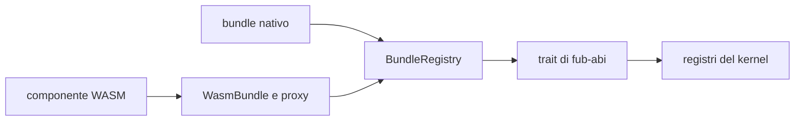
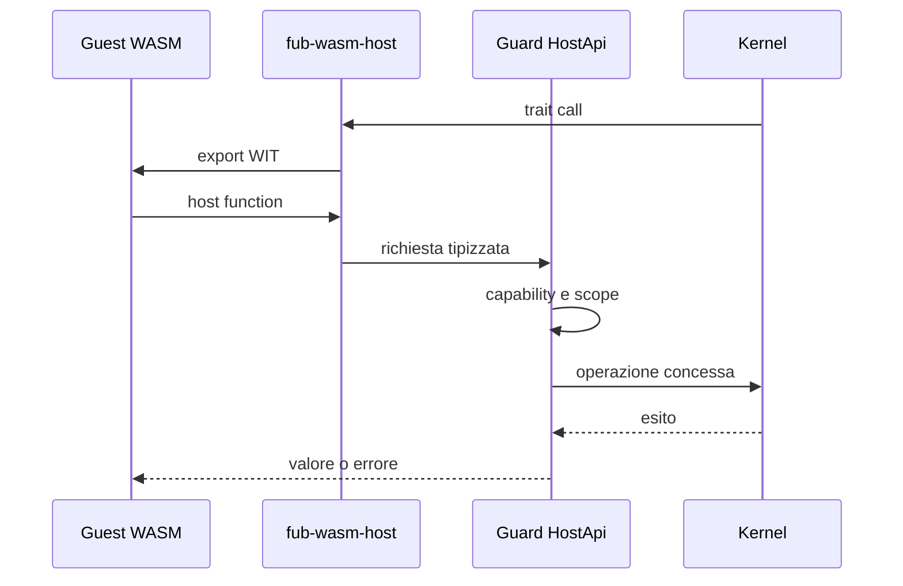

# Runtime dei plugin

> **Domanda:** come usa Fub gli stessi contratti per provider nativi e
> componenti WASM, applicando permessi e limiti in un solo punto?
> **Fonti autorevoli:** `crates/fub-abi/src/traits.rs`,
> `crates/fub-host/src/mount.rs`, `crates/fub-wasm-host/src/`.

## Modello

Un bundle fornisce manifest, fiducia, plugin e registrazioni. Il registry monta
le registrazioni e conserva l'ownership necessaria allo smontaggio.

La dichiarazione di un provider è codice esterno: `commands`, `views`,
`interests` e `targets` devono essere chiamati fuori da `Custody<Workspace>`.
`PreparedRegistration` conserva provider e dichiarazioni in un token opaco;
`Workspace::commit_registration` applica namespace, collisioni e fiducia host
senza richiamare il provider. Un rifiuto lascia il provider nel token, da
distruggere dopo aver rilasciato la guardia. Il token è consumabile una sola
volta. La porta copre comandi, view, import, export, handler, sintassi e renderer.
La cattura conserva il corpo fuori dalla rete di panic della dichiarazione:
anche un errore di `Drop` successivo viene isolato, senza un doppio panic.

Per gli indici, `PreparedIndexRegistration` separa cattura delle rotte,
ammissione, attivazione esterna e pubblicazione. Il commit riconvalida le rotte;
un rifiuto mantiene il corpo per `dispose_uncommitted` fuori dalla guardia.
L'errore recuperabile `RegistryError::Activate` conserva la semantica esistente:
l'indice è pubblicato e deve ricostruire lo stato derivato.

Il composition root espone alla closure del bundle un `Registrar` stretto, non
il workspace. Il registrar porta un `RegistrationPermit` opaco legato
all'identità del workspace, all'owner e alla generazione della dichiarazione:
ogni pubblicazione riconvalida il permesso, quindi un mount ritirato o un owner
dichiarato di nuovo non può pubblicare un risultato vecchio. `BundleRegistry`
mantiene un turno di scrittura attraverso le fasi del mount o dello smontaggio,
ma prende le guardie solo per applicare stato già preparato. Preparazione,
attivazione, registrazione, disattivazione, chiusura degli indici e ultimi
`Drop` girano fuori dalle guardie di workspace e registry. Il teardown marca
l'owner in ritiro ed estrae gli indici, li chiude con un `JobHost`, poi estrae
gli altri provider e ritira la dichiarazione in una sola breve mutazione. Gli
owner estratti vengono distrutti soltanto dopo aver rilasciato la guardia.

Il default-deny creato durante il mount restituisce una ricevuta della precisa
scrittura machine-scoped nell'istanza `MachineSettings` condivisa dai vault del
processo. Il rollback rimuove il valore solo se quella revisione è ancora
corrente: una scrittura successiva, anche `false → true → false`, non viene
confusa con il valore provvisorio del mount. Il formato persistente non acquista
un contatore o un token di transazione.

Resta un confine esplicito nelle view. Durante la registrazione
`PreparedRegistration::views` cattura fuori guardia anche `interests` per
l'istanza unica; un panic fallisce la registrazione e non viene sostituito da un
default. Per un'istanza parametrica `ViewProvider::interests` resta però
non-fallibile: un proxy WASM che possa produrre trap non dispone di un
canale di errore tipizzato. Risolverlo richiede un cambiamento del contratto
Rust e WIT; finché quel contratto non nasce da un caso reale, il runtime non
inventa un fallback e non modifica l'ABI.

## Provider nativo

Un provider nativo implementa il trait Rust direttamente. Il composition root
gli consegna un `HostApi` protetto dalla policy.

Essere nativo non significa poter ignorare il contratto: comandi, view ed eventi
devono comunque usare tipi ed errori condivisi.

## Provider WASM

`fub-wasm-host`:

1. carica il componente;
2. genera i binding dal WIT vivo;
3. traduce manifest e tipi;
4. implementa i trait Rust come proxy;
5. monta il bundle nella stessa porta del backend nativo.

## Capability

Il runtime non replica la policy. Riceve un `HostApi` già incappucciato dal
`Guard` del kernel.

Le interfacce host vengono linkate una alla volta. Se un componente importa una
famiglia non disponibile, l'istanza non viene montata e l'errore nomina la
famiglia.

## Sandbox

Il component model isola la memoria. Il runtime corrente:

- non collega WASI;
- non concede filesystem o rete diretti;
- impone un limite alla memoria lineare;
- usa epoch interruption per la deadline;
- converte trap e timeout in `PluginError`;
- limita la profondità delle conversioni ricorsive;
- mantiene vivo l'host dopo il fallimento di un componente.

Il lavoro lungo passa dai job. Una chiamata di trait breve non è il posto per
una computazione senza limite.

## Istanza e non rientranza

Plugin e provider dello stesso componente condividono lo stato della medesima
istanza. Un mutex rende esplicita la non rientranza richiesta dal component
model; non offre esecuzione concorrente dentro l'istanza.

Le host function che accodano lavoro non lo eseguono immediatamente durante la
chiamata guest.

## Disabilitazione e chiusura

Il toggle utente e la chiusura della sessione preparano il teardown sotto lock,
eseguono `Plugin::deactivate` e `IndexProvider::flush/close` fuori dai guard di
workspace e registry, poi finalizzano sotto lock. Il proxy `JobHost` acquisisce
il workspace per una capacità alla volta e riusa il `Guard` del kernel.

Il token identifica workspace e generazione della dichiarazione: un risultato
obsoleto non ritira un nuovo plugin con lo stesso id. Errori e panic delle
callback vengono raccolti senza saltare le callback di chiusura successive.
Il corpo vede ancora provider e capacità vivi; successivamente vengono ritirate
le rotte degli indici, chiusi gli indici e rimossa la dichiarazione. I dati
persistenti del plugin restano conservati. I disposer del corpo e degli indici
vengono isolati fuori lock; gli altri provider e gli hook dell'owner vengono
estratti durante la finalizzazione e distrutti singolarmente dopo il rilascio
del guard. Un panic del disposer non salta le risorse successive.

Il flush di fine indicizzazione e quello del watcher usano la stessa porta
staccata: gli snapshot degli indici vengono rilasciati fuori guard anche quando
la finalizzazione rileva un provider ritirato.

La sessione ferma watcher e job, consegna `VaultClosed`, esegue il flush globale
e smonta i plugin in ordine inverso. L'anagrafe viene persistita per ultima.
La disabilitazione persiste prima la scelta e rinvia gli eventi fino al termine
dello smontaggio. La chiusura consegna invece gli eventi di `deactivate` mentre
le registrazioni del plugin sono ancora disponibili.

Questa separazione riguarda il teardown delle porte host. Il mount, il suo
rollback e le chiamate dirette del registry restano percorsi sincroni: non
costituiscono una prova del contratto completo sulle callback fuori lock.

## UI non fidata

`UiNode` contiene forme riservate al codice fidato, come HTML o webview. Il
giorno in cui `ViewProvider` attraversa WASM, ogni albero deve passare da
`UiNode::validate_untrusted()` prima della shell.

Questa proprietà non è ancora esercitata end-to-end ed è tracciata in
[#10](https://github.com/Fubeo/Fub/issues/10).

## Stato di M5

| Capacità | Stato |
|---|---|
| lifecycle `Plugin` | presente |
| `CommandProvider` | presente |
| lettura modello | presente |
| eventi host | presente |
| timeout e memoria | presenti |
| capability negate | presenti |
| `ViewProvider` | da completare |
| altri provider | da completare su casi reali |
| discovery e installazione | da completare |
| UI non fidata | da completare |

Vedi [`../project/m5-wasm-runtime.md`](../project/m5-wasm-runtime.md).

## Invarianti

- Wasmtime resta in `fub-wasm-host`;
- il kernel non distingue il backend;
- un solo `Guard` applica la policy;
- nessuna famiglia host è concessa implicitamente;
- mount parziale e teardown incompleto sono errori;
- un componente incompatibile viene rifiutato prima dell'attivazione.
