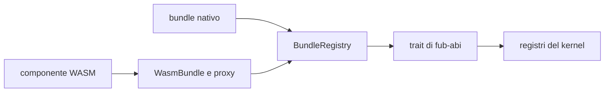
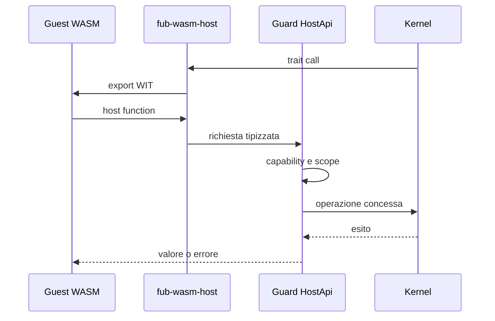

# Runtime dei plugin

> **Domanda:** come usa Fub gli stessi contratti per provider nativi e
> componenti WASM, applicando permessi e limiti in un solo punto?
> **Fonti autorevoli:** `crates/fub-abi/src/traits.rs`,
> `crates/fub-host/src/mount.rs`, `crates/fub-wasm-host/src/`.

## Modello

Un bundle fornisce manifest, fiducia, plugin e registrazioni. Il registry monta
le registrazioni e conserva l'ownership necessaria allo smontaggio.

La dichiarazione di un provider è codice esterno: `commands`, `views`,
`interests` e `targets` devono essere chiamati fuori da `Custody<Workspace>`.
`PreparedRegistration` conserva provider e dichiarazioni in un token opaco;
`Workspace::commit_registration` applica namespace, collisioni e fiducia host
senza richiamare il provider. Un rifiuto lascia il provider nel token, da
distruggere dopo aver rilasciato la guardia. Il token è consumabile una sola
volta. La porta copre comandi, view, import, export, handler, sintassi e renderer.
La cattura conserva il corpo fuori dalla rete di panic della dichiarazione:
anche un errore di `Drop` successivo viene isolato, senza un doppio panic.

Per gli indici, `PreparedIndexRegistration` separa cattura delle rotte,
ammissione, attivazione esterna e pubblicazione. Il commit riconvalida le rotte;
un rifiuto mantiene il corpo per `dispose_uncommitted` fuori dalla guardia.
L'errore recuperabile `RegistryError::Activate` conserva la semantica esistente:
l'indice è pubblicato e deve ricostruire lo stato derivato.

Il composition root espone alla closure del bundle un `Registrar` stretto, non
il workspace. Il registrar porta un `RegistrationPermit` opaco legato
all'identità del workspace, all'owner e alla generazione della dichiarazione:
ogni pubblicazione riconvalida il permesso, quindi un mount ritirato o un owner
dichiarato di nuovo non può pubblicare un risultato vecchio. `BundleRegistry`
mantiene un turno di scrittura attraverso le fasi del mount o dello smontaggio,
ma prende le guardie solo per applicare stato già preparato. Preparazione,
attivazione, registrazione, disattivazione, chiusura degli indici e ultimi
`Drop` girano fuori dalle guardie di workspace e registry. Il teardown marca
l'owner in ritiro ed estrae gli indici, li chiude con un `JobHost`, poi estrae
gli altri provider e ritira la dichiarazione in una sola breve mutazione. Gli
owner estratti vengono distrutti soltanto dopo aver rilasciato la guardia.

Il default-deny creato durante il mount restituisce una ricevuta della precisa
scrittura machine-scoped nell'istanza `MachineSettings` condivisa dai vault del
processo. Il rollback rimuove il valore solo se quella revisione è ancora
corrente: una scrittura successiva, anche `false → true → false`, non viene
confusa con il valore provvisorio del mount. Il formato persistente non acquista
un contatore o un token di transazione.

Resta un confine esplicito nelle view. Durante la registrazione
`PreparedRegistration::views` cattura fuori guardia anche `interests` per
l'istanza unica; un panic fallisce la registrazione e non viene sostituito da un
default. Per un'istanza parametrica `ViewProvider::interests` resta però
non-fallibile: un proxy WASM che possa produrre trap non dispone di un
canale di errore tipizzato. Risolverlo richiede un cambiamento del contratto
Rust e WIT; finché quel contratto non nasce da un caso reale, il runtime non
inventa un fallback e non modifica l'ABI.

## Provider nativo

Un provider nativo implementa il trait Rust direttamente. Il composition root
gli consegna un `HostApi` protetto dalla policy.

Essere nativo non significa poter ignorare il contratto: comandi, view ed eventi
devono comunque usare tipi ed errori condivisi.

## Formati e confine host

`FormatSource` è una porta host-agnostica: prepara `FormatProvider` e risorse
prima dell'apertura del `Workspace`. L'host registra i provider prima di
costruire il workspace; le risorse preparate restano vive per la sessione e
vengono rilasciate anche in caso di rollback.

L'interfaccia WIT `format` è opzionale. Se il componente la esporta,
`WasmBundle` congela descriptor e capability dichiarati e `fub-wasm-host`
presenta un proxy `FormatProvider` per `parse`, `render_html` e `serialize`.
La validazione del modello in ingresso e in uscita è parte del confine fidato:
modelli malformati e trap vengono restituiti come `FormatError`. La validazione
accetta DAG ordinari e visita il grafo in `O(V+E)`; rifiuta cicli, riferimenti
fuori indice, profondità oltre 64, span non validi, JSON non valido e una
materializzazione oltre il budget documentato di 8 Mi unità pesate.

`InstalledPluginManager` prepara una sola volta, per ogni apertura, lo snapshot
dell'inventario `enabled` con consenso `granted`: da quello stesso passaggio
restituisce bundle e `PreparedFormatSource` sotto la medesima
`StartupValidity`/lease. Il manager è cablato come `StartupSource`, non come
`FormatSource`; ogni bundle selezionato viene caricato una sola volta. Se un
componente selezionato è corrotto o non caricabile, o se un'export `format`
presente è incompatibile, l'apertura conserva una diagnostica tipizzata e
salta quel componente, senza impedire l'apertura del vault. Un bundle caricato
resta utilizzabile per le altre interfacce anche se la preparazione del suo
provider di formato fallisce, con la diagnostica corrispondente. Un'invalidazione
concorrente revoca la validità: l'apertura stantia fa rollback e non pubblica
alcuna sessione.

Il lease e le risorse preparate sono posseduti dalla sessione o dal rollback;
nessuna `Operation` del manager viene trattenuta dalla sessione.

Il componente non riceve capability host per il solo fatto di esportare
`format`: ogni famiglia resta soggetta al mount e al `Guard`. Il percorso
end-to-end verificato copre parse, render, errore dichiarato dal guest,
modello malformato, trap e serialize; non documenta una parità ulteriore.

### Decisioni sui provider

`FormatProvider` è implementato e ha parità nativo/WASM per le operazioni
coperte `parse`, `render_html` e `serialize`. Errori dichiarati dal guest,
modelli malformati e trap sono coperti end-to-end nel percorso WASM e vengono
recuperati come `FormatError`, ma non costituiscono un confronto di parità
nativo/WASM.

`IndexProvider` non viene aggiunto senza un componente che ne possieda una
route e provi il feed, la query, il flush e la close. `EventHandler` inbound
resta deferred finché un componente deve reagire a `Notice`; non va confuso
con `host-events`, già supportato per il percorso outbound verso il guest.

## Provider WASM

`fub-wasm-host`:

1. carica il componente;
2. genera i binding dal WIT vivo;
3. traduce manifest e tipi;
4. implementa i trait Rust come proxy;
5. monta il bundle nella stessa porta del backend nativo.

## Capability

Il runtime non replica la policy. Riceve un `HostApi` già incappucciato dal
`Guard` del kernel.

Le interfacce host vengono linkate una alla volta. Se un componente importa una
famiglia non disponibile, l'istanza non viene montata e l'errore nomina la
famiglia.

## Sandbox

Il component model isola la memoria. Il runtime corrente:

- non collega WASI;
- non concede filesystem o rete diretti;
- impone un limite alla memoria lineare;
- usa epoch interruption per la deadline;
- converte trap e timeout in `PluginError`;
- limita la profondità delle conversioni ricorsive;
- mantiene vivo l'host dopo il fallimento di un componente.

Il lavoro lungo passa dai job. Una chiamata di trait breve non è il posto per
una computazione senza limite.

## Istanza e non rientranza

Plugin e provider dello stesso componente condividono lo stato della medesima
istanza. Un mutex rende esplicita la non rientranza richiesta dal component
model; non offre esecuzione concorrente dentro l'istanza.

Le host function che accodano lavoro non lo eseguono immediatamente durante la
chiamata guest.

## Disabilitazione, I/O e chiusura

Il toggle utente e la chiusura della sessione preparano il teardown sotto lock,
eseguono `Plugin::deactivate` e `IndexProvider::flush/close` fuori dai guard di
workspace e registry, poi finalizzano sotto lock. Il proxy `JobHost` acquisisce
il workspace per una capacità alla volta e riusa il `Guard` del kernel.

Il token identifica workspace e generazione della dichiarazione: un risultato
obsoleto non ritira un nuovo plugin con lo stesso id. Errori e panic delle
callback vengono raccolti senza saltare le callback di chiusura successive.
Il corpo vede ancora provider e capacità vivi; successivamente vengono ritirate
le rotte degli indici, chiusi gli indici e rimossa la dichiarazione. I dati
persistenti del plugin restano conservati. I disposer del corpo e degli indici
vengono isolati fuori lock; gli altri provider e gli hook dell'owner vengono
estratti durante la finalizzazione e distrutti singolarmente dopo il rilascio
del guard. Un panic del disposer non salta le risorse successive.

Il flush degli indici usa un token che estrae gli snapshot sotto guardia, chiama
i provider con `JobHost` fuori da `Custody<Workspace>` e finalizza dopo la
riacquisizione. `IndexCall` impedisce che un indice rientri sincronicamente nel
proprio `flush`; il suo `Drop` ripristina il frame anche se la callback va in
panic. Fine indicizzazione, watcher, manutenzione e teardown attraversano la
stessa porta staccata.

Scrittura, edit e creazione preparano sorgente, parser e `BeforeWrite` sotto
guardia, ma eseguono parser e hook con handle owned e capacità strette. Il panic
di `BeforeWrite` viene convertito in errore prima della scrittura: il commit non
tocca il documento quando l'hook fallisce o va in panic. Feed e finalize degli
indici restano fasi successive e staccate.

Il ripristino dal cestino fotografa voce, destinazione, revisione e parser sotto
guardia; poi legge la sorgente, invoca parser e sintassi e compie la mossa
no-replace fuori dalla custodia. Il commit riconvalida workspace e collisioni
senza consultare storage o provider. Side-data, feed, osservazione della
revisione e journal vengono completati fuori guardia. Se il core rifiuta il
risultato, lo stesso token esegue il rollback; l'identità osservata impedisce di
sovrascrivere alla cieca un file cambiato nel frattempo.

Anche le rename esplicite di documenti e asset sono staged. Stat, letture,
parser, riscritture dei link, feed, operazione filesystem, migrazione dei
side-data e journal non vengono nascosti sotto `Custody<Workspace>`; prepare e
commit riconvalidano invece identità, collisioni e generazioni. Il rollback usa
la ricevuta della mossa e resta prudente se un processo esterno ha sostituito il
file: senza rename condizionale o reservation non esiste una transazione globale
contro il filesystem.

Il watcher separa filtro e pianificazione, invocazione di stat/read/parse e
finalizzazione. Le rename tracciate percorrono i token dedicati a documenti e
asset; gli altri eventi ricadono nella sincronizzazione ordinaria. Un lotto che
ha già mutato stato tenta il flush anche se un elemento successivo fallisce, in
modo da non perdere in silenzio un derivato già alimentato.

Il rebuild di manutenzione segue lo stesso schema: autorizzazione e snapshot
sotto guardia, camminata, letture, parser e callback fuori custodia, quindi
finalizzazione e drain degli eventi. Le operazioni globali e il dry run usano
porte tipizzate e non riaprono accesso generico a `Host::workspace`.

L'uscita desktop è in due fasi: prima il manager chiude l'ammissione e revoca
lo snapshot startup; poi `Host` chiude le sessioni e infine il manager attende
il drain dei lease. La sessione ferma watcher e job, consegna `VaultClosed`,
esegue il flush globale e smonta i plugin in ordine inverso; l'anagrafe viene
persistita per ultima. La chiusura consegna gli eventi di `deactivate` mentre
le registrazioni del plugin sono ancora disponibili.

Mount, rollback e chiamate dirette del registry rispettano lo stesso confine:
preparazione, attivazione, registrazione e disposer esterni non conservano i
guard di workspace o registry. Le prove del call graph di produzione e la
certificazione G3 sono riferite nello [stato del progetto](../project/status.md).

## UI non fidata

`UiNode` contiene forme riservate al codice fidato, come HTML o webview. Il
giorno in cui `ViewProvider` attraversa WASM, ogni albero deve passare da
`UiNode::validate_untrusted()` prima della shell.

Questa proprietà non è ancora esercitata end-to-end ed è tracciata in
[#10](https://github.com/Fubeo/Fub/issues/10).

## Inventario installato

`InstalledPluginStore` in `fub-wasm-host` fornisce agli host nativi
installazione da un singolo file, inventario persistente, consenso
all'esecuzione, scelta enabled, load verificato e rimozione dell'eseguibile.
Lo store conserva componenti identificati dal contenuto nella configurazione
della macchina. Non salva né scopre componenti installati nello storage
persistente `.fub/plugins/<id>/` del vault e non lo cancella.

L'installazione valida componente, manifest e ABI senza chiamare `activate`.
Listing e load verificano solo inventario e digest: non compilano, istanziano o
chiamano il guest. La validazione attiva esplicita produce un `WasmBundle` con
`Trust::Community` e ricontrolla il manifest. Nessuna di queste operazioni monta
l'istanza o concede capability: `BundleMount` conserva il lifecycle comune e un
solo `Guard` applica permessi e scope. Consenso, scelta enabled e stato del mount
restano tre fatti distinti.

Il bootstrap desktop sceglie una sola directory di configurazione per log,
host e store. Filtra i record con `enabled && consent == granted` prima di
leggere il blob o validare attivamente il componente. I record esclusi restano
metadata nello store: un loro blob corrotto non viene eseguito né diagnosticato
durante l'avvio.

`InstalledPluginManager` implementa `StartupSource`;
`Host::with_startup_source` prepara i bundle e i relativi `BundleClaim` per il
registry comune prima della custodia del workspace. Feature ufficiali, temi e
primo bundle registrato conservano la propria identità; una collisione non li
sostituisce e non trasferisce l'autorità sul claim. Un plugin opzionale fallito
viene diagnosticato senza pubblicare registrazioni parziali né impedire
l'apertura del vault. Il riavvio rilegge le scelte persistite; lo store resta
separato dalle istanze delle sessioni.

`InstalledPluginManager` espone le cinque operazioni IPC desktop per inventario,
installazione, consenso, abilitazione e rimozione, persiste le decisioni e
riconcilia i vault aperti. La rimozione richiede prima la disabilitazione, ritira
soltanto i claim posseduti, quindi elimina record e blob senza cancellare
`.fub/plugins/<id>/`.

Schema, atomicità e rimozione sono descritti nel
[layout su disco](../reference/on-disk-layout.md).

## Stato di M5

| Capacità | Stato |
|---|---|
| lifecycle `Plugin` | presente |
| `CommandProvider` | presente |
| lettura modello | presente |
| eventi host | presente |
| timeout e memoria | presenti |
| capability negate | presenti |
| `ViewProvider` | da completare |
| altri provider | da completare su casi reali |
| discovery, store installato e startup autorizzato | presenti; gestione desktop da completare |
| UI non fidata | da completare |

Vedi [`../project/m5-wasm-runtime.md`](../project/m5-wasm-runtime.md).

## Invarianti

- Wasmtime resta in `fub-wasm-host`;
- il kernel non distingue il backend;
- un solo `Guard` applica la policy;
- nessuna famiglia host è concessa implicitamente;
- mount parziale e teardown incompleto sono errori;
- un componente incompatibile viene rifiutato prima dell'attivazione.
