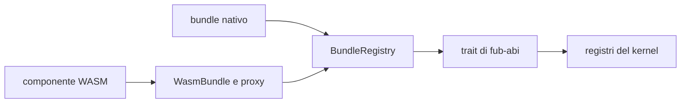
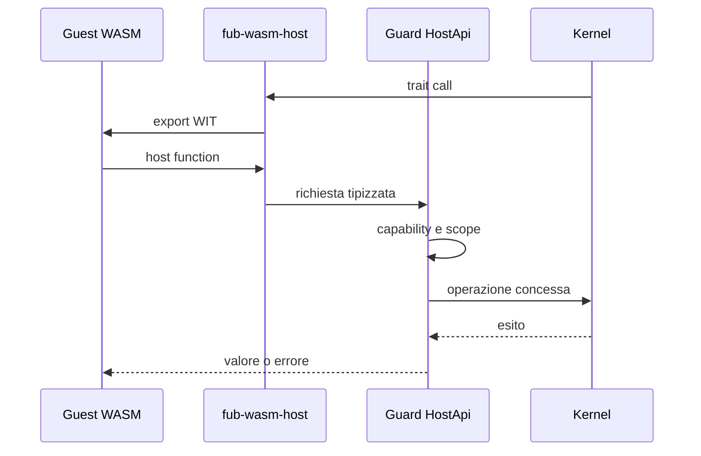

# Runtime dei plugin

> **Domanda:** come usa Fub gli stessi contratti per provider nativi e
> componenti WASM, applicando permessi e limiti in un solo punto?
> **Fonti autorevoli:** `crates/fub-abi/src/traits.rs`,
> `crates/fub-host/src/mount.rs`, `crates/fub-wasm-host/src/`.

## Modello

Un bundle fornisce manifest, fiducia, plugin e registrazioni. Il registry monta
le registrazioni e conserva l'ownership necessaria allo smontaggio.

## Provider nativo

Un provider nativo implementa il trait Rust direttamente. Il composition root
gli consegna un `HostApi` protetto dalla policy.

Essere nativo non significa poter ignorare il contratto: comandi, view ed eventi
devono comunque usare tipi ed errori condivisi.

## Provider WASM

`fub-wasm-host`:

1. carica il componente;
2. genera i binding dal WIT vivo;
3. traduce manifest e tipi;
4. implementa i trait Rust come proxy;
5. monta il bundle nella stessa porta del backend nativo.

## Capability

Il runtime non replica la policy. Riceve un `HostApi` già incappucciato dal
`Guard` del kernel.

Le interfacce host vengono linkate una alla volta. Se un componente importa una
famiglia non disponibile, l'istanza non viene montata e l'errore nomina la
famiglia.

## Sandbox

Il component model isola la memoria. Il runtime corrente:

- non collega WASI;
- non concede filesystem o rete diretti;
- impone un limite alla memoria lineare;
- usa epoch interruption per la deadline;
- converte trap e timeout in `PluginError`;
- limita la profondità delle conversioni ricorsive;
- mantiene vivo l'host dopo il fallimento di un componente.

Il lavoro lungo passa dai job. Una chiamata di trait breve non è il posto per
una computazione senza limite.

## Istanza e non rientranza

Plugin e provider dello stesso componente condividono lo stato della medesima
istanza. Un mutex rende esplicita la non rientranza richiesta dal component
model; non offre esecuzione concorrente dentro l'istanza.

Le host function che accodano lavoro non lo eseguono immediatamente durante la
chiamata guest.

## UI non fidata

`UiNode` contiene forme riservate al codice fidato, come HTML o webview. Il
giorno in cui `ViewProvider` attraversa WASM, ogni albero deve passare da
`UiNode::validate_untrusted()` prima della shell.

Questa proprietà non è ancora esercitata end-to-end ed è tracciata in
[#10](https://github.com/Fubeo/Fub/issues/10).

## Inventario installato

`InstalledPluginStore` in `fub-wasm-host` fornisce agli host nativi
installazione da un singolo file, inventario persistente, consenso
all'esecuzione, enabled, load verificato e rimozione dell'eseguibile.
La directory appartiene alla configurazione della macchina, separata dai dati
namespaced del plugin nel vault.

Installare valida componente, manifest e ABI, senza chiamare activate.
Il load ricontrolla digest e manifest prima di produrre un `WasmBundle` con
fiducia Community. Il registry comune conserva la responsabilità per
collisioni con provider nativi, dipendenze, permessi, mount e rollback.

Il consenso dello store riguarda l'esecuzione degli esatti byte installati;
non concede i permessi del manifest. Una nuova identità installata nasce senza
consenso; i grant macchina restano una decisione separata del percorso comune.
La shell deve leggere separatamente la scelta enabled e l'esito del mount: un
record non certifica un'istanza attiva.
Il percorso desktop completo resta tracciato in
[#8](https://github.com/Fubeo/Fub/issues/8).

Schema, atomicità e rimozione sono descritti nel
[layout su disco](../reference/on-disk-layout.md).

## Stato di M5

| Capacità | Stato |
|---|---|
| lifecycle `Plugin` | presente |
| `CommandProvider` | presente |
| lettura modello | presente |
| eventi host | presente |
| timeout e memoria | presenti |
| capability negate | presenti |
| `ViewProvider` | da completare |
| altri provider | da completare su casi reali |
| discovery e store installato per host nativi | presenti, percorso desktop da completare |
| UI non fidata | da completare |

Vedi [`../project/m5-wasm-runtime.md`](../project/m5-wasm-runtime.md).

## Invarianti

- Wasmtime resta in `fub-wasm-host`;
- il kernel non distingue il backend;
- un solo `Guard` applica la policy;
- nessuna famiglia host è concessa implicitamente;
- mount parziale e teardown incompleto sono errori;
- un componente incompatibile viene rifiutato prima dell'attivazione.
