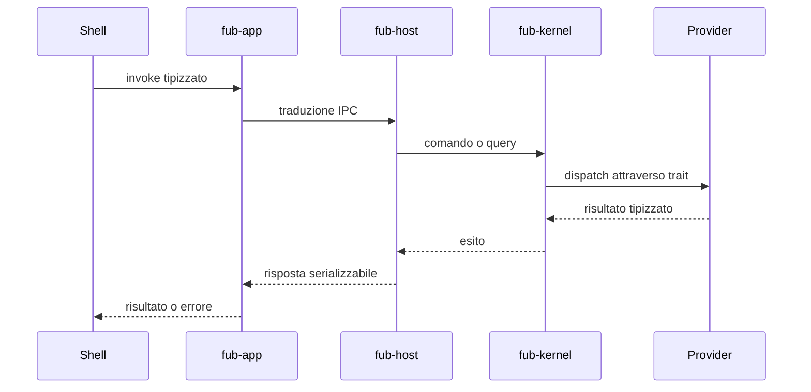
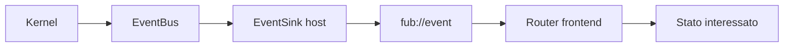

# Flusso di una richiesta

> **Stato:** implementato  
> **Fonte di verità:** seam IPC, shell host e dispatcher del kernel

Una richiesta parte dalla shell, attraversa un numero ridotto di adattatori e raggiunge un canale generico del backend.

## Comando

## Eventi di ritorno

## Regole

- query per ottenere dati;
- comandi per chiedere mutazioni;
- view per UI dichiarativa;
- eventi per fatti osservabili;
- porte dedicate solo quando il canale generico non esprime la semantica;
- nessun IPC specifico per una singola feature se esiste già un registro.

## Fallimenti

Gli errori vengono tradotti una sola volta al confine e mantengono una variante riconoscibile. La shell decide come presentare il testo localizzato, senza analizzare stringhe arbitrarie.
