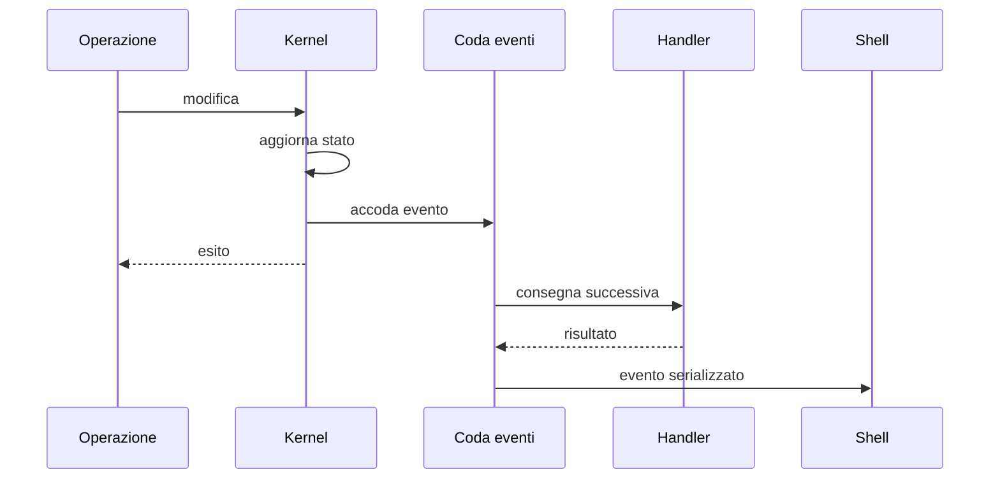
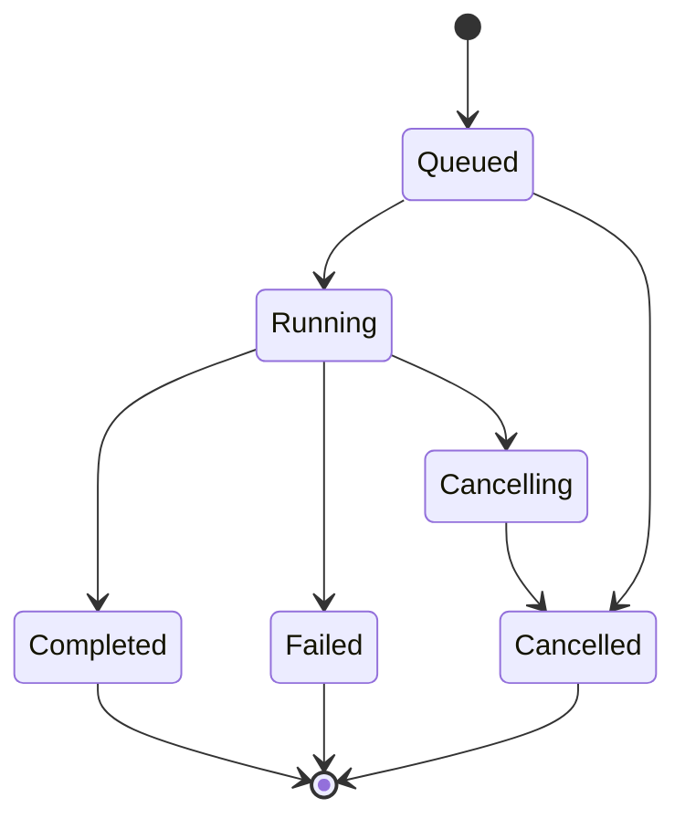
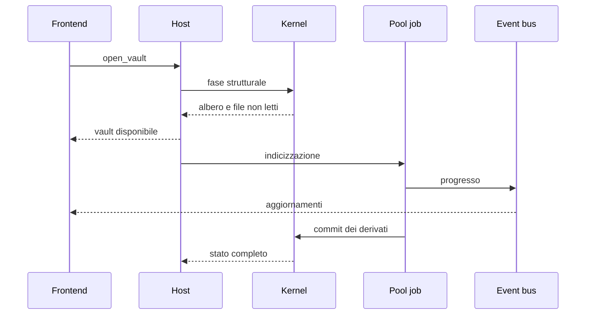

# Runtime, eventi e job

> **Domanda:** come attraversano Fub operazioni brevi, eventi e lavoro lungo
> senza rientranza o lock prolungati?
> **Fonti autorevoli:** `crates/fub-kernel/src/bus.rs`,
> `crates/fub-kernel/src/index/mod.rs`,
> `crates/fub-kernel/src/workspace/removal.rs`,
> `crates/fub-host/src/jobs.rs`, `crates/fub-host/src/session.rs`.

## Tre forme di lavoro

| Forma | Uso |
|---|---|
| chiamata breve | lettura, query o comando sincrono e limitato |
| evento | fatto già accaduto, consegnato in coda |
| job | lavoro lungo con progresso, cancellazione e stato |

Una funzione sincrona non diventa un job soltanto perché attraversa IPC. Un
lavoro potenzialmente lungo non deve bloccare il thread che custodisce il
workspace.

## Eventi

Gli eventi descrivono:

- origine e attore;
- soggetto;
- tipo di cambiamento;
- severità o avviso;
- lotto, quando più fatti appartengono alla stessa operazione.

La consegna è accodata. Un handler non viene chiamato mentre il kernel mantiene
un prestito esclusivo o sta ancora mutando lo stesso registro.

## Job

Un job ha un'identità, uno stato e un proprietario. Il lifecycle tipico è:

Il progresso è informativo e può essere compattato. Il risultato finale non
deve essere ricostruito da una sequenza di eventi che potrebbe essere stata
limitata da un budget.

## Apertura del vault

La shell può lavorare prima che l'indice sia completo, ma le query dichiarano
lo stato di indicizzazione.

## Custodia e lock

`fub-host` custodisce il workspace e misura i prestiti esclusivi lunghi. Le
regole sono:

- non chiamare provider con il lock del workspace;
- estrarre i dati necessari, rilasciare il lock, chiamare codice esterno;
- rientrare soltanto per applicare un esito verificato;
- accodare gli eventi;
- non eseguire subito il lavoro appena accodato da un callback.

Il turno di scrittura dell'host può attraversare le tre fasi senza conservare
il prestito esclusivo del workspace:

1. `prepare` valida lo stato e produce dati posseduti e un token;
2. `invoke` chiama il provider con il workspace libero;
3. `finalize` rientra, ripristina il frame e applica l'esito ancora valido.

Il turno tiene in ordine gli altri writer. I reader continuano a progredire
durante `invoke`. Dove l'esito dipende da uno snapshot, il finalizzatore
verifica generazione, revisione o identità del workspace. Un token legato a
un'altra istanza produce un `Conflict` e torna al chiamante: il finalizzatore
sbagliato non chiude il frame originale.

## Callback degli indici

Le query staccate, le fette di apertura, l'alimentazione delle scritture host e
le rimozioni consegnano agli indici una fotografia di handle. Ogni callback
attraversa la rete contro i panici senza una guardia del workspace. Anche
l'ultimo rilascio di un `Arc` può eseguire il distruttore di un provider: gli
handle vengono quindi rilasciati dentro `safety::external`, dopo la guardia del
provider e prima del rientro nel workspace.

Una stessa istanza di indice non è rientrante sullo stesso thread. Una query
verso quell'istanza e una mutazione di documenti che dovrebbe alimentarla
rispondono `Conflict`; la mutazione viene rifiutata prima di cambiare file,
memoria o eventi. Le query verso altri indici e le capacità che non alimentano
documenti restano disponibili.

Per una rimozione, il kernel aggiorna prima il proprio indice, invoca
`on_documents_removed` fuori dal lock e finalizza poi le perdite. Solo dopo il
ritorno di tutti gli indici accoda `DocumentRemoved` e `IndexUpdated`. Se nel
frattempo esiste di nuovo lo stesso `DocId`, conserva la nuova identità e
accoda un conflitto invece di annunciare una rimozione ormai stale. Gli handler
ricevono la coda dopo il rilascio della guardia del finalizzatore.

## Errori

Gli errori attraversano i confini come specie tipizzate: conflitto, permesso
negato, argomenti errati, non trovato, I/O, cancellazione e altre varianti.

La localizzazione della frase avviene prima della presentazione, ma il tipo non
viene perso. La shell non decide il comportamento cercando sottostringhe in un
messaggio.

## Shutdown

Lo spegnimento avviene dal livello proprietario verso l'interno:

1. impedisce nuove registrazioni o richieste;
2. cancella o attende i job secondo la policy;
3. disattiva i bundle;
4. rimuove registrazioni, handler e timer;
5. chiude watcher e sessioni;
6. rilascia il workspace.

Un disposer appartiene all'owner che ha registrato la risorsa. Non si svuotano
mappe globali per tentativi.
