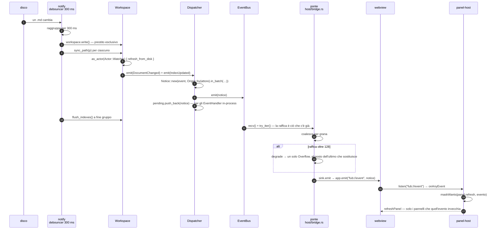

# La forma della shell

Torna a [PIANO.md](../PIANO.md) · [ui-protocol.md](ui-protocol.md) · [i verbali](../decisions/README.md)

Dove sta cosa nel frontend, e le regole che tengono in piedi quella divisione. È
il verbale operativo della
[decisione 0015](../decisions/0015-la-forma-della-shell.md): lì c'è il perché,
qui la mappa da consultare quando si scrive un file nuovo.

## Perché un albero dichiarato

Il frontend è nato piatto: quattordici file in `frontend/src/`, con `main.ts` a
1622 righe, 81 funzioni di primo livello e 18 variabili globali mutabili. Non è
disattenzione: **non c'era un posto dove mettere le cose**, e in mancanza di un
posto ogni aggiunta finisce nel file più grande. Il costo non lo paga la voce che
lo provoca, lo paga quella dopo — e quelle dopo erano già scritte nella roadmap.
Con l'albero, la [0016](../decisions/0016-cosa-e-una-view.md) ha portato
venticinque specie di nodo nuove toccando `ui/node.ts`, `ui/views.ts` e
`host/contract.ts` e nient'altro; il [§10.3](../roadmap/10-gli-eventi.md) ha
toccato `ui/notify.ts`, un `panels/activity.ts` nuovo e la barra di stato.

## L'albero

```
frontend/src/
  main.ts        il punto di montaggio: compone e nient'altro
  style.css      le regole dei componenti

  host/          la cucitura con l'esterno, e nient'altro
    contract.ts    i tipi (e i pochi valori) rispecchiati dal Rust (nessun @tauri-apps)
    enums.generated.ts  le union di stringhe EMESSE dai tipi Rust (decisione 0053)
    ipc.ts         `api` + il canale eventi: i comandi del backend
    query.ts       il canale dati: si costruisce una query, si apre una risposta
    dialog.ts      le superfici di SISTEMA: conferme, selettore di cartella

  state/         lo stato condiviso e ciò che lo cambia
    store.ts       i campi condivisi + il bus dei segnali + lo stato di vista
    layout.ts      l'albero dei riquadri: quanti sono, come sono disposti, che
                   tab tiene ognuno e in che modalità (§1.2)
    kernel.ts      il router degli eventi del kernel
    vault.ts       le operazioni sul vault (tutte dal registro comandi)
    organization.ts  l'organizzazione del vault: specchio + le quattro scritture

  ui/            le primitive di interfaccia, senza dominio (un'eccezione: intents.ts)
    node.ts        il renderer di `UiNode`
    panel-host.ts  il registro dei pannelli: chi c'è, e quando si ridisegna
    views.ts       l'adattatore `ViewSpec` → pannello, per ciò che il backend dichiara
    intents.ts     gli intenti che la shell sa eseguire (l'unico qui che nomina i pannelli)
    palette.ts     la palette dei comandi
    menu.ts        menu contestuale e selettore di icona
    notify.ts      il centro notifiche: toast, storico, raggruppamento (§10.3)
    dom.ts         `$`

  panels/        un modulo per dominio
    document.ts    i riquadri: gli editor, **un buffer per documento** (non per
                   riquadro), le tab, la modalità di ciascuno, il contesto di
                   sessione del riquadro col fuoco
    preview.ts     il documento reso (modalità Lettura) e gli embed
    explorer.ts    l'albero, gli spazi, le appuntate, il drag & drop
    search.ts      la barra e i risultati (§21.4-§21.5: qui atterrano anche il
                   quick switcher e la ricerca dentro la nota aperta — una porta
                   sola verso l'indice, non tre)
    trash.ts       **solo il gesto**: la conferma prima di cestinare una nota.
                   Il pannello del cestino è una view dichiarata (§1.2), e la
                   cronologia — che era `history.ts` — anche: il file non c'è più
    sidebar.ts     quale pannello della sidebar occupa lo spazio
    graph.ts       il grafo su canvas (superficie privilegiata, fuori da UiNode)
    activity.ts    il centro attività: cosa sta girando, a che punto è, come si ferma (§10.3)
    settings.ts    il pannello di impostazioni: il form generato dallo schema che
                   i componenti dichiarano, i componenti da accendere e spegnere,
                   i vault conosciuti (§11.1)

  editor/        i moduli CodeMirror, autonomi e iniettati
    editor.ts, editor-commands.ts, completions.ts, livepreview.ts

  rules/         le regole condivise col Rust
    organizer.ts   alberatura, folder note, nome pagina
    offsets.ts     il ponte byte UTF-8 ↔ code unit UTF-16

  theme/         i token
    tokens.css

  __fixtures__/  le fixture generate da serde (il mirror TS↔Rust)
```

Di `host/` un file **non si scrive**: `enums.generated.ts` è emesso dagli `enum`
senza payload del contratto (`crates/fub-abi/tests/ts_enums.rs`,
[decisione 0053](../decisions/0053-il-contratto-ha-una-sorgente.md)), e
`contract.ts` lo ri-esporta tenendo accanto la prosa. La riga di taglio è *ciò
che si deriva senza reimplementare serde*: i casi di un enum nudo sì, la forma di
un record o di un variant con payload no — quelli restano rispecchiati a mano e
li presidia la fixture. E la forma delle stringhe è quella di **serde**, non
quella del WIT: sull'IPC un evento è `{"type": "trouble", …}` piatto, nel WIT è
un `variant` con il payload in un record a sé, e i due confini non si generano
l'uno dall'altro.

Un file **non rispetta** la riga che lo ospita: `ui/intents.ts` importa
`panels/document` e `panels/search`, mentre `ui/` è per il resto senza dominio.
Non è una svista: gli intenti arrivano da due sorgenti diverse (un `ViewUpdate`
di una view e un `CommandEffect` di un comando) e sono gli stessi perché sono
intenti **della shell**. Il vincolo che lo rende innocuo è che nessun modulo di
`panels/` importa `intents.ts`: è un pozzo, non un anello.

Due cartelle **non esistono ancora come codice**, e non è una dimenticanza:

- `i18n/` — la [decisione 0040](../decisions/0040-chi-localizza.md) ha risposto
  alla metà che riguardava i **provider**, e nel modo che toglie lavoro a questa
  cartella: le loro stringhe le risolve il *kernel*, e alla shell arrivano già
  nude. Resta il catalogo di ciò che la shell scrive di suo (`main.ts`,
  `panels/*.ts`) e il suo `t()`, cioè il §12.4, più gli errori del confine
  (§12.2). La cartella nasce quando nasce quel catalogo.
- `theme/` esiste ma con **solo i token di oggi**. Il sistema vero — scala
  semantica, chiaro/scuro/sistema, snippet CSS dell'utente, alto contrasto e
  reduced motion — è 6.2 e 25.1 di FEATURES; qui c'è il contenitore in cui
  atterrerà.

## Le regole

### 1. Una cucitura sola verso l'host, e un test che la presidia

Nessun modulo importa `@tauri-apps` fuori da `host/ipc.ts` e `host/dialog.ts`.
Vale **anche per i tipi**: `import type` conta come un import, o la regola si
aggira con una parola.

Il presidio è `host/no-tauri-outside-host.test.ts`, che legge i sorgenti con
`import.meta.glob` e fallisce nominando il file colpevole. Non è una regola di
stile: è il prerequisito del PWA (26.3), del mobile (26.2) e degli e2e della
shell ([§17.2](../roadmap/17-presidi-che-restano.md)), che girano contro un host
finto — e prima bastava **una riga** in `main.ts` per perderlo.

Per la stessa ragione `host/ipc.ts` dichiara il ritorno del canale eventi come
`() => void` invece che `UnlistenFn`, e `tsconfig.json` non ha i tipi di Node: la
shell gira in una webview, e non avere `process`/`fs` a tiro è ciò che impedisce
di scrivere codice che nell'app impacchettata non esiste.

### 2. Chi cambia qualcosa lo dice; chi ha interesse si iscrive

Due bus, con due nature diverse:

- **`state/kernel.ts`** — gli eventi del *backend*. Un modulo dichiara quale
  evento gli interessa (`onEvent("document_renamed", …)`) e riceve l'evento già
  ristretto alla sua variante, con l'origine. C'è un solo ascoltatore "di tutto"
  legittimo (`onAnyEvent`), ed è l'host dei pannelli, che decide per **dato** —
  la maschera che ogni pannello ha dichiarato — e non per conoscenza privata di
  chi c'è.
- **`state/store.ts`** — i segnali della *shell*: `vault`, `documents`,
  `active-doc`, `organization`, `stale-views`.

Prima c'era una funzione sola, `handleKernelEvent`, che conosceva privatamente
ogni pannello. Il guadagno non è l'eleganza: è che `explorer` e `document`
possono entrambi dipendere dallo store senza dipendere l'uno dall'altro. Un ciclo
di import fra due moduli di dominio, in un bundle ESM, è un `undefined`
all'avvio che non dice da dove viene.

In entrambi i bus **un ascoltatore che lancia non ferma gli altri**: il difetto
si manifesterebbe come «metà finestra ferma», cioè nel modo più difficile da
ricondurre alla causa.

### 3. Le operazioni sul vault non disegnano e non aprono

`state/vault.ts` fa l'operazione e **restituisce** ciò che serve; chi ha chiamato
decide cosa farne. È la regola che tiene i moduli aciclici: se `createNote`
aprisse da sé la nota creata dovrebbe importare `panels/document`, che a sua
volta la chiama per creare la nota di un wikilink non risolto.

Le uniche due eccezioni sono iniettate esplicitamente in `main.ts`, con la
ragione scritta accanto: il pannello del documento riceve `searchTag`,
l'anteprima riceve `openPage`.

### 4. Lo store è piccolo per costruzione

Nello store sta ciò che serve a **più di un modulo**. I risultati di ricerca
restano nel loro pannello. Uno store che raccoglie tutto torna a essere
l'oggetto-dio, con un file diverso.

Le voci del cestino e l'anteprima di una versione erano gli altri due esempi, e
adesso sono un esempio più forte: non stanno *nel loro pannello*, stanno **di là
dal confine**, perché quei due pannelli sono view dichiarate e ciò che devono
ricordare vive nello stato di vista dell'esemplare (§11.2). Uno stato che non ha
mai attraversato il confine non può finire nello store per distrazione.

### 5. Un pannello dichiara cosa lo fa invecchiare; l'host decide quando chiamarlo

C'è **un solo modo** di montare un pannello, e sta in `ui/panel-host.ts`: si
dichiara `id`, `title`, `placement`, la maschera `refresh` degli eventi del
kernel che lo invecchiano, se segue il documento aperto (`followsDoc`), se è
visibile (`visible`) e come si disegna (`render`). Nessun pannello si iscrive più
da sé al bus per ridisegnarsi.

Una view dichiarata dal backend è un pannello come gli altri: `ui/views.ts` è
solo l'adattatore che traduce un `ViewSpec` in un `Panel`. Da lì in giù non c'è
differenza — ed è il punto, perché finché convivono due modi il secondo vince per
pigrizia.

La maschera che arriva in quel `ViewSpec` è già quella dell'**esemplare** e non
della specie ([0063](../decisions/0063-la-maschera-e-dell-esemplare.md)): la
risolve il kernel alla registrazione, chiedendola al provider per l'esemplare che
la shell monta da sé. La shell non fa un secondo giro di IPC per riaverla — la
domanda ha già la sua risposta dentro `list_views`.

Cosa ci si guadagna, oltre alla simmetria:

- **`overflow` si tratta in un posto solo.** Non è un fatto del dominio, è la
  coda troncata: l'host riconcilia **tutti** i pannelli da zero, e nessuno lo
  dichiara fra i suoi `refresh`. Prima era la terza riga copiata in ogni
  pannello, e quella che si dimenticava per prima.
- **La terna non si copia più.** `index_updated`/`batch_ended` stava a mano in
  explorer, ricerca e cestino: dimenticarne un pezzo — è già successo con
  `batch_ended` ([decisione 0011](../decisions/0011-il-lotto.md)) — lasciava un
  pannello fermo senza che nulla lo dicesse.
- **Un pannello che lancia non zittisce gli altri.**
- **La maschera si applica con la regola del contratto**, non con un `includes`
  scritto qui: `refresh` è una `EventMask` intera
  ([decisione 0033](../decisions/0033-la-grana-di-un-abbonamento.md)) — specie,
  prefissi di topic, soggetto, e **cosa è cambiato**
  ([0069](../decisions/0069-cosa-sa-dire-un-abbonamento.md)) — e a deciderla è
  `maskWants` (`rules/mirrored.ts`),
  gemella della funzione del kernel e legata a lei dalla fixture generata. Con la
  lista di specie di prima, la shell avrebbe ignorato in silenzio una view
  ristretta a una cartella.
- **Il registro è l'inventario** di quali superfici questa shell abbia davvero —
  il pezzetto di [§7.6](../roadmap/07-il-confine.md) che le riguarda.

Due iscrizioni dirette restano, e non sono eccezioni perché non sono *ridisegni*:
`panels/explorer.ts` ascolta `document_renamed` per traslocare l'organizzazione
**prima** del ridisegno (il router consegna i generici prima dei tipizzati,
quindi un refresh dal registro partirebbe col path vecchio), e
`panels/document.ts` reagisce agli eventi sul documento aperto — l'editor non è
un pannello del registro, è l'area principale.

## Da un file cambiato fuori a un pannello ridisegnato

Il percorso completo di una scrittura che non è passata da noi — qualcuno salva
una nota da un altro editor, o da un client di sincronizzazione. Attraversa
quattro processi logici e tre freni, e ognuno dei tre ha un numero diverso.



| Pezzo | Dove | Numero |
|---|---|---|
| debounce del rilevatore | [watcher.rs:151](../../crates/fub-host/src/watcher.rs) | **300 ms** |
| tetto della coda di un iscritto | [bus.rs:51](../../crates/fub-kernel/src/bus.rs) | **1024** notice |
| budget di un drenaggio | [dispatcher.rs:44](../../crates/fub-kernel/src/dispatcher.rs) | **1024** consegne |
| tetto della raffica del ponte | [bridge.rs:61](../../crates/fub-host/src/bridge.rs) | **128** notice |
| chi timbra l'origine | [dispatcher.rs:157](../../crates/fub-kernel/src/dispatcher.rs) | un punto solo |
| chi decide cosa è sacrificabile | [event.rs `is_recoverable`](../../crates/fub-abi/src/event.rs) | un punto solo, nel contratto |
| chi decide se un pannello è invecchiato | [panel-host.ts:164](../../frontend/src/ui/panel-host.ts) via [rules/mirrored.ts](../../frontend/src/rules/mirrored.ts) | la gemella di `mask_wants` del kernel |

Tre cose che il disegno dice e che è facile dare per scontate al contrario.

**Il ponte non ha una finestra temporale.** Non aspetta N millisecondi: fa una
`recv()` bloccante e poi prende con `try_iter()` quello che nel frattempo si è
accumulato. Il freno è la dimensione della raffica, non il tempo — quindi a
carico basso la latenza è quella di un evento singolo, e il raggruppamento
compare solo quando ci sarebbe stato comunque da smaltire.

**Il raggruppamento ha quattro grane e non una** — `IndexUpdated`,
`DocumentChanged(id)`, `ViewInvalidated(view, esemplare)`, `JobProgress(id)` — e
di ogni grana si tiene **l'ultima**. Tutto il resto passa uno per uno: un
`VaultClosed` non si fonde con niente, perché non è recuperabile.

**Questo percorso non apre nessun lotto.** Il gruppo del debouncer e il *lotto*
della [0011](../decisions/0011-il-lotto.md) sono due cose diverse con lo stesso
nome comune: il lotto lo apre solo chi chiama `Workspace::batch` — una rinomina,
un comando, un annullamento — e si chiude con un `Event::BatchEnded`. Il
debouncer non ne apre uno, quindi da qui non esce nessun `BatchEnded`, e ogni
`DocumentChanged` viaggia per sé. Un diagramma che mettesse un lotto in mezzo a
questa catena disegnerebbe un evento che non arriva mai.

## Cosa resta aperto, e perché

Del [§1.2](../roadmap/18-editor-e-tastiera.md#12-smontare-il-monolite) non resta
niente: il modello di layout è fatto
([decisione 0078](../decisions/0078-i-riquadri-sono-un-fatto-della-shell.md)) —
l'area principale è un albero di riquadri, ognuno con le sue tab e la sua
modalità, e la finestra si ricorda com'era. Restano queste, che sono altre voci:

- **I workspace salvati con un nome.** La casa è decisa — nel vault, come le
  note e le scorciatoie ([0076](../decisions/0076-le-impostazioni-vivono-nel-vault.md)),
  perché li ha creati l'utente apposta — e il formato aspetta di vedere assetti
  veri. È l'altra metà della distinzione che la 0078 ha fatto: *com'era aperta
  la finestra* non ha un nome ed è stato di vista (file della macchina), *un
  workspace* un nome ce l'ha, e un'impostazione ha un valore alla volta mentre
  un layout ne ha uno per nome ([0036](../decisions/0036-le-impostazioni-e-i-tre-stati.md)).
  Con questo il [§11.2](../roadmap/11-impostazioni-e-i-tre-stati.md) si chiude:
  il «terzo stato senza contenitore» che il titolo nominava non era terzo — i
  due contenitori esistevano già entrambi.
- **Una view dichiarata dentro un riquadro** ([§3.3](../roadmap/18-editor-e-tastiera.md)).
  Un riquadro tiene tab di **documenti**; il giorno che ne tenga una di view, il
  grafo smette di essere un pannello nativo in overlay. Non è più bloccato da
  niente — è il posto che mancava, e adesso c'è.
- ~~**Cestino e cronologia come `ViewProvider` veri.**~~ **Fatti**
  ([0075](../decisions/0075-una-view-non-chiede-con-una-finestra.md)): sono due
  provider di `fub-features`, e di qua è rimasto solo il *gesto* di cestinare —
  che è della shell perché tocca il buffer aperto. Il grafo non è in attesa di
  niente: resta fuori da `UiNode` per decisione di M2, ed è nel registro come
  superficie `overlay`.
