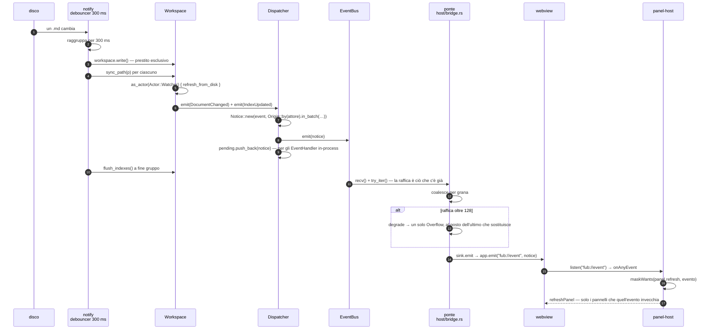

# La forma della shell

Torna a [PIANO.md](../PIANO.md) · [ui-protocol.md](ui-protocol.md) · [i verbali](../decisions/README.md)

Questo documento mappa la struttura del frontend. Stabilisce le regole della sua architettura. Deriva dalla [decisione 0015](../decisions/0015-la-forma-della-shell.md). La decisione originale spiega i motivi. Questo documento funge da guida pratica. Consultalo prima di creare un file nuovo.

## L'albero dichiarato

Il frontend utilizza una struttura ad albero. L'organizzazione modulare evita l'accumulo di codice in file enormi causato dall'assenza di un posto dedicato.

Il frontend originario era piatto. La directory `frontend/src/` conteneva quattordici file. Il file `main.ts` possedeva 1622 righe, 81 funzioni di primo livello e 18 variabili globali mutabili. Ogni aggiunta ingrandiva il file principale. Questa inerzia tecnica penalizzava gli sviluppi successivi.

I vantaggi della struttura ad albero includono:
- La [0016](../decisions/0016-cosa-e-una-view.md) ha aggiunto venticinque specie di nodo nuove. Ha modificato esclusivamente `ui/node.ts`, `ui/views.ts` e `host/contract.ts`.
- Il [§10.3](../roadmap/10-gli-eventi.md) ha alterato solo `ui/notify.ts`, un nuovo `panels/activity.ts` e la barra di stato.

## L'albero

- `frontend/src/main.ts`: Punto di montaggio. Compone l'applicazione.
- `frontend/src/style.css`: Regole CSS dei componenti.
- **`host/`**: Cucitura con l'esterno.
  - `contract.ts`: Tipi e valori speculari al Rust (il linguaggio del backend). Esclude le dipendenze da `@tauri-apps`. Definisce le QUERY: `testoCercato`, `testoNelDocumento`, `nomeCercato`. Funge da porta unica verso l'indice. Prevede tre configurazioni (decisioni 0082, 0083).
  - `enums.generated.ts`: Union di stringhe derivate dai tipi Rust (decisione 0053).
  - `ipc.ts`: Canale `api` e canale eventi. Veicola i comandi del backend.
  - `query.ts`: Canale dati. Costruisce una query e apre la risposta.
  - `dialog.ts`: Superfici di sistema. Gestisce conferme e selettore di cartella.
- **`state/`**: Stato condiviso e mutazioni.
  - `store.ts`: Campi condivisi, bus dei segnali e stato di vista.
  - `layout.ts`: Albero dei riquadri. Gestisce numero, disposizione, tab per riquadro e modalità (§1.2).
  - `kernel.ts`: Router degli eventi del kernel (il nucleo del backend).
  - `vault.ts`: Operazioni sul vault (lo spazio di lavoro dei file). Invocate dal registro comandi.
  - `organization.ts`: Organizzazione del vault. Include lo specchio e le quattro scritture.
  - `recenti.ts`: Elenco delle note aperte e ricerche recenti. Salva due elenchi da dieci voci nello stato di vista della shell (l'interfaccia utente) tramite la chiave `history`. Richiede un interruttore solo e un gesto per la cancellazione (§21.7).
- **`ui/`**: Primitive di interfaccia prive di dominio. Include un'eccezione: `intents.ts`.
  - `node.ts`: Renderer di `UiNode`.
  - `panel-host.ts`: Registro dei pannelli. Dichiara i pannelli e i momenti di ridisegno.
  - `views.ts`: Adattatore `ViewSpec` → pannello per le viste dichiarate dal backend.
  - `intents.ts`: Intenti eseguibili dalla shell. Unico modulo in `ui/` con riferimenti ai pannelli.
  - `palette.ts`: Palette dei comandi.
  - `menu.ts`: Menu contestuale e selettore di icona.
  - `notify.ts`: Centro notifiche. Gestisce toast, storico e raggruppamento (§10.3).
  - `dom.ts`: Espone `$`.
- **`panels/`**: Moduli legati a un singolo dominio.
  - `document.ts`: Riquadri attivi. Include gli editor, un buffer per documento (indipendente dal riquadro), tab, modalità singola e contesto di sessione.
  - `preview.ts`: Documento reso in modalità Lettura ed embed.
  - `explorer.ts`: Albero, spazi, note appuntate e drag & drop.
  - `search.ts`: Barra di ricerca e risultati del vault.
  - `doc-search.ts`: Ricerca interna alla nota aperta (§21.4) su `Mod-f`.
  - `quick-switcher.ts`: Navigazione veloce verso la nota (§21.5, FEATURES 8.1) su `Mod-o`. Cerca per nome. Mostra le note recenti a mani vuote sfruttando una memoria temporale (`state/recenti.ts`).
  - `trash.ts`: **solo il gesto** — la conferma prima di cestinare una nota. Il
    pannello del cestino è una view dichiarata (§1.2), e la cronologia — che era
    `history.ts` — anche: quel file non c'è più.
  - `sidebar.ts`: Controllo dello spazio nella barra laterale.
  - `graph.ts`: Metà shell dedicata al grafo. Disegna `fub:graph` su canvas. Riceve i dati dal `ViewProvider` (§3.3). Rende gli elementi in un sistema distaccato da `UiNode`.
  - `activity.ts`: Centro attività. Monitora i processi attivi e il loro arresto (§10.3).
  - `settings.ts`: Pannello impostazioni. Mostra il form generato dai componenti, gestisce i componenti attivabili e i vault conosciuti (§11.1).
- **`editor/`**: Moduli CodeMirror autonomi e iniettati. Include `editor.ts`, `editor-commands.ts`, `completions.ts`, `livepreview.ts`.
- **`rules/`**: Regole condivise col Rust.
  - `organizer.ts`: Alberatura, folder note e nome pagina.
  - `offsets.ts`: Conversione ponte byte UTF-8 ↔ code unit UTF-16.
  - `sintassi.ts`: Unico punto di riconoscimento della sintassi shell (§4.4).
  - `sintassi.generated.ts`: Dichiarazione esposta da un montaggio vero.
- **`theme/`**: Token visivi (`tokens.css`).
- **`__fixtures__/`**: Fixture generate da serde (il serializzatore automatico Rust).

Accanto a `src/` sta `frontend/banco/`, che non è codice della shell ma la
guarda: è il **banco visivo** del §31.1
([0166](../decisions/0166-il-banco-che-vede.md)). Monta `index.html` e `main.ts`
veri e sostituisce due moduli soli — quelli della regola 1 qui sotto — poi
fotografa venti scene in due luci e le confronta con le baseline versionate.
Il confronto a pixel è un cancello locale; il contrasto reso (`axe-core`) e il
presidio delle scene girano in CI. Come si lanciano sta in
[CONTRIBUTING.md](../CONTRIBUTING.md#il-banco-visivo-e-la-metà-che-resta-fuori-da-qui).

Il file `enums.generated.ts` in `host/` è autogenerato. Deriva dagli `enum` senza payload del contratto (`crates/fub-abi/tests/ts_enums.rs`, [decisione 0053](../decisions/0053-il-contratto-ha-una-sorgente.md)). Il file `contract.ts` lo esporta includendo la documentazione testuale. Il confine di generazione automatica copre solo i casi di un `enum` nudo. Deriviamo a mano la forma di un record o di un variant con payload. La fixture presidia questi tipi manuali. La serializzazione delle stringhe applica le regole di serde al posto di quelle del WIT (WebAssembly Interface Type). Sull'IPC (Inter-Process Communication) un evento appare piatto come `{"type": "trouble", …}`. Il WIT lo struttura usando un `variant` accompagnato da un record di payload separato. Le due metodologie rimangono distinte.

Un file fa eccezione rispetto alla cartella ospitante: `ui/intents.ts` importa i moduli da `panels/document` e `panels/search`. Il resto di `ui/` rimane agnostico ai domini. Questa importazione supporta due sorgenti distinte: un `ViewUpdate` di una view o un `CommandEffect` di un comando. Essi convergono in intenti centralizzati della shell. L'architettura evita cicli poiché i moduli di `panels/` omettono di importare `intents.ts`. Il file funge da pozzo finale al posto di chiudere un anello di dipendenze.

Due cartelle mancano volutamente dal codice sorgente:

- `i18n/`: La [decisione 0040](../decisions/0040-chi-localizza.md) affida la metà delle localizzazioni al kernel per le stringhe dei provider. La shell acquisisce tali stringhe in forma pre-localizzata. La cartella ospiterà il catalogo delle stringhe interne della shell (`main.ts`, `panels/*.ts`), l'implementazione del suo `t()` (§12.4) e la gestione degli errori di confine (§12.2).
- `theme/`: Attualmente contiene solo i token base di oggi. Espanderà il sistema visivo includendo scala semantica, temi chiaro/scuro/sistema, snippet CSS dell'utente, alto contrasto e movimento ridotto. Questi interventi soddisfano i punti 6.2 e 25.1 di FEATURES.

## Le regole

### 1. Una cucitura sola verso l'host e un test di presidio

I moduli evitano di importare `@tauri-apps` esternamente a `host/ipc.ts` e `host/dialog.ts`. Questo principio vieta esplicitamente l'importazione di un tipo tramite `import type`.

Il file `host/no-tauri-outside-host.test.ts` implementa un test di verifica. Legge i sorgenti tramite `import.meta.glob`. Segnala nominalmente il file colpevole in caso di violazione. Questo incapsulamento abilita la conformità PWA (26.3), il supporto mobile (26.2) e l'esecuzione degli e2e (end-to-end) della shell contro un host simulato. Storicamente, una riga in `main.ts` comprometteva questa architettura. I test e2e attuali ([0112](../decisions/0112-un-e2e-contro-un-host-finto-prova-il-cablaggio.md)) montano la shell intera contro `host/finto.ts`. Il compilatore interpreta quel file come un modulo intero (`typeof import("./ipc")`) ed evita la sua lettura come un pezzo parziale di modulo.

Questa cucitura ha ora due clienti e non uno. Il secondo è il banco visivo, che
sostituisce esattamente `host/ipc.ts` e `host/dialog.ts` con un plugin di Vite
(`resolveId`, non `resolve.alias`: un alias è una regola sul testo di un import,
e quei due moduli arrivano da path relativi a profondità diverse). Il valore
della regola si misura qui: la superficie da sostituire per fotografare l'app
vera è di due file, e nessuna riga di produzione cambia.

Il file `host/ipc.ts` dichiara il ritorno del canale eventi come `() => void`. Elimina la referenza a `UnlistenFn`. Il `tsconfig.json` sopprime volontariamente i tipi di Node. La shell gira all'interno di una webview. La privazione di `process` e `fs` assicura la compatibilità del codice nell'app impacchettata.

### 2. Sottoscrizione per interesse e annuncio dei cambiamenti

Il sistema impiega due bus con due nature diverse:

- **`state/kernel.ts`**: Gestisce gli eventi emessi dal backend. Un modulo richiede l'evento di suo interesse (es. `onEvent("document_renamed", …)`). Riceve la risposta già ristretta alla sua variante, completa di origine. L'host dei pannelli funge da unico ascoltatore globale autorizzato tramite `onAnyEvent`. Valuta la ricezione consultando la maschera dichiarata da ciascun pannello. Ignora la conoscenza privata dei componenti presenti.
- **`state/store.ts`**: Regola i segnali specifici della shell: `vault`, `documents`, `active-doc`, `organization`, `stale-views`.

Prima esisteva una funzione sola, `handleKernelEvent`, strettamente legata a ogni pannello. La scissione attuale separa le responsabilità. Entità come `explorer` e `document` si appoggiano allo store rimanendo reciprocamente indipendenti. Un ciclo di import all'interno di un bundle ESM provocherebbe un valore `undefined` all'avvio difficile da isolare.

Un ascoltatore in errore isola il proprio fallimento su entrambi i bus. Gli altri componenti mantengono la normale operatività. Questa accortezza previene il blocco parziale della finestra.

### 3. Le operazioni sul vault restituiscono dati

Il modulo `state/vault.ts` elabora le richieste e restituisce le informazioni necessarie. Il chiamante valuta l'uso dei dati. Questo schema mantiene i moduli aciclici. Ad esempio, la funzione `createNote` evita di importare `panels/document` per aprire direttamente un wikilink.

Il sistema contempla due eccezioni in `main.ts`. Il pannello del documento acquisisce `searchTag`. L'anteprima riceve `openPage`.

### 4. Lo store si mantiene compatto per costruzione

Lo store ospita esclusivamente dati condivisi tra più di un modulo. I risultati di ricerca restano confinati nel loro pannello. Uno store globale ripristinerebbe la criticità di un oggetto-dio isolato in un file diverso.

Il cestino e l'anteprima di una versione forniscono gli altri due esempi. Risiedono di là dal confine, gestiti dal backend. Appartengono allo stato di vista dell'esemplare (§11.2) di quelle specifiche view dichiarate. Questo isolamento garantisce la corretta archiviazione dello stato.

### 5. Un pannello dichiara le condizioni di invecchiamento

La shell stabilisce un solo modo per il montaggio dei pannelli tramite `ui/panel-host.ts`. Un pannello dichiara `id`, `title`, `placement`, la maschera `refresh` per gli eventi usuranti del kernel, l'allineamento al documento (`followsDoc`), lo stato visibile (`visible`) e la procedura di disegno (`render`). Il pannello delega completamente il ridisegno all'host.

Il backend dichiara le view adottando l'architettura di un pannello standard. L'adattatore `ui/views.ts` traduce un `ViewSpec` in un `Panel`. La coesistenza di due modi incoraggerebbe l'utilizzo del pattern scorretto.

La maschera eventi dello `ViewSpec` qualifica uno specifico esemplare al posto di una specie generica ([0063](../decisions/0063-la-maschera-e-dell-esemplare.md)). Il kernel la valuta durante la fase di registrazione interrogando il provider. Il payload `list_views` trasmette la configurazione completa. Questo approccio previene la necessità di un secondo giro IPC.

L'adozione offre i seguenti vantaggi architetturali:

- **L'`overflow` si tratta in un posto solo.** Non è un fatto del dominio: è la
  coda troncata. L'host riconcilia **tutti** i pannelli da zero, e nessun
  pannello lo dichiara fra i suoi `refresh`. Prima era la terza riga copiata in
  ognuno — e la prima che ci si dimenticava.
- **Diffusione di eventi automatizzata:** Propaga segnali come `index_updated` e `batch_ended` da una sorgente unica. In passato, dimenticare un pezzo nei pannelli causava blocchi silenziosi ([decisione 0011](../decisions/0011-il-lotto.md)).
- **Resilienza alle interruzioni:** Un pannello problematico confina il proprio stato. Gli altri continuano il lavoro regolarmente.
- **Applicazione contrattuale della maschera:** Il sistema adopera una `EventMask` integrale ([decisione 0033](../decisions/0033-la-grana-di-un-abbonamento.md)). Scarta l'approccio debole basato su una stringa `includes`. Monitora la specie, il prefisso dei topic, il soggetto e il dettaglio di cosa è cambiato ([0069](../decisions/0069-cosa-sa-dire-un-abbonamento.md)). La procedura `maskWants` in `rules/mirrored.ts` convalida l'evento ricalcando la funzione originale del kernel. La valutazione corretta evita di ignorare una view ristretta a una cartella.
- **Censimento del confine:** Il registro forma l'inventario definitivo delle superfici supportate dalla shell ([§7.6](../roadmap/07-il-confine.md)).

Due iscrizioni dirette rimangono operative per necessità temporali:
- `panels/explorer.ts` intercetta `document_renamed` per traslocare l'organizzazione in anticipo. Risolve la criticità di un ridisegno con percorsi obsoleti.
- `panels/document.ts` gestisce direttamente gli eventi sul documento aperto. Identifica l'editor come nucleo centrale indipendente dai pannelli standard.

## Da un file cambiato fuori a un pannello ridisegnato

Questo è il percorso architetturale attivato da un salvataggio esterno, come l'intervento da un altro editor. Il flusso valica quattro processi logici sottoposti a tre freni operativi. Ognuno dei tre freni dichiara un numero di configurazione diverso.

| Componente | Posizione | Valore |
|---|---|---|
| Debounce del rilevatore | [watcher.rs:179](../../crates/fub-host/src/watcher.rs) | **300 ms** |
| Limite coda iscritto | [bus.rs:51](../../crates/fub-kernel/src/bus.rs) | **1024** notice |
| Budget drenaggio | [dispatcher.rs:64](../../crates/fub-kernel/src/dispatcher.rs) | **1024** consegne |
| Limite raffica ponte | [bridge.rs:64](../../crates/fub-host/src/bridge.rs) | **128** notice |
| Marcatore di origine | [dispatcher.rs:273](../../crates/fub-kernel/src/dispatcher.rs) | Un punto solo |
| Selettore eventi sacrificabili | [event.rs `is_recoverable`](../../crates/fub-abi/src/event.rs) | Un punto solo, nel contratto |
| Valutatore invecchiamento pannelli | [panel-host.ts:187](../../frontend/src/ui/panel-host.ts) via [rules/mirrored.ts](../../frontend/src/rules/mirrored.ts) | La gemella di `mask_wants` del kernel |

Tre comportamenti architetturali specifici governano il sistema:

- **Immediatezza della ricezione sul ponte:** L'infrastruttura adopera la chiamata bloccante `recv()`. Esegue immediatamente `try_iter()` sui pacchetti pervenuti in tempo reale. Mantiene il blocco basato sulla dimensione saltando l'attesa di N millisecondi. Conserva la latenza ridotta pari all'elaborazione di un evento singolo in condizioni normali. Raggruppa i dati solamente in presenza di carico di rete smaltibile.
- **Segmentazione delle grane:** Il consolidamento sfrutta quattro grane al posto di una: `IndexUpdated`, `DocumentChanged(id)`, `ViewInvalidated(view, esemplare)` e `JobProgress(id)`. Preserva esclusivamente la direttiva finale per ogni categoria. Smista individualmente il traffico estraneo per garantire l'avviso irrevocabile di un evento letale come un `VaultClosed`.
- **Questo percorso non apre nessun lotto.** Il gruppo del debouncer e il
  *lotto* della [0011](../decisions/0011-il-lotto.md) sono due cose diverse con
  lo stesso nome comune. Il lotto lo apre solo chi chiama `Workspace::batch` —
  una rinomina, un comando, un annullamento — e si chiude con un
  `Event::BatchEnded`. Il debouncer non ne apre uno: da qui non esce nessun
  `BatchEnded`, e ogni `DocumentChanged` viaggia per sé. Un diagramma che
  mettesse un lotto in mezzo a questa catena disegnerebbe un evento che non
  arriva mai.

## Cosa resta aperto, e perché

L'integrazione del modello di layout depenna definitivamente il [§1.2](../roadmap/18-editor-e-tastiera.md#12-smontare-il-monolite) corroborando la [decisione 0078](../decisions/0078-i-riquadri-sono-un-fatto-della-shell.md). L'albero ospita i riquadri supportando configurazioni di tab personalizzate. Preserva integralmente lo stato della finestra pregressa.

Prospettive attive nel progetto:

- **I workspace salvati con un nome:** Alloggeranno nel vault accostati alle note e alle chiavi del kernel ([0076](../decisions/0076-le-impostazioni-vivono-nel-vault.md)). I selettori diretti della shell persistono sulla macchina antecedendo cronologicamente il caricamento dell'area ([0116](../decisions/0116-lo-scope-di-una-chiave-segue-la-vita-di-chi-la-dichiara.md)). Gli utenti creano esplicitamente queste formazioni. Le configurazioni definiscono un workspace nominativo contrapposto alla forma della finestra priva d'intestazione. Un'impostazione riflette un valore puntuale. Un layout garantisce l'archiviazione di un tracciato associato a un nome ([0036](../decisions/0036-le-impostazioni-e-i-tre-stati.md)). Questo processo completa il [§11.2](../roadmap/11-impostazioni-e-i-tre-stati.md). Il terzo stato immaginario senza dimora sfrutta appieno i due contenitori precedentemente consolidati.

Funzioni già implementate:

- ~~**Una view dichiarata dentro un riquadro**~~ ([§3.3](../roadmap/18-editor-e-tastiera.md)): Implementazione validata con la [0079](../decisions/0079-il-grafo-esce-dall-overlay.md). Un `Tab` esplicita l'appartenenza limitandola tra un documento o una view. Il montaggio operativo di `ViewSurface::Main` si attiva all'avvio del pannello. Consuma come esemplare l'id del riquadro ospitante. L'integrazione del grafo come cliente inaugurale ha eliminato definitivamente l'overlay.
- ~~**Cestino e cronologia come `ViewProvider` veri**~~: Trasformati sulla base della [0075](../decisions/0075-una-view-non-chiede-con-una-finestra.md). Diventano due provider certificati all'interno di `fub-features`. Delegano il controllo sul gesto di eliminazione al frontend. Il renderer del grafo si aggiunge come settimo servizio ufficiale ([0079](../decisions/0079-il-grafo-esce-dall-overlay.md)). Convalida la scelta temporale M2 escludendo la dipendenza grafica verso `UiNode`. Rimuove radicalmente i riferimenti verso la zona `overlay` all'interno del registro.
