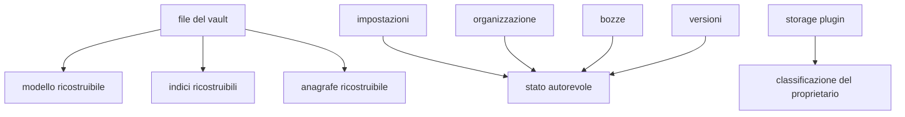
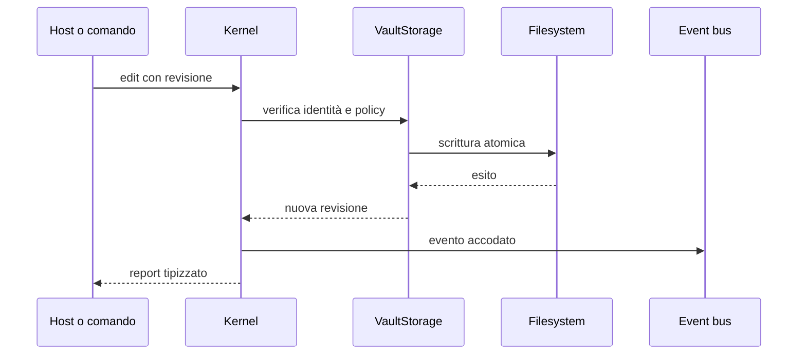

# Storage e identità

> **Domanda:** come rimangono coerenti path, documenti, cache e sidecar durante
> le modifiche?
> **Fonti autorevoli:** `crates/fub-kernel/src/`, schemi persistenti e test di
> integrazione.

## Livelli di identità

| Identità | Significato |
|---|---|
| path assoluto | posizione sul filesystem della macchina |
| `DocId` | path relativo canonico nel vault |
| revisione | impronta della sorgente su cui è calcolata una modifica |
| ancora o heading | posizione indirizzabile dentro un documento |
| id di plugin o view | identità namespaced di una registrazione |

`DocId` non è un UUID indipendente dal path. Rename e move cambiano il path
pubblico e devono aggiornare ogni derivato collegato.

## Dati autorevoli e derivati

Una posizione sotto `.fub/data/` non determina da sola che il dato sia una
cache. Lo schema e il proprietario dichiarano se può essere ricostruito.

## Apertura del vault

L'apertura separa struttura e contenuto:

1. inventaria le voci;
2. rende disponibile l'albero;
3. legge i documenti;
4. aggiorna anagrafe e indici;
5. pubblica avanzamento ed eventuali file non letti.

La prima fotografia del vault viene consegnata senza lasciare una finestra in
cui watcher e scansione possano perdere una modifica.

## Lettura e scrittura

Le scritture autorevoli passano dal kernel. Il percorso comune:

Il chiamante non tiene un lock durante codice esterno. Gli eventi vengono
pubblicati dopo l'operazione autorevole.

## Rename

Un rename deve considerare:

- collisione con un documento vivo;
- differenze di maiuscole del filesystem;
- aggiornamento del `DocId`;
- sessioni aperte;
- bozze;
- anagrafe e indici;
- organizzazione;
- riferimenti che una feature decide di riscrivere;
- evento unico e ricongiunto.

La validazione dell'identità del nome vive in regole condivise, non in ogni
chiamante.

## Sidecar

Un sidecar contiene informazioni che non appartengono al file principale ma ne
descrivono stato o provenienza. Deve avere:

- schema o forma riconoscibile;
- comportamento su versione futura;
- legame verificabile con il file a cui si riferisce, quando l'omonimia è
  possibile;
- fallback che non distrugga il documento.

## Schemi

Ogni formato persistente ha una propria `SchemaVersion`. Gli schemi non
avanzano tutti insieme.

- un derivato incompatibile può essere eliminato e ricostruito;
- un dato autorevole richiede migrazione o rifiuto;
- un file scritto da una versione più nuova non viene reinterpretato a metà;
- un fallback silenzioso è ammesso soltanto quando non può perdere dati.

Il catalogo preciso è in
[`../reference/on-disk-layout.md`](../reference/on-disk-layout.md).

## Invarianti

- nessun path esterno alla radice viene accettato per errore;
- ogni scrittura autorevole è atomica o lascia intatto il valore precedente;
- la revisione impedisce overwrite silenziosi;
- cache e autorità sono classificate per formato;
- rename, watcher e indice convergono sullo stesso `DocId`;
- i file sconosciuti vengono preservati.
