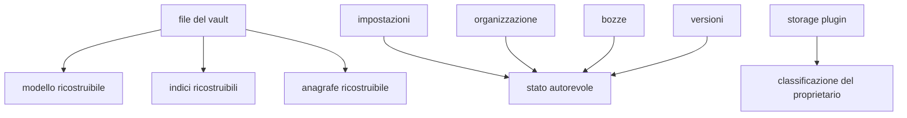
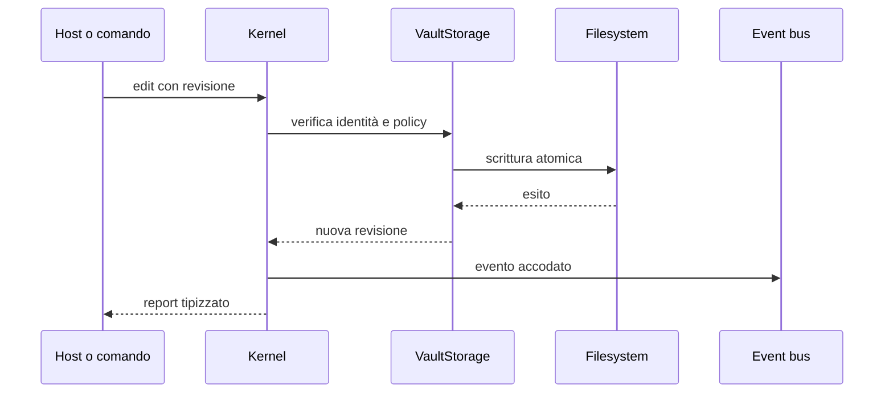
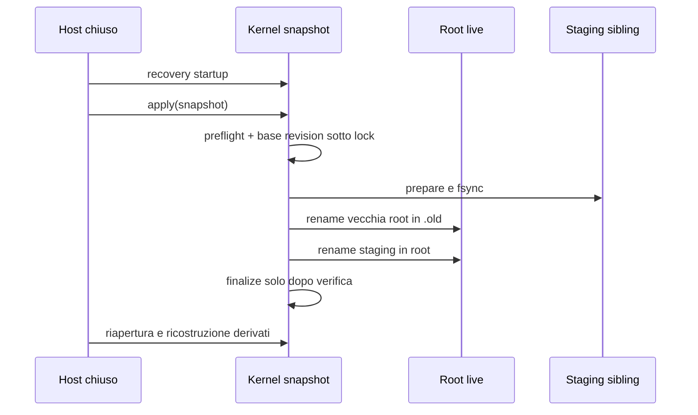

# Storage e identità

> **Domanda:** come rimangono coerenti path, documenti, cache e sidecar durante
> le modifiche?
> **Fonti autorevoli:** `crates/fub-kernel/src/`, schemi persistenti e test di
> integrazione.

## Livelli di identità

| Identità | Significato |
|---|---|
| path assoluto | posizione sul filesystem della macchina |
| `DocId` | path relativo canonico nel vault |
| revisione | impronta della sorgente su cui è calcolata una modifica |
| ancora o heading | posizione indirizzabile dentro un documento |
| id di plugin o view | identità namespaced di una registrazione |

`DocId` non è un UUID indipendente dal path. Rename e move cambiano il path
pubblico e devono aggiornare ogni derivato collegato.

## Dati autorevoli e derivati

Una posizione sotto `.fub/data/` non determina da sola che il dato sia una
cache. Lo schema e il proprietario dichiarano se può essere ricostruito.

## Apertura del vault

L'apertura separa struttura e contenuto:

1. inventaria le voci;
2. rende disponibile l'albero;
3. legge i documenti;
4. aggiorna anagrafe e indici;
5. pubblica avanzamento ed eventuali file non letti.

La prima fotografia del vault viene consegnata senza lasciare una finestra in
cui watcher e scansione possano perdere una modifica.

## Lettura e scrittura

Le scritture autorevoli passano dal kernel. Il percorso comune:

Nei percorsi staccati dell'host il chiamante non tiene il lock del workspace
durante codice esterno. Gli eventi vengono pubblicati dopo l'operazione
autorevole.

## Cancellazione

Il cestino dell'app e la rimozione osservata dal watcher condividono la stessa
coda in memoria, ma soltanto il primo sposta il file. Dopo la mossa riuscita il
kernel ritira modello, grafo e contesto attivo, quindi notifica gli indici
esterni senza tenere il lock del workspace. Perdite e panici degli indici
diventano avvisi; non annullano la cancellazione, perché il vault resta la fonte
autorevole e l'indice è ricostruibile.

Il fatto `DocumentRemoved` viene accodato dopo il ritorno degli indici. Il
watcher conserva l'attore del proprio lotto e drena una volta alla fine. Il
cestino elimina anche la bozza, registra la mossa nel journal e restituisce il
nuovo `DocId` della voce cestinata.

I compagni persistenti `.<nome>.lock`, riconosciuti dal protocollo dello storage,
non sono voci cestinate: il catalogo e lo svuotamento li escludono senza
rimuoverli. File utente come `Cargo.lock` e contenuti di directory con nomi
simili restano invece visibili e conservano le normali regole del cestino.

### CAS cooperativa

`RootedFsStorage` coordina i writer Fub tramite un file stabile
`.<nome>.lock` accanto al target, aperto relativamente alla capability.
La creazione è esclusiva; soltanto `AlreadyExists` conduce all'apertura del
lock esistente, senza troncarlo. Il file non viene rimosso al rilascio:
writer concorrenti devono continuare a riferirsi alla stessa identità.

Il lock viene acquisito prima della rilettura e resta detenuto durante il
confronto e la sostituzione atomica. Un errore di apertura o acquisizione
impedisce la scrittura e mantiene la specie I/O originale. La diagnostica
distingue lo stadio del lock dall'operazione protetta.

La CAS è esatta fra writer che rispettano questo protocollo. Con writer
esterni che ignorano il lock la protezione resta best-effort.

## Snapshot globale

Lo snapshot globale è una responsabilità del kernel, non del provider di
versioning e non dell'IPC. `fub_kernel::snapshot` enumera soltanto lo stato
autorevole: documenti, allegati e sconosciuti condividono la classe `user`
perché il kernel non possiede il `FormatRegistry`; cestino,
settings/organizzazione/drafts/journal, sidecar autorevoli e storage persistente
dei plugin hanno classi core proprie. La cache `.fub/data/plugins/<id>/` è
derivata soltanto quando contiene `.fub-cache-root`; senza marker è storage
autorevole legacy. La configurazione macchina e gli altri derivati
ricostruibili restano fuori.

La fotografia produce un manifest schema 1 deterministico. Ogni path relativo
normalizzato porta classe, owner, schema quando applicabile, size e SHA-256.
Preflight completo rifiuta prima di scrivere schema futuro, path traversal,
duplicati, symlink/file speciali, entry mancanti e mismatch di size/digest. La
base revision è il digest del manifest live; il kernel la rilegge sotto un lock
sibling stabile immediatamente prima del commit. Non deduce l'autorità dal solo
prefisso `.fub/data/`.

L'applicazione offline usa staging sibling privato e un record persistente
idempotente:

La vecchia root resta disponibile fino a `finalize`; un crash fra le fasi viene
risolto dalla recovery riconoscendo soltanto schema, transaction id e nomi
propri. File ignoti non vengono rimossi. La garanzia all-or-old-or-new vale tra
writer cooperativi; writer esterni e filesystem senza rename/fsync durevoli non
sono coperti da atomicità universale. Il restore per-file di `fub.versioning` e
il drill backup #7 rimangono percorsi separati.

## Rename

Un rename deve considerare:

- collisione con un documento vivo;
- differenze di maiuscole del filesystem;
- aggiornamento del `DocId`;
- sessioni aperte;
- bozze;
- anagrafe e indici;
- organizzazione;
- riferimenti che una feature decide di riscrivere;
- evento unico e ricongiunto.

La validazione dell'identità del nome vive in regole condivise, non in ogni
chiamante.

Su Windows il backend ancorato usa `NtSetInformationFile` con il directory
handle e un nome UTF-16, senza riaprire il path ambientale della root. Il lock
sibling della sorgente precede la sua apertura: due writer Fub concorrenti non
possono dichiarare entrambi lo spostamento, anche verso destinazioni diverse.
La syscall rifiuta atomicamente una destinazione occupata. Inoltre `cap_std`
nega la condivisione della cancellazione sulle directory Windows aperte: la
root non può essere rinominata o cancellata durante il mount.

## Sidecar

Un sidecar contiene informazioni che non appartengono al file principale ma ne
descrivono stato o provenienza. Deve avere:

- schema o forma riconoscibile;
- comportamento su versione futura;
- legame verificabile con il file a cui si riferisce, quando l'omonimia è
  possibile;
- fallback che non distrugga il documento.

## Schemi

Ogni formato persistente ha una propria `SchemaVersion`. Gli schemi non
avanzano tutti insieme.

- un derivato incompatibile può essere eliminato e ricostruito;
- un dato autorevole richiede migrazione o rifiuto;
- un file scritto da una versione più nuova non viene reinterpretato a metà;
- un fallback silenzioso è ammesso soltanto quando non può perdere dati.

Il catalogo preciso è in
[`../reference/on-disk-layout.md`](../reference/on-disk-layout.md).

## Invarianti

- nessun path esterno alla radice viene accettato per errore;
- ogni scrittura autorevole è atomica o lascia intatto il valore precedente;
- la revisione impedisce overwrite silenziosi;
- cache e autorità sono classificate per formato;
- rename, watcher e indice convergono sullo stesso `DocId`;
- i file sconosciuti vengono preservati.
