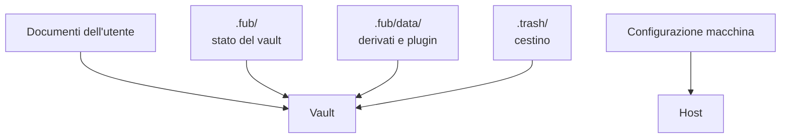

# Storage e persistenza

> **Stato:** implementato  
> **Fonte di verità:** moduli di storage del kernel e test cross-platform

La persistenza separa contenuti dell'utente, stato autorevole, dati derivati e preferenze della macchina.

## Strati

## Regole

- una scrittura autorevole usa aggiornamento atomico quando la piattaforma lo consente;
- la versione dello schema viene letta prima del contenuto;
- un formato più nuovo viene rifiutato quando degradare perderebbe informazioni;
- un dato derivato incompatibile può essere eliminato e ricostruito;
- il journal descrive mutazioni concluse, non intenzioni;
- bozze e versioning proteggono percorsi diversi e non si sostituiscono;
- i lock di file impediscono a due processi di sovrascrivere lo stesso stato di macchina.

## Rinomina e cestino

Una rinomina aggiorna identità, indici e sidecar nella stessa operazione logica. Il cestino conserva il file e, quando disponibile, la provenienza necessaria al ripristino.

## Prove mancanti

Le prove periodiche di backup/ripristino e l'applicazione atomica di snapshot sono tracciate nelle issue #7 e #5. Finché non sono chiuse, la documentazione non deve descrivere quei percorsi come garanzie complete.
