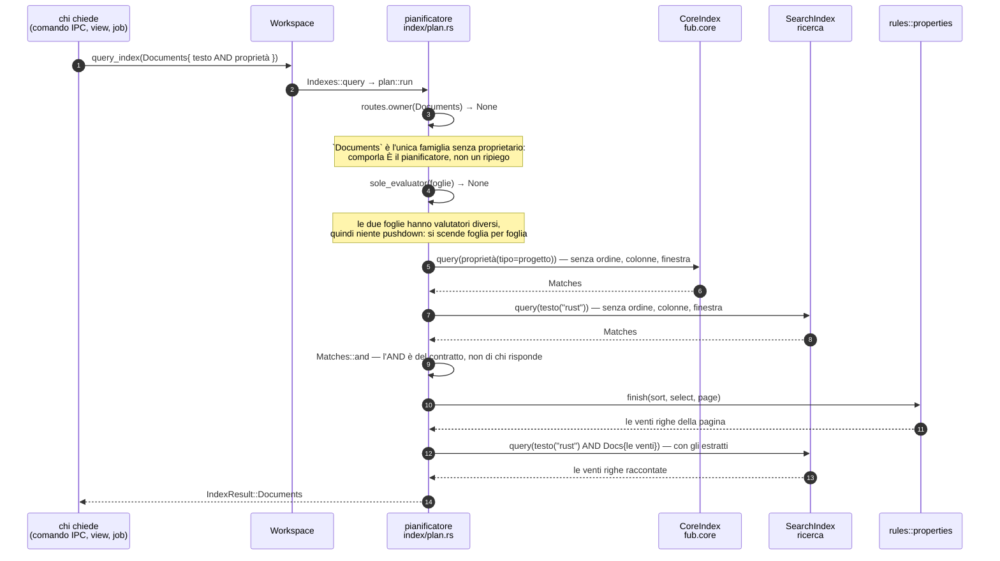

# Superficie dei trait di estensione

Tutti i trait di estensione sono definiti **una volta sola** in `fub-abi`
(`src/format.rs` e `src/traits.rs`). Le feature ufficiali li implementano in modo
nativo; i plugin di terzi (M5) li implementeranno via proxy WASM. **Il kernel vede
sempre `dyn Trait`** e non sa quale backend c'è dietro.

Torna a [../PIANO.md](../PIANO.md) · vedi [data-model.md](data-model.md),
[ui-protocol.md](ui-protocol.md), [plugin-boundary.md](plugin-boundary.md).

## Regola d'oro

Ogni argomento e ogni valore di ritorno di ogni trait è:
- un tipo di `fub-abi`, `Serialize + Deserialize`;
- esprimibile come **record/variant/resource WIT**;
- senza reference con lifetime nella memoria del kernel, senza trait object nelle
  firme dei dati, senza closure.

I trait sono **object-safe**, **sincroni** e — per contratto — **brevi**: nessun
`async fn`, nessun metodo generico. L'I/O vive nell'`HostApi` (vedi
[plugin-boundary.md](plugin-boundary.md)), non nelle firme dei provider:
`parse`/`render`/`serialize` sono CPU-pure. Il lavoro **lungo** (rete, calcolo
pesante, il vault camminato per intero) passa dai **job** —
`HostApi::spawn_job` → `Plugin::run_job` → `Event::JobDone` — eseguiti fuori dal
giro sincrono del kernel e con le capacità in mano, prese una chiamata alla volta
([decisione 0027](../decisions/0027-il-lavoro-lungo-vede-il-vault.md)).

Da **M2** un `crates/fub-abi/wit/fub/*.wit` vivente rende la regola
verificabile a ogni commit (vedi [M4](../milestones/M4-wit-hardening.md) per il
congelamento formale).

## I nove trait

Le firme qui sotto sono la copia fedele del contratto (`fub-abi`). Se il codice
diverge, il codice ha ragione: aggiornare questo documento.

### `FormatProvider` — `src/format.rs`

L'astrazione su "come si comporta un formato". Markdown è il primo provider
(nativo, `fub-format-markdown`).

```rust
pub trait FormatProvider: Send + Sync {
    fn descriptor(&self) -> FormatDescriptor;
    fn capabilities(&self) -> FormatCapabilities;
    fn parse(&self, source: &DocumentSource, ctx: &ParseContext) -> Result<DocumentModel, FormatError>;
    fn render_html(&self, model: &DocumentModel, opts: &RenderOptions) -> Result<String, FormatError>;
    fn serialize(&self, model: &DocumentModel) -> Result<String, FormatError>;
}
```

Tipi di supporto: `FormatDescriptor { id, name, extensions, source }`,
`FormatCapabilities { syntax: OptionMap }`,
`ParseContext { doc_id, options: OptionMap }` (helper `::obsidian(id)`),
`RenderOptions { target: RenderTarget, options: OptionMap }`.

**La mappa con namespace** ([decisione 0017](../decisions/0017-chi-disegna-cio-che-il-core-non-conosce.md)).
`OptionMap` è `ns:nome` → parametro: **presente = acceso**, il valore è il
dettaglio, un `false` esplicito spegne. Il namespace è di chi definisce la voce
(`fub` per il core, l'id del plugin per gli altri); le chiavi del core stanno
in `options::{syntax, render_option, permission}`. Prima erano N booleani, e con
quella forma ogni sintassi del capitolo 5.2 costava un campo del contratto.

`FormatCapabilities` e `ParseContext` **condividono il vocabolario** (`syntax`):
«cosa so fare» e «cosa devi accendere» sono la stessa domanda vista da due lati.
`RenderTarget` resta un `enum` (`Screen`, `Print`, `Pdf`, `StaticSite`) perché i
bersagli sono **esclusivi**: la mappa serve a ciò che è additivo, non a ciò che è
alternativo.

**La sorgente ha una forma dichiarata.** `FormatDescriptor::source` dice se il
provider vuole testo UTF-8 o byte grezzi, e il kernel legge di conseguenza:
«leggi il file» e «decodificalo come UTF-8» erano la stessa operazione, e per un
canvas (12), un CSV con un encoding suo (11.4, 2.3) o un PDF (13.2) la seconda
metà è sbagliata. Un provider testuale che riceva dei byte risponde
`Unsupported`, non indovina.

### `SyntaxRule` e `CustomRenderer` — ciò che il core non conosce

Il perno è il `custom_kind`: un nome con namespace lo produce, lo stesso nome lo
disegna, lo stesso nome arriva alla shell dentro `UiKind::Custom { ns }`.

```rust
pub trait SyntaxRule: Send + Sync {
    fn spec(&self) -> SyntaxRuleSpec;   // id, formato, trigger, ordine, opzione, kind prodotti
    fn apply(&self, m: &SyntaxMatch, ctx: &ParseContext)
        -> Result<Option<SyntaxProduct>, FormatError>;
}

pub trait CustomRenderer: Send + Sync {
    fn spec(&self) -> CustomRendererSpec;   // id, i custom_kind rivendicati
    fn render(&self, block: &CustomBlock, opts: &RenderOptions)
        -> Result<CustomRendering, FormatError>;
}
```

- Una regola **si innesta** su un provider che non la conosce e agisce sul
  **modello** dopo il parse. Prezzo dichiarato: non può cambiare come la
  grammatica di base spezza il testo — prende un recinto già riconosciuto
  (`SyntaxTrigger::Fence`) o un tratto fra due delimitatori
  (`SyntaxTrigger::Inline`).
- Una regola produce **solo l'escape hatch**: `Block::Custom` o `Inline::Custom`,
  mai un nodo del vocabolario centrale.
- Un renderer risponde `Html` (markup, passa dalla sanitizzazione), `Ui` (un
  albero `UiNode`, **sicuro per costruzione**) o `Fallback` («non lo disegno
  io», diverso da un errore).
- **I conflitti non sono silenziosi.** `FormatRegistry::register`,
  `register_syntax_rule` e `register_custom_renderer` restituiscono un `Result`;
  il perdente non si registra affatto, nemmeno per le sintassi libere che
  portava. Sostituire un provider si chiede per nome (`FormatRegistry::replace`).
- `Workspace::undrawn_kinds()` dice quali kind qualcuno **produce** e nessuno
  **disegna**: ogni nome lì è un blocco che l'utente leggerà crudo.

La composizione la fa il kernel: `render_preview` restituisce un
`RenderedDocument { html, parts }`, dove l'HTML porta un buco
`data-ui-slot="N"` e la parte con quel numero ci va dentro. Il provider non sa
che i renderer esistono — se lo sapesse, aggiungerne uno vorrebbe dire toccare
ogni provider.

Due semantiche fissate nel contratto:

- **`serialize` è generazione, non round-trip** — la fonte di verità di un
  documento esistente è la sorgente; le modifiche programmatiche sono patch via
  `Span` (vedi [data-model.md](data-model.md), "Fonte di verità").
- **`render_html` è puro per-documento** — niente `HostApi`, quindi niente
  transclusion nel provider: gli embed escono come placeholder e la composizione
  è di kernel+frontend (`Workspace::render_embed`, vedi
  [ui-protocol.md](ui-protocol.md), "Transclusion").

### `HostApi` — `src/traits.rs`

L'unico varco con cui un provider/plugin tocca il mondo esterno. Nativo → oggetto
in-process; WASM (M5) → proxy che reinoltra come host function.

**È una somma di quindici trait** [conta: wit-interfacce-host]
([decisione 0021](../decisions/0021-il-confine.md),
§7.1) e non un trait solo: un trait solo si implementa per intero o per niente, e
chi ne può fare una metà — il percorso di render, un comando di sola lettura, a
M5 un componente senza permesso di scrivere — era costretto a scrivere l'altra
metà come una fila di rifiuti. I dieci con cui la 0021 l'ha spezzato sono
`VaultRead`, `VaultWrite`, `VaultStructure`, `DataRead`, `DataWrite`, `HostEnv`,
`HostEvents`, `HostQuery`, `HostCommands`, `HostServices`; poi sono arrivati
`SettingsRead` e `SettingsWrite`
([0036](../decisions/0036-le-impostazioni-e-i-tre-stati.md)), `ViewStateRead` e
`ViewStateWrite` ([0037](../decisions/0037-lo-stato-di-vista.md)) e infine
`HostNetwork`
([0097](../decisions/0097-un-recinto-che-vale-anche-quando-nessuno-guarda.md)).
Il criterio della divisione è uno: **cosa vuol dire negarne una**.

Le famiglie del `Guard` sono **diciotto** e non quindici, e lo scarto non è una
duplicazione: là sono ciò che un host **sa fare**, qui ciò che gli si
**concede**. `HostEnv` da sola ne porta tre — `Env`, `Session`,
`SessionSelection` — perché la 0095 ha diviso il cancello senza dividere il
trait.

`HostApi` e `ReadApi` (le famiglie di lettura) sono somme con una impl
generica: nessuno le implementa a mano, e chi le riceve continua a scrivere
`&mut dyn HostApi`. Al confine WIT sono quindici [conta: wit-interfacce-host]
`interface` che il `plugin-world` importa una per una — e là la scomposizione compra ciò che in Rust non si vede:
un mondo che non importa `host-vault-write` non ha quella funzione da chiamare.

```rust
// La somma, e le sue parti (le firme sono quelle di prima).
pub trait ReadApi: VaultRead + DataRead + HostQuery + HostEnv {}
pub trait HostApi:
    ReadApi + VaultWrite + VaultStructure + DataWrite + HostEvents + HostCommands + HostServices
    + HostNetwork + SettingsRead + SettingsWrite + ViewStateRead + ViewStateWrite {}

pub trait VaultRead: Send + Sync {
    fn read_document(&self, id: &DocId) -> Result<String, PluginError>;
    // il documento intero (chi ce l'ha in mano) …
    fn write_document(&mut self, id: &DocId, source: &str, base: Option<Revision>)
        -> Result<Revision, PluginError>;
    // … e un pezzo solo, sopra la revisione su cui è stato calcolato
    fn document_revision(&self, id: &DocId) -> Result<Revision, PluginError>;
    fn apply_edit(&mut self, id: &DocId, request: EditRequest) -> Result<EditReport, PluginError>;
    fn list_documents(&self, page: Option<Page>) -> Result<Paged<DocId>, PluginError>;
    fn free_name(&self, id: &DocId) -> DocId;
    // la STRUTTURA ([decisione 0018](../decisions/0018-chi-vede-il-modello-parsato.md)): il modello parsato, e di che formato è
    fn read_model(&self, id: &DocId) -> Result<DocumentModel, PluginError>;
    fn format_of(&self, id: &DocId) -> Option<DocumentFormat>;
    // operazioni STRUTTURALI ([decisione 0013](../decisions/0013-elenco-delle-capacita.md)): ciò che si fa a un documento senza aprirlo
    fn create_document(&mut self, id: &DocId, source: &str) -> Result<(), PluginError>;
    fn rename_document(&mut self, from: &DocId, to: &DocId) -> Result<(), PluginError>;
    fn trash_document(&mut self, id: &DocId) -> Result<DocId, PluginError>;
    fn list_trash(&self) -> Result<Vec<TrashEntry>, PluginError>;
    fn restore_document(&mut self, entry: &DocId, to: Option<DocId>) -> Result<DocId, PluginError>;
    fn empty_trash(&mut self) -> Result<u64, PluginError>;
    fn emit(&mut self, event: Event);
    fn spawn_job(&mut self, spec: JobSpec) -> Result<JobId, PluginError>;
    // a che punto sono ([decisione 0035](../decisions/0035-il-lavoro-lungo-si-racconta.md)):
    // la porta di un job che si racconta. L'id non è un parametro — lo timbra
    // l'host del job, che è l'unico ad averlo.
    fn report_progress(&mut self, progress: JobProgress);
    // storage persistente per-plugin (namespace imposto dall'host)
    fn data_read(&self, path: &str) -> Result<Option<Vec<u8>>, PluginError>;
    fn data_write(&mut self, path: &str, bytes: &[u8]) -> Result<(), PluginError>;
    fn data_remove(&mut self, path: &str) -> Result<(), PluginError>;
    fn data_list(&self, prefix: &str) -> Result<Vec<String>, PluginError>;
    // il tempo è una capacità come le altre
    fn now_unix_millis(&self) -> u64;
    // interrogazione del vault e contesto della sessione (le ha chieste la view)
    fn query_index(&self, query: IndexQuery) -> Result<IndexResult, PluginError>;
    fn active_context(&self) -> Option<ViewContext>;
    // comporre: invocare un comando del registro ([decisione 0009](../decisions/0009-registro-dei-comandi.md))
    fn run_command(&mut self, command: &str, args: serde_json::Value)
        -> Result<CommandOutcome, PluginError>;
    // tornare indietro: la pila è del kernel ([decisione 0045](../decisions/0045-l-undo-ha-due-pile.md), §13.3)
    fn undo_last(&mut self) -> Result<Option<Text>, PluginError>;
    // chiamare un altro plugin ([decisione 0021](../decisions/0021-il-confine.md), §7.5)
    fn call_service(&mut self, service: &str, method: &str, args: serde_json::Value)
        -> Result<serde_json::Value, PluginError>;
    // parlare con qualcosa che non sta sul disco ([decisione 0097](../decisions/0097-un-recinto-che-vale-anche-quando-nessuno-guarda.md), §23.3).
    // `&self`: la sola capacità la cui durata non la governa l'host, quindi un
    // job la fa senza tenere il prestito del workspace.
    fn fetch(&self, request: HttpRequest) -> Result<HttpResponse, PluginError>;
}
```

#### `HostNetwork` — parlare con qualcosa che non sta sul disco

L'ultima arrivata, e l'unica la cui **durata non la governa l'host**: una
`read_document` finisce in microsecondi, una `fetch` dura quanto la rete. Da lì
discendono due proprietà della firma. `&self` e non `&mut self` — a differenza
di `call_service`, che pure è un effetto — così un job può farla **senza tenere
il prestito del workspace**, che altrimenti affamerebbe chi scrive per tutto il
tempo di una richiesta che il vault non lo tocca affatto
([0024](../decisions/0024-chi-legge-non-aspetta-chi-legge.md)). E un tetto di
tempo che **non attraversa il confine**, per la regola della
[0094](../decisions/0094-un-tetto-che-si-fa-sentire.md).

È anche **l'unica famiglia il cui permesso porta un parametro che si onora**:
`fub:network` dichiara una allowlist di host, e il `Guard` ha due cancelli in
fila — la famiglia dice *se*, l'allowlist dice *dove*. È il primo parametro di
permesso letto in questo repo; i prefissi di path di `read-vault` restano la
casella del [§7.1](../roadmap/07-il-confine.md#la-casella-rimasta), e non per
pigrizia: un path si confronta per prefisso dentro una radice che è
dell'utente, un host per nome dentro uno spazio che non è di nessuno, quindi
`Policy::denies_host` è **stretta** invece di generica.

Tre righe rendono l'allowlist vera invece che decorativa, e la prima vale le
altre due: **i redirect non si seguono**. Un host dichiarato che risponde `302`
verso uno che non lo è porterebbe fuori dal recinto senza che nessuno l'abbia
deciso, e un client che li segue lo farebbe in silenzio; qui il `3xx` torna a
chi ha chiesto, e seguirlo è una **seconda chiamata** che ripassa dal cancello.
Le altre due: `*.` è obbligatorio per i sottodomini (una `ends_with` nuda
regalerebbe `evil-acme.com` a chi dichiara `acme.com`), e le credenziali di un
URL si scartano.

Un `4xx` o un `5xx` sono `Ok`: l'errore è *non aver potuto chiedere*, e arriva
come `Io` — la distinzione della
[0041](../decisions/0041-un-errore-e-testo-che-qualcuno-legge.md) applicata al
filo. Il corpo è di **byte** e il `content-type` sta fra gli header, che è la
[0087](../decisions/0087-il-testo-che-sta-dentro-gli-allegati.md) letta al
contrario per una differenza vera: un file sul disco non dice di che codifica
è, una risposta HTTP sì — ma metà della rete risponde `image/png`.

**Sette di queste capacità non sanno dire di no**, ed è una proprietà delle
firme: `emit`, `report_progress`, `free_name`, `format_of`, `now_unix_millis`,
`user_locale` e `active_context` non restituiscono un `Result`, quindi una
politica che le nega può solo dare la risposta nulla. Regola che ne segue: una
capacità nuova porti un esito **anche quando "non può fallire"** — non potendo
fallire, non può nemmeno essere negata.

Per `active_context` la risposta nulla è dalla
[0095](../decisions/0095-cosa-guardo-e-cosa-sto-scrivendo.md) anche **parziale**
(`selections: None` a sessione concessa e selezione negata), e in nessuno dei
due casi è la risposta vera — `None` significa già «nessun pannello», e
`selections: None` già «nessun cursore». Regge lo stesso, con la clausola che
quella decisione ha aggiunto al criterio della 0094: *un fallback muto è onesto
anche quando la risposta nulla non è quella vera, purché chi la legge abbia già
in mano il motivo* — e il motivo, qui, è un permesso che il plugin non si è
dichiarato da sé.

Diceva **sei** e ne nominava sei, e ne mancavano due: `user_locale` e
`random_bytes`, nate con la [0039](../decisions/0039-il-locale-e-il-caso.md) dopo
che il conto era stato fatto, non ci si erano aggiunte. La regola era scritta e
il censimento che la faceva rispettare no — che è il modo tipico in cui una
regola giusta smette di mordere. `random_bytes` ne è uscita con la
[0094](../decisions/0094-un-tetto-che-si-fa-sentire.md), che le ha dato l'esito;
`user_locale` ci resta a ragione, perché il locale di default *è* la risposta del
contratto per «nessuno me l'ha detto» e negarla non produce una bugia.

**L'elenco è chiuso** ([decisione 0013](../decisions/0013-elenco-delle-capacita.md)).
Chiuso **alla sottrazione**, non alla crescita: da quel giro in avanti aggiungere
un metodo è una minor, toglierne uno una major. La 0013 ne contava ventidue;
oggi, contando le funzioni delle quattordici interfacce `host-*` di
`abi.wit`, sono **trentaquattro**. Quel giro ha **tolto** `storage_get/set` — l'unica rottura, con la linea
di base ritagliata in `crates/fub-abi/wit/frozen/0.1.0.wit` — e ha deciso a
verbale anche le capacità che restano fuori: allegati (§14.1; il modello ora c'è
con la [0046](../decisions/0046-l-anagrafe-del-vault.md), e la capacità di
scrittura sarà **additiva** quando qualcuno la chiederà), rete (§9.1 + §7.3),
tempo differito (§8.3), `create_folder` (§14.3), `notify`/`progress`/`log`
(informano senza aspettare risposta: sono eventi, non capacità).

`report_progress` **non riapre quella regola**, ed è il caso su cui vale la pena
fermarsi perché sembra il contrario: è la
*porta* di un evento (`Event::JobProgress`), come `emit` lo è di ogni altro, e
c'è perché un job non conosce il proprio `JobId`. Siccome l'id non è un
parametro, nessuno può raccontare il progresso di un altro; fuori da un job la
porta è un no-op, perché un progresso ha bisogno di una **fine** per essere tale
([decisione 0035](../decisions/0035-il-lavoro-lungo-si-racconta.md)).

`JobSpec { job, payload }` e `JobId(u64)` sono il varco del **lavoro lungo**:
`spawn_job` accoda e ritorna subito; l'esito arriva come `Event::JobDone` con lo
stesso `JobId`. Il corpo del job è `Plugin::run_job`, eseguito fuori dal kernel;
il `payload` porta gli **argomenti** del job, non il suo input — quello se lo
legge da sé.

Il ciclo è visibile per intero: `Event::JobStarted { id, job }` quando il kernel
lo accetta (non quando parte: quando parta lo sa solo chi possiede i thread, e un
job in coda si annulla come uno in volo), `Event::JobProgress { id, progress }`
quante volte il job vuole, `Event::JobDone` alla fine. `JobProgress { done,
total, label }` è **un record solo** per l'evento e per la risposta a
`IndexQuery::Jobs`, che elenca i job **vivi** (`JobStatus { id, job, plugin,
since, progress }`) — ed è quella query a rendere *recuperabili* i primi due
eventi, cioè frenabili come tutti gli altri.

**Le operazioni strutturali le ha chieste il registro dei comandi.** Crea,
rinomina e cestina restavano cablate nella shell perché il contratto non sapeva
farle; adesso `CoreCommands` le offre come comandi (`note.create`,
`note.rename`, `note.trash`, `trash.restore`, `trash.empty`) usando **solo**
queste capacità, e i sei comandi Tauri corrispondenti sono spariti — che è ciò
che rende vera la regola del §16.6, oggi presidiata da un'allowlist
([0057](../decisions/0057-la-dieta-dell-ipc.md)): i comandi Tauri sono **37**, e
aggiungerne uno costringe a dichiarare perché non poteva essere altro. `vault.archive` è il cliente di
`run_command`: sposta N note invocando `note.rename`, e da lì si vede che il
modo viaggia con l'host, che l'attore non si riazzera e che il lotto non si
moltiplica. Dettagli in [plugin-boundary.md](plugin-boundary.md), "Operazioni
strutturali".

Le altre le ha chieste il **dogfooding**, un cliente vero alla volta — è così che
un buco nel contratto si scopre prima del freeze, invece che a M5:

- `data_*` — storage persistente per-plugin. Il plugin nomina **blob** con path
  relativi; lo spazio (`.fub/data/plugins/<id>/`) lo assegna l'host, che
  rifiuta path assoluti, `..` e separatori di sistema con `PermissionDenied`.
- `now_unix_millis` — l'orologio dell'host. WASI può negarlo a un componente, e
  un tempo che passa dal confine è un tempo che i test possono fermare.
- `list_documents` — **a finestra**. Senza, `read_document` serve solo per gli id
  che arrivano dagli eventi: nessun plugin potrebbe guardarsi intorno su
  `VaultOpened`. *(Queste tre le ha chieste il versioning, che nella prima
  stesura usava `std::fs` e `fub_kernel::time`: funzionava da nativo, e un
  plugin WASM no.)*
- `query_index` — la porta di `Workspace::query_index` aperta ai provider, stesso
  dispatch. `&self`: una query non muta, e così una view la serve sotto prestito
  condiviso. **Due permessi, non uno**
  ([0096](../decisions/0096-una-bozza-non-e-una-nota.md)): `fub:read-vault` per
  ogni domanda tranne una, `fub:read-drafts` per `IndexQuery::Drafts` — **al
  posto** dell'altro e non in aggiunta, così che si possa concedere il vault e
  negare ciò che l'utente sta scrivendo *e* concedere le bozze a un pannello di
  recupero senza dargli il vault. È il primo punto in cui il `Guard` guarda
  **quale** domanda passa e non solo il metodo; la mappa (`query_capability`) è
  un `match` esaustivo su `QueryKind` senza ramo di scarto, perché con uno la
  famiglia nuova erediterebbe `read-vault` restando verde — che è esattamente
  come `Drafts` ci era finita.
- `active_context` — pannello, documento, selezione, modalità (`ViewContext`, in
  `fub_abi::session`). **Due permessi, non uno**
  ([0095](../decisions/0095-cosa-guardo-e-cosa-sto-scrivendo.md)):
  `fub:read-session` per quale nota è aperta, `fub:read-selection` per il testo
  selezionato — è il solo metodo del contratto con due cancelli, e li ha perché
  la scelta che serve all'utente sta in mezzo ai due. La view lo **chiede**; a
  scriverlo è solo la shell (`Workspace::set_active_context`). Scartati l'evento (`render_view(&self)` è
  immutabile) e l'argomento di `render_view` (obbligo per ogni view a portarsi un
  contesto che non usa). Era `active_document() -> Option<DocId>`, che non regge
  schede né split. Le selezioni sono **N** (multi-cursore) con la **primaria**
  nominata, portano il testo **sempre** e le coordinate **solo a buffer
  pulito** — plugin-boundary.md, "La regola dello span". *(Queste due le
  ha chieste la migrazione dei backlink a view: una view che non può interrogare
  il vault né sapere quale nota è aperta è un guscio che l'app riempie.)*
- `apply_edit` — gli edit della richiesta, tutti o nessuno, sul sorgente che la
  sua `base` nomina. La base **non è opzionale**: trasforma una sovrascrittura
  silenziosa in un `PluginError::Conflict`. Il rapporto torna nelle coordinate
  del testo nuovo e porta ciò che era stato sostituito, da cui l'edit inverso.
- `document_revision` — l'identità del sorgente su cui si sta per calcolare. È
  una capacità e non un calcolo perché la `Revision` è opaca: un provider che se
  la derivasse da sé si legherebbe a *questo* host. *(Le ha chieste la modifica
  chirurgica, [0008](../decisions/0008-modifica-chirurgica.md); vedi
  plugin-boundary.md, "Scrivere un pezzo".)*
- `free_name` — il primo nome libero della famiglia `<nome>`, `<nome> 1`, …
  ([0006](../decisions/0006-import-export-come-trait.md)). La convenzione (D3) la
  sa solo il vault, che conosce l'occupato **in memoria e sul disco**; con ~50
  importer nel solo capitolo 17.1, l'alternativa erano cinquanta convenzioni.
- `read_model` — la struttura, con gli `Span`; il gemello di `read_document`.
  **Rilegge e riparsa dal disco a ogni chiamata**, e lo dice nella firma: la
  cache del kernel tiene i soli metadati, quindi un modello servito dalla cache
  sarebbe una cache che non esiste. Chi vuole i soli metadati passa da
  `IndexQuery::Outline`/`Properties`/`Tags`. Il modello è quello del **file**: un
  buffer non salvato non lo conosce nessuno al di qua del confine.
- `format_of` — di che formato è un documento e che sintassi capirebbe
  (`DocumentFormat { descriptor, capabilities }`). Non è un `Result` e non tocca
  il disco: è una domanda sul **nome**, quindi vale anche per un documento che
  non esiste ancora. `None` = nessun provider lo rivendica. Le capacità sono
  quelle **effettive**, sintassi innestate comprese. *(Le due le ha chieste il
  percorso one-shot, [0018](../decisions/0018-chi-vede-il-modello-parsato.md):
  prima il `DocumentModel` attraversava il contratto in un verso solo, spinto a
  chi indicizza quando lo decide il kernel.)*

**Il recinto del vault vale anche qui.** `read_document`/`write_document`
validano il `DocId` con la stessa regola dei comandi IPC
(`fub_kernel::valid_doc_id`) e rispondono `PermissionDenied` a una risalita —
lo stesso errore di `data_*`. Serve perché un importer nomina i documenti a
partire dal **nome di una sorgente**, cioè da una stringa che l'utente non ha
scritto.

L'identità del plugin (`<id>`) la assegna **chi registra**
(`Workspace::register_event_handler(id, handler)`), non il plugin: chi si sceglie
il recinto da sé non è dentro a un recinto. `Workspace::with_host(id, f)` presta
lo stesso `HostApi` a chi compone le due metà di una feature dall'esterno del
dispatch — è così che l'app apre lo store delle versioni e ne rilegge una, senza
un canale privilegiato che un plugin non avrebbe.

### `CommandProvider` — comandi (M2: registro, palette, dry-run)

```rust
pub trait CommandProvider: Send + Sync {
    fn commands(&self) -> Vec<CommandSpec>;
    fn invoke(&self, command: &str, args: serde_json::Value, mode: InvokeMode,
              host: &mut dyn HostApi) -> Result<CommandOutcome, PluginError>;
}
```

`CommandSpec { id, title, description, keybinding, params: Vec<ParamSpec>, scope:
CommandScope }`. I tre campi oltre `{id, title}` esistono per il chiamante che
**non ha letto il codice** ([decisione 0010](../decisions/0010-comando-descritto-a-una-macchina.md)):
la `description` è l'unico ingrediente su cui un chiamante non umano sceglie, i
`params` gli permettono di comporre un'invocazione, lo `scope { writes, reach,
reversible }` è il dato su cui si decide se chiedere conferma. Una palette si
accontenterebbe di `{id, title}` — non la CLI (27.1), l'API locale (27.2), le
automazioni (16.2), il centro di comando (22.4).

`ParamKind { Text, Number, Bool, Document, Documents, Choice(Vec<Choice>) }` è un
vocabolario chiuso e piccolo: le specie che un chiamante qualunque sa produrre.
**Non** sono i nodi di input del protocollo di UI — questi dicono *cosa* è un
valore, quelli diranno *come* lo si chiede.

`CommandOutcome { notify: Option<String>, effect: CommandEffect }` con
`CommandEffect { Done, Navigate, Reveal, RunSearch, Plan(CommandPlan), Custom }`.
Le intenzioni sono le stesse di `ViewUpdate` perché sono intenzioni della
**shell**; `Replace` non c'è, perché da un comando non esiste una view da
ridisegnare.

**Le tre cose che l'host garantisce**
(`Workspace::invoke_command(command, args, mode, by: Actor)`):

1. **Gli argomenti sono convalidati contro la spec prima del comando**
   (`CommandSpec::validate_args`): obbligatori presenti, specie giuste, e un
   argomento **non dichiarato è un errore** — per chi non può leggere il codice,
   l'argomento ignorato in silenzio è il modo peggiore di sbagliare.
2. **Le capacità dipendono da ciò che il comando ha dichiarato.** Scrive solo un
   `InvokeMode::Apply` di un comando con `scope.writes`; in ogni altro caso —
   dry-run, o comando dichiarato di sola lettura — l'host prestato rifiuta le
   scritture con `PermissionDenied`. Il dry-run non è quindi una convenzione fra
   chiamante e comando, e `writes: false` non è una decorazione.
3. **L'invocazione è un lotto, intestato a chi l'ha chiesta**
   ([0011](../decisions/0011-il-lotto.md) +
   [0012](../decisions/0012-origine-degli-eventi.md)). `vault.replace` su 40 note
   emette un `batch-ended` solo, e ogni evento porta `by` come attore. Che `by`
   sia un parametro e non un default evita di attribuire all'utente ciò che ha
   chiesto un'automazione. `by` **non** arriva fino a `CommandProvider::invoke`:
   l'origine è ciò che l'host appone, e un comando che si comportasse
   diversamente a seconda del chiamante sarebbe una policy (§7.3) nascosta in
   un'implementazione.

Il piano (`CommandPlan { summary, docs, edits }`) è un `EditRequest` per
documento ([0008](../decisions/0008-modifica-chirurgica.md)), con le revisioni
**di adesso**: se il documento cambia fra il piano e l'approvazione, applicarlo
fallisce con `Conflict` invece di sovrascrivere. `docs` è l'insieme impattato
completo — ci sta anche ciò che un `EditRequest` non esprime — e **lo completa
l'host** con i documenti degli edit: quell'elenco è ciò che l'utente approva.

**I provider veri: `CoreCommands`** (`fub-features/src/commands.rs`), nove
comandi — `search.open`, `selection.wikilink` (contesto di sessione
[0007](../decisions/0007-contesto-di-sessione.md) + modifica chirurgica
[0008](../decisions/0008-modifica-chirurgica.md)), `vault.replace` (N note,
quattro specie di parametri, piano prima di applicare), i cinque **strutturali**
della [0013](../decisions/0013-elenco-delle-capacita.md) e `vault.archive`, che
invoca `note.rename` una volta per nota.

I cinque strutturali sono ciò che la shell cablava in sei comandi Tauri: adesso
passano dalle stesse firme di un plugin. Le due **letture** che erano rimaste al
loro fianco — `list_trash` e `propose_free_name`, porte IPC verso due capacità
del contratto, perché un `CommandOutcome` porta un messaggio e un effetto e non
dati — non ci sono più: dal §1.2 il cestino è una view dichiarata e le chiede
dall'altro lato del confine, dove sono capacità e non porte
([0075](../decisions/0075-una-view-non-chiede-con-una-finestra.md)). Due dettagli decisi lì: `note.rename` dichiara
`CommandReach::Documents` e non `Document`, perché una rinomina riscrive anche le
note che linkavano — e il suo piano le **nomina**, chiedendole all'indice;
`note.trash` è `reversible` perché `trash.restore` sta nello stesso registro.

Prove: `crates/fub-kernel/tests/invoke_command.rs` (le due garanzie, con
comandi che provano *apposta* a violarle),
`crates/fub-kernel/tests/structural_host.rs` (le capacità nuove viste dal lato
del plugin, e `run_command` che compone) e
`crates/fub-features/tests/commands_e2e.rs` (il ciclo di vita di una nota
chiesto solo al registro).

#### Tornare indietro: due pile che non si incontrano

`CommandOutcome` porta un campo `undo: Option<Undo>`, e quel campo è il solo modo
in cui un'operazione diventa annullabile. Ma la pila in cui finisce non è la pila
dell'editor: sono due, con due soggetti diversi, e non si fondono.

```mermaid
sequenceDiagram
    autonumber
    participant U as utente
    participant E as editor<br/>CodeMirror
    participant Sh as shell
    participant W as Workspace
    participant St as UndoStack<br/>kernel

    rect rgb(60,60,72)
    Note over U,E: Mod-z — la pila del TESTO, che il kernel non vede
    U->>E: digita
    U->>E: Mod-z
    E-->>U: il buffer torna indietro (nessun IPC)
    end

    rect rgb(45,55,75)
    Note over U,St: Mod-Alt-z — la pila delle OPERAZIONI
    U->>Sh: rinomina una nota
    Sh->>W: run_command("note.rename", …) in Apply
    W-->>Sh: CommandOutcome{ undo: Some(Undo) }
    W->>St: push(undo) — solo a profondità zero
    Note over W,St: dentro una macro non si spinge:<br/>tre rinomine sono UNA voce, non tre
    U->>Sh: Mod-Alt-z
    Sh->>W: run_command("vault.undo")
    W->>St: pop() — la voce esce PRIMA di girare
    W->>St: begin_replay()
    Note over W,St: annullare non è annullabile:<br/>senza la bandiera, due pressioni si rincorrerebbero per sempre
    W->>W: batch { per ogni UndoStep: apply_edit | invoke_command }
    W->>St: end_replay()
    W-->>Sh: un solo BatchEnded, un solo ridisegno
    end
```



| Pezzo | Dove | Cosa tiene |
|---|---|---|
| la pila del testo | [editor.ts:181](../../frontend/src/editor/editor.ts) | la history di CodeMirror: non è un tipo di questo repo, e `setDoc` la azzera rifacendo lo stato, perché CodeMirror non ha un «svuota» |
| `UndoStack` | [undo.rs:52](../../crates/fub-kernel/src/undo.rs) | `Vec<Undo>` più una bandiera `replaying`; tetto a cento voci, perché una voce porta dentro il testo sostituito |
| `Undo` / `UndoStep` | [command.rs:567](../../crates/fub-abi/src/command.rs) | i passi **nell'ordine in cui vanno eseguiti**, che è il contrario di come sono successi |
| dove si spinge | [workspace.rs:890](../../crates/fub-kernel/src/workspace.rs) | due condizioni: modo `Apply`, e pila dei comandi vuota |
| `undo_last` | [workspace.rs:4269](../../crates/fub-kernel/src/workspace.rs) | pop, replay, un lotto solo |
| `vault.undo` | [commands.rs:88](../../crates/fub-features/src/commands.rs) | un comando come gli altri, su `Mod-Alt-z` perché `Mod-z` è dell'editor |

Le due pile non si fondono perché non hanno lo stesso soggetto: ordinarle
insieme vorrebbe dire mettere in fila «ho scritto tre lettere» e «ho rinominato
quaranta note», e fra i due non c'è un ordine comune — il primo gesto per il
vault non è ancora successo, il secondo per il buffer non è mai successo. **A
decidere quale delle due risponde è il fuoco**, non la cronologia.

Si incontrano in un punto solo, e non è una guardia scritta per l'undo:
annullare mentre l'editor tiene un buffer sporco fa fallire il confronto di
revisione di `EditRequest::base`, e torna un `PluginError::Conflict`. È la
[0008](../decisions/0008-modifica-chirurgica.md) che vale anche qui.

Due assenze da non disegnare: **il redo non esiste** (è un'altra pila, e non c'è),
e la pila non si legge dal canale dati — nessuna `IndexQuery` la nomina. Al
confine `HostApi::undo_last` costa **due** capacità, `Commands` e `VaultWrite`
([guard.rs:591](../../crates/fub-kernel/src/host/guard.rs)): senza la seconda,
un host di sola lettura avrebbe una scala per riscrivere il vault.

### `ViewProvider` — UI dichiarativa (M2: graph/outline/tag panel)

```rust
pub trait ViewProvider: Send + Sync {
    fn views(&self) -> Vec<ViewSpec>;
    fn render_view(&self, view: &str, host: &dyn HostApi) -> Result<UiNode, PluginError>;
    fn on_action(&self, view: &str, action: UiAction, host: &mut dyn HostApi)
        -> Result<ViewUpdate, PluginError>;
}
```

`ViewSpec { id, title, placement: ViewPlacement, refresh: EventMask, follows:
ContextMask }` con `ViewPlacement { LeftSidebar, RightSidebar, Bottom }`. Le due
maschere dicono **quando** una view invecchia: `refresh` per gli eventi del
vault, `follows` per le parti del contesto di sessione. Dal §22.3
([0063](../decisions/0063-la-maschera-e-dell-esemplare.md)) la maschera è
dell'**esemplare**: la risponde `interests(&ViewInstance) -> ViewInterests
{ refresh, follows }`, e i due campi della spec restano il caso largo — quello
dichiarato prima che un esemplare esistesse. Il kernel le risolve dove le spec
si chiedono, alla registrazione, così l'elenco che la shell legge porta già la
maschera dell'esemplare che monta da sé. Chi dichiara
`IndexUpdated` in `refresh` deve dichiarare anche `BatchEnded`: dentro un lotto
([0011](../decisions/0011-il-lotto.md)) il primo non arriva, e il secondo è ciò
che fa fare **un** ridisegno dove prima ne faceva N — la regola è
`EventMask::misses_batches()`, verificata su ogni view ufficiale in
`fub-features/tests/view_refresh_masks.rs`.
`UiNode`/`UiAction`/`ViewUpdate` sono in [ui-protocol.md](ui-protocol.md).

**I quattro provider veri** (`fub-features`), ognuno cliente di una parte
diversa del contratto:

- **backlink** — è ciò che ha esercitato il trait per intero e fatto emergere
  `query_index`/`active_context`. Non riceve dati: in `render_view` chiede
  contesto e backlink all'host, in `on_action` traduce il click in
  `ViewUpdate::Navigate`.
- **outline** — primo cliente del **canale metadata**: `IndexQuery::Outline` per
  gli heading del documento attivo, click → `ViewUpdate::Reveal { doc_id, span }`
  (lo `span` è in byte UTF-8, il frontend lo mappa su CodeMirror con
  `frontend/src/rules/offsets.ts`).
- **tag** — aggrega i tag del vault con `IndexQuery::Tags`, click →
  `ViewUpdate::RunSearch { query }`.
- **statistiche** — primo cliente della **selezione**: conta parole e caratteri
  del documento e di ciò che è selezionato, e in lettura mostra il tempo di
  lettura. È la view che dimostra perché una selezione porta il testo e non solo
  lo span — e con più cursori somma i punti e dice quanti sono.

Prove end-to-end col kernel vero:
`crates/fub-features/tests/{backlinks,outline,tags,stats}_view_e2e.rs`.

**Il varco unico degli alberi di UI.** I provider si registrano con
`Workspace::register_view_provider(id, trust, provider)`, dove
`Trust { Core, Verified, Community, Development, Revoked }` dice **di chi** ci si
fida (non *cosa* è ammesso: lo stesso `UiNode::Html` è legittimo da una feature
ufficiale e inaccettabile da un plugin sandboxato). Ogni albero entra da
`Workspace::render_view` / `Workspace::view_action`, e lì — in un punto solo —
`UiNode::validate_untrusted` rifiuta il contenuto attivo di un provider non
fidato, a qualunque profondità e anche quando arriva come `ViewUpdate::Replace`.
Oggi nessun provider non fidato esiste e la validazione è un no-op: il punto
esiste **prima** del primo, perché aggiungerlo dopo vorrebbe dire cercarlo fra N
chiamanti (`crates/fub-kernel/tests/view_trust.rs`).

### `IndexProvider` — ricerca (M2: tantivy)

```rust
pub trait IndexProvider: Send + Sync {
    fn routes(&self) -> Vec<QueryRoute>;
    fn activate(&mut self, host: &mut dyn HostApi) -> Result<(), PluginError>;
    fn on_documents_indexed(&mut self, docs: &[DocumentModel]) -> Vec<IndexLoss>;
    fn on_documents_removed(&mut self, ids: &[DocId]) -> Vec<IndexLoss>;
    fn reconcile(&mut self, ids: &[DocId]) -> Vec<IndexLoss>;
    fn up_to_date(&self, entries: &[VaultEntry]) -> Vec<DocId> { Vec::new() }
    fn flush(&mut self, host: &mut dyn HostApi) -> Result<(), PluginError>;
    fn close(&mut self, host: &mut dyn HostApi) -> Result<(), PluginError>;
    fn query(&self, query: IndexQuery) -> Result<IndexResult, PluginError>;
}
```

`up_to_date` è **la domanda che mancava**
([0046](../decisions/0046-l-anagrafe-del-vault.md), §14.2): all'apertura il
kernel chiede a ogni indice cosa ha già — con l'anagrafe in mano, cioè senza
aprire un file — e legge e parsa solo il resto. Il default è la lista vuota, che
vuol dire «mandami tutto»; il kernel salta un documento solo se **ogni** indice
lo ha rivendicato.

`IndexQuery { Documents, Backlinks, Outline, Tags, Neighbors, PropertyValues,
VaultHealth, Custom, VaultStatus, Jobs, Settings, Organization, Resolve,
Entries }` è il **canale dati verso le view**: ciò che non è esprimibile qui
diventa un comando bespoke dell'app, cioè una superficie che un plugin non potrà
mai avere. Le risposte stanno in `IndexResult`, con gli stessi nomi.

Le forme che portano: `DocumentMatch { doc, score?, snippet?, highlights,
properties }`, `BacklinkRef { source, context }`, `NeighborRef { doc, via,
depth }`, `TagCount { name, count }`, `PropertyCount { value, count }`,
`HealthIssue { doc, check, detail, span }`,
`VaultStatus { watching, sync_failures, last_sync_error }`,
`JobStatus { id, job, plugin, since, progress }` con
`JobProgress { done, total, label }`,
`VaultEntry { id, kind, size, mtime, fingerprint? }` con
`EntryKind { Document, Asset, Unknown }`.

Tre varianti che meritano una riga in più:

- `Entries { of_kind, page }` → `Entries(Paged<VaultEntry>)` è **l'anagrafe del
  vault** ([0046](../decisions/0046-l-anagrafe-del-vault.md), §14.1 + §14.2): la
  sola domanda del canale che risponde anche su ciò che non è un documento. La
  **specie non è persistita** — è una proprietà del file *dato chi è registrato
  adesso*, e un `.canvas` diventa `Document` il giorno che qualcuno rivendica
  quell'estensione. Il MIME non è un campo ma una regola
  (`rules::media::mime_of`), perché è funzione pura del nome; `fingerprint` è la
  stessa `Revision` di `document_revision` e c'è solo dove qualcuno ha già avuto
  i byte in mano.
  E una riga che dalla
  [0068](../decisions/0068-un-vault-si-apre-per-quel-che-si-legge.md) non è più
  implicita: **l'anagrafe e i documenti indicizzati possono divergere.** Questa
  domanda dice cosa **c'è** nel vault; `Documents` dice cosa è arrivato agli
  indici, e un documento che l'apertura non ha potuto leggere sta nella prima e
  non nella seconda. Prima non potevano divergere — o un documento si parsava, o
  il vault non si apriva — e chi deducesse l'una dall'altra oggi sbaglierebbe
  proprio sulle note che hanno un problema.
- `Resolve { target: LinkTarget, from: Option<DocId> }` →
  `Resolved(Option<ResolvedRef>)`, dove
  `ResolvedRef { doc: DocId, at: Option<DocPosition> }`,
  è «cosa nomina questo riferimento, adesso?»
  ([0043](../decisions/0043-il-path-e-la-chiave.md), §13.1). Il bersaglio è un
  `LinkTarget` e non una stringa perché `a/b.md` è due cose — un wikilink per
  path *e* un link markdown relativo — che non risolvono allo stesso posto. `at`
  è la metà di risposta arrivata dopo
  ([0049](../decisions/0049-una-posizione-dentro-un-documento.md)): un
  `[[Nota#Sezione]]` o un `[[Nota#^blocco]]` porta un punto, e finché la
  risposta sapeva dire solo *quale documento* tutti e cinque i punti che
  risolvono un wikilink lo scartavano con un `..`.
- `VaultStatus` è l'unica variante che non chiede niente **sul contenuto** del
  vault: chiede del vault stesso — *sa quando cambia da fuori?*
  ([0030](../decisions/0030-il-rilevamento-si-puo-chiedere.md)). Passa di qui e
  non da un comando IPC perché una feature comandi non ne ha.

**La query è un albero, non una stringa**
([0019](../decisions/0019-il-canale-dati.md)). `Documents { matching: QueryExpr,
… }` porta un OR di clausole, ogni clausola un AND di letterali, ogni letterale
un `QueryPredicate` eventualmente negato: testo, proprietà, tag, cartella,
relazione di link, un elenco di documenti, o un predicato di terzi con namespace.
La stringa libera vive **dentro** la foglia `Text` (con `TextMode` e i campi in
cui cercare), e non è più la sintassi di una dipendenza — è ciò che rende
esprimibile «le note `tipo: progetto` che parlano di rust». Due livelli e non un
albero qualunque: al confine i tipi ricorsivi passano solo per arena, e la forma
normale disgiuntiva esprime ogni combinazione booleana.

**La finestra è nella domanda.** `Page { offset, limit }` sta nella query e
`Paged<T> { items, offset, total }` nella risposta: `None` al posto della `Page`
significa "tutto", e `total` è il conteggio *prima* della finestra — senza, chi
disegna non sa se esiste una pagina dopo. Chi sa paginare alla sorgente lo fa
(tantivy usa `offset`/`limit` del collector e un `Count` per il totale); chi
risponde da una mappa in memoria ritaglia con `Paged::window`. L'unica risposta
senza finestra è `Outline`: cresce con **un** documento, non col vault. Al
confine WIT i generici non esistono, e ogni istanza è un record a sé
(`backlinks-page`, `documents-page`, …). Anche `HostApi::list_documents` ha la
sua finestra.

**Chi serve cosa è dichiarato** (`routes`). Una **famiglia** (`QueryKind`) ha un
proprietario solo — lì la risposta si *compone*, e due autori vorrebbero dire che
vince l'ordine di montaggio: registrarne una già rivendicata è un conflitto, e
sostituire si chiede per nome. Una **foglia** (`PredicateKind`) può averne più
d'uno, perché è un fatto sul vault e chi la rivendica promette la stessa risposta
degli altri: è ciò che permette a tantivy di dichiarare `Tag` e `Folder`, che ha
indicizzato apposta, e al pianificatore di consegnargli `testo AND cartella` come
una clausola sola — cioè il filtro **dentro** il motore. Quello che nessuno ha
dichiarato torna come `PluginError::Unserved`, distinguibile da «chi la serve ha
fallito».

**L'alimentazione non passa dagli eventi.** Il `Workspace` possiede gli
`IndexProvider` registrati e chiama `on_documents_*` *dentro* le stesse operazioni
che aggiornano il grafo. È deliberato e asimmetrico rispetto a `EventHandler`: la
coda eventi ha un budget e può troncare (`Event::Overflow`), e un indice che
perde un aggiornamento non smette di rispondere — risponde **sbagliato**, in
silenzio.

**E adesso può dirlo.** Per un anno l'argomento qui sopra è stato vero a metà:
il *canale* non tronca, ma il *destinatario* può rifiutare, e i tre metodi
dell'alimentazione restituivano `()` mentre `activate` e `flush` restituivano un
`Result`. Dalla [0051](../decisions/0051-l-alimentazione-risponde.md)
restituiscono `Vec<IndexLoss>` — *su questa identità l'indice adesso mente*, col
`DocId` che lo nomina — e sono **a lotto**, perché la forma dell'esito e la grana
della chiamata avevano una risposta sola. Ciò che torna indietro diventa un
`Event::Trouble` ([0052](../decisions/0052-cio-che-va-storto-e-un-evento.md)).
A tagliare il lotto è il kernel, e la fetta non è nel contratto.

In più `on_documents_indexed` riceve i `DocumentModel` **già parsati
dalla passata che li sta indicizzando**: dalla
[0018](../decisions/0018-chi-vede-il-modello-parsato.md) un handler *potrebbe*
chiederlo (`HostApi::read_model`), ma pagherebbe una rilettura e un parse per
evento.

Restano due giunture, ed è il compito degli altri metodi:

- `reconcile(ids)` — `ids` è l'insieme **completo** dei documenti del vault e ciò
  che l'indice ha in più è morto. «Completo» vuol dire *esistenti*, non
  *indicizzati*: dalla
  [0068](../decisions/0068-un-vault-si-apre-per-quel-che-si-legge.md) un
  documento che l'apertura non è riuscita a leggere sta in questa lista pur non
  essendo mai arrivato a nessun indice — il file c'è, e ometterlo direbbe agli
  indici di buttare una nota che nessuno ha toccato. Chiude l'unico modo in cui un indice
  persistente può divergere: quel che succede mentre non è vivo. Il kernel lo
  chiama in coda a `reindex`. Non è un rebuild — gli immutati non vanno
  reindicizzati.
- `flush(host)` — punto di consistenza **e di persistenza**. Il kernel scrive un
  documento alla volta, un indice vuole scrivere **a lotti**: fra un
  `on_document_*` e il `flush` il provider è libero di accumulare. Chi decide che
  il lotto è finito non è il kernel (non lo sa) ma chi il lotto lo ha formato —
  nell'app, il watcher debounced. Chi interroga senza aspettare un flush vede
  comunque le proprie scritture: lo garantisce il provider.
- `close(host)` — **l'ultima chiamata**, gemello di `activate`: l'indice lascia
  andare ciò che tiene (segmenti mmappati, lock file, thread di merge) e può
  ancora scrivere. Il kernel chiama `flush` e *poi* questa. Non ha un corpo di
  default ([0028](../decisions/0028-come-un-componente-smette.md)): un `Drop` non
  ha l'`HostApi`, e a M5 un componente smontato non esegue niente affatto.

**Dove sta l'`HostApi`, e perché non è su ogni metodo.** Un indice persistente
deve poter caricare e salvare il proprio stato, e l'unico storage durevole del
contratto è `data_*`: senza host in nessuna firma, un index provider di terzi in
WASM non potrebbe persistere *nulla*. L'host arriva dove lo stato attraversa il
disco, e non altrove: `activate` (una volta sola, alla registrazione, prima di
qualunque alimentazione — è dove un indice ritrova ciò che ha già visto, e
`SearchIndex` ci carica il manifest delle impronte), `flush` (l'unico punto in
cui si **scrive**) e `close`. Non su `on_documents_*` e `reconcile`, che sono
mutazioni in memoria e costringerebbero il kernel a prestare `&mut Workspace`
dentro il ciclo di alimentazione; non su `query`, che prende `&self` ed è servita
sotto prestito **condiviso**.

L'host è **per-chiamata** e non un handle conservato alla costruzione: un handle
dovrebbe essere `'static`, e l'host del kernel *è* un prestito `&mut Workspace`.

L'identità la assegna chi registra — `Workspace::register_index_provider(id,
index)`, che registra **e attiva** — e determina lo spazio dati concesso.
`SearchIndex` è registrato con `SEARCH_ID = "fub.search"`.

**Il caso di tantivy.** Il manifest passa da `data_*`; la cartella dei segmenti
no, e non potrebbe: un motore di ricerca mmappa i propri file e li rilegge quando
gli pare, anche dai thread di merge, e in quei momenti non ha un host da
chiamare. Il path arriva da `Workspace::plugin_data_dir(id)` — una vera cartella,
**dentro lo stesso recinto** di `data_*`. È un varco per il codice nativo,
dichiarato come tale; a M5 l'equivalente è un preopen WASI sulla stessa radice.

**Anche le risposte del kernel sono un `IndexProvider`.** `CoreIndex`
(`kernel/src/index/core.rs`) è registrato per primo e serve `Backlinks` e
`Neighbors` (dal grafo), `Outline` (dai metadati di un documento), `Tags` e
`PropertyValues` (dai metadati del vault), `VaultHealth`, `VaultStatus`, `Jobs`,
più le foglie `Property`/`Tag`/`Folder`/`Linked`: hanno tutte una sola fonte di
verità *dentro* il kernel. Sono anche il **canale metadata**, cioè il modo con
cui una view legge struttura, tag e proprietà senza avere un `FormatProvider`. La
scelta è **dichiarata** invece che cablata: chi la contraddice trova un conflitto
di registrazione, chi la vuole sostituire lo chiede per nome
(`Workspace::replace_index_provider`).

Caso limite: la bandiera del rilevamento dietro `VaultStatus` gliela **presta chi
monta** (`Workspace::watch_flag`, un `Arc<AtomicBool>` del watcher), perché il
kernel non sa cosa sia un watcher — ma la risposta resta sua, dato che l'altra
metà (gli esiti delle sincronizzazioni per-path) non ce l'ha nessun altro.

**Il pianificatore** (`kernel/src/index/plan.rs`) mette insieme una domanda le
cui foglie hanno proprietari diversi: manda ogni sottoalbero a chi lo sa
valutare, spinge giù una clausola intera quando è tutta di un motore, e ricompone
con le combinazioni che stanno nel **contratto** (`QueryEvaluator`) — cosa
significhino AND, OR e la negazione non deve poter divergere fra il kernel e chi
implementa un indice. Ciò che il destinatario non saprebbe valutare gli arriva
già risolto, dentro un `QueryPredicate::Docs`.

Il caso che vale la pena seguire per intero è una domanda le cui foglie
appartengono a **due indici diversi**: `testo("rust") AND proprietà(tipo=progetto)`.
Il testo lo sa valutare solo la ricerca, la proprietà solo il kernel, e nessuno
dei due sa comporre `Documents`.



| Riquadro | Dove | Cosa fa qui |
|---|---|---|
| `Workspace::query_index` | [workspace.rs:364](../../crates/fub-kernel/src/workspace.rs) | l'unico ingresso: una riga, che gira agli indici |
| `plan::run` | [plan.rs:54](../../crates/fub-kernel/src/index/plan.rs) | proprietario → pushdown → ricomposizione, in quest'ordine |
| `sole_evaluator` | [plan.rs:335](../../crates/fub-kernel/src/index/plan.rs) | l'intersezione dei valutatori di tutte le foglie: se è una sola, la clausola scende intera |
| `RouteTable` | [routing.rs:57](../../crates/fub-kernel/src/index/routing.rs) | chi ha dichiarato cosa al montaggio; `declare` è tutto-o-niente |
| `CoreIndex` | [core.rs:118](../../crates/fub-kernel/src/index/core.rs) | tredici famiglie e quattro foglie — e **non** `Text`, che è l'assenza da cui nasce questo caso |
| `Matches::and` | [query.rs:389](../../crates/fub-abi/src/query.rs) | la fusione; `QueryEvaluator` ha una implementazione sola, quella del contratto |
| `properties::finish` | [properties.rs:232](../../crates/fub-abi/src/rules/properties.rs) | ordine, colonne e finestra, in coda e per tutti: rompe la parità per `DocId` o la paginazione ripete righe |

**Le due chiamate sono in fila, non insieme.** Il kernel non parallelizza una
query per conto proprio, ed è una decisione e non un debito: la concorrenza gliela
portano i chiamanti — N comandi IPC e N view sulla stessa istanza di indice — e
ciò che la [0026](../decisions/0026-due-query-insieme.md) ha comprato è che due
`query` possano essere **in volo insieme** sullo stesso `&self`, non che una si
spezzi in due. Quel che il pianificatore evita non è il tempo di attesa, è il
lavoro: chiede a ciascuno la sua foglia e nient'altro.

**Le frecce 6 e 8 chiedono `Excerpts::Omit`, la 12 chiede `Excerpts::Attach`, e
la ragione è che quando si seleziona non si sa ancora chi resterà.** Il
pianificatore non può consegnare la **finestra** a chi indicizza — l'ordine di
una risposta paginata è del contratto (`finish` rompe la parità per `DocId`;
tantivy la rompe per indirizzo di segmento, che cambia quando i segmenti si
fondono) — quindi chiede senza finestra, e senza il campo `excerpts` chi
risponde dovrebbe presumere che l'estratto serva per ognuna delle righe che sta
per consegnare. Misurato: duemila estratti generati per mostrarne venti, ventuno
millisecondi su ventitré ([0074](../decisions/0074-selezionare-non-e-raccontare.md)).
Il secondo giro (`rehydrate`) torna **dallo stesso indice** con la stessa
espressione ristretta ai documenti sopravvissuti, ed è la mossa di `resolve_for`
qui sotto applicata dopo la finestra invece che prima. Il **punteggio** non
segue gli estratti: arriva già dal primo giro, perché serve a ordinare — e
ordinare è ciò che si fa prima di sapere quale pagina resta.

Il passo che il disegno non mostra sta dentro le frecce 6 e 8: `resolve_for`
([plan.rs:246](../../crates/fub-kernel/src/index/plan.rs)) riscrive ogni
letterale che il destinatario **non** sa valutare in un `QueryPredicate::Docs`
già risolto. È il motivo per cui una foglia sola può arrivare a un indice che
della domanda originale conosceva metà.

E le due risposte negative restano distinte fino in fondo: se nessuno ha
dichiarato la famiglia il pianificatore produce `PluginError::Unserved`
([error.rs:106](../../crates/fub-abi/src/error.rs)); se il proprietario c'è e
fallisce, il suo errore **risale così com'è** — `plan::run` non lo riavvolge. La
differenza fra «non c'è nessuno» e «c'è, e ha sbagliato» è una domanda che si fa
una volta sola, quando qualcosa non funziona, ed è troppo tardi per aggiungerla.

**`snippet` è testo, mai markup.** L'evidenziazione viaggia separata, in
`highlights: Vec<Span>` (byte *dentro* `snippet`): un provider di terzi non deve
poter iniettare contenuto attivo nella webview privilegiata passando per i
risultati di ricerca — stessa regola di `UiNode::Html` in
[ui-protocol.md](ui-protocol.md).

**Dentro `snippet` e non dentro il documento**, e accanto c'è l'altra metà:
`occurrences: Vec<DocPosition>`, che sono coordinate nel **sorgente**
([0049](../decisions/0049-una-posizione-dentro-un-documento.md)). Le due non si
fondono perché servono a due cose — `highlights` a **disegnare** una riga,
`occurrences` a **tornare** al testo con `ViewUpdate::Reveal { doc_id, span }` —
e la regola di `absorb` segue chi chiede: l'estratto resta uno per documento (la
riga di una collezione ne disegna una), le occorrenze si sommano (la ricerca ne
mostra N).

A riempirle non è chi indicizza ma il kernel, e non è una comodità: un motore
full-text indicizza la **proiezione a testo piano** del documento, e fra quella e
il sorgente non c'è nessuna mappa. Il sorgente ce l'ha il vault
(`kernel/occurrences.rs`, chiamato da `Workspace::query_index`).

`TextQuery` porta l'altra metà della stessa seduta
([0050](../decisions/0050-cosa-si-chiede-a-una-ricerca.md)): `tolerance`
(`Exact`/`Typos`, un'**intenzione** e mai una distanza di edit) e
`partial_last_term` (l'ultimo termine è incompleto — proprietà
dell'**invocazione**, che chi salva una query normalizza a `false`).

`Custom` è il **varco di estensione** (namespaced: `ns` = plugin id): senza, gli
enum chiusi + il freeze WIT obbligherebbero il contratto a prevedere in anticipo
ogni query futura. `ns` sconosciuto → `PluginError::BadArgs`.

### `EventHandler` — reazione agli eventi

```rust
pub trait EventHandler: Send + Sync {
    fn subscribed(&self) -> EventMask;
    fn handle(&mut self, notice: &Notice, host: &mut dyn HostApi) -> Result<(), PluginError>;
}
```

`Notice { event: Event, origin: Origin }`,
`Origin { actor: Actor, batch: Option<BatchId> }`,
`Actor { User, Watcher, Kernel, Plugin { id } }`,
`Event { VaultOpened { root }, DocumentChanged { id, changes }, DocumentRemoved { id },
DocumentRenamed { from, to }, IndexUpdated, JobDone { id, job, result },
Overflow { dropped }, Custom { topic, payload }, BatchEnded { batch, changed },
ViewInvalidated { view, instance }, VaultClosed { root },
JobStarted { id, job }, JobProgress { id, progress },
SettingChanged { key, scope },
EntryChanged { id, kind }, EntryRemoved { id, kind },
EntryRenamed { from, to, kind },
Trouble { severity, subject, error }, TimerFired { owner, timer } }`,
`EventKind` (stesso set, senza payload),
`EventMask { kinds, topics, subjects, changes }` con
`Subject { Document { id }, Folder { path } }` e
`DocChange { Body, Frontmatter, Tags, Links, Outline, Anchors }`.

I due campi arrivati con la [0069](../decisions/0069-cosa-sa-dire-un-abbonamento.md)
non hanno la stessa forma, ed è la sostanza di quella decisione:
`DocumentChanged.changes` è un `Option<DocChanges>` che porta gli **aspetti** *e i
nomi* — quali chiavi di frontmatter, quali tag aggiunti e tolti — mentre
`EventMask.changes` filtra sui **soli aspetti**. Si filtra su un insieme chiuso
dal contratto, perché la maschera si valuta a ogni consegna; i nomi si leggono,
perché il diff che li produce è già in mano a chi emette. E i due stati
dell'`Option` sono due cose: assente è *non lo so* e passa ogni filtro, presente e
vuoto è *niente è cambiato* e non passa.

`TimerFired` è l'unico evento che non nasce da qualcosa che è successo nel vault:
lo fa nascere una **dichiarazione nel manifest** (`PluginManifest.timers`), che è
il posto dove sta perché una maschera filtra e non causa.

`Trouble` ([0052](../decisions/0052-cio-che-va-storto-e-un-evento.md)) è
l'unico che **non si emette** dall'esterno, e ha una riga che sorprende chi la
scopre tardi: `EventMask::all()` **non lo nomina**, quindi un handler che chiede
tutto non riceve i guasti — e resta l'unico che non nomina, perché la
[0069](../decisions/0069-cosa-sa-dire-un-abbonamento.md) ci ha messo dentro
`TimerFired` invece di allargare il buco. Chi li mostra oggi — il centro notifiche — li prende
dal bus attraverso il ponte, che non passa da nessuna maschera.

- `Origin` dice **chi ha chiesto** l'operazione
  ([0012](../decisions/0012-origine-degli-eventi.md)), non chi l'ha eseguita: un
  comando invocato da un'automazione porta l'origine dell'automazione. È l'unica
  lettura per cui il campo esiste — `Actor::is_plugin(id)` risponde a «questa
  l'ho scritta io?» — e senza di essa un'automazione su-modifica si richiama da
  sola finché il budget non tronca. `Watcher` è l'unico attore che dice «il vault
  è cambiato senza passare da noi». Quale *comando* abbia chiesto l'operazione
  non c'è: è l'audit trail di 22.4. Il posto che lo conserverebbe adesso esiste —
  `.fub/journal.jsonl`, che di ogni mutazione scrive l'`Origin` intera
  ([0067](../decisions/0067-il-registro-di-cio-che-e-successo.md)) — quindi ciò che
  manca non è più un posto: è che l'`Actor` sappia dire *quale comando*, e nessun
  cliente l'ha ancora chiesto.
- `BatchEnded { batch, changed }` chiude un **lotto**
  ([0011](../decisions/0011-il-lotto.md)). Dentro un lotto `IndexUpdated` **non
  viene emesso** — è l'unico evento senza payload, quindi l'unico di cui N copie
  dicono quanto ne dice una — mentre gli eventi per-documento passano tutti. Da
  qui la regola, ed è l'unico punto non additivo della voce: *chi dichiara
  `IndexUpdated` dichiara anche `BatchEnded`* (`EventMask::misses_batches()`). Un
  lotto **non è una transazione**.
- `VaultClosed { root }` è il gemello di `VaultOpened`, e il suo contratto sta
  tutto nel **quando** ([0029](../decisions/0029-chiudere-un-vault-e-chiuderli-tutti.md)):
  arriva *prima* che si spenga chiunque, quindi chi lo riceve è ancora
  registrato, ha ancora l'`HostApi` e **può ancora scrivere**. Un `IndexProvider`
  non ne ha bisogno (ha `flush` e `close`); ne ha bisogno ogni `EventHandler`,
  che un metodo di ciclo di vita non ha e non avrà. Che sia un evento e non una
  chiamata sul trait è la regola della
  [0013](../decisions/0013-elenco-delle-capacita.md): chi chiude non aspetta la
  risposta.
- `DocumentRenamed` esiste perché **l'identità è il path**: un rename non è
  remove+add (vedi [data-model.md](data-model.md), "Identità e rename").
- `EntryChanged` / `EntryRemoved` / `EntryRenamed` sono i **tre gemelli per ciò
  che non è un documento** ([0046](../decisions/0046-l-anagrafe-del-vault.md),
  §14.1): un PNG copiato nel vault, un allegato spostato, uno cancellato. Portano
  la `kind`, mai `Document`. Sono tre eventi in più e non tre casi in più dei
  primi per una ragione **retroattiva**: chi ascolta `DocumentChanged` è codice
  scritto quando un documento era l'unica cosa che il vault contenesse, e
  consegnargli un PNG lo farebbe leggere un modello che non esiste. Sono
  **recuperabili** — entrano in `names()` e non in `touched()` — e si riscoprono
  con `IndexQuery::Entries`.
- `JobDone { id, job, result }` è il rientro dei **job**: l'esito consegnato sul
  giro sincrono normale. Le eventuali scritture le fa l'handler che lo riceve,
  mai il job.
- `JobStarted` e `JobProgress` sono le altre due tappe
  ([0035](../decisions/0035-il-lavoro-lungo-si-racconta.md)): la prima la emette
  il kernel quando **accetta** il job, la seconda l'host del job. Sono gli unici
  due eventi **recuperabili** che non si riscoprono guardando il vault: li si
  riscopre **chiedendo** (`IndexQuery::Jobs`).
- `Overflow { dropped }` segnala che la coda è stata **troncata**: chi deriva
  stato dagli eventi (indice, grafo, cache, frontend) deve considerarlo stantio e
  **riconciliare da zero**, partendo da `HostApi::list_documents` (riferimento:
  `VersioningHandler::reconcile_after_overflow`). Chi tiene stato
  **per-documento** deve abbonarcisi: perdere un `DocumentChanged` costa un
  aggiornamento in ritardo, perdere un `DocumentRenamed` o un `DocumentRemoved`
  lascia lo stato derivato a *mentire*. Le sorgenti sono **tre**: il budget del
  dispatch, il tetto degli arretrati di un subscriber del bus e il tetto della
  raffica del ponte verso la shell (le ultime due dalla
  [0034](../decisions/0034-il-freno-e-il-raggruppamento.md)). Cosa i freni possano
  buttare non è una politica di chi frena ma una proprietà dell'evento:
  `Event::is_recoverable()` distingue ciò che si riscopre riguardando il vault da
  ciò che porta **l'unica copia di un fatto** (l'esito di un job, il payload di
  un custom, l'apertura e la chiusura di un vault, un guasto, l'`Overflow`
  stesso).

  **E vale per due delle tre**, non per tre: qui c'era scritto che «il secondo
  gruppo passa sempre», e il codice lo smentisce. Il tetto del bus (`bus.rs`) e
  la raffica del ponte guardano `is_recoverable`; il **budget del dispatch** no —
  `Dispatcher::next_to_deliver` svuota `pending` in blocco e annuncia un
  `Overflow`. Finché in coda passavano solo `document-changed` e `index-updated`
  la differenza non si vedeva, perché «riconcilia da zero» li ricostruisce tutti;
  con `Event::Trouble` ([0052](../decisions/0052-cio-che-va-storto-e-un-evento.md))
  in coda c'è un fatto che nessuna riconciliazione riporta indietro. È il
  [§20.5](../roadmap/20-quando-qualcosa-va-storto.md#205-il-budget-del-dispatch-tronca-senza-guardare-cosa-sta-troncando),
  e la riga è rimasta qui a dire il falso finché qualcuno non ha avuto una
  ragione per verificarla.
- `Custom { topic, payload }` è il varco per gli eventi dei plugin (topic
  namespaced `ns:nome`, §7.4), ed è il canale con cui i plugin comunicano fra
  loro.
- **La maschera dice tre cose, non una**
  ([0033](../decisions/0033-la-grana-di-un-abbonamento.md)): le specie (`kinds`),
  i **prefissi di topic** dei custom (`topics`) e il **soggetto** (`subjects`: un
  documento, o una cartella come prefisso di path finché il §14.3 non ne fa un
  cittadino del kernel). I tre sono in and, e ognuno vuoto vuol dire *non
  filtro*. I prefissi si spezzano sui separatori del contratto (`:` e `.` per i
  nomi, `/` per i path) e non sui caratteri: `com.acme` non è un prefisso di
  `com.acmecorp:x`. Il filtro di soggetto vale per i soli eventi che un documento
  lo **nominano** (`Event::names`): un rename ne nomina due, e `Overflow`,
  `VaultClosed` e `JobDone` non ne nominano nessuno e passano comunque. La regola
  sta in `fub_abi::rules::events` perché la applicano in due: il kernel per
  consegnare, la shell per decidere quando ridisegnare.

**Dispatch (implementato in `fub-kernel`).** Gli handler girano dentro al
kernel **a coda, mai ricorsivamente**: ogni operazione mutante del `Workspace`
accoda i propri eventi e li drena alla fine, e un handler che durante `handle`
emette eventi o scrive documenti accoda invece di rientrare. Un budget di
drenaggio tronca i ping-pong infiniti; il troncamento è **rumoroso**
(`Event::Overflow { dropped }` sul bus e agli handler — ciò che viene emesso
gestendo l'`Overflow` è a sua volta scartato, unico modo di garantire la
terminazione). Durante il drenaggio gli handler sono estratti dal workspace, così
l'`HostApi` presta `&mut Workspace` senza aliasing. Coda, budget, lotto e attore
stanno in `kernel/src/dispatcher.rs`; il ciclo che consegna resta in
`workspace.rs`. Vedi `tests/rename_and_events.rs`.

**Dentro un lotto il drenaggio è rimandato alla chiusura**
([0011](../decisions/0011-il-lotto.md)), per la stessa ragione per cui è
rimandato dentro la chiamata a un provider: a metà di un'operazione il vault è in
uno stato che non è mai esistito per nessuno. Conseguenza: un handler non può più
creare un conflitto di `base` scrivendo *dentro* una rinomina, perché quando gira
la rinomina è finita. La guardia della base resta per chi scrive fuori dal giro.
Prove: `fub-kernel/tests/batch_and_origin.rs`.

### `ImportProvider` / `ExportProvider` — import ed export (`src/transfer.rs`)

```rust
pub trait ImportProvider: Send + Sync {
    fn can_handle(&self, source: &ImportSource) -> bool;
    fn import(&mut self, source: &ImportSource, request: &ImportRequest,
              host: &mut dyn HostApi) -> Result<ImportReport, PluginError>;
}

pub trait ExportProvider: Send + Sync {
    fn targets(&self) -> Vec<ExportTarget>;
    fn export(&self, request: &ExportRequest, host: &dyn HostApi)
        -> Result<ExportReport, PluginError>;
}
```

Il capitolo 17 di FEATURES è ~120 voci: o ognuna è un provider, o il capitolo 17
*è* l'app. Quattro decisioni stanno nella forma dei tipi, e valgono per tutte e
centoventi.

- **Il confine è di byte, non di path.** `ImportSource { name, media_type, bytes }`
  arriva **già letta**; `ExportReport { artifacts, log }` esce come
  `ExportArtifact { path, media_type, bytes }`, dove `path` è il posto *dentro
  l'esito*. Chi apre il dialogo di sistema e chi posa i byte è l'host. È ciò che
  rende import ed export esprimibili **senza** una capacità filesystem. Prezzo
  dichiarato: sorgente e artefatti stanno in memoria — lo streaming è additivo,
  un `path: String` non lo sarebbe.
- **Il piano è il rapporto di una prova a vuoto.** Niente `MigrationPlan` gemello
  di `ImportReport`: c'è `ImportMode { Preview, Apply }`, e in `Preview` lo stesso
  import restituisce lo stesso rapporto senza scrivere. Due tipi che dicono la
  stessa cosa in due momenti divergono al primo campo aggiunto a uno solo.
- **L'errore è "non ho potuto cominciare".** `Err(PluginError)` per la sorgente
  illeggibile o la destinazione ignota; tutto ciò che riguarda *un pezzo* di un
  trasferimento riuscito a metà sta nel rapporto (`ImportOutcome`,
  `TransferNote { level, message, entry }`). Un import di 4000 note che ne perde
  3 è riuscito con tre problemi.
- **L'import scrive, l'export legge — e si vede dalla firma.** `import` è
  `&mut self` (17.3 chiede *resume* e *retry*) e riceve un host in scrittura;
  `export` è `&self` con `&dyn HostApi`, quindi gira sotto prestito **condiviso**
  del workspace come `render_view`.

Tipi di supporto: `ImportRequest { mode, folder, on_conflict, options }` con
`ConflictPolicy { Skip, Replace, Rename }` (`Rename` usa `HostApi::free_name`),
`ImportReport { mode, documents, log }` con `ImportedDocument { doc, outcome,
entry }` e `ImportOutcome { Created, Replaced, Skipped, Failed(String) }`;
`ExportTarget { id, name, extension: Option<String> }` (assente = l'esito è un
albero di file), `ExportRequest { selection, target, options }` con
`ExportSelection { Documents, Folder, Query(IndexQuery) }` — e
`ExportSelection::resolve(host)` sta nel contratto, come `heading_slug`, perché
«cosa c'è in questa cartella» deve avere una risposta sola.

**I provider veri: `MarkdownImport` e `MarkdownExport`**
(`fub-format-markdown`), registrati con
`Workspace::register_import_provider(id, p)` / `register_export_provider(id, p)`.
`Workspace::import` sceglie il **primo** provider il cui `can_handle` dice sì (la
domanda è esplicita e non dedotta da un `BadArgs`: provare vorrebbe dire
scrivere); `Workspace::export` risolve la destinazione sul suo proprietario.

**I due versi non hanno la stessa forma**, ed è la cosa da sapere prima di
scriverci sopra un plugin. Quello predefinito copia i byte e **non li prende dal
modello**: un vault esce in artefatti e rientra identico byte per byte, comprese le
divergenze fra il modello e il file che il corpus dichiara — perché una divergenza
del modello non è una perdita del trasferimento.

L'unica opzione dell'export markdown, `{"frontmatter": false}`, dal modello ci
passa: taglia il sorgente sullo span del primo blocco (`transfer.rs`,
`strip_frontmatter`), esteso indietro attraverso l'indentazione, che lo span lascia
fuori e che per un code block indentato è sintassi. Là la pretesa non è l'identità —
sarebbe esclusa per definizione — ma che **la struttura non cambi**, ed è presidiata
caso per caso sul corpus. Due limiti dichiarati, con una prova ciascuno: **l'export
senza metadati non è idempotente** (due frontmatter in fila si tolgono in due giri e
non in uno, perché il primo taglio scopre il secondo), e **non può promettere niente
sui byte il cui significato dipende dalla posizione** — un BOM che era in mezzo al
documento, tolto il frontmatter, si ritrova in testa e smette di essere testo.

Prove: `tests/transfer_e2e.rs` nel crate markdown, sul vault scritto a mano **e sul
corpus** della [0060](../decisions/0060-il-modello-dice-il-vero-sui-byte.md) — che
arriva da `tests/corpus/mod.rs`, un modulo condiviso con `il_corpus.rs` — più due
fuzzer, uno sull'export e uno sui nomi delle sorgenti
([0061](../decisions/0061-un-giro-che-non-passa-dal-modello.md)); e
`fub-kernel/tests/transfer_dispatch.rs` per il protocollo.

Resta fuori, dichiarato: **rollback e resume** (l'inverso di un lotto, sopra il
journal del §15.2), il **lavoro lungo** che vede il vault (§9.1: oggi un import
gira nel giro sincrono) e la **superficie IPC**. Il modello parsato a un exporter
era in questo elenco e non c'è più: lo serve `HostApi::read_model`
([0018](../decisions/0018-chi-vede-il-modello-parsato.md)).

### `Plugin` — ciclo di vita (M4/M5)

```rust
pub trait Plugin: Send + Sync {
    fn manifest(&self) -> PluginManifest;
    fn activate(&mut self, host: &mut dyn HostApi) -> Result<(), PluginError>;
    fn deactivate(&mut self, host: &mut dyn HostApi) -> Result<(), PluginError>;
    fn run_job(&self, job: &str, payload: serde_json::Value, host: &mut dyn HostApi)
        -> Result<serde_json::Value, PluginError> { /* default: UnknownJob */ }
}
```

`run_job` è il corpo di un job richiesto via `HostApi::spawn_job`, eseguito
dall'host **fuori** dal giro sincrono del kernel e **con** le capacità del plugin
([0027](../decisions/0027-il-lavoro-lungo-vede-il-vault.md)). Non è uno snapshot:
il prestito del workspace se lo prende una chiamata alla volta, quindi fra due
chiamate il vault può cambiare, e contro quel cambio vale la guardia di tutti
(`apply_edit` con la sua `base`, `Conflict`). Default fornito (`UnknownJob`): la
maggior parte dei plugin non ha job.

`PluginManifest { id, name, version, permissions: PluginPermissions }` e il
modello di permessi in [plugin-boundary.md](plugin-boundary.md).

## Chi implementa cosa, e quando

| Trait | Impl M1 | Prossima impl | Note |
|---|---|---|---|
| `FormatProvider` | `MarkdownProvider` (comrak) ✅ | altri formati (futuro) | unico "sa" del markdown |
| `IndexProvider` | `CoreIndex` (grafo, metadati, tag) ✅ | `SearchIndex` (tantivy) **M2** ✅ | `routes` dichiarate alla registrazione; `activate`/`flush`/`close` con `HostApi`: persiste via `data_*`, e alla chiusura restituisce il lock della cartella ([0028](../decisions/0028-come-un-componente-smette.md)) |
| `ViewProvider` | `BacklinksView`, `OutlineView`, `TagPanelView`, `StatsView` ✅ **M2** | **M2** (graph-data) | `query_index`+`active_context`; canale metadata (`Outline`/`Tags`); `ViewUpdate` `Navigate`/`Reveal`/`RunSearch`; `ViewSpec.follows` per il contesto |
| `CommandProvider` | — | `CoreCommands` ✅ **M2** ([0009](../decisions/0009-registro-dei-comandi.md), [0010](../decisions/0010-comando-descritto-a-una-macchina.md), [0013](../decisions/0013-elenco-delle-capacita.md)) | registro + palette; argomenti convalidati dall'host; `writes`/`dry-run` fatti rispettare con un host in sola lettura; quindici comandi, cinque strutturali, uno che compone (`vault.archive`) e uno che disfa (`vault.undo`, [0045](../decisions/0045-l-undo-ha-due-pile.md)) |
| `EventHandler` | dispatch a coda nel kernel ✅ | **M4/M5** (plugin) | anti-rientranza, vedi sopra |
| `ImportProvider` | — | `MarkdownImport` ✅ **M2** ([0006](../decisions/0006-import-export-come-trait.md)) | dispatch `can_handle`; sorgente a byte; `Preview` non scrive |
| `ExportProvider` | — | `MarkdownExport` ✅ **M2** ([0006](../decisions/0006-import-export-come-trait.md)) | `&self`: un export è una lettura, gira sotto prestito condiviso |
| `Plugin` | firma definita | **M4** (primo plugin nativo) → **M5** (WASM) | confine di fiducia |
| `HostApi` | `KernelHost` nel `Workspace` ✅ | **M4** (permessi) → **M5** (host function) | **elenco chiuso con la [0013](../decisions/0013-elenco-delle-capacita.md)**. Oggi i metodi sono **36** [conta: hostapi-metodi], contando le funzioni delle quindici [conta: wit-interfacce-host] interfacce `host-*` di `abi.wit`: le **quattordici** arrivate dopo la chiusura sono `read_model` e `format_of` ([0018](../decisions/0018-chi-vede-il-modello-parsato.md)), `call_service` ([0021](../decisions/0021-il-confine.md)), `spawn_job` ([0032](../decisions/0032-il-runner-dei-job.md)), `report_progress` ([0035](../decisions/0035-il-lavoro-lungo-si-racconta.md)), le tre della configurazione ([0036](../decisions/0036-le-impostazioni-e-i-tre-stati.md)), le due dello stato di vista ([0037](../decisions/0037-lo-stato-di-vista.md)), `user_locale` ([0039](../decisions/0039-il-locale-e-il-caso.md)) `undo_last` ([0045](../decisions/0045-l-undo-ha-due-pile.md)) `read_document_bytes` ([0087](../decisions/0087-il-testo-che-sta-dentro-gli-allegati.md)) e `fetch` ([0097](../decisions/0097-un-recinto-che-vale-anche-quando-nessuno-guarda.md), l'unica che porti con sé un'**interfaccia nuova** invece di aggiungersi a una che c'era). Sono **aggiunte**, cioè minor: l'elenco è chiuso alla sottrazione, non alla crescita — e questo conteggio, tenuto a mano, ha detto ventitré e trentadue nello stesso documento prima che qualcuno lo rifacesse ([§16.8](../roadmap/16-crate-sdk-banchi-di-prova.md#168-la-prosa-che-conta-i-sorgenti-non-ha-nessun-presidio)) |

A M1 backlink e anteprima passano dal grafo/registry del kernel, non ancora da
`IndexProvider`/`ViewProvider`: la superficie è definita per intero (è il valore
del crate-contratto), ma cablata progressivamente.

## Tabella di esprimibilità WIT (la regola d'oro, resa verificabile)

Ogni tipo che attraversa una firma di trait mappa su un costrutto WIT. Questa
tabella è il checklist di conformità di M4; il `wit/` vivente di M2 la
materializza in `crates/fub-abi/wit/fub/*.wit` + test abi↔WIT.

| Tipo abi | Costrutto WIT |
|---|---|
| `DocId(String)` | `type doc-id = string` |
| `Span { start: usize, end: usize }` | `record span { start: u64, end: u64 }` — vedi "Larghezze" sotto |
| `Frontmatter(Map<String,Value>)` | `type json = string` (JSON serializzato) |
| `DocumentModel` | `record document-model { … }`, con `body: document-tree` |
| `Block` / `Inline` (alberi) | `variant block` / `variant inline` **in arena**: `list<block-ref>` / `list<inline-ref>` al posto dei figli diretti, nodi in `document-tree` |
| `LinkTarget` | `variant link-target { wiki(link-target-wiki), url(string), path(string) }` |
| `Link` / `Heading` / `Tag` / `Anchor` | `record` |
| `ListItem` / `TaskMarker` / `TableRow` / `TableCell` | `record` (dentro l'arena: `list-item.blocks` è `list<block-ref>`, `table-cell.inlines` è `list<inline-ref>`) |
| `ColumnAlign` | `enum column-align { none, left, center, right }` |
| `PropertyValue` / `PropertyScalar` | `variant` — la lista porta gli scalari, perché WIT non ha tipi ricorsivi |
| `PropertyDate` / `PropertyTime` | `record` (`s32` per l'anno, `option<s16>` per il fuso) |
| `FormatDescriptor`/`FormatCapabilities`/`ParseContext`/`RenderOptions` | `record` |
| `SourceKind`/`RenderTarget` | `enum source-kind { text, bytes }` / `enum render-target { screen, print, pdf, static-site }` |
| `DocumentSource` | `variant document-source { text(string), bytes(list<u8>) }` |
| `OptionMap` | `type option-map = list<option-entry>` (interface `options`) — al confine è una **lista di coppie**, perché WIT non ha mappe; lato Rust è una `BTreeMap`, e l'ordine stabile è ciò che la rende confrontabile |
| `SyntaxRuleSpec`/`SyntaxMatch` | `record` (interface `syntax`) |
| `SyntaxTrigger`/`SyntaxProduct` | `variant` — ogni caso ha il suo record (`syntax-trigger-fence`, `syntax-product-block`, …) |
| `CustomRendererSpec`/`CustomBlock` | `record` (interface `renderer`) |
| `CustomRendering` | `variant custom-rendering { html(string), ui(ui-tree), fallback }` |
| `CommandSpec`/`ParamSpec`/`Choice`/`CommandScope`/`CommandOutcome`/`CommandPlan`/`PlannedEdit` | `record` (interface `command`) |
| `ParamKind` | `variant` (solo `choice` porta un payload: `list<choice>`) — tag **adiacente** su JSON, come `PropertyValue`, perché una variante che porta una sequenza non è serializzabile col tag interno |
| `CommandReach`/`InvokeMode` | `enum command-reach { session, document, documents, vault, settings }` / `enum invoke-mode { apply, dry-run }` |
| `CommandEffect` | `variant` (`plan(command-plan)`; `reveal`/`custom` hanno il loro record) |
| `ViewSpec`/`ViewPlacement` | `record` / `enum` |
| `TextEdit`/`EditRequest`/`AppliedEdit`/`EditReport` | `record` (interface `edit`) |
| `Revision` | `type revision = string` — **opaca**: solo l'uguaglianza è contratto, la derivazione è dell'host |
| `ViewContext`/`SelectionSet` | `record` / `variant` (interface `session`); `selections` è `option<selection-set>`, e il set è `anchored` o `floating` — le coordinate ci sono per tutte o per nessuna |
| `PaneId`/`PaneMode` | `type pane-id = string` / `enum pane-mode { source, live-preview, reading }` |
| `ContextKind`/`ContextMask` | `enum context-kind` / `type context-mask = list<context-kind>` (come `event-mask`) |
| `UiNode` (albero) | `variant ui-node` **in arena**: `list<ui-ref>` fra i figli, nodi in `ui-tree` |
| `UiAction`/`ViewUpdate` | `record` / `variant` (`replace(ui-tree)`) |
| `IndexQuery`/`IndexResult` | `variant` — ogni caso con più di un argomento ha il suo record (`index-query-neighbors`, `index-query-properties`, …) |
| `BacklinkRef`/`DocumentMatch`/`NeighborRef`/`TagCount`/`PropertyEntry`/`PropertyCount`/`HealthIssue` | `record` |
| `Page` / `Paged<T>` | `record page` / **un record per istanza** (`backlinks-page`, `search-page`, `tags-page`, `neighbors-page`, `properties-page`, `property-values-page`, `vault-health-page`): al confine i generici non esistono |
| `QueryExpr`/`QueryClause`/`QueryLiteral`/`TextQuery`/`PropertyFilter`/`PropertySort` | `record` |
| `QueryPredicate`/`PropertySelect`/`QueryKind`/`PredicateKind`/`QueryRoute` | `variant` |
| `PropertyTest` | `variant` (i casi senza valore — `exists`, `missing` — non portano payload) |
| `LinkDirection`/`HealthCheck` | `enum` |
| `Event`/`EventKind`/`EventMask` | `variant` (incl. `document-renamed`, `job-done`, `overflow`, `custom`, `batch-ended`, `trouble`, `timer-fired`) / `enum` / `record { kinds, topics, subjects, changes }` — `event-mask` è un **record** dalla [0033](../decisions/0033-la-grana-di-un-abbonamento.md), non più un alias su `list<event-kind>` |
| `DocChange`/`DocChanges` | `enum` / `record` — cosa è cambiato in un documento ([0069](../decisions/0069-cosa-sa-dire-un-abbonamento.md)) |
| `TimerSpec`/`TimerSchedule` | `record` / `variant` (`every`, `after`) — una sveglia dichiarata nel manifest ([0069](../decisions/0069-cosa-sa-dire-un-abbonamento.md)) |
| `Severity` | `enum` (`warning`, `failure`) — la gravità di un guasto ([0052](../decisions/0052-cio-che-va-storto-e-un-evento.md)) |
| `IndexLoss` | `record { id, why }` — cosa un indice non ha preso ([0051](../decisions/0051-l-alimentazione-risponde.md)) |
| `Notice`/`Origin` | `record` (interface `events`): è ciò che `event-handler.handle` riceve — l'evento **e** chi lo ha chiesto |
| `Actor` | `variant { user, watcher, kernel, plugin(actor-plugin) }` — il payload è un record col solo `id` |
| `BatchId` | `type batch-id = u64` — sul confine JSON è una **stringa** (regola di `fub_abi::ipc`), come `job-id` |
| `TransferNote`/`NoteLevel` | `record` / `enum` (interface `transfer`: due interfacce le condividono, quindi il tipo sta in una terza) |
| `ImportSource`/`ImportRequest`/`ImportedDocument`/`ImportReport` | `record` (interface `importer`); `bytes: list<u8>` — nessun campo porta un percorso |
| `ImportMode`/`ConflictPolicy` | `enum` |
| `ImportOutcome` | `variant` (solo `failed` porta un payload) |
| `ExportTarget`/`ExportRequest`/`ExportArtifact`/`ExportReport` | `record` (interface `exporter`) |
| `ExportSelection` | `variant { documents(list<doc-id>), folder(string), query(index-query) }` |
| `JobSpec`/`JobId` | `record job-spec` / `type job-id = u64` (interface `jobs`) |
| `PluginManifest`/`PluginPermissions` | `record` |
| `TrashEntry` | `record trash-entry { id, original, deleted-at: u64, size: u64 }` (interface `host-api`) — salita nel contratto con la [0013](../decisions/0013-elenco-delle-capacita.md) |
| `FormatError`/`PluginError` | `variant` (mappati su `result<_, error>` WIT) |
| `serde_json::Value` (in `attrs`, `args`, storage) | `type json = string` |

**Punto di attenzione noto:** i valori JSON liberi (`attrs`, command `args`,
storage) attraversano il confine come stringa JSON, non come tipo WIT
strutturato. È una scelta deliberata (mantiene l'escape hatch flessibile) da
confermare a M4.

### Alberi ricorsivi al confine: arena, non JSON

`Block`, `Inline` e `UiNode` sono **ricorsivi**, e WIT non ammette tipi
ricorsivi: la ricorsione via `list<ui-node>` è una proposta aperta del component
model, non una feature, e il contratto scritto così non passava nemmeno il
parser. La contaminazione era transitiva — `DocumentModel.body` rendeva
inesprimibili `FormatProvider` e `on_documents_indexed`.

Le due strade erano l'**arena** e la **stringa JSON**. Si è scelta l'arena:

| | Arena (`list<nodo>` + indici `u32`) | Stringa JSON |
|---|---|---|
| Tipi al confine | restano record/variant WIT, campo per campo | un `string` opaco |
| Conformità abi↔WIT | verificabile: il test confronta campi e casi | niente da confrontare |
| Costo | una conversione albero↔arena nel proxy | serializzazione + parsing a ogni chiamata |

La stringa JSON avrebbe fatto sparire dal contratto proprio la parte che il
contratto esiste per fissare: il modello di documento. L'escape hatch JSON resta
dov'era — `attrs`, `args`, storage — cioè dove il contenuto è **per definizione**
libero.

In pratica: `Vec<Inline>` diventa `list<inline-ref>` (`inline-ref = u32`),
`Vec<Block>` diventa `list<block-ref>`, e i nodi veri vivono in
`record document-tree { blocks, inlines, roots }` (per l'UI,
`record ui-tree { nodes, root }`). **I tipi Rust nativi non si toccano.**

**La conversione esiste già, e non nel proxy: è `fub_abi::arena`.** Il modulo
contiene i mirror piatti (`arena::Block`/`Inline`/`UiNode`, con gli indici come
**newtype**), `DocumentTree`/`UiTree` con `flatten`/`rebuild`, e `arena::Span`
con le due conversioni di larghezza. Le proprietà sotto test:

- **round-trip** albero→arena→albero identità, su un corpo che tocca ogni
  variante e annida a più livelli;
- **indici fuori range** e **cicli** sono `ArenaError`, non panic e non loop: chi
  manda un'arena può essere un plugin sbagliato o ostile. (Due riferimenti allo
  stesso nodo — un DAG — non sono un ciclo: il controllo guarda il *percorso*.)
- **`usize`↔`u64`** con `From` e `TryFrom`, e gli span che restano attaccati al
  nodo giusto dopo l'appiattimento.

Il legame fra i mirror e gli alberi nativi lo tiene il compilatore:
`flatten`/`rebuild` sono match esaustivi sui due lati, quindi una variante nuova
in `model::Block` non compila finché non entra anche nell'arena.

### Larghezze e keyword

- **`Span` è `usize` in Rust e `u64` nel WIT.** I campi indicizzano `&str` in
  memoria; obbligarli a `u64` metterebbe un `as usize` su ogni slice del kernel
  per compiacere un confine che il kernel non attraversa. `usize`→`u64` è sempre
  lecita; `u64`→`usize` su wasm32 passa da una conversione controllata. La
  divergenza è `arena::Span` con `From<model::Span>` e `TryFrom` nell'altro
  verso, e il test di conformità confronta il `record span` del WIT con **quello
  del confine**, non col nativo.
- **`list`, `result` e `from` sono keyword WIT** e nel contratto compaiono con
  l'escape `%` (`%list`, `%result`, `%from`). È sintassi del linguaggio:
  l'identificatore dichiarato resta quello, e i campi Rust non si rinominano per
  una questione di grammatica altrui.

### Come la conformità è verificata

`crates/fub-abi/tests/wit_conformance.rs` **parsa**
`crates/fub-abi/wit/fub/abi.wit` con `wit-parser` (dev-dependency:
l'invariante di `fub-abi` riguarda le dipendenze normali) e confronta **nomi e
tipi dichiarati**, non sottostringhe del sorgente. Quattro pressioni:

1. un WIT che non parsa è rosso;
2. un tipo Rust che cambia **non compila** più il test — i record si
   destrutturano per intero, i variant si esauriscono in un `match`, e le
   funzioni sono *cast dei metodi dei trait a puntatore a funzione*;
3. nomi **e tipi** confrontati nelle due direzioni: campi dei record (in ordine —
   in un record l'ordine è la disposizione al confine, in un variant è il
   discriminante), payload dei casi, destinazioni degli alias, firme complete
   delle funzioni; ciò che il WIT dichiara e l'abi non rivendica è contratto
   morto e fallisce ugualmente;
4. **`host` è eliso**: nessuna funzione del WIT può avere un parametro `host`,
   anche là dove il metodo Rust prende un `&mut dyn HostApi` — le capacità si
   importano dal world.

Il punto delicato è **da dove vengono i tipi attesi**: non sono scritti a mano.
`wit(&campo)` deduce la forma WIT dal tipo Rust del campo destrutturato, e
`WitFn` deduce parametri e risultato dal tipo del puntatore a funzione. Se
`DocumentMatch::score` diventasse `f64`, l'attesa diventerebbe `f64` e il
confronto col contratto (`f32`) fallirebbe — il caso che un confronto per soli
nomi non avrebbe visto.

**Questa è la direzione della verità, ed è opposta a quella del parse**: si parsa
il WIT perché è ciò che si controlla, e l'atteso viene da Rust perché è ciò di cui
ci si fida. La [decisione 0053](../decisions/0053-il-contratto-ha-una-sorgente.md)
l'ha resa esplicita e ne ha tratto la conseguenza: la sorgente del contratto è
Rust, il WIT e il mirror TypeScript sono due **proiezioni** su due confini che non
hanno la stessa forma, e ciò che finora li ripeteva si deriva. Il lettore del
sorgente Rust sta in `tests/common/`, e da lì proiettano in due: `kebab` verso il
WIT, `snake` verso il JSON di serde.

E c'è il test del test: **quattordici** divergenze introdotte ad arte — campo
rinominato, caso rimosso, funzione sparita, tipo di troppo, alias con la
larghezza sbagliata, tipo di un campo cambiato, payload di un caso cambiato,
risultato di una funzione cambiato, parametro rinominato o ritipato, `host`
riapparso, campi e casi riordinati — devono tutte far diventare rosso il test.
L'**ordine** dei casi è confrontato con quello della dichiarazione Rust, letta
dal sorgente con `syn`: riordinare l'enum senza toccare WIT e test è rosso quanto
riordinare il WIT. *(Questa riga diceva il contrario — «limite dichiarato: …non
con quello dell'enum Rust» — ed era falsa da settantacinque commit: `rust_enum_order`
è arrivata con la [0003](../decisions/0003-modello-del-documento.md), due giorni
dopo che la frase era stata scritta, e nessuno è tornato a correggerla. È il
[§16.8](../roadmap/16-crate-sdk-banchi-di-prova.md#168-la-prosa-che-conta-i-sorgenti-non-ha-nessun-presidio)
nella sua forma peggiore: non un numero invecchiato, ma un limite dichiarato che
non esisteva più — cioè un invito a non fidarsi di una garanzia che c'era.)*

Dalla [0053](../decisions/0053-il-contratto-ha-una-sorgente.md) l'ordine non si
elenca nemmeno più per gli `enum`: `enumeration_from(nome, (file, EnumRust))`
legge i casi dal sorgente invece di farli riscrivere. Per i `variant` l'elenco
resta, perché i **payload** non si derivano da una dichiarazione: vengono dal
destrutturare un valore vero, ed è il compilatore a garantirne l'esaustività.
