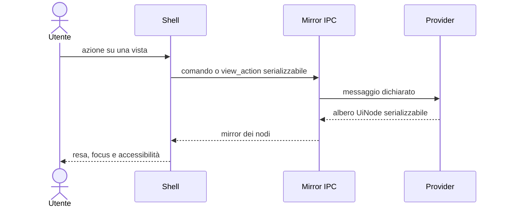
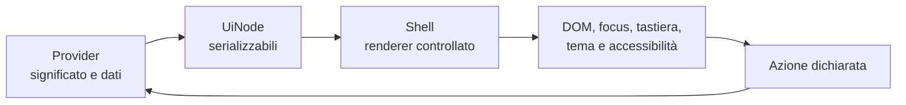

# Protocollo UI dichiarativo

Un provider non costruisce componenti della shell e non riceve il DOM. Restituisce una struttura serializzabile di `UiNode`; la shell decide come renderizzarla.

## Perché è dichiarativo

- il guest WASM non dipende dal framework del frontend;
- tema e accessibilità restano sotto il controllo della shell;
- i nodi possono attraversare IPC e WIT;
- lo stesso provider può essere testato senza una finestra;
- la shell può rifiutare nodi o proprietà non supportati.

## Flusso

Le azioni della vista tornano al provider come messaggi dichiarati. Non contengono callback o riferimenti a oggetti del frontend.

## Responsabilità

| Provider | Shell |
|---|---|
| significato della vista | resa degli elementi standard |
| dati mostrati | focus e tastiera |
| azioni ammesse | tema e ruoli accessibili |
| stato di dominio | comportamento visivo e fallback |

Il dettaglio dei nodi e dell'IPC è in [`frontend/02-il-protocollo-ui-node.md`](../frontend/02-il-protocollo-ui-node.md) e [`frontend/03-comandi-eventi-ipc.md`](../frontend/03-comandi-eventi-ipc.md).