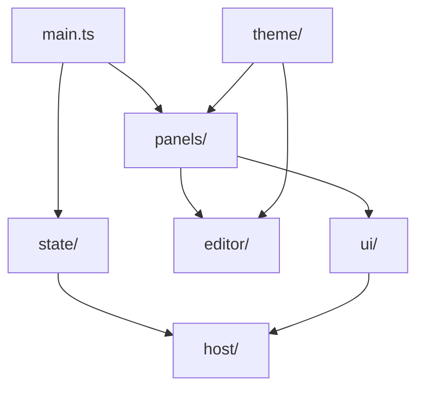

# Shell e interfaccia grafica

> **Stato:** implementato  
> **Fonte di verità:** `frontend/src/`

La shell è TypeScript senza framework applicativo pesante. Gestisce layout, focus, superfici interattive, rendering dichiarativo e seam IPC.

## Componenti

## Responsabilità

| Area | Possiede |
|---|---|
| `host/` | contratto TypeScript, IPC, dialoghi e fake host |
| `state/` | stato condiviso, layout, eventi e code |
| `ui/` | interprete `UiNode`, pannelli generici e azioni |
| `panels/` | composizione delle superfici applicative |
| `editor/` | CodeMirror, preview, completamenti e comandi |
| `theme/` | token, ricetta, skin, contrasto e caricamento |

## UI dichiarativa

Un `ViewProvider` restituisce dati `UiNode`; la shell li trasforma in DOM sicuro e inoltra le azioni al proprietario. I renderer custom sono registrati con un disposer e non ricevono accesso arbitrario al backend.

## Stato del documento

Il buffer autorevole appartiene alla sessione del documento. Cursore, scroll e history locale appartengono alla singola superficie. Due riquadri possono mostrare lo stesso documento senza duplicare salvataggio e conflitti.

## Temi

I fogli generati derivano da ricette e sorgenti versionate. Non si modificano a mano. Contrasto, moto ridotto e `forced-colors` sono verificati da test e banco visuale.

La proposta per rendere riusabili i motori di editing è in [rfcs/0001-shared-editing-surfaces.md](../rfcs/0001-shared-editing-surfaces.md); non è ancora un contratto pubblico.
