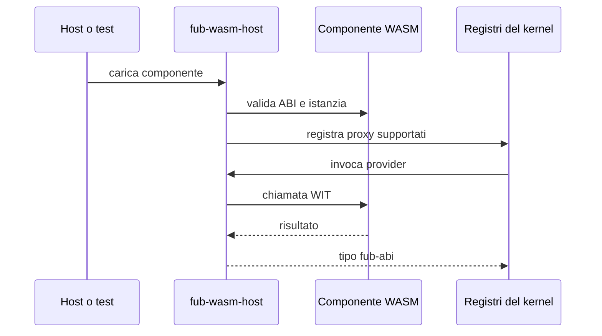

# Runtime WASM

> **Stato:** parziale  
> **Fonte di verità:** `crates/fub-wasm-host/`, esempi WASM e test di integrazione

Il runtime usa Wasmtime Component Model per adattare componenti `wasm32-wasip2` ai contratti di `fub-abi`.

## Disponibilità

| Superficie | Stato |
|---|---|
| Caricamento del componente nei test | implementato |
| Lifecycle `Plugin` | implementato |
| `CommandProvider` attraverso proxy | implementato |
| Prime famiglie di funzioni host | implementato/parziale |
| Limiti di memoria e tempo | implementato |
| Discovery utente dal vault | non completa |
| Installazione e aggiornamento | non completi |
| Tutti i trait di `fub-abi` | non disponibili |
| Percorso end-to-end documentabile | issue #8 |

## Flusso disponibile

## Isolamento

Il componente dispone della propria memoria. WASI e le funzioni host non vengono esposte implicitamente: il linker collega soltanto ciò che il contratto e la policy consentono.

## Perché non esiste ancora una guida “installa un plugin”

Una guida procedurale deve descrivere lo stesso percorso coperto da un test end-to-end. Finché discovery, installazione e teardown utente non sono esercitati insieme, pubblicare una guida completa sarebbe prematuro. L'issue #8 definisce il criterio di uscita.
