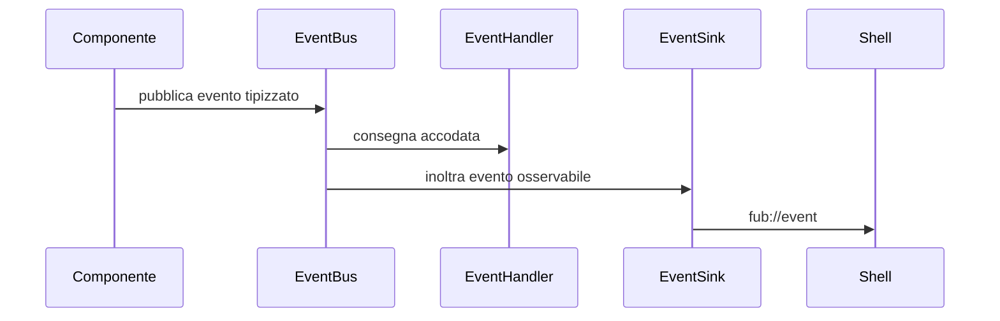

# Gli eventi

> **Stato:** implementato  
> **Fonte di verità:** `crates/fub-abi/src/event.rs`, bus del kernel e router frontend

Gli eventi raccontano fatti già avvenuti. Non sostituiscono comandi, query o risultati di una scrittura.

## Flusso

## Proprietà

- origine esplicita;
- topic e soggetto filtrabili;
- dispatch accodato e non rientrante;
- raggruppamento e limiti per i consumatori;
- eventi di guasto distinti dagli errori restituiti al chiamante;
- teardown delle sottoscrizioni insieme al proprietario.

## Eventi e indici

Gli indici autorevoli vengono aggiornati direttamente nell'operazione che modifica i documenti. Non dipendono dal riascolto di un evento che potrebbe essere ritardato, filtrato o scartato.

## Errori

Un errore sincrono risponde a chi ha chiesto l'operazione. Un evento `Trouble` informa gli osservatori di un problema che deve essere visibile anche fuori dal chiamante. I due canali possono coesistere senza duplicare il significato.
