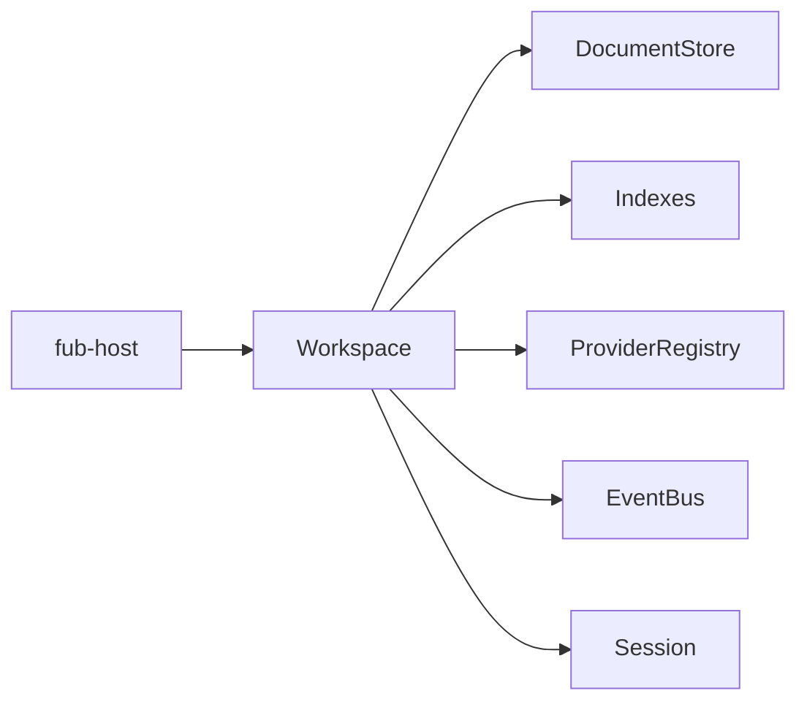

# Il kernel

> **Stato:** implementato  
> **Fonte di verità:** `crates/fub-kernel/`

Il kernel possiede lo stato coerente del vault e applica le regole comuni. Non conosce la finestra desktop, il parser Markdown o il motore Wasmtime.

## Responsabilità

- documenti e revisioni;
- anagrafe e indici comuni;
- registri dei provider;
- bus degli eventi;
- impostazioni del vault;
- capability e policy;
- operazioni strutturali e persistenza.

## Cosa non fa

| Fuori dal kernel | Proprietario |
|---|---|
| Creare finestre o dialoghi | shell e `fub-app` |
| Analizzare Markdown | `fub-format-markdown` |
| Scegliere i bundle da montare | `fub-host` |
| Eseguire componenti WASM | `fub-wasm-host` |
| Disegnare un pannello | frontend |

## Regola dei provider

Il kernel dipende da trait e tipi di `fub-abi`. Una funzionalità non entra con un ramo speciale quando può essere rappresentata come provider, comando, query, view o handler.

## Concorrenza

Le letture possono procedere insieme. Le mutazioni richiedono accesso esclusivo, ma un lock non viene mantenuto durante chiamate a codice esterno. Il dispatch degli eventi è accodato per evitare rientranza.

La forma completa è descritta in [architecture/concurrency.md](../architecture/concurrency.md).
