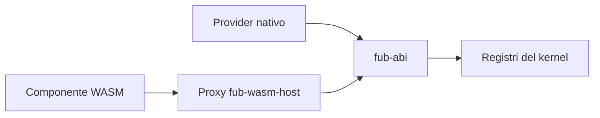

# Provider e plugin

> **Stato:** implementato per i provider nativi; parziale per WASM  
> **Fonte di verità:** `fub-abi`, `fub-features`, `fub-wasm-host`

Un provider implementa una capacità del sistema attraverso un trait. Un plugin raggruppa provider, metadati e lifecycle sotto un proprietario comune.

## Distinzione

| Termine | Significato |
|---|---|
| Provider | Implementazione di un punto di estensione |
| Bundle | Gruppo montabile di provider e risorse |
| Plugin nativo | Codice Rust compilato con Fub |
| Plugin WASM | Componente isolato adattato ai trait attraverso proxy |

## Punti di estensione principali

- `FormatProvider` per i formati;
- `ViewProvider` per viste dichiarative;
- `IndexProvider` per query e indici;
- `CommandProvider` per azioni;
- `EventHandler` per reazioni agli eventi;
- servizi, import/export, sintassi e renderer per capacità specifiche.

## Fiducia

I provider nativi sono codice del programma. I componenti WASM ricevono soltanto le famiglie di funzioni host collegate e autorizzate. Una capability assente non deve essere simulata con un errore tardivo: idealmente la funzione non viene esposta.

## Limite corrente

Il contratto WIT è più ampio della porzione già attraversata dal runtime. Non assumere che ogni trait Rust sia già disponibile a un componente installabile dall'utente. Consulta [architecture/wasm-runtime.md](../architecture/wasm-runtime.md).
