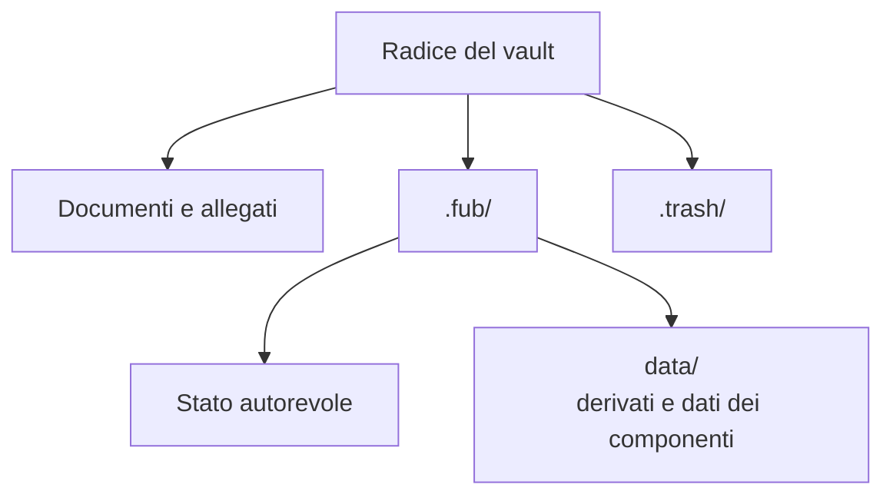
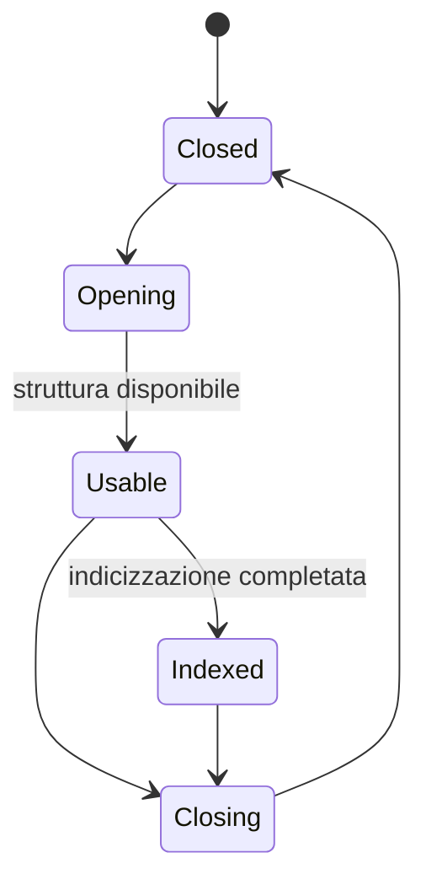

# Il vault

> **Stato:** implementato  
> **Fonte di verità:** `crates/fub-kernel/src/vault.rs`, test di persistenza

Un vault è la cartella che contiene i documenti e i file di servizio associati. Il percorso della cartella delimita ciò che Fub può leggere o scrivere per quella sessione.

## In breve

- i documenti dell'utente rimangono file normali;
- i path sono relativi alla radice del vault;
- `.fub/` contiene stato di servizio;
- `.fub/data/` contiene dati ricostruibili o specifici dei componenti;
- `.trash/` contiene elementi cestinati e metadati di ripristino.

## Autorità dei dati

| Categoria | Esempi | Ricostruibile |
|---|---|---|
| Contenuto utente | note e allegati | no |
| Stato autorevole | impostazioni, bozze, journal | non sempre |
| Dati derivati | indice, anagrafe ricostruibile, diagnostica | sì |
| Cestino | file rimossi e provenienza | solo in parte |

## Confine di sicurezza

Ogni operazione normalizza e valida il path prima di accedere al filesystem. Un path assoluto, un attraversamento `..` o una risoluzione fuori dalla radice deve essere rifiutato.

## Ciclo di vita

Un vault può essere usabile mentre lavori derivati continuano in background. La ricerca deve dichiarare uno stato incompleto invece di simulare “nessun risultato”.

## Documenti correlati

- [Architettura dello storage](../architecture/storage.md)
- [Layout su disco](../reference/on-disk-layout.md)
- [Il kernel](kernel.md)
