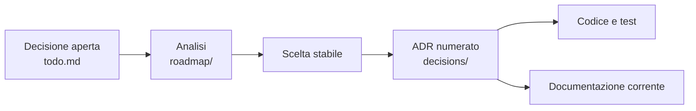

# Decisioni architetturali

Questa cartella è l'archivio delle decisioni chiuse. Ogni file conserva il problema osservato, le alternative considerate, la scelta presa, il suo costo e gli eventuali residui.



Il numero e il nome di ogni file non cambiano; il contenuto decisionale resta stabile, mentre la forma può essere migliorata secondo la [decisione 0143](0143-i-verbali-si-possono-riscrivere.md).

I conteggi verificati dei verbali e dei buchi dichiarati sono riportati in [`STATO.md`](../STATO.md). Qui resta la regola di consultazione, non una seconda fonte numerica.

## Come trovare una decisione

I file sono ordinati per numero, da [`0001`](0001-supply-chain-e-sbom.md) a [`0178`](0178-il-contrasto-sceglie-la-soglia.md). Il nome del file descrive la scelta; la ricerca del repository è l'indice principale.

```bash
# Per numero
find docs/decisions -maxdepth 1 -name '0042-*.md'

# Per parola nel titolo o nel contenuto
grep -Rni --include='*.md' 'tema' docs/decisions
```

Non viene mantenuta una tabella che riassume tutti gli ADR: duplicava in forma molto più lunga ciò che è già scritto nei singoli verbali e diventava una seconda fonte da sincronizzare.

## Cosa non va qui

- il lavoro aperto vive in [`../todo.md`](../todo.md);
- la direzione corrente vive in [`../PIANO.md`](../PIANO.md);
- le sedute preparatorie vivono in [`../roadmap/`](../roadmap/README.md);
- le istruzioni operative vivono in [`../guida/`](../guida/README.md);
- il comportamento verificato vive in [`../STATO.md`](../STATO.md) e nella documentazione corrente.

Quando una scelta è ancora aperta, non creare un ADR provvisorio: mantienila nel backlog. Quando è chiusa, il backlog perde la voce e questo archivio guadagna un file numerato.