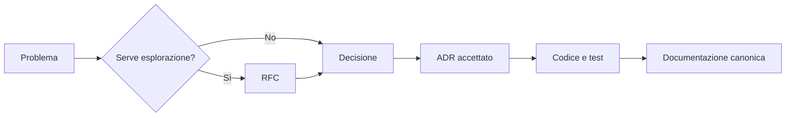

# Decisioni architetturali

Questa cartella conserva gli ADR accettati. Numero e nome dei file storici non cambiano: sono riferimenti usati da commit, test e documenti.

## Come leggere

- per ordine di accettazione: [index-by-date.md](index-by-date.md);
- per area: [index-by-topic.md](index-by-topic.md);
- per creare un nuovo ADR: [template.md](template.md).

## Regole

- il significato storico di un ADR non viene riscritto;
- chiarezza e formattazione possono essere corrette senza falsificare il contenuto;
- una decisione superata viene collegata da un nuovo ADR;
- i percorsi correnti stanno nella documentazione canonica, non vengono retrofittati in ogni verbale;
- lo stato corrente del lavoro non vive negli ADR.

## Sequenza

Gli ADR da `0001` a `0178` restano presenti nella cartella e sono ordinati cronologicamente dal numero. GitHub mostra l'elenco completo dei file; gli indici offrono percorsi di lettura sintetici senza duplicare il contenuto dei verbali.
